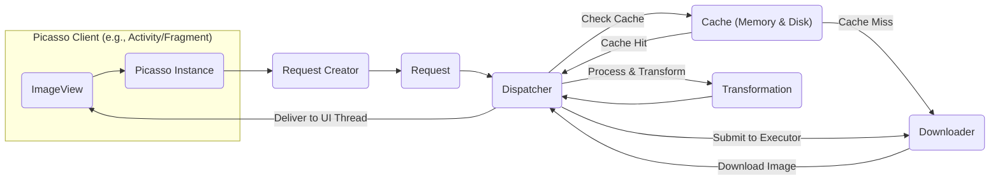
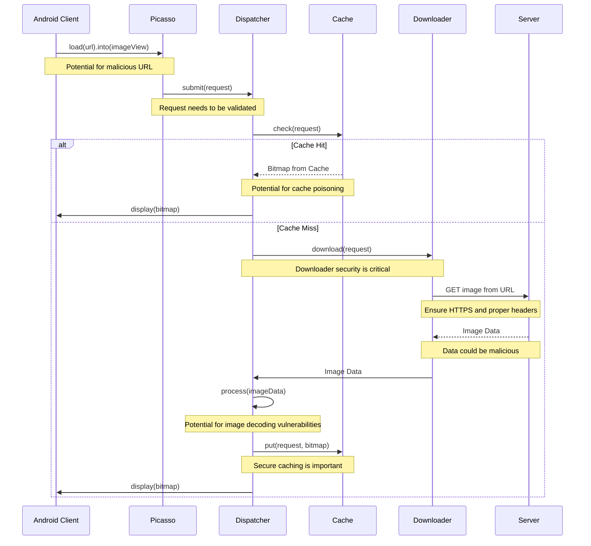

# Project Design Document: Picasso Image Loading Library

**Version:** 1.1
**Date:** October 26, 2023
**Author:** AI Software Architect

## 1. Introduction

This document provides a detailed design overview of the Picasso image loading and caching library for Android. This document serves as a foundation for subsequent threat modeling activities, outlining the key components, data flows, and interactions within the library.

Picasso is a powerful image loading library for Android that simplifies the process of displaying images from various sources, including network URLs and local files. It handles tasks such as image downloading, caching, transformations, and efficient memory management.

## 2. Goals

The primary goals of this design document are:

*   Provide a comprehensive understanding of Picasso's architecture and functionality.
*   Identify key components and their responsibilities, with a focus on security implications.
*   Map the flow of image requests and data within the library, highlighting potential security vulnerabilities.
*   Serve as a clear and concise reference for security analysts and developers during threat modeling.
*   Facilitate the identification of potential attack vectors and security weaknesses.

## 3. Scope

This document focuses on the core functionalities of the Picasso library related to image loading, caching, and display within an Android application. It covers the primary components involved in processing an image request from initiation to rendering in an `ImageView`. This document does not delve into specific implementation details of individual classes or intricate error handling mechanisms unless they are directly relevant to the overall architecture and potential security implications. For example, details of specific custom `Target` implementations or advanced features like request listeners are outside the scope.

## 4. High-Level Architecture

Picasso's architecture revolves around managing image requests efficiently and providing a smooth user experience. The following diagram illustrates the high-level components and their interactions:

**Components:**

*   **Picasso Instance:** The main entry point, responsible for managing the lifecycle and configuration. Security relevance: Central point for configuration, potentially impacting security defaults.
*   **Request Creator:** Builds immutable request objects. Security relevance: Input validation and sanitization occur here.
*   **Request:** Represents an image loading request. Security relevance: Contains information about the image source, which could be malicious.
*   **Dispatcher:** Manages and executes requests asynchronously. Security relevance: Controls access to resources and handles data flow.
*   **Downloader:** Fetches image data from various sources. Security relevance: Directly interacts with external resources, a key area for vulnerabilities.
*   **Cache (Memory & Disk):** Stores downloaded images. Security relevance: Potential for cache poisoning and data leakage.
*   **Transformation:** Modifies images. Security relevance: Could be exploited with specially crafted images.

## 5. Detailed Design

This section provides a more detailed description of the key components and their functionalities, with a focus on security considerations.

### 5.1. Picasso Instance

*   Serves as the central access point to the library's functionalities.
*   Manages a thread pool for executing background tasks, potentially introducing concurrency issues if not handled correctly.
*   Holds references to the `Dispatcher` and `Cache`.
*   Provides methods like `load()` to initiate image requests, which are the starting point for potential attacks.
*   Allows configuration options such as custom `Downloader` and `Cache` implementations. Using insecure or poorly implemented custom components can introduce vulnerabilities.

### 5.2. Request Creator

*   Provides a fluent API for building `Request` objects.
*   Allows specifying the image source (URL, URI, resource ID). Improper validation of URLs could lead to Server-Side Request Forgery (SSRF) if a custom `Downloader` is not carefully implemented.
*   Supports setting placeholder images (while loading and on error). While seemingly benign, large placeholder images could contribute to Denial of Service.
*   Enables defining image transformations to be applied.
*   Offers options for request prioritization and tagging.

### 5.3. Request

*   Represents a single, immutable image loading request.
*   Contains all the necessary information for processing the request, including:
    *   Image source (URL, URI, etc.): This is a critical piece of information that needs careful handling to prevent malicious URLs from being processed.
    *   Target `ImageView` or `Target` object.
    *   Requested image dimensions.
    *   Transformations to apply.
    *   Request priority.
    *   Error and placeholder image resources.
*   Used by the `Dispatcher` to manage and execute the request.

### 5.4. Dispatcher

*   Acts as the orchestrator for image loading requests.
*   Maintains a queue of pending requests. Improper queue management could lead to resource exhaustion.
*   Checks the `Cache` for existing images.
*   Submits cache misses to the `Downloader` for fetching.
*   Manages background threads for downloading and processing images. Concurrency issues like race conditions could arise if not properly synchronized.
*   Applies transformations to downloaded images.
*   Delivers the final `Bitmap` to the target `ImageView` on the UI thread.
*   Handles request cancellation and error scenarios. Improper error handling could leak sensitive information.

### 5.5. Downloader

*   An interface defining the contract for fetching image data.
*   Default implementations include:
    *   `OkHttp3Downloader`: Uses the OkHttp library for network requests. Security depends on the configuration and security of the underlying OkHttp client.
    *   `URLConnectionDownloader`: Uses `HttpURLConnection` for network requests (deprecated in newer versions). More susceptible to vulnerabilities if not configured correctly for HTTPS.
    *   File-based downloaders for local files. Vulnerable to path traversal attacks if not properly validated.
*   Responsible for handling network communication, including:
    *   Establishing connections.
    *   Downloading image data.
    *   Handling HTTP headers and status codes. Ignoring security-related headers could lead to vulnerabilities.
    *   Managing timeouts and retries. Improper timeout settings could lead to DoS.

### 5.6. Cache (Memory & Disk)

*   Stores downloaded `Bitmap` objects to avoid redundant downloads.
*   **Memory Cache:** Typically an `LruCache` implementation, providing fast access to recently used images. Potential for information leakage if the device is compromised.
*   **Disk Cache:** Stores images on the device's storage, persisting across application restarts. Vulnerable to cache poisoning if an attacker can write to the cache directory. Insecure permissions on the cache directory could expose cached images.
*   The `Dispatcher` checks the cache before initiating a download.
*   Downloaded images are stored in the cache for future use.
*   Cache eviction policies are used to manage storage space.

### 5.7. Transformation

*   An interface for modifying `Bitmap` objects.
*   Allows developers to implement custom image manipulations. Vulnerabilities in custom transformations could lead to crashes or unexpected behavior when processing specially crafted images.
*   Common transformations include resizing, cropping, rotating, and applying filters.
*   Transformations are applied after the image is downloaded and before it's displayed. Processing untrusted images could expose vulnerabilities in the transformation logic.

## 6. Data Flow

The following steps describe the typical data flow for an image loading request, highlighting potential security implications at each stage:

1. **Initiation:** The client (e.g., an `Activity`) calls `Picasso.get().load(url).into(imageView)`. **Security Implication:** The provided URL is the initial point of trust. If the URL is malicious, it can lead to various attacks.
2. **Request Creation:** The `Picasso` instance creates a `RequestCreator` and then a `Request` object based on the provided parameters. **Security Implication:**  Insufficient validation of the URL or other parameters at this stage can propagate vulnerabilities.
3. **Dispatching:** The `Request` is submitted to the `Dispatcher`. **Security Implication:** The `Dispatcher` needs to handle requests securely, preventing unauthorized access or manipulation.
4. **Cache Check:** The `Dispatcher` checks the memory cache and then the disk cache for the requested image.
    *   **Cache Hit:** If the image is found in the cache, it's retrieved and delivered to the `ImageView` on the UI thread. **Security Implication:**  If the cache has been poisoned, a malicious image will be served.
    *   **Cache Miss:** If the image is not in the cache, the process continues to the download phase.
5. **Downloading:** The `Dispatcher` submits the request to the appropriate `Downloader` (e.g., `OkHttp3Downloader`). **Security Implication:** The choice and configuration of the `Downloader` are crucial for secure network communication.
6. **Network Request:** The `Downloader` makes a network request to the specified URL. **Security Implication:** This is where network security protocols (HTTPS) and proper header handling are essential.
7. **Image Retrieval:** The image data is downloaded from the server. **Security Implication:** The downloaded data could be malicious or contain exploits.
8. **Processing & Transformation:** The `Dispatcher` receives the downloaded image data. It decodes the data into a `Bitmap` and applies any specified `Transformation` objects. **Security Implication:** Image decoding libraries can have vulnerabilities, and malicious images can trigger them. Custom transformations also introduce potential risks.
9. **Caching:** The processed `Bitmap` is stored in both the memory and disk caches. **Security Implication:** This step introduces the risk of cache poisoning if the storage mechanism is not secure.
10. **Delivery:** The `Dispatcher` delivers the final `Bitmap` to the target `ImageView` on the UI thread. **Security Implication:** While less direct, displaying a malicious image can still have security implications (e.g., phishing).

## 7. Key Interactions

*   **Client and Picasso:** The client interacts with the `Picasso` instance to initiate image loading requests, making the initial input validation crucial.
*   **Picasso and Dispatcher:** `Picasso` delegates the management and execution of requests to the `Dispatcher`, highlighting the `Dispatcher`'s role in enforcing security policies.
*   **Dispatcher and Cache:** The `Dispatcher` interacts with the `Cache` to check for and store images, emphasizing the importance of cache integrity and security.
*   **Dispatcher and Downloader:** The `Dispatcher` uses the `Downloader` to fetch images from remote sources, making the `Downloader` a critical component for network security.
*   **Downloader and Server:** The `Downloader` communicates with remote servers to download image data, where secure communication protocols are paramount.
*   **Dispatcher and Transformations:** The `Dispatcher` applies image transformations as specified in the request, introducing potential vulnerabilities in transformation logic.
*   **Dispatcher and UI Thread:** The `Dispatcher` ensures that the final `Bitmap` is delivered to the `ImageView` on the main UI thread, ensuring UI thread safety but also the display of potentially untrusted content.

## 8. Security Considerations (Detailed)

This section expands on the initial security thoughts, providing more specific examples of potential threats and vulnerabilities:

*   **Insecure Network Communication:**
    *   **Threat:** Man-in-the-middle attacks if using HTTP instead of HTTPS, allowing attackers to intercept and modify image data.
    *   **Mitigation:** Enforce HTTPS usage, configure `Downloader` to reject insecure connections.
*   **Cache Poisoning:**
    *   **Threat:** An attacker could replace legitimate cached images with malicious ones, leading to the display of incorrect or harmful content.
    *   **Mitigation:** Implement integrity checks for cached data, secure the cache directory permissions.
*   **Denial of Service (DoS):**
    *   **Threat:** Repeated requests for extremely large images or a large number of unique images can exhaust device resources (memory, network) or overwhelm the remote server.
    *   **Mitigation:** Implement request throttling, set reasonable image size limits, use efficient caching strategies.
*   **Data Leaks through Caching:**
    *   **Threat:** Sensitive information embedded in image metadata or filenames could be unintentionally cached and potentially exposed if the device is compromised or the cache is not properly secured.
    *   **Mitigation:** Avoid storing sensitive information in image metadata, secure cache storage with appropriate permissions.
*   **Malicious Image Processing:**
    *   **Threat:** Specially crafted images can exploit vulnerabilities in image decoding libraries (e.g., libjpeg, libpng), potentially leading to crashes, memory corruption, or even arbitrary code execution.
    *   **Mitigation:** Keep image decoding libraries up-to-date, consider using secure image decoding libraries, implement input validation on image data.
*   **Bypass of Security Measures:**
    *   **Threat:** Using custom `Downloader` or `Cache` implementations that do not adhere to security best practices can introduce vulnerabilities.
    *   **Mitigation:** Thoroughly review and audit custom implementations, adhere to security guidelines when developing custom components.
*   **Local File Access Vulnerabilities:**
    *   **Threat:** If loading images from local files, improper handling of file paths could lead to path traversal attacks, allowing access to unauthorized files on the device.
    *   **Mitigation:** Sanitize and validate file paths, restrict access to specific directories.
*   **Transformation Vulnerabilities:**
    *   **Threat:** Bugs or vulnerabilities in custom `Transformation` implementations could lead to unexpected behavior or security issues when processing malicious images.
    *   **Mitigation:** Thoroughly test custom transformations with various inputs, including potentially malicious images.
*   **Server-Side Request Forgery (SSRF):**
    *   **Threat:** If the application allows users to provide image URLs, a malicious user could provide an internal URL, potentially allowing the application to access internal resources.
    *   **Mitigation:** Implement strict URL validation and sanitization, restrict the schemes and domains allowed for image loading.

## 9. Assumptions

*   The application using Picasso has the necessary network and storage permissions, and these permissions are granted appropriately by the user.
*   The underlying Android operating system and hardware provide basic security features and are not compromised.
*   Remote image servers are assumed to be potentially untrusted and may serve malicious content.
*   The device has sufficient storage and memory resources to handle image loading and caching operations.

## 10. Out of Scope

This document does not cover:

*   Specific implementation details of individual classes and methods within the Picasso library.
*   Detailed error handling and retry mechanisms implemented by Picasso, unless directly related to security vulnerabilities.
*   Performance optimization strategies beyond the basic caching mechanism.
*   Integration with specific image formats or codecs beyond general decoding considerations.
*   The internal workings of third-party libraries used by Picasso, such as OkHttp, in detail.
*   Detailed analysis of specific UI rendering aspects beyond the interaction with the `ImageView`.
*   Security considerations related to specific Picasso extensions or add-ons.