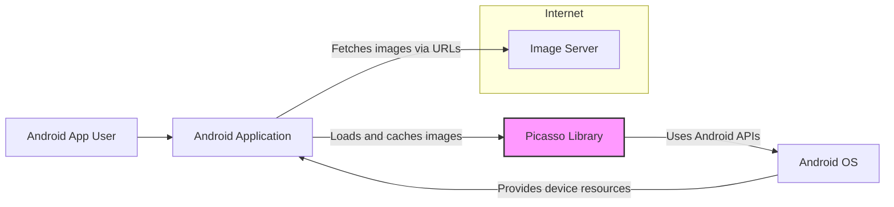

# BUSINESS POSTURE

This project, Picasso, is an open-source Android library for image loading and caching.

- Business Priorities and Goals:
  - Provide an efficient and easy-to-use image loading and caching solution for Android developers.
  - Improve the performance and user experience of Android applications by optimizing image handling.
  - Offer a robust and reliable library that simplifies complex image loading tasks.
  - Maintain an active and supportive open-source community around the library.

- Business Risks:
  - Vulnerabilities in the library could be exploited by malicious actors, potentially affecting applications using Picasso.
  - Performance issues or bugs in the library could negatively impact the user experience of applications.
  - Lack of maintenance or community support could lead to the library becoming outdated or insecure over time.
  - Security breaches related to image handling, such as denial-of-service attacks through malformed images or information disclosure through insecure caching.

# SECURITY POSTURE

- Existing Security Controls:
  - security control: Reliance on standard Android platform security features. Implemented by: Android OS and device manufacturers.
  - security control: Use of standard Java/Kotlin security practices in the codebase. Implemented by: Picasso developers.
  - security control: Code reviews and community contributions to identify and address potential vulnerabilities. Implemented by: Picasso maintainers and community.
  - accepted risk: Dependencies on third-party libraries may introduce vulnerabilities. Accepted risk: inherent in using open-source ecosystems.
  - accepted risk: Potential for vulnerabilities to be discovered in the library code. Accepted risk: inherent in software development.

- Recommended Security Controls:
  - security control: Implement automated dependency scanning to identify and address vulnerabilities in third-party libraries.
  - security control: Integrate static application security testing (SAST) tools into the build process to detect potential code-level vulnerabilities.
  - security control: Conduct regular security code reviews, focusing on areas related to image handling, caching, and network communication.
  - security control: Implement input validation for image URLs and data received from network requests to prevent injection attacks and other input-related vulnerabilities.
  - security control: Consider implementing secure caching mechanisms to protect cached images from unauthorized access, if sensitive data is handled (though unlikely for a general image loading library).

- Security Requirements:
  - Authentication: Not directly applicable as Picasso is a client-side library and does not handle user authentication itself. Applications using Picasso will handle authentication as needed.
  - Authorization: Not directly applicable within the library itself. Authorization is handled by the application and backend services providing images. Picasso needs to respect the authorization context provided by the application when fetching images.
  - Input Validation:
    - All image URLs provided to Picasso should be validated to prevent injection attacks (e.g., path traversal, server-side request forgery).
    - Data received from network responses (image data, headers) should be validated to prevent unexpected behavior or vulnerabilities.
  - Cryptography:
    - Cryptography is not a primary requirement for the core functionality of Picasso.
    - If secure caching is implemented for sensitive images in the future, appropriate encryption mechanisms should be used.
    - HTTPS should be used for all network requests to ensure confidentiality and integrity of image data in transit. This is a responsibility of the application using Picasso, but Picasso should encourage and facilitate HTTPS usage.

# DESIGN

## C4 CONTEXT



- C4 Context Elements:
  - - Name: Android App User
    - Type: Person
    - Description: End-user of the Android application that utilizes Picasso for image loading and display.
    - Responsibilities: Interacts with the Android application, triggering image loading requests.
    - Security controls: User device security, application-level permissions.
  - - Name: Android Application
    - Type: Software System
    - Description: The Android application that integrates the Picasso library to load and display images.
    - Responsibilities: Initiates image loading requests using Picasso, displays images to the user, handles user interactions.
    - Security controls: Application-level security controls, user authentication and authorization (if applicable), secure data handling.
  - - Name: Picasso Library
    - Type: Software System
    - Description: The image loading and caching library being analyzed.
    - Responsibilities: Handles image loading from URLs, caching images in memory and disk, image transformations, and image display within Android applications.
    - Security controls: Input validation, secure caching (if implemented), adherence to secure coding practices.
  - - Name: Image Server
    - Type: Software System
    - Description: External server hosting the images that are loaded by the Android application via Picasso.
    - Responsibilities: Stores and serves images, handles image requests from applications.
    - Security controls: Server-side security controls, access control, secure image storage, protection against denial-of-service attacks.
  - - Name: Android OS
    - Type: Software System
    - Description: The Android operating system on which the application and Picasso library run.
    - Responsibilities: Provides the runtime environment, system APIs, and device resources for the application and library.
    - Security controls: Operating system security features, permissions management, sandboxing, device encryption.

## C4 CONTAINER

```mermaid
flowchart LR
    subgraph Android Device
        subgraph Android Application Container
            AA["Android Application"]
            PL["Picasso Library Container"]
            AA --> PL
        end
        subgraph Picasso Library Container
            ID["Image Downloader"]
            MC["Memory Cache"]
            DC["Disk Cache"]
            TE["Transformation Engine"]
            RQ["Request Queue"]
            PL --> ID
            PL --> MC
            PL --> DC
            PL --> TE
            PL --> RQ
            RQ --> ID
            RQ --> MC
            RQ --> DC
        end
        AOS["Android OS"]
        AA --> AOS
        PL --> AOS
        ID -- "Network requests" --> Internet
        DC -- "File system access" --> AOS
    end
    subgraph Internet
        IS["Image Server"]
    end
    style PL fill:#f9f,stroke:#333,stroke-width:2px
    style "Picasso Library Container" fill:#ccf,stroke:#333,stroke-width:1px,dash-array: 5 5
    style "Android Application Container" fill:#ccf,stroke:#333,stroke-width:1px,dash-array: 5 5
```

- C4 Container Elements:
  - - Name: Picasso Library Container
    - Type: Container
    - Description: Represents the Picasso library as a deployable unit within an Android application. It encapsulates the core components of the library.
    - Responsibilities: Image loading, caching, transformation, request management.
    - Security controls: Input validation within components, secure caching implementation in Disk Cache and Memory Cache, secure network communication in Image Downloader.
    - - Name: Image Downloader
      - Type: Component
      - Description: Responsible for downloading images from URLs.
      - Responsibilities: Making network requests to image servers, handling network responses, managing network connections.
      - Security controls: Input validation of URLs, use of HTTPS for network requests, handling of network errors and exceptions, protection against SSRF vulnerabilities.
    - - Name: Memory Cache
      - Type: Component
      - Description: In-memory cache for storing recently accessed images for fast retrieval.
      - Responsibilities: Storing and retrieving images from memory, managing cache eviction policies.
      - Security controls: Limit cache size to prevent denial-of-service, consider clearing sensitive data from cache if applicable (though unlikely for image URLs).
    - - Name: Disk Cache
      - Type: Component
      - Description: Disk-based cache for storing images persistently across application sessions.
      - Responsibilities: Storing and retrieving images from disk, managing disk space usage, handling file system operations.
      - Security controls: Secure file storage permissions, protection against path traversal vulnerabilities, consider encryption for sensitive cached images (if applicable).
    - - Name: Transformation Engine
      - Type: Component
      - Description: Responsible for applying image transformations (resizing, cropping, etc.) to images.
      - Responsibilities: Applying image transformations as requested by the application.
      - Security controls: Input validation for transformation parameters to prevent unexpected behavior or vulnerabilities.
    - - Name: Request Queue
      - Type: Component
      - Description: Manages the queue of image loading requests, prioritizing and dispatching requests to other components.
      - Responsibilities: Queuing and managing image loading requests, coordinating with other components.
      - Security controls: Rate limiting of requests to prevent denial-of-service, proper handling of request failures.
  - - Name: Android Application Container
    - Type: Container
    - Description: Represents the Android application itself, which uses the Picasso library.
    - Responsibilities: Integrating Picasso, initiating image loading requests, displaying images, handling user interactions.
    - Security controls: Application-level security controls, user authentication and authorization, secure data handling, proper usage of Picasso API.
  - - Name: Android OS
    - Type: Container
    - Description: The Android operating system providing the runtime environment.
    - Responsibilities: Providing system APIs, file system access, network access, memory management.
    - Security controls: OS-level security features, permissions management, sandboxing.
  - - Name: Image Server
    - Type: External Container
    - Description: External server hosting images.
    - Responsibilities: Serving images over the network.
    - Security controls: Server-side security controls, access control, secure image storage.

## DEPLOYMENT

Deployment Diagram for Android Application using Picasso Library:

```mermaid
flowchart LR
    subgraph User Device
        subgraph Android OS
            subgraph Android Application Process
                AA["Android Application\n(APK Package)"]
                PL["Picasso Library\n(Included in APK)"]
                AA --> PL
            end
        end
    end
    subgraph Image Server Infrastructure
        IS["Image Server\n(e.g., Cloud Storage, CDN)"]
    end
    UA["Android App User"] -- "Uses Application" --> AA
    AA -- "Loads Images via HTTPS" --> IS
    style "Android Application Process" fill:#ccf,stroke:#333,stroke-width:1px,dash-array: 5 5
```

- Deployment Elements:
  - - Name: Android Application (APK Package)
    - Type: Software Deployment Unit
    - Description: The Android application packaged as an APK file, ready for installation on user devices. Includes the application code and the Picasso library.
    - Responsibilities: Executing application logic, using Picasso for image loading, interacting with the user.
    - Security controls: Application signing, code obfuscation (optional), runtime application self-protection (RASP) (optional).
  - - Name: Picasso Library (Included in APK)
    - Type: Software Deployment Unit
    - Description: The Picasso library is included within the Android application's APK package. It runs within the application's process on the user's device.
    - Responsibilities: Image loading and caching functionalities within the application.
    - Security controls: Inherits security controls from the application process and Android OS.
  - - Name: Android OS
    - Type: Infrastructure
    - Description: The Android operating system running on the user's device.
    - Responsibilities: Providing the runtime environment, managing application processes, enforcing security policies.
    - Security controls: OS-level security features, permissions management, sandboxing, device encryption.
  - - Name: Image Server (e.g., Cloud Storage, CDN)
    - Type: Infrastructure
    - Description: The infrastructure hosting the image server, which could be cloud storage, a content delivery network (CDN), or a traditional server.
    - Responsibilities: Storing and serving images over HTTPS.
    - Security controls: Server-side security controls, access control, DDoS protection, secure storage, HTTPS configuration.
  - - Name: User Device
    - Type: Infrastructure
    - Description: The user's Android device where the application is installed and running.
    - Responsibilities: Running the Android OS and applications.
    - Security controls: Device security features (e.g., screen lock, device encryption), user-installed security applications.

## BUILD

Build Process Diagram for Picasso Library:

```mermaid
flowchart LR
    subgraph Developer Workstation
        DEV["Developer"] -- "Code Changes" --> VCS["Version Control System\n(GitHub)"]
    end
    VCS -- "Code Repository" --> CI["Continuous Integration\n(e.g., GitHub Actions)"]
    subgraph CI Environment
        BC["Build Container"]
        CI -- "Triggers Build" --> BC
        BC -- "Fetches Code" --> VCS
        BC -- "Builds & Tests" --> BA["Build Artifacts\n(JAR/AAR)"]
        BC -- "Runs Security Checks\n(SAST, Dependency Scan)" --> SR["Security Reports"]
        BA -- "Publish" --> RM["Repository Manager\n(Maven Central, etc.)"]
    end
    style "CI Environment" fill:#ccf,stroke:#333,stroke-width:1px,dash-array: 5 5
```

- Build Elements:
  - - Name: Developer
    - Type: Person
    - Description: Software developer contributing to the Picasso library codebase.
    - Responsibilities: Writing code, committing changes to version control.
    - Security controls: Secure development practices, code reviews, adherence to coding standards.
  - - Name: Version Control System (GitHub)
    - Type: Tool
    - Description: GitHub repository hosting the Picasso source code.
    - Responsibilities: Managing source code, tracking changes, facilitating collaboration.
    - Security controls: Access control, branch protection, audit logs.
  - - Name: Continuous Integration (e.g., GitHub Actions)
    - Type: Tool
    - Description: Automated CI system used to build, test, and package the Picasso library.
    - Responsibilities: Automating the build process, running tests, performing security checks, publishing build artifacts.
    - Security controls: Secure CI configuration, access control, secrets management, build isolation.
  - - Name: Build Container
    - Type: Environment
    - Description: Isolated environment within the CI system where the build process is executed.
    - Responsibilities: Providing a consistent and reproducible build environment.
    - Security controls: Container security, minimal required tools and dependencies, regular updates.
  - - Name: Build Artifacts (JAR/AAR)
    - Type: Software Artifact
    - Description: Compiled and packaged Picasso library (JAR or AAR file).
    - Responsibilities: Deployable library artifact for Android applications.
    - Security controls: Signing of artifacts, integrity checks (checksums).
  - - Name: Security Reports
    - Type: Document
    - Description: Reports generated by security scanning tools (SAST, dependency scanners) during the build process.
    - Responsibilities: Providing information about potential security vulnerabilities.
    - Security controls: Secure storage and access control for security reports, automated analysis and alerting.
  - - Name: Repository Manager (Maven Central, etc.)
    - Type: Tool
    - Description: Repository manager where the built Picasso library artifacts are published for distribution to developers.
    - Responsibilities: Hosting and distributing library artifacts, managing versions.
    - Security controls: Access control, secure artifact storage, integrity checks, vulnerability scanning of published artifacts.

# RISK ASSESSMENT

- Critical Business Processes:
  - Providing a reliable and performant image loading and caching library for Android developers.
  - Maintaining the reputation and trustworthiness of the Picasso library as an open-source project.
  - Ensuring the security and stability of applications that depend on Picasso.

- Data to Protect and Sensitivity:
  - Source code of the Picasso library: High sensitivity (confidentiality and integrity). Compromise could lead to vulnerabilities in the library and applications using it.
  - Build artifacts (JAR/AAR files): High sensitivity (integrity and availability). Tampered artifacts could introduce malicious code into applications.
  - Security reports and vulnerability information: Medium sensitivity (confidentiality). Disclosure could provide attackers with information to exploit vulnerabilities.
  - Cached images (on disk and in memory): Low to Medium sensitivity. Mostly public images, but could potentially include user-generated content in some application scenarios. Confidentiality and integrity are relevant.

# QUESTIONS & ASSUMPTIONS

- BUSINESS POSTURE:
  - Assumption: The primary business goal is to provide a high-quality, performant, and easy-to-use image loading library for Android developers.
  - Question: Are there specific business requirements related to compliance or industry standards that the library needs to adhere to?

- SECURITY POSTURE:
  - Assumption: Standard Android security practices are considered the baseline for security.
  - Question: Are there any specific security certifications or audits required for the library?
  - Question: What is the process for handling and disclosing security vulnerabilities found in the library?

- DESIGN:
  - Assumption: The current architecture is well-suited for the library's purpose.
  - Question: Are there any plans to introduce new features or architectural changes that could impact security or design?
  - Question: What are the performance and scalability requirements for the library, and how are they addressed in the design?