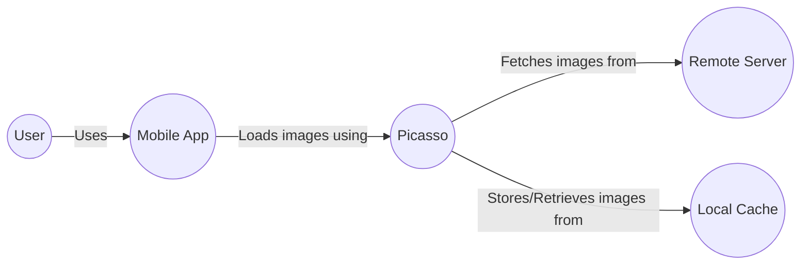
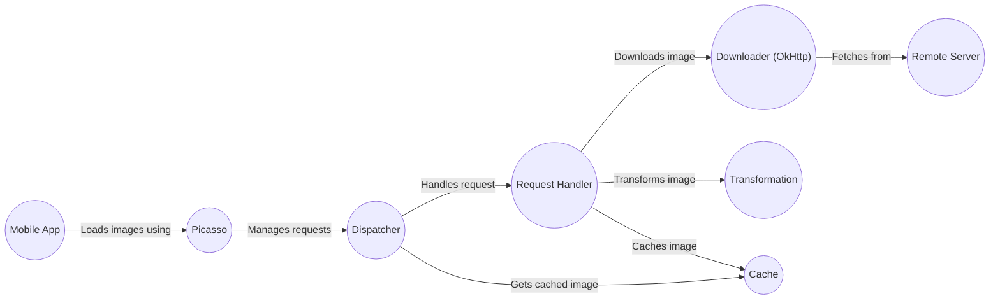
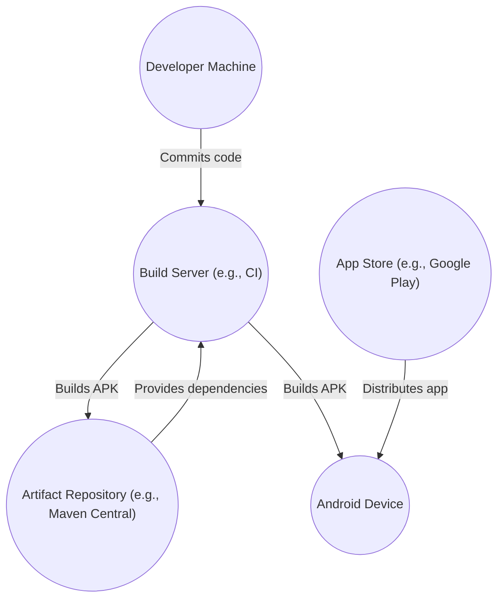
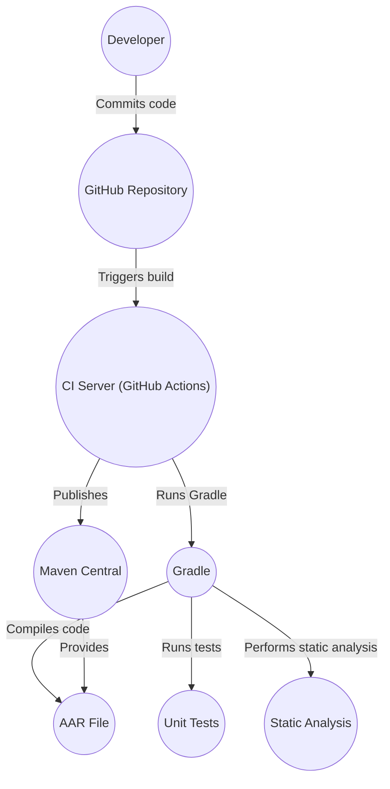

Okay, let's create a design document for the Square Picasso project, focusing on aspects relevant to threat modeling.

# BUSINESS POSTURE

Picasso is a popular open-source Android library for image loading and caching.  It's used by a vast number of applications, potentially impacting millions of users.  The primary business goals and priorities are:

*   Maintainability and Stability:  As a widely used library, stability and ease of maintenance are paramount.  Breaking changes or bugs can have a significant ripple effect.
*   Performance:  Image loading is often a performance bottleneck in mobile apps.  Picasso must be efficient in terms of memory usage, CPU utilization, and network bandwidth.
*   Ease of Use:  A simple, intuitive API encourages adoption and reduces the likelihood of developers introducing errors in their own code.
*   Community Trust:  Maintaining the trust of the Android developer community is crucial.  This includes promptly addressing security vulnerabilities and providing clear documentation.

Business risks that need to be addressed:

*   Security Vulnerabilities:  Vulnerabilities in image processing libraries can be exploited to execute arbitrary code, access sensitive data, or cause denial-of-service.  This is the most critical risk.
*   Performance Degradation:  Regressions in performance can negatively impact user experience in apps using Picasso.
*   Compatibility Issues:  Changes to the Android platform or related libraries could introduce compatibility problems.
*   Reputation Damage:  Security incidents or major bugs could damage Square's reputation and the trust of the developer community.
*   Supply Chain Attacks: Compromise of dependencies or build tools used by Picasso.

# SECURITY POSTURE

Existing security controls (based on the GitHub repository and common practices):

*   security control: Code Reviews: Pull requests on GitHub are subject to review by other developers, which helps identify potential security issues. (Implemented in GitHub workflow)
*   security control: Static Analysis: Likely use of static analysis tools (e.g., FindBugs, PMD, Android Lint) to detect common coding errors and potential vulnerabilities. (Not explicitly mentioned, but standard practice)
*   security control: Dependency Management: Use of Gradle for dependency management, allowing for tracking and updating of third-party libraries. (Described in build.gradle)
*   security control: Open Source: The code is publicly available, allowing for community scrutiny and contributions to security.
*   security control: Tests: The project includes a suite of unit and integration tests, which can help prevent regressions and catch some types of errors. (Described in /picasso/src/test/)

Accepted risks:

*   accepted risk: Reliance on Third-Party Libraries: Picasso depends on other libraries (e.g., OkHttp for networking), inheriting any vulnerabilities present in those dependencies.
*   accepted risk: Limited Fuzzing: While some testing is present, comprehensive fuzzing of image parsing is likely not performed, leaving a potential attack surface.
*   accepted risk: Android Platform Vulnerabilities: Picasso runs on the Android platform and is subject to any underlying vulnerabilities in the OS.
*   accepted risk: User-Controlled Input: Picasso processes images from potentially untrusted sources (e.g., URLs provided by users), which is an inherent risk.

Recommended security controls:

*   security control: Regular Security Audits: Conduct periodic security audits, including penetration testing and code review, by external security experts.
*   security control: Fuzz Testing: Implement fuzz testing specifically targeting the image decoding and processing components to identify potential vulnerabilities.
*   security control: Content Security Policy (CSP): If applicable, consider implementing a CSP to restrict the sources from which images can be loaded. (This is more relevant to web applications, but the concept could be adapted for certain use cases.)
*   security control: Supply Chain Security: Implement measures to secure the build pipeline and verify the integrity of dependencies (e.g., using checksums, signing).
*   security control: Memory Safety: Explore using memory-safe languages or techniques to mitigate memory corruption vulnerabilities.

Security Requirements:

*   Authentication: Not directly applicable to Picasso, as it's a library, not a service. Authentication is the responsibility of the application using Picasso.
*   Authorization: Not directly applicable. Authorization decisions are the responsibility of the application using Picasso.
*   Input Validation:
    *   Validate URLs: Ensure that URLs provided to Picasso are well-formed and point to expected domains (if applicable).
    *   Limit Image Size: Enforce maximum dimensions and file sizes for images to prevent denial-of-service attacks.
    *   Check File Headers: Validate image file headers to ensure they match the expected image format before processing.
*   Cryptography:
    *   HTTPS: Enforce the use of HTTPS for all network requests to protect image data in transit. This is handled by OkHttp, but Picasso should be configured to use it by default.
    *   Data at Rest: If caching sensitive images, consider encrypting the cache.
*   Output Encoding: Not directly applicable, as Picasso primarily deals with binary image data.

# DESIGN

## C4 CONTEXT

Element descriptions:

*   Element:
    *   Name: User
    *   Type: Person
    *   Description: The end-user of the mobile application.
    *   Responsibilities: Interacts with the mobile application, triggering image loading requests.
    *   Security controls: None (within the scope of Picasso).

*   Element:
    *   Name: Mobile App
    *   Type: Software System
    *   Description: The Android application that uses Picasso to load and display images.
    *   Responsibilities: Integrates Picasso, handles user interactions, and displays images.
    *   Security controls: Implements application-level security controls (authentication, authorization, etc.).

*   Element:
    *   Name: Picasso
    *   Type: Software System (Library)
    *   Description: The Picasso library itself.
    *   Responsibilities: Manages image loading, caching, and transformations.
    *   Security controls: Input validation, HTTPS enforcement (via OkHttp), size limits.

*   Element:
    *   Name: Remote Server
    *   Type: Software System
    *   Description: A remote server hosting the images.
    *   Responsibilities: Serves image files.
    *   Security controls: Server-side security controls (firewalls, access controls, etc.).

*   Element:
    *   Name: Local Cache
    *   Type: Software System
    *   Description: Storage on the device used for caching images.
    *   Responsibilities: Stores and retrieves cached image data.
    *   Security controls: File system permissions, potential encryption.

## C4 CONTAINER

Element descriptions:

*   Element:
    *   Name: Mobile App
    *   Type: Software System
    *   Description: The Android application using Picasso.
    *   Responsibilities: Integrates Picasso, handles user interactions, displays images.
    *   Security controls: Application-level security.

*   Element:
    *   Name: Picasso
    *   Type: Software System (Library)
    *   Description: The main entry point for the Picasso library.
    *   Responsibilities: Provides the public API, initializes components.
    *   Security controls: Input validation (URL, size limits).

*   Element:
    *   Name: Request Handler
    *   Type: Component
    *   Description: Handles different types of image requests (network, file, resource, etc.).
    *   Responsibilities: Determines how to load an image based on its source.
    *   Security controls: Input validation, request type checking.

*   Element:
    *   Name: Downloader (OkHttp)
    *   Type: Component (External Library)
    *   Description: Handles network requests for downloading images.
    *   Responsibilities: Fetches image data from remote servers.
    *   Security controls: HTTPS enforcement, connection security.

*   Element:
    *   Name: Cache
    *   Type: Component
    *   Description: Manages the image cache.
    *   Responsibilities: Stores and retrieves cached images.
    *   Security controls: File system permissions, potential encryption.

*   Element:
    *   Name: Transformation
    *   Type: Component
    *   Description: Applies image transformations (resizing, cropping, etc.).
    *   Responsibilities: Modifies images based on provided parameters.
    *   Security controls: Input validation (transformation parameters).

*   Element:
    *   Name: Dispatcher
    *   Type: Component
    *   Description: Manages request execution and threading.
    *   Responsibilities: Coordinates the loading and processing of images.
    *   Security controls: None specific, but manages potentially dangerous operations.

*   Element:
    *   Name: Remote Server
    *   Type: Software System
    *   Description: The server hosting the images.
    *   Responsibilities: Serves image files.
    *   Security controls: Server-side security.

## DEPLOYMENT

Possible deployment solutions:

1.  Directly embedded within an Android application (most common).
2.  Used as a library within a shared module in a multi-module Android project.
3.  Potentially used in a server-side context (less common, but possible for image processing).

Chosen solution (most common): Directly embedded within an Android application.

Element descriptions:

*   Element:
    *   Name: Developer Machine
    *   Type: Infrastructure Node
    *   Description: The developer's workstation.
    *   Responsibilities: Code development, testing, committing changes.
    *   Security controls: Local development environment security.

*   Element:
    *   Name: Build Server (e.g., CI)
    *   Type: Infrastructure Node
    *   Description: A continuous integration server (e.g., Jenkins, GitHub Actions).
    *   Responsibilities: Builds the Android application package (APK).
    *   Security controls: Build environment security, dependency checks, SAST.

*   Element:
    *   Name: Artifact Repository (e.g., Maven Central)
    *   Type: Infrastructure Node
    *   Description: A repository for storing build artifacts and dependencies.
    *   Responsibilities: Provides dependencies to the build server.
    *   Security controls: Access controls, integrity checks.

*   Element:
    *   Name: Device
    *   Type: Infrastructure Node
    *   Description: An Android device running the application.
    *   Responsibilities: Executes the application, loads images using Picasso.
    *   Security controls: Android OS security, application sandboxing.

*   Element:
    *   Name: App Store (e.g., Google Play)
    *   Type: Infrastructure Node
    *   Description: A platform for distributing Android applications.
    *   Responsibilities: Distributes the application to users.
    *   Security controls: App review process, malware scanning.

## BUILD

The build process for Picasso typically involves the following steps:

1.  Developer writes code and commits changes to the GitHub repository.
2.  A Continuous Integration (CI) system (likely GitHub Actions, based on the repository) is triggered.
3.  The CI system checks out the code, sets up the build environment (Java, Android SDK, etc.).
4.  Gradle is used to build the project. This includes:
    *   Compiling the Java code.
    *   Running unit tests.
    *   Potentially running static analysis tools (lint, etc.).
    *   Packaging the library into an AAR (Android Archive) file.
5.  The AAR file is published to a repository (likely Maven Central or a local repository).
6.  Developers using Picasso include it as a dependency in their own projects' Gradle files.

Security controls in the build process:

*   security control: CI/CD Pipeline: Automated build and testing through a CI system (GitHub Actions).
*   security control: Dependency Management: Gradle manages dependencies, allowing for version control and updates.
*   security control: Unit Tests: Automated tests help ensure code quality and prevent regressions.
*   security control: Static Analysis (Potential): Likely use of static analysis tools to identify potential vulnerabilities.
*   security control: Code Review: Pull requests on GitHub are reviewed before merging.

# RISK ASSESSMENT

Critical business processes to protect:

*   Image loading and display within user applications: This is the core functionality that Picasso provides, and its failure would directly impact users.
*   The build and distribution pipeline: Compromise of the build process could lead to malicious code being injected into the library.

Data to protect and their sensitivity:

*   Image data: Sensitivity varies greatly depending on the application using Picasso. Some images may be public, while others could be highly sensitive (e.g., user photos, medical images).
*   Source code: The Picasso source code itself is public, but unauthorized modifications could introduce vulnerabilities.
*   Build artifacts (AAR file): The compiled library is a critical asset, as it's distributed to many applications.
*   Developer credentials: Access to the GitHub repository and publishing credentials must be protected.

# QUESTIONS & ASSUMPTIONS

Questions:

*   What specific static analysis tools are used in the Picasso build process?
*   Are there any existing security audit reports for Picasso?
*   What is the process for handling reported security vulnerabilities?
*   Are there any plans to implement fuzz testing?
*   What are the specific image size and format limitations enforced by Picasso?
*   Is there any mechanism for users of Picasso to configure security settings (e.g., allowed domains for image loading)?

Assumptions:

*   BUSINESS POSTURE: Assumes that Square prioritizes the security and stability of Picasso due to its widespread use.
*   SECURITY POSTURE: Assumes that standard security practices (code reviews, static analysis) are followed, even if not explicitly documented in the repository.
*   DESIGN: Assumes that the core design of Picasso is relatively stable and that major architectural changes are unlikely.
*   DEPLOYMENT: Assumes the most common deployment scenario (embedded within an Android app).
*   BUILD: Assumes the use of GitHub Actions and Gradle for the build process, based on the repository structure.
*   The provided diagrams are simplified representations and may not capture all the nuances of the actual implementation.