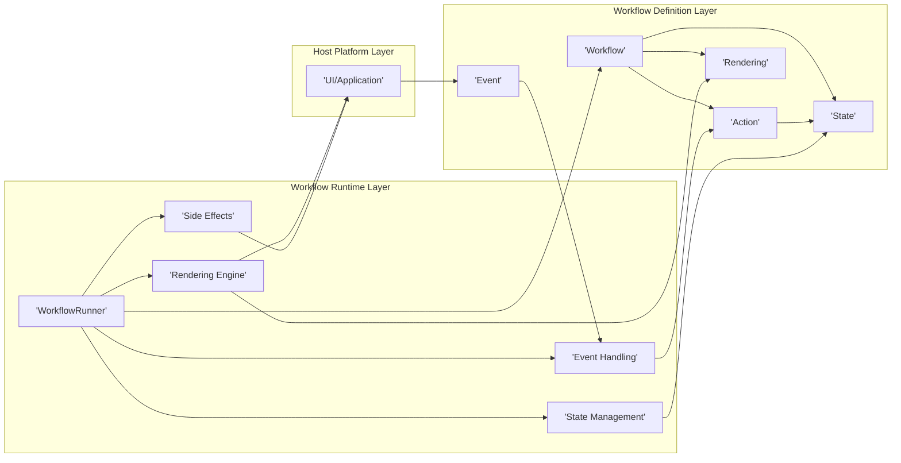
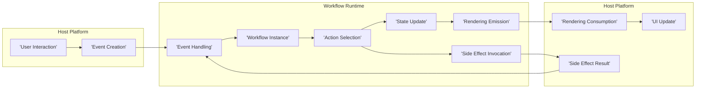

## Project Design Document: Workflow Kotlin (Improved)

**1. Introduction**

This document provides an enhanced architectural design overview of the `workflow-kotlin` project (available at [https://github.com/square/workflow-kotlin](https://github.com/square/workflow-kotlin)). This document builds upon the previous version to provide greater clarity and detail, serving as a robust foundation for subsequent threat modeling activities. It meticulously outlines the key components, their interactions, and the overall architecture of the system.

**2. Goals**

The primary goals of the `workflow-kotlin` project are to:

* Offer a declarative and composable paradigm for modeling intricate stateful processes.
* Facilitate the development of reliable and easily testable workflows.
* Provide a platform-agnostic framework for defining workflows, enabling their execution across diverse environments (e.g., Android, JVM, JavaScript via Kotlin/JS).
* Simplify the management of complex state transitions and the orchestration of side effects within applications.
* Promote a clear separation of concerns between the core business logic (encapsulated within the workflow definition) and the presentation layer (responsible for rendering the workflow's state).

**3. Non-Goals**

This design document explicitly excludes:

* In-depth implementation specifics of individual workflows created using the library.
* Detailed performance evaluations, benchmarking data, or specific optimization techniques.
* The intricacies of UI rendering implementations on various target platforms.
* The internal mechanisms of the Kotlin coroutines library, a foundational dependency of `workflow-kotlin`.
* Specific details about persistence strategies for workflow state.

**4. Architectural Overview**

`workflow-kotlin` is structured around a component-based architecture where the `Workflow` serves as the central element. Workflows are essentially state machines that react to incoming events and produce renderings that reflect their current state. The core architecture can be visualized as follows:

**5. Component Descriptions**

The key components within the `workflow-kotlin` architecture are described in detail below:

* **Workflow:**
    * The fundamental unit of composition, representing a self-contained, stateful process.
    * Encapsulates the possible `State`s, permissible `Action`s, and the logic governing transitions between states in response to `Event`s.
    * Emits `Rendering`s, which are representations of the workflow's current state intended for consumption by external systems, typically the UI.
* **State:**
    * Represents the instantaneous condition of a `Workflow` at a specific point in its execution.
    * Designed to be immutable data, ensuring predictable behavior and facilitating easier reasoning about the workflow's logic.
    * Holds all the necessary information to represent the workflow's current situation.
* **Action:**
    * Represents a discrete transformation applied to the `Workflow`'s `State`.
    * Can be triggered either by internal logic within the workflow or by external `Event`s.
    * Results in the creation of a new, updated `State` for the workflow.
* **Rendering:**
    * A structured representation of the `Workflow`'s current `State`, specifically formatted for consumption by a UI or other external observer.
    * Typically contains the data required to visually represent the current state or trigger specific UI updates.
* **Event:**
    * An occurrence that signals a potential change or interaction with the `Workflow`, potentially triggering a state transition.
    * Can originate from various sources, including user interactions within the UI, signals from external systems, or internal timers managed by the workflow.
* **WorkflowRunner:**
    * The core execution engine responsible for managing the lifecycle of a `Workflow` instance.
    * Orchestrates state transitions, manages the emission of `Rendering`s, and handles the invocation of `Side Effects`.
* **State Management:**
    * The internal mechanism responsible for maintaining and updating the `Workflow`'s `State`.
    * Ensures the consistency and integrity of the state throughout the workflow's execution.
* **Event Handling:**
    * The component that receives incoming `Event`s and routes them to the appropriate `Workflow` instance for processing.
    * Determines which `Action` should be executed by the workflow in response to a given event, based on the current state.
* **Rendering Engine:**
    * Interprets the `Rendering`s emitted by the `Workflow` and translates them into updates within the host platform, typically the UI.
    * Responsible for efficiently applying the changes described in the rendering data to the target system.
* **Side Effects:**
    * Represents interactions with the outside world that are triggered by the `Workflow`.
    * Managed by the `WorkflowRunner` to ensure proper execution and testing. Examples include network requests, database operations, or interactions with device sensors.
* **UI/Application (Host Platform):**
    * The environment in which the `Workflow` is deployed and executed.
    * Provides the necessary infrastructure for running the `WorkflowRunner` and interacting with the workflow.
    * Responsible for capturing user input and translating it into `Event`s that are fed back into the workflow.

**6. Data Flow (Detailed)**

The typical sequence of data flow within a `workflow-kotlin` application is as follows:

Detailed steps of the data flow:

* **User Interaction:** A user interacts with the application's user interface (e.g., clicks a button, enters text).
* **Event Creation:** The host platform (UI layer) translates this user interaction into a concrete `Event` object.
* **Event Handling:** The `Event Handling` component within the `Workflow Runtime` receives the created `Event`.
* **Workflow Instance:** The `Event Handling` component routes the `Event` to the appropriate `Workflow` instance that is responsible for handling it.
* **Action Selection:** The `Workflow` instance, based on its current `State` and the received `Event`, determines the appropriate `Action` to execute.
* **Side Effect Invocation (Optional):** If the selected `Action` involves interacting with the outside world, the `WorkflowRunner` invokes the necessary `Side Effect`.
* **Side Effect Result (Optional):** The result of the `Side Effect` (e.g., data from a network request) is often translated into another `Event` that is fed back into the `Workflow`.
* **State Update:** The `Action` execution results in an update to the `Workflow`'s internal `State`, creating a new immutable state.
* **Rendering Emission:** Based on the updated `State`, the `Workflow` emits a new `Rendering` that represents the current state to the outside world.
* **Rendering Consumption:** The `Rendering Engine` in the host platform receives the emitted `Rendering`.
* **UI Update:** The host platform (UI layer) consumes the `Rendering` and updates the user interface accordingly to reflect the new state of the workflow.

**7. Security Considerations (More Specific)**

Building upon the initial considerations, here are more specific security aspects to consider:

* **State Management Security:**
    * **Integrity:** Mechanisms should be in place to prevent unauthorized modification of the workflow's state, potentially through data corruption or malicious actors. Consider using immutable data structures and secure storage mechanisms if state persistence is required.
    * **Confidentiality:** If the workflow's state contains sensitive information, appropriate encryption and access control measures should be implemented to prevent unauthorized access.
    * **Replay Attacks:** If state changes are persisted, consider the risk of replay attacks where older states are reintroduced. Implement mechanisms to detect and prevent such attacks (e.g., versioning, timestamps).
* **Event Handling Security:**
    * **Input Validation:** Rigorously validate all incoming events to prevent injection attacks (e.g., SQL injection if events are derived from user input used in database queries) or unexpected behavior due to malformed data.
    * **Source Authentication:** If events originate from external systems, ensure a mechanism to authenticate the source and verify the integrity of the event data.
    * **Denial of Service:** Consider the potential for malicious actors to flood the system with events, leading to resource exhaustion. Implement rate limiting or other protective measures.
* **Rendering Security:**
    * **Information Disclosure:** Ensure that rendering data does not inadvertently expose sensitive information that should not be visible to the user or other consuming systems.
    * **Cross-Site Scripting (XSS):** If renderings are used to update web-based UIs, be mindful of XSS vulnerabilities if rendering data includes user-provided content that is not properly sanitized.
* **Workflow Definition Security:**
    * **Authorization:** Control who has the authority to define, modify, or deploy workflows, especially in environments where workflows represent critical business processes.
    * **Code Injection:** If workflow definitions involve any form of dynamic code execution or scripting, ensure robust security measures to prevent code injection vulnerabilities.
* **Side Effect Security:**
    * **Secure API Calls:** When invoking external services or APIs as side effects, ensure secure communication protocols (e.g., HTTPS) and proper authentication and authorization.
    * **Data Sanitization:** When processing data received from side effects, sanitize it appropriately before using it to update the workflow's state or generate renderings.
* **Concurrency and Threading:**
    * **Race Conditions:** Carefully design workflows and side effects to avoid race conditions that could lead to inconsistent state or security vulnerabilities. Utilize appropriate synchronization mechanisms where necessary.
    * **Deadlocks:** Be aware of the potential for deadlocks in complex workflows involving multiple concurrent operations.

**8. Deployment Considerations (Expanded)**

`workflow-kotlin`'s platform-agnostic nature allows for flexible deployment options:

* **Native Android Applications:** Workflows can manage the state and navigation logic within Activities, Fragments, or Jetpack Compose components. Integration with Android lifecycle management is a key consideration.
* **Server-Side JVM Applications:** Workflows can orchestrate business processes in backend services built with frameworks like Spring Boot or Ktor. Considerations include handling concurrent requests and managing workflow state persistence in a distributed environment.
* **Web Applications (Kotlin/JS):** Using Kotlin/JS, workflows can be executed directly in the browser to manage the state of web applications built with frameworks like React or Vue.js. Security considerations related to client-side execution become paramount.
* **Desktop Applications (JVM):** Workflows can be integrated into desktop applications built with frameworks like JavaFX or Swing to manage application state and user interactions.
* **Embedded Systems (Kotlin/Native):** While potentially more complex, workflows could theoretically be used in resource-constrained embedded systems using Kotlin/Native, requiring careful consideration of memory management and performance.

Deployment typically involves including the `workflow-kotlin` library as a dependency in the project's build configuration. The instantiation and execution of workflows are managed by the `WorkflowRunner` within the specific host environment.

**9. Future Considerations**

Potential future enhancements and considerations for the `workflow-kotlin` project include:

* **Enhanced Debugging and Monitoring Tools:** Development of more sophisticated tools for inspecting workflow state, tracking event flow, and debugging complex workflow logic.
* **Standardized State Persistence Mechanisms:** Providing built-in or recommended patterns for persisting workflow state, catering to different persistence needs (e.g., in-memory, database).
* **Improved Testing Support:** Further enhancements to testing APIs and methodologies to facilitate comprehensive testing of workflows, including state transitions and side effect interactions.
* **Integration with Reactive Streams:** Deeper integration with reactive streams libraries (e.g., RxJava, Reactor) to facilitate asynchronous event handling and data processing within workflows.
* **Advanced Error Handling and Recovery:** Implementing more robust mechanisms for handling errors and exceptions within workflows, including strategies for recovery and rollback.
* **Visual Workflow Design Tools:** Exploring the possibility of visual tools or DSLs for designing and modeling workflows, potentially simplifying the creation of complex processes.

This improved design document provides a more detailed and comprehensive understanding of the `workflow-kotlin` project's architecture. The enhanced descriptions of components, data flow, and security considerations will be invaluable for conducting a thorough and effective threat modeling exercise.