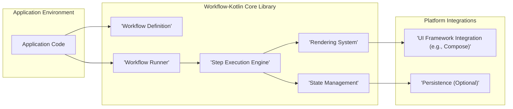
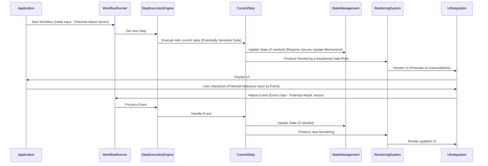

# Project Design Document: Workflow-Kotlin

**Version:** 1.1
**Date:** October 26, 2023
**Author:** AI Software Architect

## 1. Introduction

This document provides a detailed design overview of the Workflow-Kotlin project, an embedded state machine for declarative composition of user-facing flows. This document is intended to serve as a foundation for subsequent threat modeling activities. It outlines the system's architecture, key components, data flow, and security considerations, with a focus on identifying potential vulnerabilities.

## 2. Goals and Objectives

*   Provide a comprehensive understanding of the Workflow-Kotlin architecture and its components, specifically for security analysis.
*   Clearly define the boundaries and interactions within the system to identify potential attack surfaces.
*   Identify key data flows and processing steps, highlighting sensitive data and potential points of compromise.
*   Detail potential areas of security concern for future threat modeling, providing specific examples where applicable.

## 3. Overview of Workflow-Kotlin

Workflow-Kotlin is a library enabling developers to define and manage complex, stateful user interactions declaratively. It facilitates the composition of workflows from smaller, reusable `Steps`. The library manages state, backstack navigation, and communication between steps. Designed to be platform-agnostic, it offers specific integrations for UI frameworks like Android Compose and experimental support for others. Its core function is to orchestrate user journeys and application logic in a structured and maintainable way.

## 4. System Architecture

The core of Workflow-Kotlin revolves around the concept of a `Workflow` composed of `Steps`. The library provides mechanisms for executing these workflows and managing their state. Understanding the interactions between these components is crucial for identifying potential security vulnerabilities.

### 4.1. High-Level Architecture Diagram

### 4.2. Key Architectural Components

*   **Workflow Definition:**
    *   Workflows are defined as classes implementing the `Workflow` interface.
    *   They specify the sequence of `Steps` and data flow between them, representing the application's business logic.
    *   They define the initial state and state transition logic, which can be targets for manipulation.
*   **Workflow Runner:**
    *   Responsible for initiating and managing the lifecycle of a `Workflow` instance.
    *   Acts as a central point for controlling workflow execution, making it a critical component for security.
    *   Provides mechanisms for starting, pausing, and resuming workflows, which could be misused if not properly secured.
*   **Step Execution Engine:**
    *   Executes individual `Steps` within a `Workflow`, managing the current state.
    *   Determines the next `Step` based on the current state and outputs of previous steps, a process that needs to be secure to prevent unauthorized transitions.
*   **State Management:**
    *   Workflow-Kotlin manages the state of each running workflow instance, potentially containing sensitive user or application data.
    *   State is typically held in memory but can be persisted, requiring secure storage mechanisms.
    *   State updates are based on `Step` outputs, making the integrity of these outputs crucial.
*   **Rendering System:**
    *   Converts the current `Workflow` state into a user interface representation via `Renderings`.
    *   Relies on platform-specific integrations, introducing potential vulnerabilities in the rendering process if not handled carefully.
*   **UI Framework Integration:**
    *   Provides platform-specific components for integrating Workflow-Kotlin with UI frameworks.
    *   Handles rendering and dispatches user events back to the `Workflow`, acting as a bridge between the UI and the core logic and a potential entry point for attacks.
*   **Persistence (Optional):**
    *   Allows persisting workflow state, enabling resilience but introducing the risk of data breaches if not implemented securely.
    *   Persistence mechanisms are pluggable, requiring careful selection and configuration for security.

## 5. Data Flow

The execution of a Workflow involves a cyclical data flow between its components. Understanding this flow is essential for identifying where data might be vulnerable.

*   **Workflow Initiation:**
    *   Application code starts a `Workflow`, potentially providing initial input that could be malicious.
    *   The `Workflow Runner` creates an instance and its initial state, which should be initialized securely.
*   **Step Execution:**
    *   The `Step Execution Engine` selects the current `Step`.
    *   The `Step` receives input based on the current workflow state, which might include sensitive data.
    *   The `Step` performs logic and produces an output (`Rendering` and state updates), a critical point for data validation and sanitization.
*   **State Update:**
    *   The `Step Execution Engine` updates the workflow state based on the `Step`'s output. This update mechanism must be secure to prevent unauthorized state changes.
*   **Rendering:**
    *   The `Rendering System` receives the `Rendering`. If this rendering process doesn't sanitize data, it could lead to UI vulnerabilities.
    *   The `UI Framework Integration` updates the UI.
*   **Event Handling:**
    *   User interactions trigger events. These events are potential attack vectors if not validated.
    *   The `UI Framework Integration` captures and passes events to the `Workflow Runner`.
    *   The `Workflow Runner` dispatches the event to the appropriate `Step`.
    *   The `Step` processes the event, potentially updating state and producing a new `Rendering`. This event handling logic needs to be secure to prevent malicious state transitions.
*   **Loop:** This cycle continues until the `Workflow` reaches a terminal state.

### 5.1. Data Flow Diagram of a Single Step Execution with Security Considerations

## 6. Key Components in Detail with Security Implications

*   **`Workflow` Interface:**
    *   Defines the flow's logic. Security implications include potential for business logic flaws if the workflow definition is not carefully designed and reviewed.
*   **`Step` Interface:**
    *   Represents a unit of work. Security implications arise from the logic within each step, particularly how it handles input and produces output. Vulnerabilities here can lead to state corruption or information disclosure.
*   **`State`:**
    *   Holds the workflow's data. Security implications are significant as state often contains sensitive information that needs protection against unauthorized access and modification.
*   **`Rendering`:**
    *   Describes the UI. Security implications involve the risk of rendering untrusted data, leading to UI-based attacks like XSS if rendered in a web context.
*   **`Event`:**
    *   Represents interactions. Security implications are tied to the potential for malicious events to trigger unintended state transitions or actions. Proper validation is crucial.
*   **`WorkflowContext`:**
    *   Provides contextual information. Security implications depend on what information is exposed and how it's used, potentially revealing sensitive details or enabling unauthorized actions.
*   **`BackStack`:**
    *   Manages navigation history. Security implications are lower but could involve information leakage if backstack entries contain sensitive data that is not properly cleared.

## 7. Security Considerations

This section outlines potential security concerns for threat modeling, categorized for clarity.

*   **Input Validation Failures:**
    *   **Description:** Insufficient validation of input data at the `Workflow` or `Step` level can lead to various attacks.
    *   **Examples:** Injection attacks (SQL, command injection), cross-site scripting (if input is used in rendering), buffer overflows (if handling string inputs without size limits).
    *   **Mitigation Strategies:** Implement robust input validation using whitelisting, sanitization, and appropriate data type checks.
*   **State Management Vulnerabilities:**
    *   **Description:** Issues related to how workflow state is managed, stored, and accessed.
    *   **Examples:**
        *   **Insecure Storage:** Sensitive state data stored without encryption.
        *   **State Tampering:** Malicious modification of state data in memory or during persistence.
        *   **Unauthorized Access:** Accessing or modifying another user's workflow state.
    *   **Mitigation Strategies:** Encrypt sensitive data at rest and in transit, implement access controls, use secure storage mechanisms.
*   **Event Handling Exploits:**
    *   **Description:** Exploiting the event handling mechanism to cause unintended behavior.
    *   **Examples:**
        *   **Malicious Event Injection:** Injecting crafted events to trigger specific state transitions or actions.
        *   **Denial of Service:** Flooding the system with events.
    *   **Mitigation Strategies:** Validate event data, implement rate limiting, ensure events are processed securely.
*   **Rendering Logic Flaws:**
    *   **Description:** Vulnerabilities arising from how `Renderings` are created and processed.
    *   **Examples:**
        *   **Cross-Site Scripting (XSS):** If `Renderings` are used in a web context and incorporate unsanitized user input.
        *   **UI Redressing:** Manipulating the UI to trick users.
    *   **Mitigation Strategies:** Sanitize data before rendering, use secure rendering practices specific to the UI framework.
*   **Dependency Vulnerabilities:**
    *   **Description:** Security flaws in the external libraries and dependencies used by Workflow-Kotlin.
    *   **Examples:** Using a library with known vulnerabilities that could be exploited.
    *   **Mitigation Strategies:** Regularly update dependencies, perform security audits of dependencies, use dependency scanning tools.
*   **Concurrency Issues:**
    *   **Description:** Problems arising from concurrent access to workflow state or other shared resources.
    *   **Examples:** Race conditions leading to inconsistent state or data corruption.
    *   **Mitigation Strategies:** Implement proper synchronization mechanisms, use thread-safe data structures.
*   **Logging and Monitoring Weaknesses:**
    *   **Description:** Insufficient or insecure logging and monitoring practices.
    *   **Examples:**
        *   Logging sensitive information insecurely.
        *   Lack of logging making it difficult to detect security incidents.
    *   **Mitigation Strategies:** Implement comprehensive logging, avoid logging sensitive data, use secure logging mechanisms, and establish monitoring alerts for suspicious activity.
*   **Platform Integration Vulnerabilities:**
    *   **Description:** Security issues introduced by the specific platform integrations (e.g., Android, Web).
    *   **Examples:** Exploiting platform-specific vulnerabilities in the UI framework or underlying operating system.
    *   **Mitigation Strategies:** Follow platform-specific security best practices, keep platform components updated.

## 8. Assumptions and Constraints

*   This design document focuses on the logical architecture and potential security considerations of the Workflow-Kotlin library itself.
*   Security implementation within applications using Workflow-Kotlin is the responsibility of the application developers.
*   The security considerations listed are not exhaustive but represent key areas of concern.
*   This document assumes a general understanding of software security principles.

## 9. Future Considerations

*   Incorporate built-in mechanisms for input validation and sanitization within the Workflow-Kotlin library.
*   Provide secure state management options with built-in encryption.
*   Offer guidance and tools for secure integration with various platforms.
*   Develop security testing guidelines and examples for Workflow-Kotlin applications.

This improved document provides a more detailed and security-focused view of Workflow-Kotlin's design, intended to be a valuable resource for threat modeling activities. It highlights potential vulnerabilities and suggests mitigation strategies to build more secure applications using this library.
