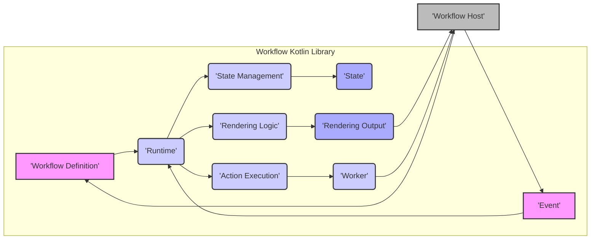
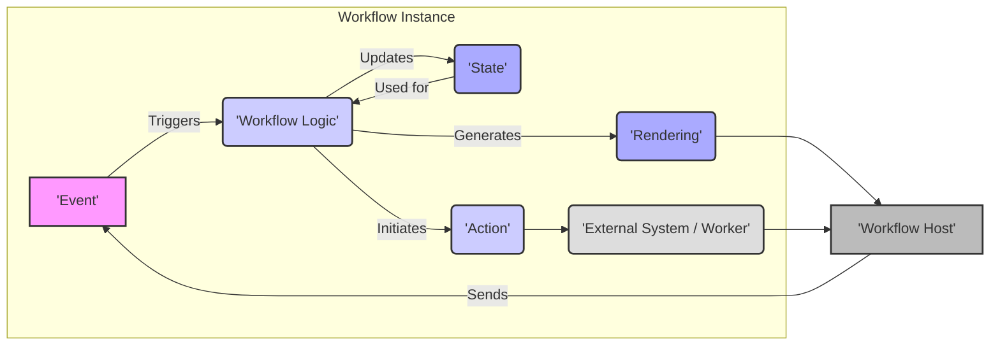

## Project Design Document: Workflow Kotlin Library (Improved)

**1. Introduction**

This document provides an enhanced design overview of the `workflow-kotlin` library developed by Square. Its primary purpose is to serve as a robust foundation for subsequent threat modeling activities. This document meticulously outlines the key components, functionalities, data flow, and interactions within the library, with a strong emphasis on security-relevant aspects. It is intended for security architects, software developers, and threat modeling engineers involved in assessing the security posture of applications utilizing `workflow-kotlin`.

**2. Project Overview**

The `workflow-kotlin` library is a sophisticated framework designed for building stateful and composable user interfaces and business logic. It empowers developers to define workflows as a structured sequence of steps and transitions, effectively managing state and side effects in a predictable and maintainable manner. The central concept is the "Workflow," representing a distinct unit of work characterized by a defined lifecycle and internal state.

**3. Goals**

*   Deliver a more refined and detailed description of the `workflow-kotlin` library's architecture and functionality.
*   Precisely identify key components and elucidate their interactions with greater clarity.
*   Illustrate the flow of data within the library with enhanced precision.
*   Sharpen the focus on potential areas of interest for security analysis and threat modeling, providing more actionable insights.

**4. Target Audience**

*   Security Architects
*   Software Developers
*   Threat Modeling Engineers

**5. Scope**

This document specifically focuses on the design and architecture of the core `workflow-kotlin` library itself. It deliberately excludes the design of specific applications built using the library and does not delve into the intricacies of the underlying platform (e.g., Android, JVM) on which the library operates.

**6. Architectural Overview**

The `workflow-kotlin` library's architecture is centered around several fundamental concepts and interconnected components that collaboratively manage the lifecycle and state of workflows.

*   **Workflow:** The foundational building block, encapsulating a stateful process. It declaratively defines the logic, permissible state transitions, and rendering behavior.
*   **State:** Represents the instantaneous condition of a specific workflow instance. It can range from simple data primitives to complex object graphs.
*   **Event:** An external input that has the potential to trigger a state transition within a workflow. Events originate from sources external to the workflow itself (e.g., user interactions, system notifications).
*   **Action:** A side effect or operation executed by a workflow, either in direct response to an event or as an integral part of its internal logic. Actions can encompass state updates, I/O operations, or the initiation of other workflows.
*   **Rendering:** The output generated by a workflow, typically representing the desired user interface or a set of instructions for the host environment to update the UI.
*   **Workflow Host:** The execution environment in which workflows are instantiated and managed. This could be an Android Activity, a server-side application, or any platform capable of executing Kotlin code.
*   **Runtime:** The core engine responsible for the orchestration of workflow instances, the processing of incoming events, and the execution of defined actions.
*   **Worker:** Abstractions designed to facilitate the execution of asynchronous operations or side effects within the context of a workflow, preventing blocking of the main execution thread.
*   **Snapshot:** A mechanism for capturing and subsequently restoring the complete state of a workflow instance, enabling persistence and resilience.

**7. Component Diagram**

**8. Data Flow Diagram**

**9. Detailed Component Description**

*   **Workflow Definition:**
    *   Encapsulates the declarative specification of a workflow's behavior, including its initial state, the set of possible states it can occupy, permissible transitions between these states, and the actions to be performed during these transitions.
    *   Typically implemented using Kotlin code, leveraging the library's Domain Specific Language (DSL) for conciseness and clarity.
    *   Crucially defines the logic for handling incoming events and the resulting state changes.
*   **Runtime:**
    *   Serves as the central orchestrator, responsible for managing the entire lifecycle of individual workflow instances.
    *   Receives events originating from the **Workflow Host** and intelligently dispatches them to the appropriate workflow instance for processing.
    *   Orchestrates the process of updating the workflow's **State** based on event handling logic.
    *   Manages the execution of **Actions** triggered by state transitions or internal workflow logic.
    *   Oversees the **Rendering Logic** to produce output based on the current workflow state.
*   **State Management:**
    *   Dedicated to the secure and consistent storage and management of the current **State** of each active workflow instance.
    *   Implements mechanisms to ensure that state updates are atomic, preventing race conditions and maintaining data integrity.
    *   May incorporate features for state persistence (using **Snapshots**) and restoration, enabling workflows to survive application restarts or failures.
*   **Event:**
    *   Represents a discrete occurrence that can potentially trigger a change in a workflow's internal **State**.
    *   Can originate from a variety of sources, including direct user interactions (e.g., button presses, form submissions), asynchronous system events (e.g., timers expiring, network responses), or signals from other parts of the application.
    *   Typically structured as data objects, carrying relevant information about the specific occurrence.
*   **Action Execution:**
    *   Responsible for the reliable execution of side effects or operations that are defined within the workflow's logic.
    *   May involve interactions with external systems (e.g., making API calls, writing to databases), performing input/output (I/O) operations, or initiating other related workflows.
    *   Leverages **Worker** abstractions to manage asynchronous operations efficiently, preventing blocking of the main application thread.
*   **Rendering Logic:**
    *   The component responsible for generating the output of the workflow based on its current **State**.
    *   Typically produces a representation of the user interface (UI) to be displayed or a set of instructions for the **Workflow Host** to update the existing UI.
    *   Involves mapping the workflow's internal **State** to visual elements or other output formats suitable for the host environment.
*   **State:**
    *   Represents the internal data held by a workflow at a specific point in time, reflecting its current condition.
    *   Can range from simple primitive data types (e.g., integers, strings, booleans) to complex, nested object structures.
    *   Changes in the **State** are the primary driver of a workflow's behavior and the content of its **Rendering Output**.
*   **Worker:**
    *   A crucial abstraction for encapsulating asynchronous operations or any side effects that should not block the main execution thread of the workflow.
    *   Allows workflows to perform potentially long-running tasks (e.g., network requests, file system operations) without freezing the user interface or hindering responsiveness.
    *   Examples include network clients, database access objects, or interfaces to hardware sensors.
*   **Rendering Output:**
    *   The tangible result of the **Rendering Logic**, typically representing the UI elements to be displayed to the user or specific instructions for the **Workflow Host** to modify the UI.
    *   The specific format of the **Rendering Output** is dependent on the nature of the **Workflow Host** (e.g., UI component trees for Android applications, HTML structures for web applications).
*   **Workflow Host:**
    *   The encompassing application or environment within which the `workflow-kotlin` library is integrated and operates.
    *   Provides the fundamental infrastructure required for running workflows, including mechanisms for dispatching **Events** to the **Runtime** and rendering the **Rendering Output** generated by workflows.
    *   Responsible for the creation, management, and lifecycle of individual workflow instances.

**10. Key Interactions**

*   The **Workflow Host** initiates a new workflow instance by providing a **Workflow Definition** to the **Runtime**.
*   The **Workflow Host** signals occurrences within the environment by sending **Events** to the **Runtime**.
*   The **Runtime**, upon receiving an **Event**, consults the relevant **Workflow Definition** to determine the appropriate state transition logic.
*   The **Runtime** then updates the workflow's internal **State** through the **State Management** component.
*   Based on the triggered state transition, the **Runtime** may initiate **Action Execution**.
*   **Action Execution** can involve invoking a specific **Worker** to perform asynchronous operations or interact with external systems.
*   The **Runtime** utilizes the **Rendering Logic**, informed by the current **State**, to generate the **Rendering Output**.
*   The **Workflow Host** consumes the **Rendering Output** to update the user interface or trigger other relevant actions within the host environment.
*   **Workers**, after completing their assigned tasks, may provide results back to the **Runtime**, potentially triggering further state transitions or actions.

**11. Security Considerations (Detailed for Threat Modeling)**

This section provides a more detailed examination of potential security concerns, intended to guide subsequent threat modeling efforts.

*   **Event Handling:**
    *   **Insufficient Input Validation:** Lack of robust validation on incoming **Events** could allow attackers to inject malicious data, leading to unexpected state transitions or application crashes. Consider validating event structure, data types, and allowed values.
    *   **Event Spoofing/Replay Attacks:** If the source of **Events** is not properly authenticated or if events lack sufficient temporal information, attackers might be able to inject or replay events, manipulating the workflow's state. Implement secure event sourcing and authentication mechanisms.
*   **State Management:**
    *   **State Tampering:** If the storage or in-memory representation of the **State** is not adequately protected, attackers might be able to directly modify the state, bypassing intended workflow logic. Employ memory protection techniques and secure storage mechanisms.
    *   **State Injection:** Vulnerabilities in how state is updated or initialized could allow attackers to inject malicious data into the state, potentially leading to code execution or information disclosure. Carefully sanitize data before incorporating it into the state.
    *   **Insecure Serialization/Deserialization:** If **State** is serialized for persistence or transfer (e.g., using **Snapshots**), vulnerabilities in the serialization/deserialization process could allow for remote code execution or data corruption. Use secure serialization libraries and avoid deserializing data from untrusted sources.
*   **Action Execution:**
    *   **Privilege Escalation:** If **Actions** are not properly authorized, a workflow might be able to perform actions with elevated privileges, leading to unauthorized access or modification of resources. Implement fine-grained authorization controls for actions.
    *   **Injection Vulnerabilities:** If **Actions** involve interacting with external systems (e.g., constructing database queries, making API calls), they could be susceptible to injection attacks (e.g., SQL injection, command injection) if input is not properly sanitized. Use parameterized queries and secure coding practices.
    *   **Resource Exhaustion:** Maliciously crafted workflows or events could trigger **Actions** that consume excessive resources (e.g., CPU, memory, network bandwidth), leading to denial-of-service. Implement rate limiting and resource quotas for actions.
*   **Rendering:**
    *   **Cross-Site Scripting (XSS):** If the **Rendering Output** is used to generate web UI, insufficient sanitization of user-provided data within the state could lead to XSS vulnerabilities, allowing attackers to inject malicious scripts into the rendered page. Employ robust output encoding and consider using a Content Security Policy (CSP).
    *   **Information Disclosure:** The **Rendering Output** might inadvertently expose sensitive information contained within the workflow's **State** if not carefully designed. Review rendering logic to ensure only necessary information is displayed.
*   **Worker Security:**
    *   **Vulnerable Dependencies:** **Workers** often rely on external libraries, which might contain security vulnerabilities. Regularly audit and update dependencies to mitigate this risk.
    *   **Insecure Communication:** If **Workers** communicate with external systems, ensure that communication channels are secured using protocols like HTTPS and that sensitive data is encrypted in transit.
*   **Workflow Definition Security:**
    *   **Malicious Logic Injection:** If the process of creating or modifying **Workflow Definitions** is not properly controlled, attackers might be able to inject malicious logic into the workflow, leading to arbitrary code execution or other security breaches. Implement access controls and code review processes for workflow definitions.
    *   **Lack of Input Validation in Definitions:** Similar to event handling, ensure that any external input used within workflow definitions is validated to prevent unexpected behavior.
*   **Workflow Host Security:**
    *   The overall security of the `workflow-kotlin` library is inherently tied to the security of the **Workflow Host** environment. Vulnerabilities in the host application (e.g., insecure dependencies, improper configuration) can directly impact the security of the workflows running within it. Follow secure development practices for the host application.

**12. Deployment Considerations**

The `workflow-kotlin` library is typically integrated as a dependency within a larger application. The specific deployment strategy depends on the target platform. Security considerations during deployment include:

*   **Secure Dependency Management:** Utilize secure dependency management tools and practices to ensure the integrity and authenticity of the `workflow-kotlin` library and all its transitive dependencies. Verify checksums and use trusted repositories.
*   **Secure Configuration:** Carefully configure any settings related to the library, ensuring that default configurations are reviewed and hardened as necessary. Avoid storing sensitive information in configuration files.
*   **Secure Runtime Environment:** Ensure that the underlying runtime environment (e.g., JVM, Android runtime) is secure, patched against known vulnerabilities, and properly configured.

**13. Future Considerations**

*   **Enhanced State Persistence Security:** Investigate and implement more robust security measures for state persistence mechanisms, including encryption at rest and access controls.
*   **Security for Distributed Workflows:**  Address the unique security challenges associated with running workflows across multiple nodes or services, including secure communication and distributed state management.
*   **Comprehensive Monitoring and Logging:** Implement secure and auditable logging and monitoring mechanisms to track workflow activity, detect suspicious behavior, and facilitate security incident response. Ensure logs do not inadvertently expose sensitive information.

**14. Conclusion**

This improved document provides a more detailed and security-focused design overview of the `workflow-kotlin` library. It meticulously outlines the key components, data flow, and interactions, with a strong emphasis on potential security vulnerabilities. This information is crucial for conducting thorough threat modeling activities and implementing appropriate security mitigations for applications built using this powerful framework. The detailed security considerations outlined here serve as a valuable starting point for identifying and addressing potential risks.