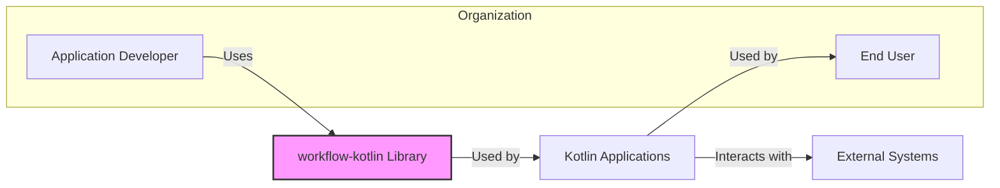
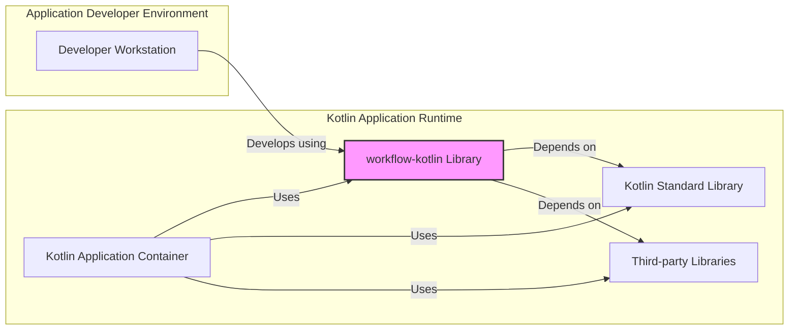
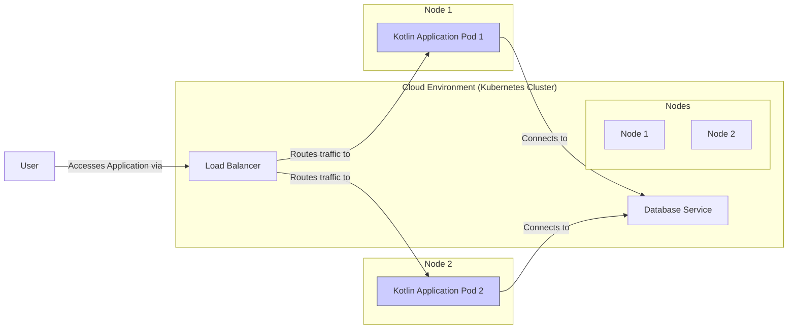
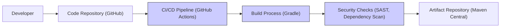

# BUSINESS POSTURE

This project, 'workflow-kotlin', is a Kotlin library designed to simplify the development of applications that require complex state management and orchestration. It aims to provide a robust and developer-friendly framework for building and managing workflows within Kotlin applications.

- Business Priorities and Goals:
  - Simplify development of stateful applications.
  - Improve code maintainability and readability for complex workflows.
  - Enhance developer productivity by providing a reusable workflow framework.
  - Enable building resilient and scalable applications through workflow management.
  - Foster adoption of Kotlin for building complex backend systems.

- Business Risks:
  - Adoption Risk: Developers may not adopt the library if it is perceived as too complex, poorly documented, or lacking in features.
  - Maintenance Burden:  Maintaining the library and ensuring its compatibility with evolving Kotlin and related technologies requires ongoing effort.
  - Security Vulnerabilities:  Vulnerabilities in the library could be inherited by all applications that use it, posing a widespread risk.
  - Performance Issues: Inefficient workflow implementations within the library could lead to performance bottlenecks in applications.
  - Community Support Risk: Reliance on open-source community for support and contributions can be unpredictable.

# SECURITY POSTURE

- Security Controls:
  - security control: Code Reviews - Implemented through GitHub pull requests and contributions review process. (Location: GitHub repository contribution guidelines and pull request process)
  - security control: Unit Tests -  Extensive unit tests are present in the repository to ensure code correctness and prevent regressions. (Location: 'workflow-kotlin' repository test directories)
  - security control: Open Source License (Apache 2.0) - Allows for community scrutiny and contributions, potentially leading to faster identification and resolution of security issues. (Location: LICENSE file in the repository)

- Accepted Risks:
  - accepted risk: Third-party Dependencies - The library relies on external Kotlin and Java libraries, which may contain vulnerabilities. Risk is mitigated by dependency management and updates.
  - accepted risk: Community Contributions - Security of contributions from the community relies on the code review process. Potential risk of malicious or vulnerable code being introduced.
  - accepted risk: Lack of Dedicated Security Team - As an open-source project, there might not be a dedicated security team continuously monitoring for vulnerabilities. Reliance on community and maintainers.

- Recommended Security Controls:
  - security control: Automated Dependency Scanning - Implement automated scanning of dependencies for known vulnerabilities as part of the CI/CD pipeline.
  - security control: Static Application Security Testing (SAST) - Integrate SAST tools into the CI/CD pipeline to automatically detect potential security flaws in the code.
  - security control: Security Audits - Conduct periodic security audits of the codebase by external security experts.
  - security control: Vulnerability Disclosure Policy - Establish a clear vulnerability disclosure policy to allow security researchers to report issues responsibly.
  - security control: Security Documentation - Provide clear security guidelines for developers using the library, including best practices for secure workflow implementation.

- Security Requirements:
  - Authentication: Not directly applicable to a library. Authentication is the responsibility of the applications using the library.
  - Authorization: Not directly applicable to a library. Authorization is the responsibility of the applications using the library. However, the library should provide mechanisms to implement authorization within workflows if needed by the application.
  - Input Validation: The library's API should perform robust input validation to prevent unexpected behavior or vulnerabilities when applications interact with it. This is crucial for public functions and workflow definitions.
  - Cryptography: If the library handles sensitive data or requires secure communication within workflows, it should provide secure cryptographic functionalities or guidance on using external cryptography libraries securely.  Ensure proper key management practices if cryptography is used.

# DESIGN

## C4 CONTEXT

- Context Diagram Elements:
  - - Name: Application Developer
    - Type: Person
    - Description: Developers who use the 'workflow-kotlin' library to build Kotlin applications.
    - Responsibilities: Develop applications using the library, define workflows, integrate workflows into applications.
    - Security controls: Secure development practices, code reviews, access control to development environments.
  - - Name: End User
    - Type: Person
    - Description: Users who interact with applications built using the 'workflow-kotlin' library.
    - Responsibilities: Use the applications to perform tasks, interact with workflows indirectly through the application's user interface.
    - Security controls: Authentication to applications, authorization within applications, input validation in applications.
  - - Name: workflow-kotlin Library
    - Type: Software System
    - Description: A Kotlin library providing a framework for building and managing workflows.
    - Responsibilities: Provide core workflow functionalities, state management, workflow execution, API for developers.
    - Security controls: Input validation in library APIs, secure coding practices, dependency scanning, SAST, security audits.
  - - Name: Kotlin Applications
    - Type: Software System
    - Description: Applications built using the 'workflow-kotlin' library. These applications implement specific business logic and workflows.
    - Responsibilities: Implement business logic, define and execute workflows using the library, interact with external systems, provide user interface.
    - Security controls: Authentication, authorization, input validation, secure data handling, secure communication, application-level security controls.
  - - Name: External Systems
    - Type: Software System
    - Description: External services, databases, APIs, or other systems that Kotlin applications might interact with as part of their workflows.
    - Responsibilities: Provide data, services, or functionalities required by the workflows.
    - Security controls: API security, authentication, authorization, secure communication protocols, data security controls.

## C4 CONTAINER

- Container Diagram Elements:
  - - Name: Developer Workstation
    - Type: Environment
    - Description: The development environment used by application developers to write code and build applications that use 'workflow-kotlin'.
    - Responsibilities: Code development, local testing, building application artifacts.
    - Security controls: Workstation security policies, access control, developer training on secure coding practices.
  - - Name: Kotlin Application Container
    - Type: Container
    - Description: The runtime environment where Kotlin applications built with 'workflow-kotlin' are executed. This could be a JVM, a Docker container, or other runtime environments.
    - Responsibilities: Execute Kotlin application code, manage application dependencies, provide runtime environment for workflows.
    - Security controls: Container security hardening, runtime environment security configurations, resource management, monitoring and logging.
  - - Name: workflow-kotlin Library
    - Type: Library
    - Description: The 'workflow-kotlin' library itself, integrated into the Kotlin application.
    - Responsibilities: Provide workflow engine, state management, workflow definition API, workflow execution logic.
    - Security controls: Input validation, secure coding practices, dependency management, vulnerability scanning.
  - - Name: Kotlin Standard Library
    - Type: Library
    - Description: The standard library for Kotlin, a dependency of 'workflow-kotlin' and Kotlin applications.
    - Responsibilities: Provide core Kotlin functionalities, data structures, utilities.
    - Security controls: Managed by Kotlin Foundation, generally considered secure, updates and patches are released.
  - - Name: Third-party Libraries
    - Type: Library
    - Description: External libraries that 'workflow-kotlin' and Kotlin applications might depend on.
    - Responsibilities: Provide specific functionalities, utilities, or integrations.
    - Security controls: Dependency scanning, vulnerability management, license compliance checks.

## DEPLOYMENT

For applications built using 'workflow-kotlin', deployment architectures can vary widely. Common deployment options include:

- Cloud Platforms (AWS, Azure, GCP): Deploying Kotlin applications as microservices or serverless functions in cloud environments.
- Container Orchestration (Kubernetes): Deploying applications as containers managed by Kubernetes for scalability and resilience.
- On-Premise Servers: Deploying applications on traditional servers within a company's own data center.

Let's consider a deployment scenario using Kubernetes in a cloud environment.

- Deployment Diagram Elements:
  - - Name: Cloud Environment (Kubernetes Cluster)
    - Type: Environment
    - Description: A cloud-based Kubernetes cluster providing the infrastructure for deploying and running the Kotlin application.
    - Responsibilities: Container orchestration, resource management, scalability, high availability.
    - Security controls: Cloud provider security controls, Kubernetes security configurations (RBAC, network policies, etc.), cluster monitoring and logging.
  - - Name: Nodes (Node 1, Node 2)
    - Type: Infrastructure
    - Description: Worker nodes in the Kubernetes cluster where application pods are deployed.
    - Responsibilities: Run containerized applications, provide compute resources.
    - Security controls: Node operating system hardening, container runtime security, security updates, access control.
  - - Name: Kotlin Application Pods (Kotlin Application Pod 1, Kotlin Application Pod 2)
    - Type: Container
    - Description: Instances of the Kotlin application (built using 'workflow-kotlin') running as pods within the Kubernetes cluster.
    - Responsibilities: Execute application logic, handle user requests, interact with database and other services.
    - Security controls: Application-level security controls (authentication, authorization, input validation), container security, resource limits.
  - - Name: Load Balancer
    - Type: Infrastructure
    - Description: A load balancer distributing incoming traffic across multiple instances of the Kotlin application pods.
    - Responsibilities: Traffic distribution, high availability, SSL termination (optional).
    - Security controls: Load balancer security configurations, DDoS protection, access control, SSL/TLS configuration.
  - - Name: Database Service
    - Type: Data Store
    - Description: A managed database service used by the Kotlin application to store and retrieve data.
    - Responsibilities: Data persistence, data management, data security.
    - Security controls: Database access control, encryption at rest and in transit, database security configurations, backups and recovery.
  - - Name: User
    - Type: Person
    - Description: End users accessing the Kotlin application.
    - Responsibilities: Interact with the application to perform tasks.
    - Security controls: User authentication, secure communication channels (HTTPS).

## BUILD

- Build Process Elements:
  - - Name: Developer
    - Type: Person
    - Description: Developers writing and committing code to the 'workflow-kotlin' repository.
    - Responsibilities: Write code, commit changes, create pull requests.
    - Security controls: Secure coding practices, code reviews, access control to repository.
  - - Name: Code Repository (GitHub)
    - Type: System
    - Description: GitHub repository hosting the 'workflow-kotlin' source code.
    - Responsibilities: Version control, code storage, collaboration platform.
    - Security controls: Access control (authentication, authorization), branch protection, audit logs, vulnerability scanning by GitHub.
  - - Name: CI/CD Pipeline (GitHub Actions)
    - Type: System
    - Description: GitHub Actions workflows automating the build, test, and release process for 'workflow-kotlin'.
    - Responsibilities: Automated build, testing, security checks, artifact publishing.
    - Security controls: Secure pipeline configuration, secret management, access control to pipeline definitions, audit logs.
  - - Name: Build Process (Gradle)
    - Type: Tool
    - Description: Gradle build system used to compile, test, and package the 'workflow-kotlin' library.
    - Responsibilities: Dependency management, compilation, testing, packaging.
    - Security controls: Dependency management security, build script security, reproducible builds.
  - - Name: Security Checks (SAST, Dependency Scan)
    - Type: Tool
    - Description: Security scanning tools integrated into the CI/CD pipeline to perform static analysis and dependency vulnerability scanning.
    - Responsibilities: Identify potential security vulnerabilities in code and dependencies.
    - Security controls: Tool configuration, vulnerability reporting, integration with CI/CD pipeline.
  - - Name: Artifact Repository (Maven Central)
    - Type: System
    - Description: Maven Central repository where the built 'workflow-kotlin' library artifacts are published.
    - Responsibilities: Artifact storage, distribution of library artifacts to developers.
    - Security controls: Artifact signing, access control, repository security policies.

# RISK ASSESSMENT

- Critical Business Processes:
  - The critical business processes are those implemented by applications that utilize the 'workflow-kotlin' library. The library itself is an enabling component, and its failure or compromise could impact any application depending on it. The criticality depends on the specific applications and their business functions.

- Data Sensitivity:
  - The 'workflow-kotlin' library itself does not directly handle business data. However, applications built with it will process and manage data. The sensitivity of data depends entirely on the applications using the library. It could range from publicly available information to highly sensitive personal or financial data, depending on the application's purpose. The library should be designed to facilitate secure data handling by applications, but the responsibility for data security ultimately lies with the application developers.

# QUESTIONS & ASSUMPTIONS

- BUSINESS POSTURE:
  - Question: What are the primary use cases and target audience for applications built with 'workflow-kotlin'? (Assumption: Broad range of backend applications requiring workflow management).
  - Question: What is the expected level of community involvement and contribution to the project? (Assumption: Active community engagement is desired and expected).
  - Question: What are the key performance requirements for workflows built with the library? (Assumption: Performance is important, but flexibility and developer experience are also prioritized).

- SECURITY POSTURE:
  - Question: Are there any specific compliance requirements (e.g., GDPR, HIPAA, PCI DSS) that applications using 'workflow-kotlin' might need to adhere to? (Assumption: Applications might need to meet various compliance requirements depending on their domain).
  - Question: What is the process for handling security vulnerability reports and releasing security patches for the library? (Assumption: A clear and responsive vulnerability management process is in place or will be established).
  - Question: Are there any specific security features or functionalities that are planned for future development of the library? (Assumption: Security is considered an ongoing priority in the library's development).

- DESIGN:
  - Question: What are the typical deployment environments envisioned for applications using 'workflow-kotlin'? (Assumption: Cloud environments and containerized deployments are common targets).
  - Question: Are there any specific integrations with other systems or libraries that are considered essential or highly desirable for 'workflow-kotlin'? (Assumption: Integration capabilities are important for the library's usability).
  - Question: What level of customization and extensibility is intended for the workflow engine provided by the library? (Assumption: A balance between ease of use and extensibility is desired).