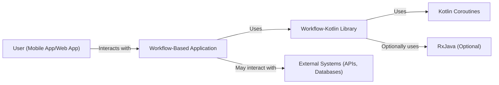
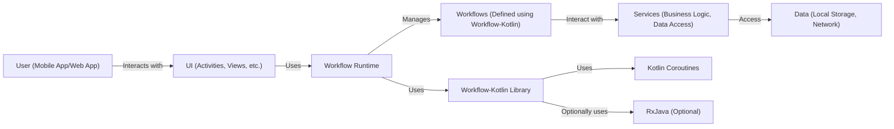
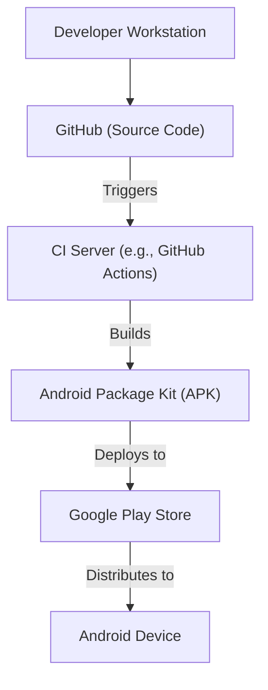
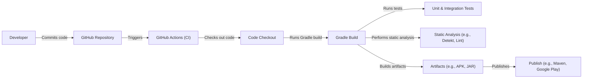

Okay, let's create a design document for Square's workflow-kotlin library.

# BUSINESS POSTURE

Business Priorities and Goals:

*   Enable developers to build robust, stateful, and scalable applications (primarily on the JVM, but with Kotlin Multiplatform potential).
*   Provide a clear and maintainable way to manage complex application logic as workflows.
*   Reduce boilerplate and improve code readability compared to traditional state management approaches.
*   Offer a testable framework that simplifies unit and integration testing of complex flows.
*   Support reactive programming models (e.g., RxJava, Kotlin Flows) for asynchronous operations.
*   Potentially reduce development time and cost by providing a higher-level abstraction for managing application state.

Most Important Business Risks:

*   Adoption Risk: Developers may be hesitant to adopt a new workflow library, preferring established patterns or other state management solutions.
*   Complexity Risk: If the library is too complex to understand or use, it will hinder rather than help development.
*   Performance Risk: The library must be performant enough to handle complex workflows without introducing significant overhead.
*   Bug Risk: As with any library, bugs in workflow-kotlin could introduce instability or incorrect behavior into applications that use it.
*   Maintenance Risk: The library must be actively maintained and updated to address bugs, security vulnerabilities, and evolving Kotlin language features.
*   Integration Risk: The library should integrate well with existing Square infrastructure and other libraries/frameworks commonly used by Square.

# SECURITY POSTURE

Existing Security Controls:

*   security control: Code Reviews: Square likely has a strong code review process for all its open-source projects, including workflow-kotlin. (Inferred from Square's reputation and open-source practices). Described in pull request process.
*   security control: Static Analysis: Square likely uses static analysis tools to identify potential code quality and security issues. (Inferred from Square's engineering practices). Described in build process.
*   security control: Dependency Management: The project uses Gradle, which provides mechanisms for managing dependencies and their versions, reducing the risk of using vulnerable libraries. Described in build.gradle.kts files.
*   security control: Open Source: Being open source allows for community scrutiny and contributions, potentially leading to faster identification and resolution of security issues.

Accepted Risks:

*   accepted risk: Reliance on Third-Party Libraries: Like any project, workflow-kotlin depends on other libraries (e.g., Kotlin coroutines, RxJava). Vulnerabilities in these dependencies could impact the security of applications using workflow-kotlin.
*   accepted risk: Evolving Threat Landscape: New types of attacks and vulnerabilities are constantly emerging. The library may need to be updated to address unforeseen security threats.

Recommended Security Controls:

*   security control: Dynamic Analysis (Fuzzing): Implement fuzz testing to identify potential vulnerabilities related to unexpected inputs or edge cases.
*   security control: Security Audits: Conduct regular security audits, both internal and external, to identify potential vulnerabilities.
*   security control: Supply Chain Security: Implement measures to verify the integrity of dependencies and prevent supply chain attacks (e.g., using signed artifacts, dependency verification tools).
*   security control: Vulnerability Scanning: Integrate automated vulnerability scanning into the CI/CD pipeline to detect known vulnerabilities in dependencies.

Security Requirements:

*   Authentication: Not directly applicable to the library itself. Authentication is the responsibility of the application using workflow-kotlin.
*   Authorization: Not directly applicable to the library itself. Authorization is the responsibility of the application using workflow-kotlin. Workflows can be used to *model* authorization flows, but the library doesn't enforce any specific authorization mechanism.
*   Input Validation: While the library doesn't directly handle user input, it's crucial that applications using workflow-kotlin perform proper input validation *before* passing data to workflows.  Workflows should be designed to handle invalid or unexpected inputs gracefully.
*   Cryptography: Not directly applicable to the library itself. If workflows need to handle sensitive data, the application using workflow-kotlin should use appropriate cryptographic techniques. The library should not introduce any cryptographic weaknesses.

# DESIGN

## C4 CONTEXT

Element Descriptions:

*   Element:
    *   Name: User (Mobile App/Web App)
    *   Type: Person
    *   Description: Represents a user interacting with an application built using workflow-kotlin.
    *   Responsibilities: Initiates actions, views data, interacts with the application's UI.
    *   Security controls: Authentication and authorization are typically handled at the application level, not within the workflow-kotlin library itself.

*   Element:
    *   Name: Workflow-Based Application
    *   Type: Software System
    *   Description: An application built using the workflow-kotlin library to manage its state and business logic.
    *   Responsibilities: Handles user interactions, manages application state, orchestrates workflows, interacts with external systems.
    *   Security controls: Implements authentication, authorization, input validation, and other application-specific security measures.

*   Element:
    *   Name: Workflow-Kotlin Library
    *   Type: Software System
    *   Description: The library providing the framework for building workflows.
    *   Responsibilities: Provides APIs for defining workflows, managing state transitions, handling asynchronous operations, and testing.
    *   Security controls: Relies on secure coding practices, static analysis, and dependency management.

*   Element:
    *   Name: External Systems (APIs, Databases)
    *   Type: Software System
    *   Description: External systems that the workflow-based application may interact with.
    *   Responsibilities: Provide data or services to the application.
    *   Security controls: External systems should have their own security controls (authentication, authorization, etc.).

*   Element:
    *   Name: Kotlin Coroutines
    *   Type: Software System
    *   Description: The Kotlin Coroutines library, used for asynchronous programming.
    *   Responsibilities: Provides mechanisms for managing asynchronous operations and concurrency.
    *   Security controls: Relies on secure coding practices and ongoing security reviews of the Kotlin Coroutines library.

*   Element:
    *   Name: RxJava (Optional)
    *   Type: Software System
    *   Description: The RxJava library, an optional dependency for reactive programming.
    *   Responsibilities: Provides reactive extensions for managing asynchronous data streams.
    *   Security controls: Relies on secure coding practices and ongoing security reviews of the RxJava library.

## C4 CONTAINER

Element Descriptions:

*   Element:
    *   Name: User (Mobile App/Web App)
    *   Type: Person
    *   Description: Same as in the Context diagram.
    *   Responsibilities: Same as in the Context diagram.
    *   Security controls: Same as in the Context diagram.

*   Element:
    *   Name: UI (Activities, Views, etc.)
    *   Type: Container
    *   Description: The user interface components of the application.
    *   Responsibilities: Displays data to the user, handles user input, interacts with the Workflow Runtime.
    *   Security controls: Input validation, secure handling of user data.

*   Element:
    *   Name: Workflow Runtime
    *   Type: Container
    *   Description: The runtime environment for executing workflows. Provided by workflow-kotlin.
    *   Responsibilities: Manages the lifecycle of workflows, handles state transitions, dispatches actions.
    *   Security controls: Relies on the security of the underlying Kotlin Coroutines and (optionally) RxJava libraries.

*   Element:
    *   Name: Workflows (Defined using Workflow-Kotlin)
    *   Type: Container
    *   Description: The individual workflows defined using the workflow-kotlin library.
    *   Responsibilities: Encapsulate specific pieces of application logic and state.
    *   Security controls: Should be designed to handle invalid or unexpected inputs gracefully.

*   Element:
    *   Name: Services (Business Logic, Data Access)
    *   Type: Container
    *   Description: Components that provide business logic and data access functionality.
    *   Responsibilities: Perform operations on data, interact with external systems.
    *   Security controls: Implement appropriate security measures for data access and interaction with external systems (e.g., authentication, authorization, encryption).

*   Element:
    *   Name: Data (Local Storage, Network)
    *   Type: Container
    *   Description: The data used by the application.
    *   Responsibilities: Stores and retrieves data.
    *   Security controls: Data encryption at rest and in transit, access controls.

*   Element:
    *   Name: Workflow-Kotlin Library
    *   Type: Software System
    *   Description: Same as in the Context diagram.
    *   Responsibilities: Same as in the Context diagram.
    *   Security controls: Same as in the Context diagram.

*   Element:
    *   Name: Kotlin Coroutines
    *   Type: Software System
    *   Description: Same as in the Context diagram.
    *   Responsibilities: Same as in the Context diagram.
    *   Security controls: Same as in the Context diagram.

*   Element:
    *   Name: RxJava (Optional)
    *   Type: Software System
    *   Description: Same as in the Context diagram.
    *   Responsibilities: Same as in the Context diagram.
    *   Security controls: Same as in the Context diagram.

## DEPLOYMENT

Possible Deployment Solutions:

1.  **Android Application:** Deployed as an APK to Android devices via the Google Play Store or sideloading.
2.  **JVM Application (Server-Side):** Deployed as a JAR or WAR file to a JVM-based application server (e.g., Tomcat, Jetty) or a cloud platform (e.g., AWS, GCP, Azure).
3.  **Kotlin Multiplatform:** Potentially deployed to multiple platforms (Android, iOS, JVM, JavaScript) depending on the specific project.

Chosen Deployment Solution (Android Application):

Element Descriptions:

*   Element:
    *   Name: Developer Workstation
    *   Type: Infrastructure Node
    *   Description: The developer's local machine.
    *   Responsibilities: Writing code, running tests, committing changes.
    *   Security controls: Local security measures (e.g., disk encryption, strong passwords).

*   Element:
    *   Name: GitHub (Source Code)
    *   Type: Infrastructure Node
    *   Description: The source code repository hosted on GitHub.
    *   Responsibilities: Storing the source code, managing versions, triggering builds.
    *   Security controls: Access controls, branch protection rules, code review policies.

*   Element:
    *   Name: CI Server (e.g., GitHub Actions)
    *   Type: Infrastructure Node
    *   Description: The continuous integration server.
    *   Responsibilities: Building the application, running tests, creating artifacts.
    *   Security controls: Secure configuration, access controls, vulnerability scanning.

*   Element:
    *   Name: Android Package Kit (APK)
    *   Type: Software Artifact
    *   Description: The compiled Android application package.
    *   Responsibilities: Contains the application code, resources, and manifest.
    *   Security controls: Code signing, ProGuard/R8 obfuscation and shrinking.

*   Element:
    *   Name: Google Play Store
    *   Type: Infrastructure Node
    *   Description: The official app store for Android applications.
    *   Responsibilities: Distributing the application to users, managing updates.
    *   Security controls: Google Play Protect, app review process.

*   Element:
    *   Name: Android Device
    *   Type: Infrastructure Node
    *   Description: The user's Android device.
    *   Responsibilities: Running the application.
    *   Security controls: Android security features (e.g., sandboxing, permissions).

## BUILD

Build Process Description:

1.  **Code Commit:** A developer commits code changes to the GitHub repository.
2.  **CI Trigger:** GitHub Actions (or another CI system) is triggered by the commit.
3.  **Code Checkout:** The CI server checks out the latest code from the repository.
4.  **Gradle Build:** The Gradle build system is invoked.
5.  **Tests:** Unit and integration tests are executed.
6.  **Static Analysis:** Static analysis tools (e.g., Detekt, Android Lint) are run to identify code quality and potential security issues.
7.  **Artifact Creation:** The build process creates the necessary artifacts (e.g., APK for Android, JAR for JVM).
8.  **Publish:** The artifacts are published to a repository (e.g., Maven Central for library artifacts, Google Play Store for Android apps).

Security Controls in Build Process:

*   security control: Static Analysis: Tools like Detekt and Android Lint are used to identify potential code quality and security issues.
*   security control: Dependency Management: Gradle manages dependencies and their versions, helping to prevent the use of vulnerable libraries.
*   security control: Test Coverage: Unit and integration tests help ensure the correctness and robustness of the code.
*   security control: CI/CD Pipeline: Automating the build and deployment process reduces the risk of manual errors and ensures consistency.
*   security control: Code Signing (for Android): APKs are signed to verify their authenticity and integrity.

# RISK ASSESSMENT

Critical Business Processes:

*   The core business process is the reliable and predictable execution of application logic defined as workflows. Failures in workflow execution could lead to incorrect application behavior, data inconsistencies, or user dissatisfaction.

Data We Are Trying to Protect:

*   The library itself doesn't directly handle sensitive data. However, applications built using workflow-kotlin *may* handle sensitive data. The sensitivity of this data depends on the specific application. Examples include:
    *   User data (PII, credentials, etc.)
    *   Financial data
    *   Application state data
    *   Configuration data

Data Sensitivity:

*   The sensitivity of the data handled by applications using workflow-kotlin varies greatly depending on the application's purpose. It could range from low (e.g., non-sensitive user preferences) to high (e.g., financial transactions, personal health information).

# QUESTIONS & ASSUMPTIONS

Questions:

*   What specific types of applications are the primary targets for workflow-kotlin (e.g., mobile apps, server-side applications, specific domains)?
*   What are the performance requirements for typical workflows (e.g., expected number of concurrent workflows, complexity of state transitions)?
*   Are there any specific security certifications or compliance requirements that need to be considered?
*   What is the expected level of support and maintenance for the library?
*   What level of logging and monitoring is required for applications using workflow-kotlin?

Assumptions:

*   BUSINESS POSTURE: Square prioritizes code quality, security, and maintainability for its open-source projects.
*   SECURITY POSTURE: Square has internal security processes and tools that are applied to workflow-kotlin, even if they are not explicitly documented in the repository.
*   DESIGN: The library is designed to be flexible and adaptable to different use cases and application architectures. The provided C4 diagrams are a general representation and may need to be adapted for specific applications. The deployment model assumes an Android application, but other deployment models are possible.