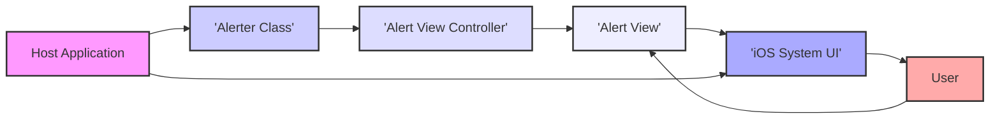
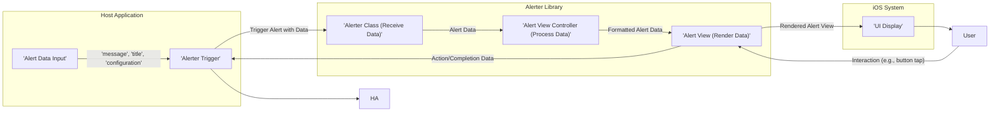

# Project Design Document: Alerter iOS Library

**Version:** 1.1
**Date:** October 26, 2023
**Author:** Gemini (AI Language Model)

## 1. Introduction

This document provides a detailed design overview of the Alerter iOS library, as found on GitHub at [https://github.com/Tapadoo/Alerter](https://github.com/Tapadoo/Alerter). This document is specifically created to facilitate effective threat modeling by providing a comprehensive understanding of the library's architecture, components, and data flow.

### 1.1. Purpose

The primary purpose of this document is to clearly articulate the design of the Alerter library. This detailed description will serve as the foundation for identifying potential security vulnerabilities and attack vectors during subsequent threat modeling exercises.

### 1.2. Scope

This document focuses on the design of the Alerter library itself and its direct interactions within a host iOS application and with the underlying iOS system. It does not cover the design or security of applications that integrate the Alerter library, nor does it address any backend services that might provide data to these applications.

### 1.3. Goals

The goals of this design document are to:

*   Provide a clear and detailed description of the Alerter library's architecture.
*   Identify the key components of the library and their specific responsibilities.
*   Illustrate the flow of data within the library and its interactions with the host application and the iOS system.
*   Serve as a definitive reference for understanding the library's internal workings for security analysis.

## 2. Overview

Alerter is a client-side iOS library designed to simplify and enhance the presentation of alerts and notifications within iOS applications. It offers developers a flexible and visually appealing way to display important information, feedback, or warnings to the user. By abstracting the complexities of creating and managing alert views, Alerter allows developers to focus on the content and context of the alert. The library is integrated into an iOS application as a dependency, typically through a package manager like CocoaPods or Swift Package Manager, and is invoked programmatically by the application's code.

## 3. Architectural Design

The Alerter library operates entirely within the context of a host iOS application's process. Its primary function is to create and manage the presentation of alert views within the application's user interface.

### 3.1. Key Components

*   **`Alerter` Class:** This serves as the primary interface for interacting with the library. It provides static methods for creating and presenting various types of alerts, such as informational, warning, error, and success alerts. It encapsulates the logic for instantiating and configuring the appropriate alert view controllers.
*   **Alert View Controllers (e.g., `TopAlertViewController`, `BottomAlertViewController`, potentially others for different presentation styles):** These view controllers are responsible for managing the lifecycle and visual presentation of the alert views. They handle tasks such as:
    *   Creating and configuring the alert view instance.
    *   Managing the alert's position and animation on the screen.
    *   Handling user interactions with the alert (e.g., button presses, dismissal gestures).
    *   Implementing the logic for the alert to disappear after a certain duration or upon user interaction.
*   **Alert View (`AlerterView` or a similar custom `UIView` subclass):** This represents the actual visual element displayed to the user. It is responsible for rendering the alert's content, including:
    *   The alert message (text).
    *   The alert title (optional text).
    *   An optional image or icon.
    *   Optional buttons with associated labels.
    *   Styling elements like background color, text color, and font.
*   **Configuration Options (Passed as parameters or through configuration objects):** The library allows customization of the alert's appearance and behavior through various configuration options. These might include:
    *   Alert type (influencing default styling).
    *   Background color.
    *   Text color.
    *   Font.
    *   Animation type (e.g., slide in, fade in).
    *   Duration for which the alert is displayed automatically.
    *   Button titles and associated actions (closures or delegate methods).
*   **Queue Management (Likely implemented implicitly within the `Alerter` class or a related component):** To handle multiple alerts being triggered in quick succession, the library likely implements a mechanism to queue alerts and present them sequentially, preventing UI conflicts and ensuring a smooth user experience.

### 3.2. Component Interactions

*   The **Host Application** initiates the display of an alert by calling a static method on the **`Alerter Class`**, passing in the alert message and any desired configuration options.
*   The **`Alerter Class`** determines the appropriate **Alert View Controller** to use based on the requested alert type and configuration.
*   The **`Alerter Class`** creates an instance of the selected **Alert View Controller** and passes the alert data (message, title, configuration) to it.
*   The **Alert View Controller** creates and configures the **Alert View** with the provided data and styling.
*   The **Alert View Controller** interacts with the **iOS System UI** (specifically `UIWindow` or the current view controller's presentation context) to present the **Alert View** on the screen, often with animations.
*   The **User** can interact with the **Alert View**, for example, by tapping a button or letting the alert dismiss automatically.
*   The **Alert View** or **Alert View Controller** may trigger callbacks or notifications back to the **Host Application** to inform it of user interactions or the dismissal of the alert.

## 4. Data Flow

The primary data flow within the Alerter library involves the transfer of information necessary to create and display an alert.

### 4.1. Data Elements

*   **`message` (String):** The primary textual content of the alert that will be displayed to the user.
*   **`title` (String, Optional):** An optional title for the alert, typically displayed above the message.
*   **`alertType` (Enum or similar):**  An enumeration or similar mechanism to specify the type of alert (e.g., `.normal`, `.warning`, `.error`, `.success`). This often dictates the default visual styling of the alert.
*   **`configuration` (Object or Dictionary):** A collection of parameters or a dedicated object containing settings to customize the alert's appearance and behavior. This can include:
    *   `backgroundColor` (UIColor).
    *   `textColor` (UIColor).
    *   `textFont` (UIFont).
    *   `image` (UIImage, Optional).
    *   `animationType` (Enum or similar).
    *   `duration` (TimeInterval, Optional).
    *   `buttons` (Array of button configurations, including titles and actions).
*   **`buttonActions` (Closures or Delegate Methods):**  Code blocks or delegate methods associated with buttons in the alert, defining the actions to be performed when a button is pressed.
*   **`completionHandler` (Closure, Optional):** A closure that is executed when the alert is dismissed, either programmatically or by user interaction.

### 4.2. Data Flow Diagram

1. The **Host Application** gathers the necessary **Alert Data Input**, including the message, title, and any desired configuration settings.
2. The **Host Application** triggers the alert by calling a method on the **Alerter Class**, passing the **Alert Data Input**.
3. The **Alerter Class** receives the **Alert Data**.
4. The **Alerter Class** passes the **Alert Data** to the appropriate **Alert View Controller**.
5. The **Alert View Controller** processes the data and configures the **Alert View**.
6. The **Alert View** renders the alert content.
7. The rendered **Alert View** is displayed by the **iOS System UI** to the **User**.
8. The **User** interacts with the **Alert View** (e.g., by tapping a button).
9. The **Alert View** or **Alert View Controller** sends action or completion data back to the **Alerter Trigger** point in the **Host Application**.
10. The **Host Application** receives the feedback from the alert interaction.

## 5. Security Considerations (For Threat Modeling)

This section outlines potential security considerations relevant for threat modeling the Alerter library.

*   **Malicious Alert Content Injection:** If the alert `message` or `title` is derived from untrusted sources (e.g., user input, external APIs) without proper sanitization, it could be used to inject malicious content. This could potentially lead to:
    *   **UI Spoofing:** Displaying misleading information to trick users into performing unintended actions within the host application.
    *   **Data Exfiltration (Indirect):**  While Alerter itself doesn't exfiltrate data, a maliciously crafted alert message could trick a user into revealing sensitive information elsewhere.
*   **UI Redressing/Clickjacking:** Although less likely with simple alert views, if Alerter allows for complex interactive elements, a malicious application could potentially overlay or mask parts of the alert to trick users into clicking on unintended elements.
*   **Information Disclosure through Alert Content:**  Developers might inadvertently display sensitive information within alert messages. If an attacker can trigger the display of such alerts (e.g., through exploiting other vulnerabilities in the host application), this could lead to information disclosure.
*   **Denial of Service (Alert Spam):** An attacker who can control the triggering of alerts (again, likely through vulnerabilities in the host application) could potentially flood the user with alerts, causing annoyance and potentially rendering the application unusable.
*   **Vulnerabilities in Dependencies:** If Alerter relies on other third-party libraries, vulnerabilities in those dependencies could indirectly impact the security of applications using Alerter. This highlights the importance of keeping dependencies up-to-date.
*   **Insecure Default Configurations:** If the default configuration of Alerter is insecure (e.g., allowing overly permissive styling or interaction), it could be exploited.
*   **Lack of Input Validation:**  Insufficient validation of the `configuration` options passed to Alerter could potentially lead to unexpected behavior or vulnerabilities. For example, providing invalid color codes or animation types might cause crashes or unexpected UI behavior that could be exploited.
*   **Callback/Completion Handler Manipulation (Less likely in this client-side library, but worth considering):** In more complex scenarios, if the mechanism for handling button actions or completion handlers is not properly secured, there might be a theoretical risk of manipulating these callbacks to execute unintended code.

## 6. Assumptions and Constraints

*   The Alerter library operates within the standard security sandbox of an iOS application, limiting its direct access to system resources.
*   The host application is ultimately responsible for the secure handling of any sensitive data before passing it to Alerter for display.
*   The underlying iOS operating system provides a base level of security for UI elements and their presentation.
*   This design document is based on the publicly available information and general understanding of iOS development practices. A detailed code review might reveal further implementation-specific details.

## 7. Future Considerations (Security Focused)

*   **Content Security Policy (CSP) for Alert Content:** If Alerter were to support more complex content rendering (e.g., HTML), implementing a form of CSP could help mitigate the risk of malicious script injection.
*   **Secure Handling of User Input in Alerts:** If alerts ever need to accept user input, robust input validation and sanitization mechanisms would be crucial.
*   **Regular Dependency Updates and Security Audits:**  Maintaining up-to-date dependencies and conducting periodic security audits of the Alerter library itself would help identify and address potential vulnerabilities.
*   **Consideration for Accessibility and Security:** Ensuring that accessibility features do not inadvertently introduce security vulnerabilities.

This improved design document provides a more detailed and security-focused overview of the Alerter iOS library, making it a more effective foundation for subsequent threat modeling activities.