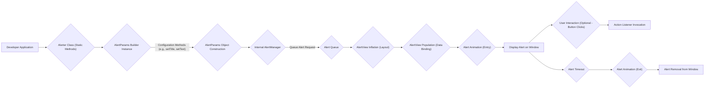
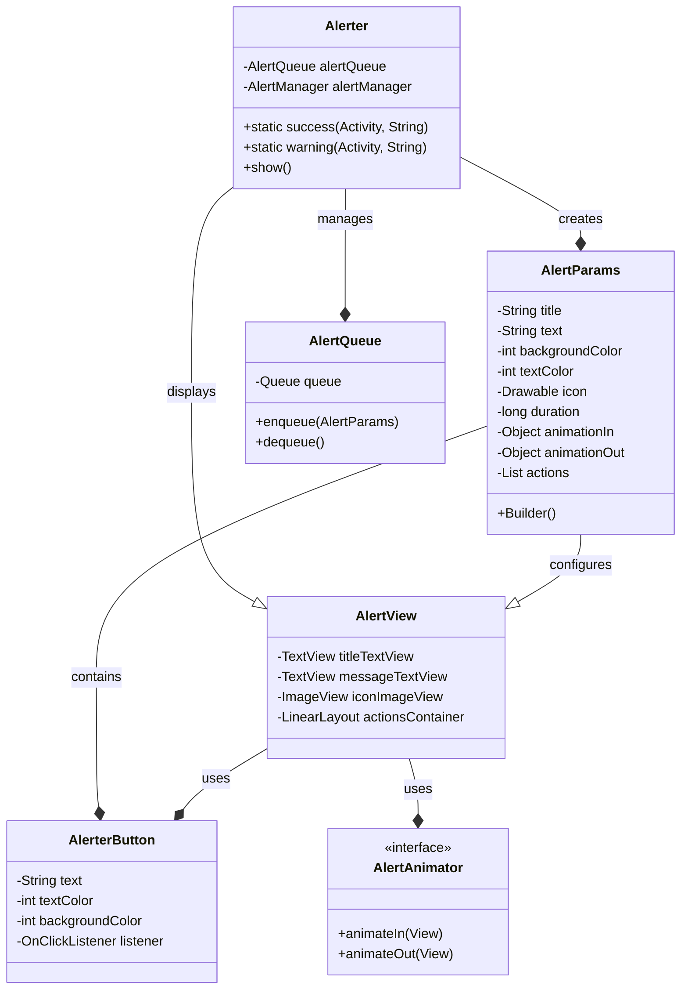
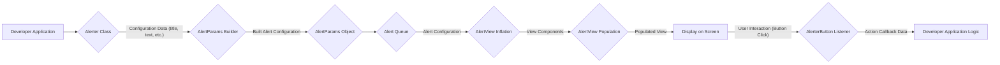

## Project Design Document: Alerter Android Library

**Version:** 1.1
**Date:** October 26, 2023
**Author:** AI Software Architect

### 1. Introduction

This document provides an enhanced architectural design for the Alerter Android library (as found at [https://github.com/tapadoo/alerter](https://github.com/tapadoo/alerter)). This revised document aims to offer a more detailed and refined understanding of the library's structure, components, and functionality, strengthening the foundation for subsequent threat modeling activities.

### 2. Project Overview

Alerter is a well-regarded Android library designed to facilitate the display of visually appealing and customizable in-app alerts. Serving as an enhancement over standard `Toast` messages, Alerter provides developers with a more expressive and interactive way to communicate important information, warnings, or success confirmations to users without disrupting the main application flow. The library emphasizes flexibility through its extensive customization options for visual presentation, animations, and user interaction.

### 3. Goals and Objectives

*   **Enhanced Alert Presentation:** To offer a visually superior and more engaging alternative to standard Android `Toast` messages.
*   **Granular Customization:** To empower developers with fine-grained control over the alert's appearance, including colors, text styles, icons, and background treatments.
*   **Dynamic Animation Capabilities:** To provide a range of animation options for alert entry and exit, enhancing the user experience.
*   **Interactive Alert Components:** To enable the inclusion of interactive elements, such as buttons with associated actions, directly within the alert.
*   **Simplified Integration Process:** To ensure a straightforward and efficient integration process into existing and new Android projects.
*   **Maintainability and Extensibility:** To establish a codebase that is easy to maintain, update, and extend with new features in the future.

### 4. Target Audience

The intended audience for this document remains Android application developers seeking a robust, customizable, and user-friendly solution for displaying in-app alerts. This includes developers working on a wide range of Android applications, from simple utilities to complex enterprise solutions.

### 5. Functional Architecture

The fundamental operation of Alerter involves the creation, configuration, and subsequent display of alert views within an Android application's user interface. The following flowchart provides a more detailed visualization of this process:



**Detailed Description of the Functional Flow:**

*   **Developer Application:** The Android application code initiates the alert display process, typically through a user interaction or a specific application state change.
*   **Alerter Class (Static Methods):** Developers interact with the library via static methods within the `Alerter` class (e.g., `Alerter.success()`, `Alerter.warning()`).
*   **AlertParams Builder Instance:**  The static methods often return an `AlertParams.Builder` instance, facilitating a fluent API for configuring the alert.
*   **Configuration Methods (e.g., setTitle, setText):** Developers chain method calls on the `AlertParams.Builder` to set various alert properties.
*   **AlertParams Object Construction:**  Once configuration is complete, the `build()` method of the builder creates an immutable `AlertParams` object.
*   **Internal AlertManager:** The `Alerter` class internally utilizes an `AlertManager` (or similar component) to handle the lifecycle and display of alerts.
*   **Queue Alert Request:** The `AlertManager` places the `AlertParams` (representing the alert request) into an internal queue.
*   **Alert Queue:** This queue manages the order in which alerts are displayed, ensuring they are shown sequentially.
*   **AlertView Inflation (Layout):** When an alert is dequeued, the library inflates the `AlertView` from a predefined XML layout.
*   **AlertView Population (Data Binding):** The properties from the `AlertParams` object are used to populate the elements within the `AlertView` (e.g., setting text in `TextView`, setting the icon in `ImageView`).
*   **Alert Animation (Entry):**  An animation (specified in `AlertParams` or a default) is applied as the `AlertView` is added to the window.
*   **Display Alert on Window:** The `AlertView` is added to the Android `WindowManager`, making it visible on top of the application's UI.
*   **User Interaction (Optional - Button Clicks):** If action buttons are included in the alert, the user can interact with them.
*   **Action Listener Invocation:**  Click events on the action buttons trigger the corresponding `OnClickListener` or a custom listener defined by the developer.
*   **Alert Timeout:** If a duration is specified, a timer is started. Upon timeout, the alert dismissal process begins.
*   **Alert Animation (Exit):** An exit animation is applied to the `AlertView`.
*   **Alert Removal from Window:** The `AlertView` is removed from the `WindowManager`, and associated resources are potentially released.

### 6. Component Architecture

The Alerter library is structured around a set of interconnected components, each with specific responsibilities.

*   **`Alerter` Class:**
    *   The primary interface for developers to interact with the library.
    *   Provides static factory methods (e.g., `success()`, `warning()`, `error()`, `info()`) for creating pre-configured alert builders.
    *   Manages the internal `AlertManager` and the alert queue.
*   **`AlertParams` Class:**
    *   An immutable data class that encapsulates all the configuration details for a single alert.
    *   Includes properties for: `title`, `text`, `backgroundColor`, `textColor`, `icon`, `duration`, `animationIn`, `animationOut`, `vibrationPattern`, action buttons (`List<AlerterButton>`), and more.
    *   Employs a nested `Builder` class for constructing instances.
*   **`AlertView` (Layout XML and Associated Logic):**
    *   Defines the visual structure of the alert. Typically an XML layout file (`alerter_view.xml`).
    *   Contains standard Android UI elements like `TextView` for messages and titles, `ImageView` for icons, and `LinearLayout` or `RelativeLayout` to arrange action buttons.
    *   May have associated custom `View` logic for handling dynamic updates or interactions.
*   **`AlerterButton` Class:**
    *   A data class representing an action button within the alert.
    *   Contains properties for the button's text, text color, background color, and an `OnClickListener`.
*   **`AlertAnimator` Interface (or Concrete Implementations):**
    *   Defines the contract for animating the alert's entry and exit.
    *   May have concrete implementations for different animation styles (e.g., `SlideInAnimator`, `FadeInAnimator`).
*   **`AlertQueue` Class:**
    *   Manages the sequence of alerts to be displayed.
    *   Typically implemented as a FIFO (First-In, First-Out) queue.
    *   Ensures that only one alert is displayed at a time.
*   **`Internal Handler/Looper` (Implicit):**
    *   The library likely uses an internal `Handler` and `Looper` (or relies on the main thread's Looper) to manage UI updates and timing (e.g., for the alert duration).



### 7. Data Flow

The data flow within the Alerter library centers around the alert configuration and the user interaction with the displayed alert.



**Detailed Description of the Data Flow:**

*   **Developer Application to Alerter Class:** The developer initiates the alert display process, providing configuration data like the message, title, and alert type to the `Alerter` class.
*   **Alerter Class to AlertParams Builder:** The `Alerter` class uses the provided data to populate the `AlertParams.Builder`.
*   **AlertParams Builder to AlertParams Object:** The builder constructs an immutable `AlertParams` object containing all the alert's configuration.
*   **AlertParams Object to Alert Queue:** The fully configured `AlertParams` object is added to the `AlertQueue`.
*   **Alert Queue to AlertView Inflation:** When the alert is ready to be displayed, its `AlertParams` are used to inflate the `AlertView` layout.
*   **AlertView Inflation to AlertView Population:** The data from `AlertParams` (text, colors, icons, button labels, etc.) is used to populate the corresponding views within the inflated `AlertView`.
*   **AlertView Population to Display on Screen:** The populated `AlertView` is then added to the Android `WindowManager` to be displayed to the user.
*   **Display on Screen to AlerterButton Listener:** When the user interacts with a button on the alert, the click event is captured by the `OnClickListener` associated with that `AlerterButton`.
*   **AlerterButton Listener to Developer Application Logic:** The `OnClickListener` (defined by the developer) executes, potentially passing data back to the application logic based on the user's action.

### 8. Security Considerations (Refined)

This section provides a more detailed examination of security considerations for the Alerter library.

*   **Input Sanitization and Validation:** Rigorous sanitization and validation of all input provided by the developer (e.g., alert messages, titles, button text) are crucial to prevent injection attacks. This includes HTML escaping or using parameterized UI elements if displaying potentially untrusted content.
*   **Permission Management (`SYSTEM_ALERT_WINDOW`):** Developers should be explicitly informed about the security implications of the `SYSTEM_ALERT_WINDOW` permission. Overuse or unnecessary requests for this permission can be a security risk. The library itself should use this permission judiciously.
*   **Click Hijacking Mitigation:** The library's design should actively prevent click hijacking. This involves ensuring proper z-ordering of the alert view, avoiding transparent or overly large touch targets, and potentially using techniques to confirm user intent before executing actions.
*   **Resource Exhaustion:** The library should be designed to prevent resource exhaustion attacks. This includes limiting the number of alerts that can be queued, efficiently managing memory and UI thread usage, and properly releasing resources when alerts are dismissed.
*   **Data Security:** Sensitive information should not be displayed in alerts unless absolutely necessary. If sensitive data must be shown, developers should be provided with clear guidance on secure handling and potential risks. Consider offering options to mask or redact sensitive information.
*   **Third-Party Code and Dependencies:** If the library relies on any third-party libraries, those dependencies should be carefully vetted for security vulnerabilities and kept up-to-date.
*   **Secure Default Settings:** The library should have secure default settings. For example, animations should not introduce vulnerabilities, and default permissions should be the least privilege necessary.
*   **Vibration Permission:** If the library uses vibration, consider the implications of the `VIBRATE` permission and whether it's strictly necessary.
*   **Deep Linking Vulnerabilities:** If action buttons trigger deep links, ensure these links are properly validated to prevent malicious redirection.

### 9. Deployment Considerations

The Alerter library is typically distributed as an Android Archive (AAR) file and integrated into Android projects using a dependency management system.

*   **Gradle Dependency via Maven Central:** The recommended method for integrating Alerter is by adding a dependency declaration to the `dependencies` block of the app's `build.gradle` file, referencing the library from Maven Central. Example:
    ```
    dependencies {
        implementation("com.github.tapadoo.alerter:alerter:6.0.0") // Example version
    }
    ```
*   **Repository Hosting:** The library should be consistently hosted on a reliable repository like Maven Central to ensure accessibility and integrity.
*   **Versioning:** Proper semantic versioning should be used for releases to clearly indicate the nature of changes (bug fixes, new features, breaking changes).

### 10. Future Enhancements (Potential)

*   **Customizable Alert View Inflation:** Allow developers to provide their own custom layout XML for the alert view, offering greater flexibility in visual design.
*   **Advanced Animation Options and Customization:** Expand the range of built-in animation styles and provide APIs for developers to create and integrate their own custom animations.
*   **Enhanced Accessibility Features:** Implement features to improve accessibility for users with disabilities, such as providing content descriptions for all interactive elements and ensuring compatibility with screen readers.
*   **Theming and Styling Support:** Provide more robust theming capabilities, allowing alerts to seamlessly integrate with the application's overall visual theme. This could involve supporting Android's `Theme` attributes.
*   **Support for Different Alert Positions:** Allow developers to specify the position of the alert on the screen (e.g., top, bottom, center).
*   **Progress Indicators:** Add the ability to display progress indicators within alerts for long-running operations.
*   **Kotlin DSL for Configuration:** Provide a Kotlin DSL (Domain Specific Language) for a more concise and type-safe way to configure alerts.

This revised design document offers a more comprehensive and detailed understanding of the Alerter Android library's architecture, functionality, and security considerations. It serves as an improved foundation for subsequent threat modeling and development efforts.