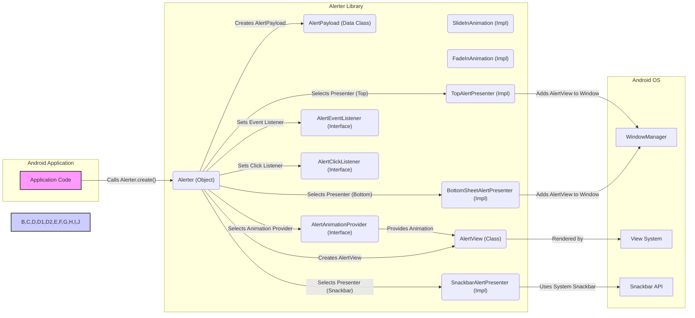
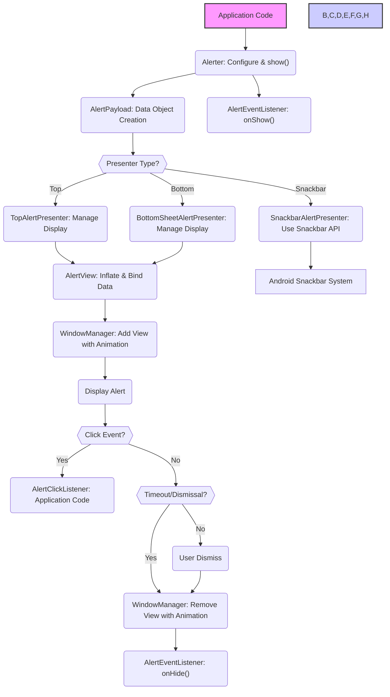

## Project Design Document: Alerter Android Library (Improved)

**1. Introduction**

This document provides an enhanced design overview of the Alerter Android library, accessible at [https://github.com/tapadoo/alerter](https://github.com/tapadoo/alerter). The primary objective is to furnish a detailed understanding of the library's internal structure, constituent parts, and the movement of data within it. This detailed design will serve as a critical input for subsequent threat modeling exercises, enabling a thorough security analysis.

**2. Project Goals**

* To articulate a precise and easily understandable description of the Alerter library's design principles and implementation.
* To clearly delineate the essential components of the library and elucidate their interactions and dependencies.
* To meticulously map out the flow of data within the library, including its interaction points with the encompassing Android application environment.
* To establish a definitive reference document that will be utilized for security assessments, vulnerability identification, and threat modeling activities.

**3. Project Overview**

The Alerter library is engineered as an Android component to streamline the presentation of visually engaging and customizable alert notifications within Android applications. It offers a range of alert styles, dynamic animations, and extensive customization options to elevate the user experience by providing clear and informative feedback. The library is intentionally designed for straightforward integration into existing Android development projects, minimizing the learning curve and setup time.

**4. System Architecture**

The Alerter library operates intrinsically within the lifecycle and context of a host Android application. Its fundamental function is to intercept and render alert messages that are programmatically initiated by the application.

* **Detailed Component Breakdown:**
    * **`Alerter` (Kotlin Object):** This serves as the central access point for the library's functionality. It exposes static (companion object) methods for the creation, configuration, and display of alerts. It acts as a facade, simplifying the interaction with the underlying alert mechanisms.
    * **`AlertPayload` (Kotlin Data Class):**  Represents the immutable data structure holding all the configuration details for a single alert instance. This includes the alert message (text), title, background color, icon (as a resource ID or Drawable), display duration, animation styles, and listener references.
    * **`AlertAnimationProvider` (Kotlin Interface & Implementations):** Defines the contract for providing animation logic for alert entrance and exit. Concrete implementations (e.g., `SlideInAnimation`, `FadeInAnimation`) encapsulate specific animation behaviors using Android's `ObjectAnimator` or `ViewPropertyAnimator`.
    * **`AlertView` (Kotlin Class extending FrameLayout):** This is a custom Android `View` responsible for visually rendering the alert. It dynamically inflates a layout (typically XML-defined) and binds the data from the `AlertPayload` to the respective UI elements (TextViews, ImageViews, etc.). It handles touch events and interactions within the alert.
    * **`AlertPresenter` (Kotlin Interface & Implementations):** Defines the strategy for presenting the `AlertView` on the screen. Implementations like `TopAlertPresenter`, `BottomSheetAlertPresenter`, and `SnackbarAlertPresenter` handle the specifics of adding the `AlertView` to the `WindowManager` or utilizing the system's `Snackbar` API.
    * **`AlertEventListener` (Kotlin Interface):** Defines callbacks for significant alert lifecycle events, such as `onShow()` and `onHide()`, allowing the application to react to these events.
    * **`AlertClickListener` (Functional Interface):**  A simple interface with a single `onClick()` method, enabling the application to define actions to be performed when the alert is tapped or clicked.

* **Component Interaction Diagram:**

**5. Data Flow (Detailed)**

The process of displaying an alert involves a structured flow of data and actions:

1. **Initiation:** The application code invokes a static builder method on the `Alerter` object (e.g., `Alerter.create(activity)`), providing the necessary context (Activity).
2. **Configuration:** The application then chains configuration methods (e.g., `.setTitle()`, `.setText()`, `.setBackgroundColorRes()`) on the `Alerter` builder to specify the alert's properties. These configurations are stored internally.
3. **Payload Creation:** When the `.show()` method is called, the `Alerter` object constructs an immutable `AlertPayload` instance, encapsulating all the configured alert parameters.
4. **Presenter Selection:** Based on the configuration (e.g., using `.showOnTop()`, `.showOnBottomSheet()`, or the default Snackbar behavior), the `Alerter` selects the appropriate `AlertPresenter` implementation.
5. **View Creation and Binding:** An `AlertView` instance is created, and the data from the `AlertPayload` is used to populate the view's elements. This involves setting the text of TextViews, setting the image source of ImageViews, and applying background colors.
6. **Presentation:** The selected `AlertPresenter` takes the `AlertView` and manages its display.
    * **Top/Bottom Alerts:** The `AlertPresenter` uses the `WindowManager` to add the `AlertView` as a system overlay. It also utilizes the `AlertAnimationProvider` to animate the entrance of the view.
    * **Snackbar Alerts:** The `SnackbarAlertPresenter` leverages the Android system's `Snackbar.make()` method to display the alert.
7. **Event Handling:**
    * **Show Listener:** If an `AlertEventListener` is registered, its `onShow()` method is invoked after the alert is successfully displayed.
    * **Click Listener:** If an `AlertClickListener` is registered, and the user interacts with the alert (taps or clicks), the listener's `onClick()` method is executed in the application's context.
8. **Dismissal:** The alert is dismissed either after a specified duration (timeout) or by user interaction (e.g., swiping or tapping an action button on a Snackbar).
9. **Removal:** The `AlertPresenter` removes the `AlertView` from the `WindowManager` (for top/bottom alerts) or the system handles the dismissal of the Snackbar. The `AlertAnimationProvider` is used to animate the exit of the view.
10. **Hide Listener:** If an `AlertEventListener` is registered, its `onHide()` method is invoked after the alert is dismissed and removed from the screen.

**6. Security Considerations (Detailed)**

This section expands on the initial security considerations, providing more specific potential threats and areas of concern. A dedicated threat modeling session will further analyze these and other potential vulnerabilities.

* **Malicious Payload Injection:**
    * **Threat:** If the application sources alert content from untrusted sources (e.g., user input without sanitization, external APIs), an attacker could inject malicious content into the alert message or title. This could include:
        * **Code Injection (less likely in this context but possible with custom views):**  Attempting to execute arbitrary code if custom view rendering is not properly secured.
        * **UI Spoofing:** Crafting alert messages that mimic legitimate system dialogs or other application UI elements to phish for credentials or trick users into performing actions.
        * **Cross-Site Scripting (XSS) like attacks (if using WebView for rendering, which is not the case here but a consideration for future extensions):** Injecting scripts that could potentially access sensitive data or perform unauthorized actions within the application's context (less relevant to the current implementation).
    * **Mitigation:** The application developer is primarily responsible for sanitizing and validating any data displayed in alerts. The Alerter library itself does not perform automatic sanitization.

* **UI Redressing/Clickjacking:**
    * **Threat:** An attacker could potentially overlay transparent or deceptive UI elements on top of the alert, tricking the user into clicking on unintended areas or performing actions they did not intend. This is more likely if the alert layout is complex or if the application allows for highly customized alert views.
    * **Mitigation:**  Careful design of alert layouts and avoiding overly complex or interactive elements can reduce this risk. The Android OS provides some inherent protection against clickjacking, but developers should be aware of this potential vulnerability.

* **Information Disclosure:**
    * **Threat:** Displaying sensitive information (e.g., API keys, personal data, security tokens) directly within alerts could lead to unintended disclosure if the device is visible to others or if screenshots are taken.
    * **Mitigation:** Applications should avoid displaying sensitive information in alerts. If necessary, consider using less revealing messages or providing more detailed information within the application itself.

* **Denial of Service (Alert Flooding):**
    * **Threat:** A malicious application or a compromised part of the application could intentionally trigger a large number of alerts in a short period, overwhelming the user and potentially making the device unusable.
    * **Mitigation:** The Alerter library itself does not have built-in rate limiting. The application developer needs to implement logic to prevent excessive alert generation.

* **Resource Exhaustion:**
    * **Threat:**  While less of a direct security vulnerability, poorly optimized animations or excessively complex alert layouts could consume significant device resources (CPU, memory, battery), potentially leading to a degraded user experience or even application crashes.
    * **Mitigation:**  Use efficient animations and keep alert layouts relatively simple. Test the performance of alerts on various devices.

* **Improper Handling of Listeners:**
    * **Threat:** If the application does not properly manage the lifecycle of `OnClickListener` or `OnHideListener` instances, it could lead to memory leaks or unexpected behavior if these listeners hold references to activities or other resources that should be garbage collected.
    * **Mitigation:**  Follow standard Android best practices for managing listener lifecycles, such as unregistering listeners when they are no longer needed.

**7. Deployment**

The Alerter library is distributed as an Android Archive (AAR) file and is typically integrated into Android application projects using a dependency management system like Gradle. Developers add the library's dependency coordinates to their module-level `build.gradle` file. The Android build process then automatically downloads and includes the library in the application's build.

**8. Future Considerations**

* **Enhanced Customization Options:** Providing more granular control over the visual appearance and behavior of alerts through theming or custom layout inflation. This would require careful consideration of potential security implications related to custom view handling.
* **Accessibility Enhancements:**  Improving accessibility features to ensure alerts are usable by individuals with disabilities, such as providing better support for screen readers and alternative input methods.
* **Integration with Architectural Patterns:**  Providing guidance or examples on how to best integrate Alerter within common Android architectural patterns like MVVM or MVI.
* **Advanced Alert Types:** Exploring the possibility of adding support for more complex alert types, such as progress indicators or interactive forms (with appropriate security considerations for user input).
* **Testing and Security Audits:**  Implementing comprehensive unit and integration tests and conducting regular security audits to identify and address potential vulnerabilities.

This enhanced design document provides a more in-depth understanding of the Alerter library's architecture and data flow. This detailed information is essential for conducting a thorough threat model and implementing appropriate security measures.