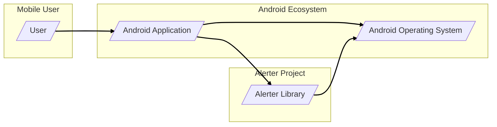
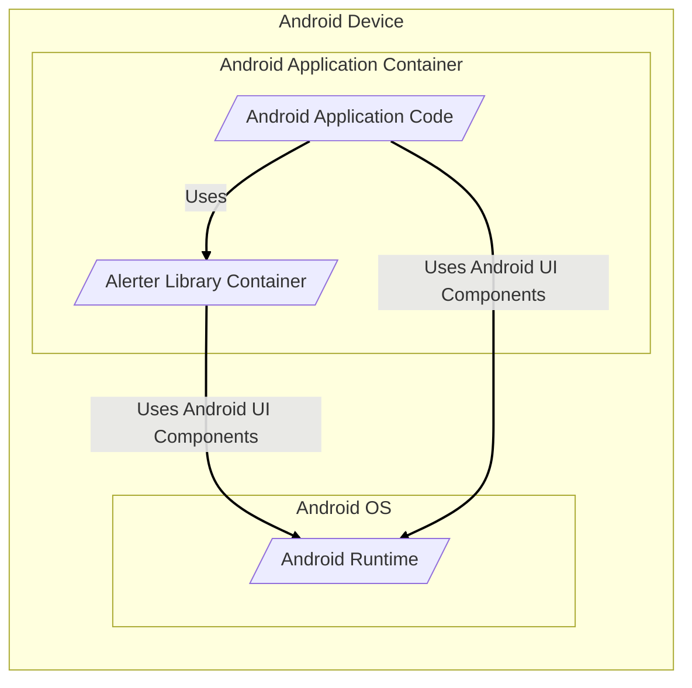
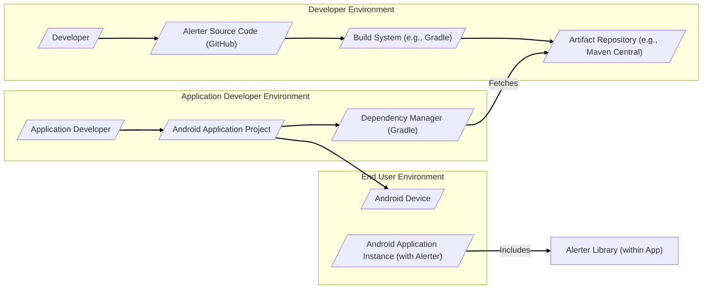
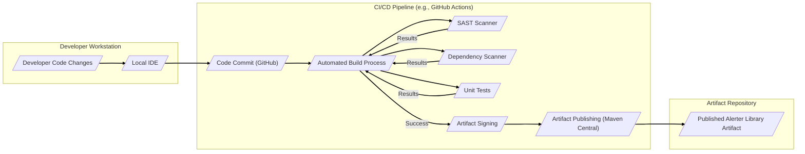

# BUSINESS POSTURE

This project, Alerter, is an Android library designed to display visually appealing and customizable alerts within Android applications.

- Business Priorities and Goals:
  - Enhance User Experience: Provide Android developers with a tool to create better user interfaces by replacing standard, less visually appealing Android alerts with more engaging and customizable alternatives.
  - Increase Developer Productivity: Offer a ready-to-use library that simplifies the implementation of custom alerts, saving developers time and effort compared to building such components from scratch.
  - Improve App Aesthetics: Enable developers to create alerts that better match their application's design and branding, leading to a more polished and professional look.
  - Community Engagement: Foster an open-source project that benefits the Android developer community and encourages contributions and improvements.

- Business Risks:
  - Adoption Risk: The library might not be widely adopted by Android developers if it doesn't meet their needs, is too complex to use, or has compatibility issues.
  - Maintenance Risk: Lack of ongoing maintenance and updates could lead to the library becoming outdated, incompatible with newer Android versions, or containing unresolved bugs.
  - Security Risk (Indirect): If the library introduces vulnerabilities into applications that use it, it could indirectly harm the reputation of the developers and businesses using the library. While a UI library is less likely to have direct security vulnerabilities, poor coding practices could still introduce issues.
  - Dependency Risk:  Reliance on external dependencies that become outdated or insecure could pose a risk to the library and applications using it.

# SECURITY POSTURE

- Security Controls:
  - security control: Code Review - The project is open source on GitHub, allowing for community code review. (Implemented: GitHub Repository)
  - security control: Open Source Licensing - Using an open-source license (likely MIT based on common practice for such libraries) allows for transparency and community scrutiny. (Implemented: LICENSE file in repository)

- Accepted Risks:
  - accepted risk: Limited Formal Security Testing - As a small, open-source UI library, it's unlikely to undergo rigorous formal security testing or penetration testing. The primary reliance for security is on good coding practices and community review.
  - accepted risk: Dependency Vulnerabilities - The library may depend on other Android libraries, and vulnerabilities in those dependencies could indirectly affect applications using Alerter. Dependency updates are assumed to be managed reactively rather than proactively with automated vulnerability scanning.
  - accepted risk: Input Validation - Input validation for alert messages and configurations is assumed to be basic and might not cover all potential injection vulnerabilities.

- Recommended Security Controls:
  - security control: Dependency Scanning - Implement automated dependency scanning to identify and address known vulnerabilities in the libraries Alerter depends on. This can be integrated into a CI/CD pipeline.
  - security control: Static Application Security Testing (SAST) - Integrate SAST tools into the build process to automatically scan the Alerter codebase for potential security vulnerabilities and coding flaws.
  - security control: Input Validation Hardening -  Review and enhance input validation for all user-provided data, such as alert titles, messages, and button text, to prevent injection attacks (though less likely in a UI library, it's still good practice).
  - security control: Secure Build Pipeline - Implement a secure build pipeline to ensure the integrity and provenance of the library artifacts.

- Security Requirements:
  - Authentication: Not applicable. Alerter is a UI library and does not handle user authentication.
  - Authorization: Not applicable. Alerter is a UI library and does not handle user authorization.
  - Input Validation:
    - All user-provided input strings (e.g., alert title, message, button text) must be properly sanitized and validated to prevent potential injection vulnerabilities (e.g., cross-site scripting if alerts were to display web content, though unlikely in this context, or format string vulnerabilities).
    - Input parameters for customization options (e.g., colors, durations, animations) should be validated to ensure they are within expected ranges and of the correct type to prevent unexpected behavior or crashes.
  - Cryptography: Not applicable. Alerter is a UI library and is not expected to handle sensitive data or cryptographic operations. However, if future features involve handling any data that could be considered sensitive (even indirectly), appropriate encryption measures should be considered.

# DESIGN

## C4 CONTEXT

- Context Diagram Elements:
  - - Name: User
    - Type: Person
    - Description: End-user of an Android application that integrates the Alerter library.
    - Responsibilities: Interacts with the Android application, triggering events that may lead to alerts being displayed via the Alerter library.
    - Security controls: User devices are assumed to have standard device security controls (passcode, biometrics, etc.), but these are outside the scope of the Alerter library itself.

  - - Name: Android Application
    - Type: Software System
    - Description: A mobile application developed for the Android platform that integrates the Alerter library to display custom alerts.
    - Responsibilities:
      - Integrate the Alerter library into its codebase.
      - Utilize the Alerter library's API to display alerts based on application logic and user interactions.
      - Handle user interactions with alerts (e.g., dismissing alerts, clicking buttons).
    - Security controls: The Android application is responsible for its own security controls, including secure coding practices, input validation in its own application logic, and adherence to Android security best practices. The application relies on the Alerter library to function as designed and not introduce vulnerabilities.

  - - Name: Alerter Library
    - Type: Software System
    - Description: An Android library that provides a customizable and visually appealing way to display alerts within Android applications.
    - Responsibilities:
      - Provide an API for Android applications to create and display various types of alerts (e.g., success, error, warning, custom).
      - Handle the UI rendering and animation of alerts on the Android screen.
      - Manage the lifecycle of alerts (displaying, dismissing, timeouts).
    - Security controls:
      - security control: Input validation within the library to handle parameters passed by the integrating application.
      - security control: Adherence to secure coding practices in the library's development.
      - security control: Open-source code for community review.

  - - Name: Android Operating System
    - Type: Software System
    - Description: The underlying operating system on Android devices that provides the environment for Android applications and the Alerter library to run.
    - Responsibilities:
      - Provide the runtime environment for Android applications and libraries.
      - Manage system resources and permissions.
      - Enforce security policies and provide security features for applications.
    - Security controls:
      - security control: Android OS security features (permissions, sandboxing, etc.) protect applications and the system from malicious activities.
      - security control: Regular security updates from Google for the Android OS.

## C4 CONTAINER

- Container Diagram Elements:
  - - Name: Android Application Code
    - Type: Application Code
    - Description: The codebase of the Android application that is developed by the application developer. This code integrates and utilizes the Alerter Library.
    - Responsibilities:
      - Application-specific logic and features.
      - Integration with the Alerter Library to display alerts.
      - Handling application-specific data and user interactions.
    - Security controls:
      - security control: Secure coding practices within the application code.
      - security control: Input validation for application-specific inputs.
      - security control: Application-level authorization and authentication (if applicable).

  - - Name: Alerter Library Container
    - Type: Library Container
    - Description: The compiled and packaged Alerter library, included as a dependency within the Android application. It contains the code and resources for displaying alerts.
    - Responsibilities:
      - Providing the API for displaying alerts.
      - Managing the UI components and logic for rendering alerts.
      - Handling alert animations and display behavior.
    - Security controls:
      - security control: Input validation within the Alerter library.
      - security control: Secure coding practices in the Alerter library codebase.
      - security control: Dependency scanning of Alerter's dependencies (recommended).

  - - Name: Android Runtime
    - Type: Runtime Environment
    - Description: The Android Runtime (ART) or Dalvik Virtual Machine, which executes the Android application code and the Alerter library code on the Android device. It provides access to Android system APIs and UI components.
    - Responsibilities:
      - Executing application and library code.
      - Providing access to Android system resources and APIs.
      - Managing memory and processes.
      - Rendering UI components.
    - Security controls:
      - security control: Android OS security features enforced by the runtime environment (permissions, sandboxing).
      - security control: Memory management and process isolation provided by the runtime.

## DEPLOYMENT

Deployment for the Alerter library itself is not a traditional deployment to servers. Instead, it's a distribution and integration process. The library is built and published to a repository (like Maven Central or JCenter, though JCenter is deprecated, so likely Maven Central now or similar). Android application developers then include this library as a dependency in their Android projects. When they build their Android applications, the Alerter library is packaged within the application and deployed to end-user Android devices when users install the application from app stores (like Google Play Store) or other distribution channels.

Here's a simplified deployment diagram focusing on the library's distribution:

- Deployment Diagram Elements:
  - - Name: Developer
    - Type: Person
    - Description: The developer(s) who maintain and update the Alerter library.
    - Responsibilities:
      - Writing and maintaining the Alerter library code.
      - Building and publishing new versions of the library.
      - Addressing issues and feature requests.
    - Security controls:
      - security control: Secure development practices.
      - security control: Code review process (via GitHub).
      - security control: Secure access to build and publishing infrastructure.

  - - Name: Source Code (GitHub)
    - Type: Code Repository
    - Description: The GitHub repository hosting the source code of the Alerter library.
    - Responsibilities:
      - Version control of the source code.
      - Collaboration platform for developers.
      - Issue tracking and project management.
    - Security controls:
      - security control: GitHub's security features (access control, audit logs).
      - security control: Branch protection and pull request reviews.

  - - Name: Build System (e.g., Gradle)
    - Type: Build Tool
    - Description: The build system used to compile, test, and package the Alerter library (likely Gradle for Android projects).
    - Responsibilities:
      - Compiling the Kotlin/Java code.
      - Running unit tests and other checks.
      - Packaging the library into an AAR (Android Archive) file.
    - Security controls:
      - security control: Secure configuration of the build system.
      - security control: Integration of security checks into the build process (SAST, dependency scanning - recommended).

  - - Name: Artifact Repository (e.g., Maven Central)
    - Type: Artifact Repository
    - Description: A repository like Maven Central where the compiled Alerter library (AAR file) is published for distribution to application developers.
    - Responsibilities:
      - Hosting and distributing the library artifacts.
      - Providing versioning and dependency management.
    - Security controls:
      - security control: Repository security features (access control, integrity checks).
      - security control: Signing of artifacts to ensure authenticity and integrity.

  - - Name: Application Developer
    - Type: Person
    - Description: An Android application developer who wants to use the Alerter library in their application.
    - Responsibilities:
      - Integrating the Alerter library into their Android project.
      - Using the Alerter API in their application code.
      - Testing and deploying their Android application.
    - Security controls:
      - security control: Secure development practices for their own application.
      - security control: Dependency management and awareness of library dependencies.

  - - Name: Android Application Project
    - Type: Software Project
    - Description: The Android application project being developed by the application developer, which includes the Alerter library as a dependency.
    - Responsibilities:
      - Application-specific features and logic.
      - Utilizing the Alerter library for alerts.
      - Packaging and deploying the application.
    - Security controls:
      - security control: Application-level security controls.
      - security control: Secure dependency management.

  - - Name: Dependency Manager (Gradle)
    - Type: Dependency Management Tool
    - Description: Gradle's dependency management system, which is used to fetch and manage dependencies, including the Alerter library, for Android projects.
    - Responsibilities:
      - Resolving and downloading dependencies.
      - Managing library versions.
    - Security controls:
      - security control: Using secure dependency resolution mechanisms.
      - security control: Verifying dependency integrity (e.g., using checksums).

  - - Name: Android Device
    - Type: Device
    - Description: An end-user's Android device where the Android application (including the Alerter library) is installed and run.
    - Responsibilities:
      - Running the Android application.
      - Displaying alerts via the Alerter library.
    - Security controls:
      - security control: Device-level security controls (OS security, device encryption).
      - security control: Application sandboxing provided by the Android OS.

  - - Name: Android Application Instance (with Alerter)
    - Type: Software Instance
    - Description: A running instance of the Android application on an Android device, which includes the Alerter library code.
    - Responsibilities:
      - Executing application logic and displaying alerts.
      - Interacting with the user.
    - Security controls:
      - security control: Application-level security controls.
      - security control: Security controls inherited from the Android OS and device.

## BUILD

The build process for the Alerter library likely involves the following steps, focusing on security aspects:

- Build Process Elements:
  - - Name: Developer Code Changes
    - Type: Code Modification
    - Description: Code changes made by the developer in their local development environment.
    - Responsibilities: Implementing new features, fixing bugs, and making improvements to the Alerter library.
    - Security controls:
      - security control: Developer workstation security practices.
      - security control: Code review before committing changes (recommended).

  - - Name: Local IDE
    - Type: Development Environment
    - Description: The Integrated Development Environment (IDE) used by the developer (e.g., Android Studio).
    - Responsibilities: Code editing, local building and testing, and committing code changes.
    - Security controls:
      - security control: IDE security features and plugins.
      - security control: Developer awareness of secure coding practices.

  - - Name: Code Commit (GitHub)
    - Type: Version Control
    - Description: Committing code changes to the GitHub repository.
    - Responsibilities: Storing and versioning code changes, triggering the CI/CD pipeline.
    - Security controls:
      - security control: GitHub's access control and security features.
      - security control: Branch protection and pull request reviews.

  - - Name: Automated Build Process (CI/CD)
    - Type: Automation System
    - Description: An automated build process, likely using GitHub Actions or similar CI/CD tools, triggered by code commits.
    - Responsibilities:
      - Automating the build, test, and publishing process.
      - Integrating security checks into the pipeline.
      - Ensuring consistent and repeatable builds.
    - Security controls:
      - security control: Secure configuration of the CI/CD pipeline.
      - security control: Access control to the CI/CD system.
      - security control: Audit logging of build activities.

  - - Name: SAST Scanner
    - Type: Security Tool
    - Description: Static Application Security Testing (SAST) tool integrated into the build pipeline to automatically scan the codebase for potential security vulnerabilities.
    - Responsibilities: Identifying potential security flaws in the code.
    - Security controls:
      - security control: Regularly updated SAST rules and vulnerability database.
      - security control: Configuration of SAST tool to match project security requirements.

  - - Name: Dependency Scanner
    - Type: Security Tool
    - Description: A dependency scanning tool integrated into the build pipeline to check for known vulnerabilities in the libraries Alerter depends on.
    - Responsibilities: Identifying vulnerable dependencies.
    - Security controls:
      - security control: Regularly updated vulnerability database for dependencies.
      - security control: Configuration of dependency scanner to match project requirements.

  - - Name: Unit Tests
    - Type: Testing Framework
    - Description: Automated unit tests to verify the functionality of the Alerter library.
    - Responsibilities: Ensuring code quality and preventing regressions.
    - Security controls: While not directly a security control, good unit tests contribute to overall code robustness and can indirectly help prevent certain types of vulnerabilities.

  - - Name: Artifact Signing
    - Type: Security Process
    - Description: Signing the compiled library artifact (AAR file) with a digital signature to ensure its authenticity and integrity.
    - Responsibilities: Proving the artifact's origin and ensuring it hasn't been tampered with.
    - Security controls:
      - security control: Secure key management for signing keys.
      - security control: Verification of signatures by dependency management tools.

  - - Name: Artifact Publishing (Maven Central)
    - Type: Publishing Process
    - Description: Publishing the signed library artifact to an artifact repository like Maven Central.
    - Responsibilities: Making the library available to application developers.
    - Security controls:
      - security control: Secure access to the artifact repository.
      - security control: Repository security policies and integrity checks.

  - - Name: Published Alerter Library Artifact
    - Type: Software Artifact
    - Description: The final, compiled, tested, and signed Alerter library artifact (AAR file) published to the artifact repository.
    - Responsibilities: Being consumed by Android application developers as a dependency.
    - Security controls:
      - security control: Digital signature for authenticity and integrity.
      - security control: Versioning and release management.

# RISK ASSESSMENT

- Critical Business Processes:
  - Indirectly, the critical business process being supported is enhancing the user experience of Android applications that use the Alerter library. A well-functioning and reliable Alerter library contributes to a better user interface and overall app quality. If the library is faulty or insecure, it could negatively impact the user experience and potentially the reputation of applications using it.

- Data to Protect and Sensitivity:
  - Data handled by the Alerter library primarily consists of:
    - Alert messages (titles, text, button labels): Sensitivity depends on the content of the alerts displayed by the integrating application. In most cases, this data is likely to be of low to medium sensitivity. It's user-facing text intended for display. However, if alerts are used to display sensitive information (which is generally not recommended for UI alerts), the sensitivity would increase.
    - Configuration parameters (colors, animations, durations): These are typically non-sensitive configuration settings that control the visual appearance and behavior of alerts. Sensitivity is low.
  - The primary concern is the integrity and availability of the Alerter library itself, ensuring it functions as expected and does not introduce vulnerabilities into applications that use it. Confidentiality of data is less of a direct concern for the library itself, but input validation is important to prevent unintended behavior or potential injection issues if alert messages were to be misused.

# QUESTIONS & ASSUMPTIONS

- Questions:
  - What is the intended scope of the Alerter library? Are there plans to expand its features beyond basic alerts (e.g., more complex UI elements, data handling)?
  - Are there specific performance requirements for the library, especially regarding UI rendering and animations?
  - Are there any specific accessibility requirements that the library needs to meet?
  - What is the process for managing and updating dependencies of the Alerter library?
  - Are there any specific security concerns or requirements from the community of developers using or considering using Alerter?

- Assumptions:
  - BUSINESS POSTURE Assumptions:
    - The primary goal is to provide a useful and easy-to-use UI library for Android developers to enhance user experience.
    - Widespread adoption by the Android developer community is a key success metric.
    - Security is important, but the library is not intended to handle highly sensitive data directly.
  - SECURITY POSTURE Assumptions:
    - Standard Android development security best practices are generally followed.
    - Security relies primarily on code quality, community review, and basic input validation.
    - Formal security testing and proactive vulnerability management are not currently in place but are recommended for improvement.
  - DESIGN Assumptions:
    - The library is designed to be lightweight and have minimal dependencies.
    - The UI components used are standard Android UI elements.
    - The library is intended to be integrated into a wide range of Android applications with varying security requirements.
    - The build process currently relies on standard Android build tools (like Gradle) and can be enhanced with security checks.