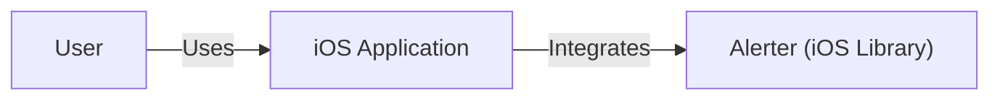
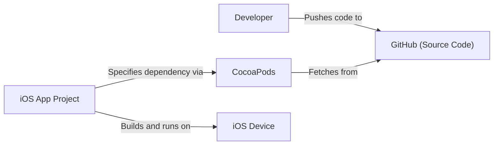
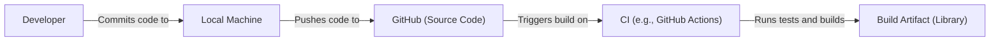

Okay, let's create a design document for the Alerter project.

# BUSINESS POSTURE

Business Priorities and Goals:

*   Provide a simple, customizable, and visually appealing way to display alerts within iOS applications.
*   Offer a lightweight alternative to standard iOS alert mechanisms.
*   Enable developers to quickly integrate and customize alerts without extensive coding.
*   Improve the user experience by providing more engaging and informative alerts.
*   Maintain a well-documented and easy-to-use library.

Most Important Business Risks:

*   **Reliability:** The library must function reliably and consistently across different iOS versions and devices. Bugs or crashes related to the library could negatively impact the host application's user experience.
*   **Maintainability:** The library should be easy to maintain and update. A complex or poorly documented codebase could make it difficult to address bugs or add new features.
*   **Adoption:** The library's success depends on developer adoption. If it's difficult to use or doesn't offer significant advantages over existing solutions, it may not gain traction.
*   **Security (Indirect):** While the library itself doesn't handle sensitive data directly, vulnerabilities in the library could potentially be exploited if it interacts with other parts of the application that do handle sensitive data. This is a lower-priority risk but should still be considered.

# SECURITY POSTURE

Existing Security Controls:

*   security control: **Code Reviews:** The GitHub repository indicates the use of pull requests, suggesting that code reviews are part of the development process. (Implicit in the use of GitHub).
*   security control: **Open Source:** The project is open-source, allowing for community scrutiny and contributions, which can help identify and address security issues. (Explicit in the repository being public).
*   security control: **Simple Functionality:** The library's core functionality is relatively simple, reducing the attack surface. It primarily deals with UI presentation. (Inferred from the project description and code).
*   security control: **No Network Communication:** The library, in its basic form, does not perform any network communication, eliminating network-related security risks. (Inferred from the project description and code).
*   security control: **No Data Storage:** The library does not store any persistent data, eliminating data storage-related security risks. (Inferred from the project description and code).

Accepted Risks:

*   accepted risk: **Limited Input Validation:** The library likely performs minimal input validation on the text and other parameters provided to it. While this is acceptable for its intended use case (displaying developer-provided content), it's important to be aware of potential issues if the library is used in unexpected ways.
*   accepted risk: **Dependency on UIKit:** The library depends on UIKit, which is a large and complex framework. While UIKit is generally well-vetted, there is always a small risk of vulnerabilities in the underlying framework.
*   accepted risk:   **No formal security audits**: There is no evidence of formal security audits.

Recommended Security Controls:

*   security control: **Fuzz Testing:** Implement fuzz testing to ensure the library handles unexpected or malformed input gracefully. This can help identify potential crashes or vulnerabilities.
*   security control: **Static Analysis:** Integrate static analysis tools into the build process to identify potential code quality and security issues.
*   security control: **Documentation of Security Considerations:** Add a section to the README or other documentation that explicitly addresses security considerations for developers using the library.

Security Requirements:

*   **Authentication:** Not applicable, as the library does not handle user authentication.
*   **Authorization:** Not applicable, as the library does not handle user authorization.
*   **Input Validation:**
    *   The library should handle various input types (text, images, etc.) gracefully.
    *   The library should avoid crashes or unexpected behavior when presented with very long strings or other potentially problematic input.
    *   Consider adding options for developers to sanitize or validate input before passing it to the library, especially if the input originates from user-generated content.
*   **Cryptography:** Not applicable, as the library does not handle encryption or other cryptographic operations.

# DESIGN

## C4 CONTEXT

Element Descriptions:

*   Element:
    *   Name: User
    *   Type: Person
    *   Description: The end-user of the iOS application.
    *   Responsibilities: Interacts with the iOS application, views alerts displayed by Alerter.
    *   Security controls: None (handled by the iOS application).

*   Element:
    *   Name: Alerter (iOS Library)
    *   Type: Software System
    *   Description: A library for displaying customizable alerts within iOS applications.
    *   Responsibilities: Provides an API for creating and displaying alerts, handles alert presentation and animation.
    *   Security controls: Input validation (limited), fuzz testing (recommended), static analysis (recommended).

*   Element:
    *   Name: iOS Application
    *   Type: Software System
    *   Description: The application that integrates the Alerter library.
    *   Responsibilities: Handles application logic, integrates Alerter to display alerts to the user.
    *   Security controls: Responsibility of the application developer.

## C4 CONTAINER

Since Alerter is a simple library, the container diagram is essentially the same as the context diagram. It's a single component integrated directly into the iOS application.

Element Descriptions:

*   Element:
    *   Name: User
    *   Type: Person
    *   Description: The end-user of the iOS application.
    *   Responsibilities: Interacts with the iOS application, views alerts displayed by Alerter.
    *   Security controls: None (handled by the iOS application).

*   Element:
    *   Name: Alerter (iOS Library)
    *   Type: Software System
    *   Description: A library for displaying customizable alerts within iOS applications.
    *   Responsibilities: Provides an API for creating and displaying alerts, handles alert presentation and animation.
    *   Security controls: Input validation (limited), fuzz testing (recommended), static analysis (recommended).

*   Element:
    *   Name: iOS Application
    *   Type: Software System
    *   Description: The application that integrates the Alerter library.
    *   Responsibilities: Handles application logic, integrates Alerter to display alerts to the user.
    *   Security controls: Responsibility of the application developer.

## DEPLOYMENT

Possible Deployment Solutions:

1.  **CocoaPods:** A dependency manager for Swift and Objective-C Cocoa projects.
2.  **Carthage:** A decentralized dependency manager for Cocoa.
3.  **Swift Package Manager:** The official package manager for Swift.
4.  **Manual Integration:** Copying the source files directly into the project.

Chosen Solution: CocoaPods (and others, but focusing on CocoaPods for this example)

Element Descriptions:

*   Element:
    *   Name: Developer
    *   Type: Person
    *   Description: The developer integrating Alerter into their iOS application.
    *   Responsibilities: Writes code, manages dependencies, builds and deploys the application.
    *   Security controls: Secure coding practices, access controls to development tools.

*   Element:
    *   Name: GitHub (Source Code)
    *   Type: System
    *   Description: The source code repository for Alerter.
    *   Responsibilities: Stores the source code, manages versions, facilitates collaboration.
    *   Security controls: GitHub's built-in security features, access controls, code review processes.

*   Element:
    *   Name: CocoaPods
    *   Type: System
    *   Description: A dependency manager for Cocoa projects.
    *   Responsibilities: Fetches and manages dependencies specified in the Podfile.
    *   Security controls: Relies on the security of the CocoaPods infrastructure and the integrity of the packages it retrieves.

*   Element:
    *   Name: iOS App Project
    *   Type: System
    *   Description: The developer's iOS application project.
    *   Responsibilities: Contains the application code, integrates Alerter as a dependency.
    *   Security controls: Responsibility of the application developer.

*   Element:
    *   Name: iOS Device
    *   Type: Device
    *   Description: The device on which the iOS application is running.
    *   Responsibilities: Executes the application code.
    *   Security controls: iOS operating system security features.

## BUILD

Element Descriptions:

*   Element:
    *   Name: Developer
    *   Type: Person
    *   Description: The developer working on the Alerter library.
    *   Responsibilities: Writes code, runs tests, commits changes.
    *   Security controls: Secure coding practices, access controls to development tools.

*   Element:
    *   Name: Local Machine
    *   Type: System
    *   Description: The developer's local development environment.
    *   Responsibilities: Used for writing code, running local tests, and committing changes.
    *   Security controls: Local machine security (e.g., firewall, antivirus).

*   Element:
    *   Name: GitHub (Source Code)
    *   Type: System
    *   Description: The source code repository for Alerter.
    *   Responsibilities: Stores the source code, manages versions, facilitates collaboration.
    *   Security controls: GitHub's built-in security features, access controls, code review processes.

*   Element:
    *   Name: CI (e.g., GitHub Actions)
    *   Type: System
    *   Description: A continuous integration system (e.g., GitHub Actions, Travis CI, CircleCI).
    *   Responsibilities: Automates the build process, runs tests, and potentially deploys the library.
    *   Security controls: CI system security, secure configuration of build scripts, use of static analysis tools (recommended).

*   Element:
    *   Name: Build Artifact (Library)
    *   Type: Artifact
    *   Description: The compiled library file (e.g., .framework, .a).
    *   Responsibilities: Used by developers to integrate Alerter into their applications.
    *   Security controls: Code signing (recommended), integrity checks (recommended).

Security Controls in Build Process:

*   **Code Review:** Pull requests on GitHub facilitate code review.
*   **Automated Testing:** The project includes unit tests, which are likely run as part of the CI process.
*   **Static Analysis (Recommended):** Integrate static analysis tools (e.g., SwiftLint) into the CI pipeline to identify potential code quality and security issues.
*   **Dependency Management:** CocoaPods, Carthage, or Swift Package Manager are used to manage dependencies.
*   **Code Signing (Recommended):** The library should be code-signed to ensure its integrity and authenticity.

# RISK ASSESSMENT

*   What are critical business processes we are trying to protect?
    *   The primary business process is providing a reliable and user-friendly UI component for iOS developers. This contributes to the overall user experience of applications that integrate Alerter.

*   What data we are trying to protect and what is their sensitivity?
    *   Alerter itself does not handle sensitive data directly. It primarily displays developer-provided text and images. The sensitivity of the data displayed depends on the application that integrates Alerter. If an application uses Alerter to display user-generated content or sensitive information, then that data would be considered sensitive. However, Alerter itself does not store or transmit this data.

# QUESTIONS & ASSUMPTIONS

Questions:

*   Are there any specific compliance requirements (e.g., GDPR, HIPAA) that apply to applications that might use Alerter? (This is primarily a concern for the integrating application, but it's good to be aware of.)
*   Are there any plans to add features that might involve network communication or data storage in the future?
*   What is the expected level of support and maintenance for the library?
*   What is the target audience for this library (e.g., all iOS developers, developers within a specific organization)?

Assumptions:

*   BUSINESS POSTURE: The primary goal is to provide a useful and well-maintained UI library for iOS developers.
*   SECURITY POSTURE: The library is assumed to be relatively low-risk from a security perspective due to its limited functionality and lack of network communication or data storage.
*   DESIGN: The library is designed to be simple and easy to integrate into iOS applications. The use of CocoaPods, Carthage, and Swift Package Manager is assumed for dependency management. The build process is assumed to be automated using a CI system like GitHub Actions.