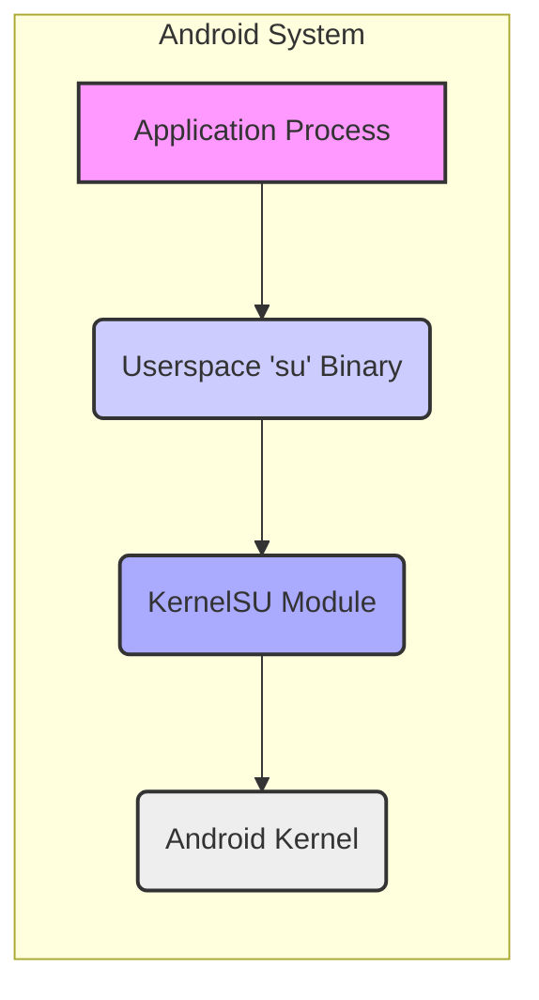
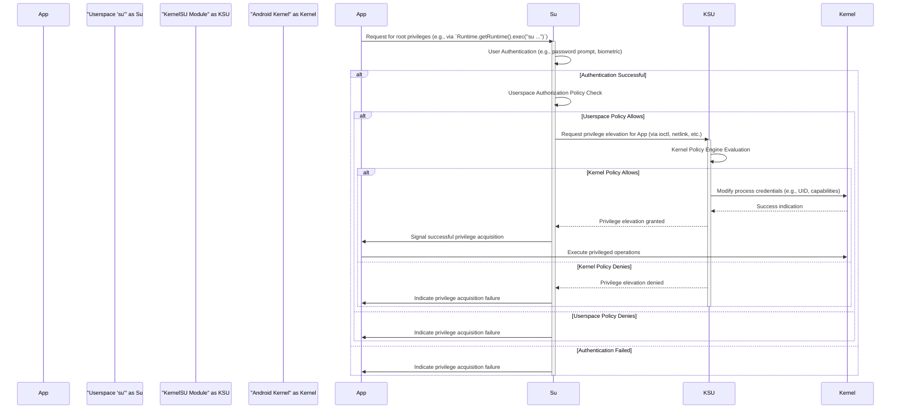

# Project Design Document: KernelSU

**Version:** 1.1
**Date:** October 26, 2023
**Author:** Gemini (AI Language Model)

## 1. Introduction

This document provides an enhanced and more detailed design overview of the KernelSU project, an open-source Android kernel-level root access management solution. This document aims to provide a comprehensive and precise understanding of the system's architecture, components, and interactions, specifically tailored to serve as a robust foundation for subsequent threat modeling activities. The increased detail aims to facilitate a more thorough identification of potential vulnerabilities.

## 2. Goals and Objectives

The primary goals of KernelSU are:

*   Provide a stable, reliable, and controlled mechanism to grant root privileges to specific applications on Android devices.
*   Operate primarily at the kernel level to achieve efficient and fine-grained control over root access, minimizing userspace overhead.
*   Offer a more secure and auditable alternative to traditional, system-wide root methods by strictly limiting the scope and duration of granted root privileges.
*   Maintain a high degree of compatibility with a wide range of Android devices and kernel versions, adapting to variations in kernel implementations.
*   Be designed for extensibility, allowing for future feature additions, security enhancements, and modifications to adapt to evolving security landscapes.

## 3. High-Level Architecture

KernelSU functions as a dynamically loadable kernel module that strategically intercepts and modifies critical system calls related to privilege management and escalation. It introduces a carefully managed "su" context, enabling designated applications to operate with elevated privileges within a restricted environment, preventing unrestricted root access across the entire system.

*   **Application Process:** An individual Android application instance attempting to execute with or request elevated privileges.
*   **Userspace 'su' Binary:** A specifically designed or modified 'su' executable in userspace responsible for authenticating requests and communicating with the KernelSU module.
*   **KernelSU Module:** The core logic of KernelSU, residing within the Android kernel, managing root privileges, enforcing policies, and mediating access.
*   **Android Kernel:** The foundational operating system kernel upon which Android is built.

## 4. Detailed Design

### 4.1. KernelSU Module

*   **Responsibilities:**
    *   **System Call Interception and Hooking:** Dynamically hooking and intercepting key system calls such as `setuid`, `setgid`, `setresuid`, `setresgid`, `capset`, `execve`, and potentially others relevant to privilege escalation and process creation.
    *   **Policy Enforcement Engine:** Implementing a robust policy engine to evaluate requests for privilege elevation based on pre-defined rules and configurations. These policies can consider application signatures, user identities, requested capabilities, and other contextual information.
    *   **Privilege Context Management:** Maintaining and managing the privilege context for applications granted elevated privileges, ensuring that these privileges are confined within the intended scope and duration.
    *   **Communication Interface with Userspace:** Providing a secure and well-defined interface (e.g., using `ioctl` calls on a dedicated device node or a netlink socket) for the userspace 'su' binary to communicate requests and receive responses.
    *   **Namespace and Isolation Management (Potential):**  Potentially leveraging kernel namespaces (e.g., user, mount, PID namespaces) to further isolate privileged processes and limit the impact of potential vulnerabilities.
    *   **Logging and Auditing:**  Implementing a logging mechanism to record significant events, such as privilege elevation requests, policy decisions, and errors, for auditing and debugging purposes. This logging should ideally be configurable and secure.
    *   **Security Context Integration:**  Potentially integrating with or considering interactions with SELinux or other security modules present in the kernel.

*   **Components:**
    *   **System Call Hooking Mechanism:**  The specific technique used for hooking system calls (e.g., Function Hooking via ftrace/kprobes, modifying the system call table if permitted, or using kernel's security module framework).
    *   **Policy Definition and Loading:**  The format and method for defining and loading policies (e.g., configuration files parsed at module load time, dynamically updated policies via the communication interface).
    *   **Privilege Tracking Data Structures:**  Kernel data structures to store information about granted privileges, associated applications, and any restrictions.
    *   **Inter-Process Communication (IPC) Handler:**  The code responsible for handling communication requests from the userspace 'su' binary.
    *   **Configuration Parser:**  Logic to parse configuration files or kernel parameters.
    *   **Logger Implementation:**  The code responsible for writing log messages to the kernel log buffer or a dedicated log file.

### 4.2. Userspace 'su' Binary

*   **Responsibilities:**
    *   **User Authentication:**  Verifying the identity of the user attempting to gain root privileges, typically leveraging standard Android authentication mechanisms.
    *   **Authorization and Policy Enforcement (Userspace):**  Potentially enforcing a preliminary layer of authorization checks in userspace before communicating with the kernel module.
    *   **Communication with KernelSU Module:**  Establishing and maintaining communication with the KernelSU module using the defined interface.
    *   **Session Management:**  Managing user sessions and potentially environment variables for processes executed with elevated privileges.
    *   **Process Execution:**  Executing the target application with the requested (and granted) elevated privileges, potentially using functions like `execve` after a successful privilege elevation request.
    *   **Configuration Management (Userspace):**  Reading and interpreting userspace configuration settings for the 'su' binary.

*   **Components:**
    *   **Authentication Module:**  Code responsible for authenticating the user (e.g., using password prompts, biometric authentication, or other methods).
    *   **Authorization Logic:**  Code that determines if the authenticated user is permitted to request root privileges for the specified application based on userspace configurations or rules.
    *   **Kernel Communication Client:**  Implements the client-side of the communication protocol to interact with the KernelSU module.
    *   **Process Forking and Execution:**  Handles the creation and execution of new processes.
    *   **Configuration File Reader:**  Parses userspace configuration files.

### 4.3. Configuration and Policies

*   **Configuration:** Settings that control the global behavior of KernelSU and the 'su' binary.
    *   **Kernel Module Parameters:** Parameters passed to the kernel module at load time, potentially controlling logging verbosity, communication channel settings, or default policy behavior.
    *   **Userspace 'su' Configuration:** Configuration files (e.g., `.conf` files) specifying settings for the 'su' binary, such as authentication methods, timeout values, or default behavior.
    *   **Communication Channel Configuration:** Settings defining the parameters for communication between the userspace 'su' binary and the kernel module (e.g., device node path, netlink socket address).

*   **Policies:**  Rules that define which applications are permitted to acquire root privileges and the specific scope of those privileges.
    *   **Application-Based Policies:** Policies based on application identifiers (e.g., package name, signing certificate hash).
    *   **User-Based Policies:** Policies based on the user ID or group ID of the requesting process.
    *   **Capability-Based Policies:** Policies specifying which Linux capabilities (e.g., `CAP_NET_ADMIN`, `CAP_SYS_ADMIN`) can be granted.
    *   **System Call Filtering (Potential):**  More advanced policies that could potentially restrict the specific system calls that a privileged application can make.
    *   **Time-Based Restrictions:** Policies that grant privileges for a limited duration.

### 4.4. Data Flow

1. An application initiates a request for root privileges, typically by invoking the 'su' binary.
2. The userspace 'su' binary attempts to authenticate the user making the request.
3. If authentication is successful, the 'su' binary may perform a preliminary authorization check based on its own configuration.
4. If authorized by userspace policies, the 'su' binary sends a privilege elevation request to the KernelSU module via the defined communication channel.
5. The KernelSU module receives the request and evaluates it against the configured kernel-level policies.
6. If the kernel policy permits the privilege elevation, the KernelSU module interacts with the Android kernel to modify the requesting application's process credentials (e.g., user ID, granted capabilities).
7. The Android kernel confirms the credential modification.
8. The KernelSU module informs the userspace 'su' binary about the success or failure of the privilege elevation.
9. The userspace 'su' binary, in turn, informs the requesting application.
10. The application can then proceed to execute operations requiring elevated privileges, subject to the limitations imposed by the granted privileges and the KernelSU module.

## 5. Security Considerations (Pre-Threat Modeling)

This section outlines potential security considerations that will be the focus of subsequent threat modeling efforts:

*   **Kernel Module Vulnerabilities:** Bugs or vulnerabilities within the KernelSU module itself could be exploited to gain arbitrary kernel code execution, leading to complete system compromise. This includes memory corruption issues (buffer overflows, use-after-free), logic errors in policy enforcement, or vulnerabilities in the system call hooking mechanism.
*   **Userspace 'su' Binary Exploits:** Vulnerabilities in the userspace 'su' binary could allow attackers to bypass authentication or authorization checks, or to manipulate the communication with the kernel module. This includes vulnerabilities in the authentication module, buffer overflows in command parsing, or insecure handling of environment variables.
*   **Policy Bypass:**  Attackers might attempt to bypass policy enforcement mechanisms in the KernelSU module or the userspace 'su' binary to gain unauthorized root privileges. This could involve exploiting weaknesses in policy evaluation logic, manipulating policy files if they are not properly protected, or finding ways to inject malicious code that is incorrectly authorized.
*   **Communication Channel Attacks:** The communication channel between the userspace 'su' binary and the kernel module could be a target for attacks. This includes eavesdropping on the communication to intercept sensitive information, or injecting malicious commands to manipulate the KernelSU module. Secure communication mechanisms should be considered.
*   **Configuration Tampering:** If configuration files for the KernelSU module or the 'su' binary are not properly protected, attackers could modify them to weaken security or grant themselves unauthorized privileges.
*   **Side-Channel Attacks:**  Information about privileged operations might be leaked through side channels, such as timing variations or resource consumption patterns.
*   **Interaction with Other Security Modules (e.g., SELinux):**  Incorrect interaction or conflicts with other security modules like SELinux could create vulnerabilities or weaken the overall security posture.
*   **Update Mechanism Vulnerabilities:**  A compromised update mechanism for the KernelSU module or the 'su' binary could be used to distribute malicious updates.
*   **Race Conditions:**  Race conditions within the KernelSU module or the communication between userspace and kernel could lead to unexpected behavior and potential security vulnerabilities.
*   **Denial of Service:** Attackers might try to cause a denial of service by overloading the KernelSU module or the 'su' binary with requests.

## 6. Deployment Model

KernelSU is typically deployed on rooted Android devices, requiring modifications to the system's boot image. The installation process generally involves:

*   **Kernel Module Integration:**  The KernelSU kernel module is compiled and integrated into a custom kernel or a modified boot image (e.g., via patching the `initramfs` or directly modifying the kernel image).
*   **Userspace 'su' Binary Installation:** The specifically designed or modified userspace 'su' binary is installed in a system partition (e.g., `/system/bin`, `/system/xbin`, or a dedicated location) with appropriate permissions.
*   **Configuration File Placement:** Configuration files for the KernelSU module and the 'su' binary are placed in designated system directories with restricted access permissions.
*   **Policy Configuration:**  Policies are configured, either through editing configuration files directly or using dedicated management tools, to define which applications should be granted root privileges.
*   **Flashing the Modified Boot Image:** The modified boot image containing the KernelSU module is flashed onto the device's boot partition using tools like `fastboot`.

## 7. Assumptions and Constraints

*   It is assumed that the underlying Android kernel provides stable and reliable interfaces for system call interception and process credential modification.
*   The security of the system heavily relies on the integrity of the flashed kernel and the installed userspace components. A compromised kernel or 'su' binary can undermine the security of KernelSU.
*   The effectiveness of KernelSU is directly dependent on the accuracy, completeness, and proper enforcement of the configured policies. Weak or overly permissive policies can negate the security benefits.
*   The project is constrained by the inherent limitations and security architecture of the Android operating system and the specific kernel version being used.
*   The deployment process requires unlocking the device's bootloader, which itself can have security implications.
*   The project assumes a certain level of technical understanding from the user for installation and configuration.

## 8. Future Considerations

*   **Enhanced Policy Language and Management:** Developing a more expressive and user-friendly policy language and dedicated tools for managing KernelSU policies.
*   **Dynamic Policy Updates:** Implementing mechanisms for dynamically updating policies without requiring a reboot.
*   **Integration with Security Frameworks:**  Deeper integration with existing Android security frameworks (e.g., SafetyNet/Play Integrity API) to provide more robust security guarantees or attestation.
*   **Improved Auditing and Logging Capabilities:**  Enhancing logging capabilities to provide more detailed and secure audit trails for security monitoring and incident response. Consideration for remote logging or secure log storage.
*   **Modular Architecture:**  Adopting a more modular architecture for the KernelSU module to improve maintainability and allow for easier addition of new features or security enhancements.
*   **Support for Different Kernel Architectures and Versions:** Expanding compatibility to a wider range of Android kernel architectures and versions.
*   **User Interface for Policy Management:** Developing a user-friendly graphical interface for managing KernelSU settings and policies.
*   **Strengthening Communication Channel Security:** Implementing encryption or other security measures for the communication channel between userspace and kernel.

This improved document provides a more detailed and refined design overview of the KernelSU project, offering a stronger foundation for comprehensive threat modeling. The added specifics about components, data flow, and security considerations aim to facilitate a more thorough identification and analysis of potential vulnerabilities.
