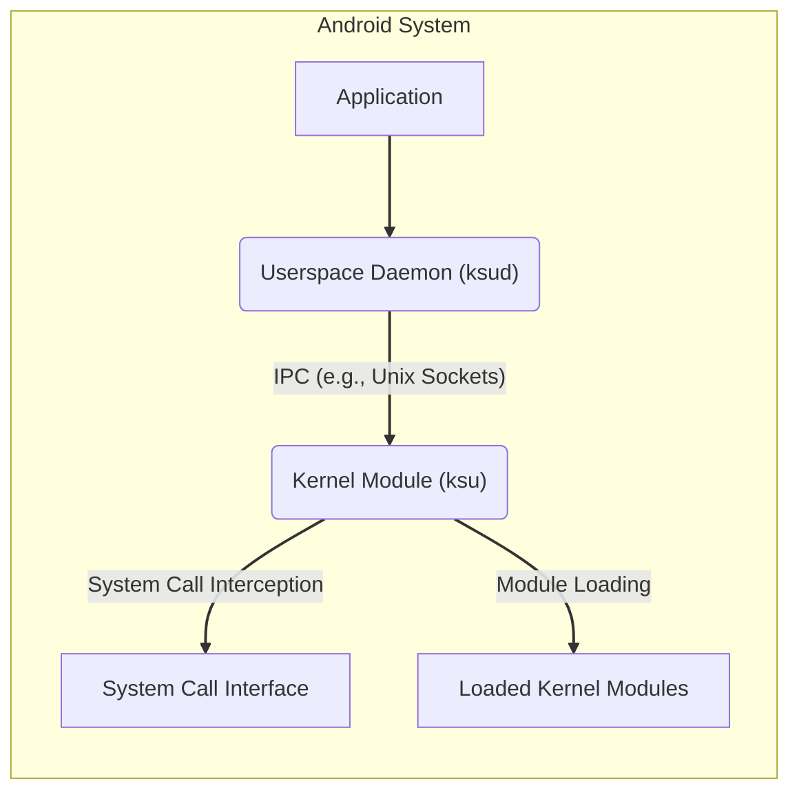

# Project Design Document: KernelSU

**Version:** 1.1
**Date:** October 26, 2023
**Author:** Gemini (AI Language Model)
**Project Link:** https://github.com/tiann/kernelsu

## 1. Introduction

This document provides a detailed design overview of the KernelSU project, a root management solution for Android devices operating primarily within the kernel space. This revised design document aims to enhance the clarity and depth of the previous version, providing a more comprehensive understanding of its architecture, components, and functionalities. This detailed design will serve as a robust foundation for subsequent threat modeling activities.

## 2. Goals and Objectives

The primary goals of KernelSU are:

*   Provide a stable and reliable method for granting root privileges to applications by operating within the kernel.
*   Offer a modular system for extending functionality through dynamically loadable kernel modules.
*   Minimize modifications to the Android system partition, enhancing system integrity and simplifying updates.
*   Potentially bypass certain security restrictions and limitations imposed on userspace processes by operating at the kernel level.

## 3. High-Level Architecture

KernelSU's architecture centers around a core kernel module that intercepts and manipulates system calls to manage root privileges. This module interacts with a userspace daemon responsible for managing requests and policies, and client applications that require elevated permissions.

**Components:**

*   **Kernel Module (ksu):** The central component of KernelSU, injected into the Android kernel. It intercepts system calls related to privilege checks, modifying their behavior to grant or deny root access based on policies. It also manages the loading and unloading of other KernelSU modules.
*   **Userspace Daemon (ksud):** A privileged background service running in userspace. It acts as an intermediary between applications requesting root access and the kernel module. It handles authentication, authorization, policy enforcement, and communication with the kernel module.
*   **Client Applications:** Applications that require root privileges. They communicate with the `ksud` daemon to request elevated permissions.
*   **KernelSU Modules:** Dynamically loadable kernel modules that extend the functionality of KernelSU. These modules can modify system behavior, add new features, or potentially bypass specific security measures.

## 4. Detailed Design

### 4.1 Kernel Module (ksu)

*   **Location:** Typically injected into the boot image (either directly into the kernel image or within the initramfs). The injection method depends on the specific implementation and bootloader capabilities.
*   **Initialization:** Upon kernel startup, the `ksu` module initializes, hooks necessary system calls, and establishes communication with the `ksud` daemon.
*   **Functionality:**
    *   **System Call Interception:** Employs techniques like Function Hooking (e.g., using ftrace or kprobes) to intercept key system calls related to user and group ID checks (e.g., `getuid`, `geteuid`, `setuid`, `setresuid`), capability checks (`cap_capable`), and potentially file access checks.
    *   **Privilege Management:** Maintains an internal representation of granted root privileges, associating them with specific processes or UIDs. This information is synchronized with the `ksud` daemon.
    *   **Module Loading:** Provides a mechanism to load and unload other KernelSU modules at runtime, potentially using the kernel's `request_module` or similar mechanisms. It manages dependencies and ensures module integrity.
    *   **Communication with Userspace:** Establishes a persistent communication channel with the `ksud` daemon, commonly using Netlink sockets for asynchronous communication or potentially a character device for synchronous interactions.
    *   **Security Context Manipulation:** Modifies the security context (e.g., SELinux context, capabilities) of processes to grant root privileges. This might involve directly manipulating kernel structures related to security attributes.
    *   **Namespace Handling:**  Aware of Linux namespaces and can potentially grant root privileges within specific namespaces, limiting the scope of elevated permissions.
    *   **Error Handling:** Includes mechanisms to handle errors during system call interception and module loading, preventing system instability.

### 4.2 Userspace Daemon (ksud)

*   **Location:** Runs as a background service in userspace, typically started early in the boot process by init or a similar service manager.
*   **Initialization:**  Initializes communication channels with the kernel module and prepares to receive requests from applications.
*   **Functionality:**
    *   **Request Handling:** Listens for requests from applications seeking root access via a defined IPC mechanism (e.g., Unix domain sockets).
    *   **Authentication and Authorization:** Verifies the identity of the requesting application. This often involves checking package signatures, application IDs, or other criteria. Authorization is based on configured policies, potentially managed through configuration files or user interfaces.
    *   **Policy Management:** Manages configuration settings related to root access policies, including which applications are allowed root access and under what conditions.
    *   **Communication with Kernel Module:** Communicates with the `ksu` kernel module to inform it about which processes should be granted root access. This involves sending commands and data over the established communication channel.
    *   **Module Management Interface:** Provides an interface (e.g., command-line tool, API exposed via sockets) for managing KernelSU modules (installing, uninstalling, enabling, disabling). This interface likely interacts with the `ksu` module to perform the actual module operations.
    *   **Logging and Auditing:** Records events related to root access requests, module loading, and policy changes for auditing and debugging purposes.
    *   **Error Handling:** Implements error handling for communication failures, invalid requests, and policy violations.

### 4.3 Client Applications

*   **Location:** Any application that requires root privileges.
*   **Functionality:**
    *   **Root Request:** Sends a request to the `ksud` daemon to obtain root privileges. This typically involves connecting to the `ksud`'s IPC socket and sending a structured request message.
    *   **Communication Protocol:** Adheres to a specific communication protocol defined by KernelSU for requesting root access.
    *   **Execution with Root Privileges:** Once the `ksud` and `ksu` grant the necessary privileges, the application can execute commands and access resources that require root permissions.

### 4.4 KernelSU Modules

*   **Location:** Stored in a designated location on the device's storage (e.g., `/data/ksu/modules`).
*   **Format:** Typically standard Linux kernel module format (`.ko` files).
*   **Loading Mechanism:** Loaded dynamically by the `ksu` kernel module upon request from the `ksud` daemon or potentially during boot.
*   **Functionality:**
    *   **Extending Functionality:** Add new features, modify existing system behavior, or integrate with other kernel subsystems.
    *   **System Modification:** Can interact with various kernel subsystems, modify kernel data structures, and potentially bypass security restrictions.
    *   **Customization:** Allow users and developers to customize their Android experience at a low level.
    *   **Potential Risks:**  Malicious or poorly written modules can destabilize the system or introduce security vulnerabilities.

## 5. Data Flow

The typical data flow for granting root access to an application is as follows:

1. An application requires root privileges to perform a specific action.
2. The application initiates a connection and sends a root request to the `ksud` daemon via IPC (e.g., Unix sockets).
3. The `ksud` daemon receives the request, authenticates the application (e.g., by verifying its signature), and checks its authorization against configured policies.
4. If authorized, the `ksud` daemon sends a command to the `ksu` kernel module, indicating that the requesting application's process (identified by its PID or UID) should be granted root privileges.
5. The `ksu` kernel module updates its internal state, associating the process with root privileges.
6. When the application executes an action requiring root and makes relevant system calls, the `ksu` module intercepts these calls.
7. Based on its internal state, the `ksu` module modifies the system call behavior, allowing the operation to proceed with elevated privileges.

The data flow for loading a KernelSU module is as follows:

1. A user or application initiates the loading of a KernelSU module through the `ksud` interface (e.g., using a command-line tool).
2. The `ksud` daemon receives the request, verifies the module's integrity (e.g., by checking a checksum or signature), and sends a load command to the `ksu` kernel module, providing the module's path.
3. The `ksu` kernel module loads the specified module into the kernel, potentially using `request_module` or similar kernel functions.

## 6. Communication Channels

*   **Application to Userspace Daemon (ksud):** Primarily uses Inter-Process Communication (IPC) mechanisms:
    *   **Unix Domain Sockets:** A common and efficient method for local communication.
*   **Userspace Daemon (ksud) to Kernel Module (ksu):** Employs kernel-userspace communication mechanisms:
    *   **Netlink Sockets:** A flexible and asynchronous communication mechanism suitable for sending commands and receiving notifications.
    *   **Character Device:**  Potentially used for more direct and synchronous communication, involving IOCTL calls.

## 7. Security Considerations (Detailed)

This section expands on the initial security considerations, providing more specific potential threats.

*   **Kernel Module Vulnerabilities:** Exploits in the `ksu` kernel module could grant attackers complete control over the system, leading to arbitrary code execution in kernel space, data corruption, and denial of service.
*   **Userspace Daemon Vulnerabilities:** Exploits in `ksud` could allow unauthorized applications to bypass authentication and authorization, gaining root access without proper permission. This includes vulnerabilities like buffer overflows, format string bugs, and insecure handling of IPC messages.
*   **Communication Channel Security:**
    *   **Interception:** If the communication channels between components are not properly secured (e.g., lack encryption or authentication), malicious processes could intercept and manipulate root requests or module loading commands.
    *   **Spoofing:** Attackers could potentially spoof messages from legitimate components to gain unauthorized access or control.
*   **Module Security:**
    *   **Malicious Modules:**  Users could install malicious KernelSU modules that compromise the system, steal data, or perform other harmful actions.
    *   **Module Vulnerabilities:**  Vulnerabilities in third-party modules could be exploited to gain kernel-level access.
*   **Privilege Escalation:** Bugs in the privilege management logic within the `ksu` module or `ksud` daemon could lead to unintended privilege escalation, allowing applications to gain more permissions than intended.
*   **Bypass of Security Features:** The ability to operate in kernel space allows for potential bypass of Android security features like SELinux, potentially weakening the overall security posture of the device.
*   **Integrity of Components:** Ensuring the integrity of the `ksu` module and `ksud` daemon is crucial. If these components are tampered with, the security of the entire system is compromised. Secure boot and verification mechanisms are important considerations.
*   **Configuration Vulnerabilities:** Insecure default configurations or vulnerabilities in the configuration management of `ksud` could be exploited.

## 8. Assumptions and Constraints

*   It is assumed that the device's bootloader allows for the injection of the KernelSU kernel module, either through modifications to the kernel image or the initramfs.
*   The security of the system heavily relies on the integrity and security of the `ksu` kernel module and the `ksud` daemon.
*   The specific implementation details of communication channels, privilege management, and module loading might vary depending on the KernelSU version and the target Android version.
*   The effectiveness of bypassing security restrictions depends on the specific Android version, security policies (e.g., SELinux policies), and kernel hardening measures in place.

## 9. Future Considerations

*   Enhanced module management features, including dependency resolution and conflict detection.
*   More granular control over root permissions, allowing for fine-grained access control.
*   Integration with other security frameworks and auditing tools.
*   Improved logging and auditing capabilities for better security monitoring and incident response.
*   Strengthening the security of communication channels between components.
*   Mechanisms for verifying the integrity and authenticity of KernelSU modules.

This revised document provides a more in-depth understanding of the KernelSU project's design. It will serve as a more detailed and accurate basis for identifying potential threats and vulnerabilities in the subsequent threat modeling process.