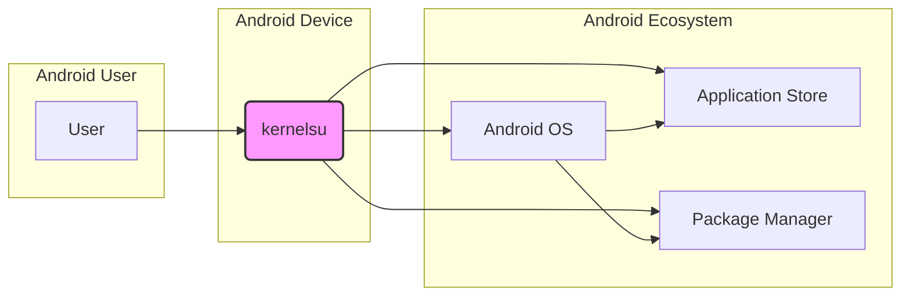
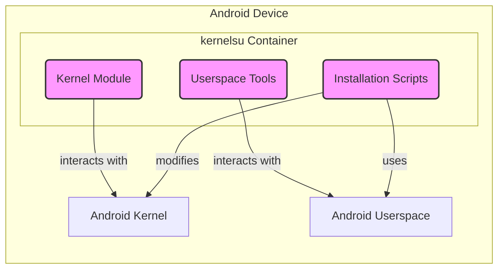
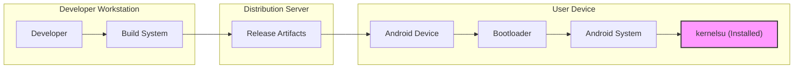

# BUSINESS POSTURE

This project, kernelsu, aims to provide a modern, modular, and safer root solution for Android devices, primarily targeting advanced Android users, developers, and enthusiasts who require root access for customization, development, or advanced device control.

Business Priorities and Goals:
- Provide a stable and reliable root solution for a wide range of Android devices and versions.
- Offer a modular design that allows for easier maintenance, updates, and customization.
- Enhance security compared to traditional rooting methods by minimizing system modifications and focusing on a more controlled approach.
- Foster an open-source community around the project for collaboration and improvement.
- Enable advanced Android customization and development use cases.

Business Risks:
- Device instability or bricking due to improper installation or software bugs.
- Security vulnerabilities in the root solution itself, potentially leading to exploitation by malicious actors.
- Compatibility issues with certain Android devices or software configurations.
- Negative user perception if the solution is perceived as too complex or risky to use.
- Potential misuse of root access by users, leading to security compromises or data loss.

# SECURITY POSTURE

Existing Security Controls:
- security control: Open-source project, allowing for community review and scrutiny of the code. (Implemented: GitHub Repository)
- security control: Utilizes kernel module approach, aiming for less invasive system modifications compared to traditional rooting methods. (Implemented: Project Design)
- security control: Integration with Magisk (optional), a popular Android rooting and module management framework, leveraging its existing security features and module ecosystem. (Implemented: Project Features)

Accepted Risks:
- accepted risk: Rooting inherently increases the attack surface of an Android device by granting elevated privileges.
- accepted risk: Potential for user error during installation or configuration, leading to security vulnerabilities or device instability.
- accepted risk: Reliance on the security of the underlying Android kernel and device hardware.
- accepted risk: Compatibility issues may introduce unexpected security flaws.

Recommended Security Controls:
- security control: Implement automated security testing, including static analysis security testing (SAST) and dynamic analysis security testing (DAST), within the development pipeline.
- security control: Conduct regular security audits and penetration testing by security experts to identify and address potential vulnerabilities.
- security control: Establish a clear vulnerability disclosure and response process to handle security issues reported by the community or discovered internally.
- security control: Provide clear and comprehensive documentation and warnings to users about the risks associated with rooting and how to mitigate them.
- security control: Implement code signing for all release artifacts to ensure integrity and prevent tampering.

Security Requirements:
- Authentication: Not directly applicable to kernelsu itself as it's a root enabler. Authentication is handled by the underlying Android OS. However, secure installation and management processes are crucial.
- Authorization: Kernelsu's primary function is to enable root authorization. It must ensure that root access is granted in a controlled and secure manner, minimizing the risk of unauthorized privilege escalation.
- Input Validation: Kernel modules and userspace tools must implement robust input validation to prevent vulnerabilities such as buffer overflows, command injection, and other input-related attacks. This is critical for the security of the kernel and the overall system.
- Cryptography: Cryptographic measures should be used to protect sensitive data and ensure the integrity of the kernelsu components. This may include secure boot integration, secure communication channels (if applicable), and secure storage of configuration data.

# DESIGN

## C4 CONTEXT



Context Diagram Elements:

- Element:
    - Name: User
    - Type: Person
    - Description: An Android device owner who wants to gain root access to their device for customization, development, or advanced control.
    - Responsibilities: Installing and managing kernelsu, using root access responsibly.
    - Security controls: User education on the risks of rooting, responsible use of root privileges, device security best practices.

- Element:
    - Name: kernelsu
    - Type: Software System
    - Description: A root solution for Android devices implemented as a kernel module and userspace tools. It provides a controlled and modular way to gain root access.
    - Responsibilities: Providing stable and secure root access, managing root privileges, integrating with Android OS.
    - Security controls: Secure boot integration (if possible), kernel module security hardening, input validation, least privilege principle in userspace tools, secure update mechanisms.

- Element:
    - Name: Android OS
    - Type: Software System
    - Description: The underlying Android operating system running on the device. Kernelsu interacts directly with the kernel and system services.
    - Responsibilities: Managing system resources, enforcing security policies, providing APIs for applications and system components.
    - Security controls: Kernel security features (SELinux, etc.), permission system, application sandboxing, secure boot, system updates.

- Element:
    - Name: Application Store
    - Type: Software System
    - Description: Platforms like Google Play Store or F-Droid where users download and install applications. Root access can affect application behavior and security.
    - Responsibilities: Providing a platform for application distribution, enforcing application security policies (to a degree).
    - Security controls: Application scanning, developer verification, user reviews, permission requests.

- Element:
    - Name: Package Manager
    - Type: Software System
    - Description: System tools like `adb` and package installer that are used to install and manage applications and system components. Used in the installation process of kernelsu.
    - Responsibilities: Installing, updating, and removing applications and system components, managing package permissions.
    - Security controls: Package signature verification, permission management, access control to package manager functionalities.

## C4 CONTAINER



Container Diagram Elements:

- Element:
    - Name: Kernel Module
    - Type: Software Container
    - Description: The core component of kernelsu, loaded into the Android kernel. It provides the fundamental root access capabilities and interacts directly with the kernel.
    - Responsibilities: Implementing root privilege escalation, managing root access requests, interacting with the Android kernel.
    - Security controls: Kernel module security hardening, input validation for kernel interactions, least privilege within the kernel module, secure communication with userspace tools.

- Element:
    - Name: Userspace Tools
    - Type: Software Container
    - Description: A set of command-line tools and utilities that run in Android userspace. These tools are used for installing, configuring, and managing kernelsu.
    - Responsibilities: Installation and uninstallation of kernelsu, configuration management, providing user interface for root management (if any), communication with the kernel module.
    - Security controls: Input validation for user commands, secure communication with the kernel module, access control to userspace tools, protection of sensitive configuration data.

- Element:
    - Name: Installation Scripts
    - Type: Software Container
    - Description: Scripts used to automate the installation process of kernelsu, including patching the boot image, installing the kernel module, and setting up userspace tools.
    - Responsibilities: Automating the installation process, ensuring correct placement of files, patching boot images, setting up necessary configurations.
    - Security controls: Integrity checks of installation scripts, secure boot image patching process, validation of installation parameters, rollback mechanisms in case of installation failure.

- Element:
    - Name: Android Kernel
    - Type: Infrastructure Container
    - Description: The core of the Android operating system, responsible for system management and hardware interaction. Kernelsu's kernel module runs within the Android kernel.
    - Responsibilities: Managing system resources, enforcing security policies, providing kernel APIs.
    - Security controls: Kernel security features (SELinux, etc.), memory protection, process isolation, secure boot.

- Element:
    - Name: Android Userspace
    - Type: Infrastructure Container
    - Description: The user-level environment in Android where applications and system services run. Kernelsu's userspace tools operate within this environment.
    - Responsibilities: Running applications and system services, providing user interface, managing user permissions.
    - Security controls: Application sandboxing, permission system, user authentication, access control.

## DEPLOYMENT

Deployment Architecture: Single Device Deployment



Deployment Diagram Elements:

- Element:
    - Name: Developer Workstation
    - Type: Environment
    - Description: The development environment used by kernelsu developers to write, build, and test the software.
    - Responsibilities: Code development, building and testing kernelsu components, managing source code.
    - Security controls: Secure coding practices, access control to development environment, code review processes, vulnerability scanning on development code.

- Element:
    - Name: Build System
    - Type: Environment
    - Description: Automated system used to compile, package, and sign kernelsu components. This could be a local system or a CI/CD pipeline.
    - Responsibilities: Automating the build process, compiling code, creating release artifacts, signing artifacts.
    - Security controls: Secure build environment, access control to build system, build process integrity checks, code signing with secure keys, vulnerability scanning during build.

- Element:
    - Name: Distribution Server
    - Type: Environment
    - Description: Server or platform used to host and distribute kernelsu release artifacts (e.g., GitHub Releases, personal website).
    - Responsibilities: Hosting release files, providing download access to users, managing release versions.
    - Security controls: Secure server infrastructure, access control to release files, integrity checks of release files (checksums, signatures), HTTPS for download access.

- Element:
    - Name: Android Device
    - Type: Device
    - Description: The target Android device where kernelsu is installed.
    - Responsibilities: Running Android OS, executing kernelsu, providing hardware resources.
    - Security controls: Device security features (secure boot, device encryption), user authentication, application sandboxing.

- Element:
    - Name: Bootloader
    - Type: Software Component
    - Description: Software that runs before the Android OS boots. It's involved in the installation process of kernelsu, often requiring unlocking for custom ROMs and root solutions.
    - Responsibilities: Booting the Android OS, verifying system integrity, allowing for custom ROM installation (if unlocked).
    - Security controls: Bootloader locking/unlocking mechanisms, secure boot verification, device integrity checks.

- Element:
    - Name: Android System
    - Type: Software Component
    - Description: The running Android operating system on the device, before kernelsu is fully active.
    - Responsibilities: Initial system startup, loading kernel and system services, preparing the environment for kernelsu.
    - Security controls: Android OS security features, kernel security, system service security.

- Element:
    - Name: kernelsu (Installed)
    - Type: Software Component
    - Description: Kernelsu components (kernel module and userspace tools) installed and running on the Android device, providing root access.
    - Responsibilities: Providing root access, managing root privileges, interacting with the Android system.
    - Security controls: Kernelsu's internal security controls (as described in Container Diagram), integration with Android security features.

## BUILD

```mermaid
flowchart LR
    A[Developer] --> B{Code Changes};
    B --> C[Version Control (Git)];
    C --> D[Build System (GitHub Actions/Local Build)];
    D --> E{Security Checks (SAST, Linters)};
    E -- Pass --> F[Compilation & Packaging];
    E -- Fail --> G[Build Failure Notification];
    F --> H[Code Signing];
    H --> I[Release Artifacts];
    I --> J[Distribution (GitHub Releases)];
    style I fill:#f9f,stroke:#333,stroke-width:2px
```

Build Process Description:

1. Developer: Developers write and modify the kernelsu source code.
2. Code Changes: Code changes are committed and pushed to a version control system.
3. Version Control (Git): Git repository (e.g., GitHub) stores the source code and tracks changes.
4. Build System (GitHub Actions/Local Build): An automated build system (like GitHub Actions or a local build environment) is triggered by code changes or release events.
5. Security Checks (SAST, Linters): Automated security checks are performed, including Static Application Security Testing (SAST) to identify potential vulnerabilities in the code and linters to enforce coding standards and best practices.
6. Compilation & Packaging: If security checks pass, the code is compiled, and the necessary components (kernel module, userspace tools, installation scripts) are packaged into release artifacts.
7. Code Signing: Release artifacts are digitally signed to ensure integrity and authenticity.
8. Release Artifacts: Signed release artifacts are generated (e.g., ZIP files, boot images).
9. Distribution (GitHub Releases): Release artifacts are published to a distribution platform, such as GitHub Releases, for users to download.

Build Process Security Controls:

- security control: Secure Development Environment: Developers use secure workstations with appropriate security configurations.
- security control: Version Control: Using Git for version control provides traceability and allows for code review.
- security control: Automated Build System: Automating the build process reduces the risk of manual errors and ensures consistent builds.
- security control: Static Application Security Testing (SAST): SAST tools are integrated into the build pipeline to automatically detect potential security vulnerabilities in the source code.
- security control: Linters: Linters are used to enforce coding standards and identify potential code quality issues that could lead to security problems.
- security control: Code Review: Code changes are reviewed by other developers to identify potential security flaws and ensure code quality.
- security control: Secure Build Environment: The build environment is secured to prevent unauthorized access and tampering.
- security control: Dependency Management: Dependencies are managed and tracked to ensure they are from trusted sources and are up-to-date with security patches.
- security control: Code Signing: Release artifacts are digitally signed using secure keys to ensure integrity and authenticity, preventing tampering and verifying the source.
- security control: Access Control: Access to the build system, code signing keys, and release artifacts is restricted to authorized personnel.

# RISK ASSESSMENT

Critical Business Processes:
- Providing root access functionality to Android devices.
- Maintaining the stability and security of devices after rooting with kernelsu.
- Ensuring a safe and reliable installation process.
- Maintaining user trust and community support for the project.

Data to Protect and Sensitivity:
- Device Integrity: Kernelsu aims to modify the system in a controlled way. Protecting device integrity means ensuring that kernelsu does not introduce instability or vulnerabilities that could compromise the device's functionality or security. Sensitivity: High.
- User Data (Indirectly): While kernelsu itself doesn't directly handle user data, gaining root access can potentially expose user data to risks if not handled securely. Sensitivity: High.
- Kernelsu Source Code: Protecting the source code from unauthorized modification or access is important to maintain the integrity and security of the project. Sensitivity: Medium.
- Code Signing Keys: Code signing keys are critical for ensuring the authenticity and integrity of releases. Compromise of these keys would be a high-impact security incident. Sensitivity: Critical.
- Build System Infrastructure: Security of the build system is important to prevent supply chain attacks and ensure the integrity of the build process. Sensitivity: Medium.

# QUESTIONS & ASSUMPTIONS

Questions:
- What is the intended threat model for kernelsu? Are there specific threat actors or attack scenarios that the project is designed to mitigate?
- What are the specific security features of the Android kernel versions that kernelsu targets?
- Are there any plans for formal security audits or penetration testing of kernelsu?
- What is the process for handling vulnerability reports and releasing security updates?
- What are the dependencies of kernelsu, and how are their security vulnerabilities managed?
- Is there a mechanism for users to verify the integrity and authenticity of kernelsu releases?

Assumptions:
- BUSINESS POSTURE: The primary goal is to provide a secure and reliable root solution for advanced Android users and developers. Security and stability are prioritized over rapid feature development.
- SECURITY POSTURE: The project currently relies on open-source review and basic secure development practices. There is room for improvement in automated security testing, vulnerability management, and formal security assessments.
- DESIGN: Kernelsu is designed as a modular system with a kernel module and userspace tools. The installation process involves boot image patching and system modifications. The build process is assumed to be automated to some extent, but details need to be further investigated for security enhancements.