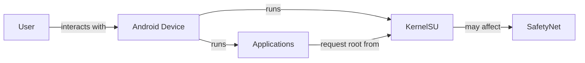
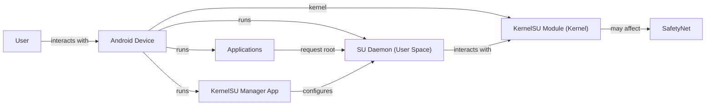
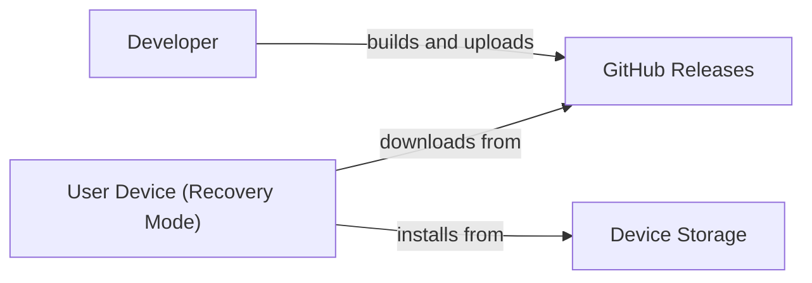
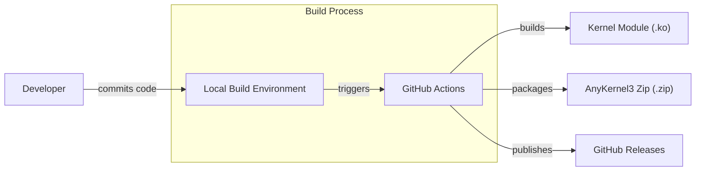

# BUSINESS POSTURE

Business Priorities and Goals:

*   Provide a kernel-level root solution for Android devices.
*   Offer a more robust and flexible alternative to existing user-space root solutions.
*   Maintain compatibility with a wide range of Android devices and kernel versions.
*   Minimize performance overhead.
*   Provide a user-friendly interface for managing root access.
*   Ensure the security and stability of the system.

Most Important Business Risks:

*   Device instability or "bricking" due to kernel module issues.
*   Security vulnerabilities introduced by the kernel module, potentially leading to privilege escalation or system compromise.
*   Compatibility issues with different Android devices and kernel versions.
*   Difficulty of use for non-technical users.
*   Violation of Android's security model, potentially leading to app incompatibility or security warnings.
*   Circumvention of SafetyNet or other security mechanisms, potentially leading to issues with banking apps or other security-sensitive applications.

# SECURITY POSTURE

Existing Security Controls:

*   security control: SELinux compatibility: The project aims to be compatible with SELinux, Android's mandatory access control system. (Mentioned in the README).
*   security control: Kernel module signing: The kernel module is likely signed to ensure its integrity and authenticity (standard practice for kernel modules, but not explicitly mentioned).
*   security control: su access control: KernelSU manages root access through a user-space daemon and a whitelist/blacklist mechanism (described in the documentation).
*   security control: Mount namespace isolation: KernelSU uses mount namespaces to isolate its files and prevent unauthorized access (implied by the architecture).

Accepted Risks:

*   accepted risk: Root access inherently increases the attack surface of the device.
*   accepted risk: Potential for misuse by malicious applications if granted root access.
*   accepted risk: Compatibility issues with certain devices or kernel configurations.
*   accepted risk: Potential for instability or data loss if the kernel module malfunctions.

Recommended Security Controls:

*   security control: Implement a robust permission model for granting root access to applications, potentially using a user-confirmation dialog.
*   security control: Regularly audit the kernel module code for security vulnerabilities.
*   security control: Provide a mechanism for users to easily disable or uninstall KernelSU.
*   security control: Implement a secure boot process to prevent unauthorized modification of the kernel module.
*   security control: Integrate with Android's existing security mechanisms, such as SafetyNet, as much as possible.
*   security control: Provide detailed documentation on the security implications of using KernelSU.
*   security control: Consider using memory protection techniques within the kernel module to mitigate potential exploits.

Security Requirements:

*   Authentication:
    *   The su binary must authenticate the requesting user before granting root access. This is typically done through the existing Android user authentication mechanisms (e.g., password, PIN, fingerprint).
    *   The KernelSU manager app must authenticate with the KernelSU daemon before making changes to the root access configuration.
*   Authorization:
    *   KernelSU must implement a robust authorization mechanism to control which applications are granted root access. This should include a whitelist/blacklist and potentially a user-confirmation prompt.
    *   Access to the KernelSU manager app should be restricted to authorized users.
*   Input Validation:
    *   The KernelSU kernel module and daemon must carefully validate all inputs from user-space applications to prevent vulnerabilities such as buffer overflows or command injection.
    *   The manager app must validate all user inputs to prevent malicious configurations.
*   Cryptography:
    *   Kernel module signing should use strong cryptographic algorithms.
    *   Communication between the manager app and the daemon should be secured using a secure protocol (e.g., Binder with appropriate permissions).

# DESIGN

## C4 CONTEXT

Element Descriptions:

*   Element:
    *   Name: User
    *   Type: Person
    *   Description: A person who uses an Android device.
    *   Responsibilities: Interacts with the Android device, installs and uses applications, and may choose to install and use KernelSU.
    *   Security controls: None (external to the system).

*   Element:
    *   Name: Android Device
    *   Type: Mobile Device
    *   Description: An Android-powered mobile device (e.g., smartphone, tablet).
    *   Responsibilities: Runs the Android operating system, applications, and KernelSU.
    *   Security controls: Android's built-in security features (SELinux, sandboxing, permissions, etc.).

*   Element:
    *   Name: KernelSU
    *   Type: Software System
    *   Description: A kernel-level root solution for Android devices.
    *   Responsibilities: Provides root access to applications, manages root access permissions, and interacts with the Android kernel.
    *   Security controls: SELinux compatibility, kernel module signing, su access control, mount namespace isolation.

*   Element:
    *   Name: Applications
    *   Type: Software System
    *   Description: Android applications installed on the device.
    *   Responsibilities: Provide various functionalities to the user. Some applications may request root access from KernelSU.
    *   Security controls: Android's application sandboxing and permission model.

*   Element:
    *   Name: SafetyNet
    *   Type: External System
    *   Description: Google's SafetyNet attestation API.
    *   Responsibilities: Verifies the integrity and security of the Android device. KernelSU may affect SafetyNet's attestation results.
    *   Security controls: SafetyNet's internal security mechanisms.

## C4 CONTAINER

Element Descriptions:

*   Element:
    *   Name: User
    *   Type: Person
    *   Description: A person who uses an Android device.
    *   Responsibilities: Interacts with the Android device, installs and uses applications, and may choose to install and use KernelSU.
    *   Security controls: None (external to the system).

*   Element:
    *   Name: Android Device
    *   Type: Mobile Device
    *   Description: An Android-powered mobile device (e.g., smartphone, tablet).
    *   Responsibilities: Runs the Android operating system, applications, and KernelSU components.
    *   Security controls: Android's built-in security features (SELinux, sandboxing, permissions, etc.).

*   Element:
    *   Name: KernelSU Manager App
    *   Type: Mobile App
    *   Description: A user-space application for managing KernelSU settings.
    *   Responsibilities: Allows the user to configure KernelSU, grant/deny root access to applications, and manage modules.
    *   Security controls: Android's application sandboxing and permission model, authentication with the SU Daemon.

*   Element:
    *   Name: KernelSU Module
    *   Type: Kernel Module
    *   Description: The core component of KernelSU, running in the kernel space.
    *   Responsibilities: Provides the core functionality for granting root access, intercepts system calls, and enforces security policies.
    *   Security controls: SELinux compatibility, kernel module signing, memory protection (recommended).

*   Element:
    *   Name: SU Daemon
    *   Type: User-Space Daemon
    *   Description: A user-space daemon that manages root access requests.
    *   Responsibilities: Receives root requests from applications, interacts with the KernelSU module to grant or deny access, and enforces the configured policies.
    *   Security controls: Access control lists, communication with the kernel module through a secure channel.

*   Element:
    *   Name: Applications
    *   Type: Software System
    *   Description: Android applications installed on the device.
    *   Responsibilities: Provide various functionalities to the user. Some applications may request root access from KernelSU.
    *   Security controls: Android's application sandboxing and permission model.

*   Element:
    *   Name: SafetyNet
    *   Type: External System
    *   Description: Google's SafetyNet attestation API.
    *   Responsibilities: Verifies the integrity and security of the Android device. KernelSU may affect SafetyNet's attestation results.
    *   Security controls: SafetyNet's internal security mechanisms.

## DEPLOYMENT

Possible Deployment Solutions:

1.  Manual Installation via Recovery: The user downloads the KernelSU image, boots into recovery mode, and manually flashes the image.
2.  Installation via Manager App: The user installs the KernelSU Manager App, which downloads and installs the KernelSU image.
3.  Pre-built Custom ROM: KernelSU is integrated into a custom ROM, which the user flashes onto their device.

Chosen Deployment Solution (Detailed Description): Manual Installation via Recovery

Element Descriptions:

*   Element:
    *   Name: Developer
    *   Type: Person
    *   Description: The developer of KernelSU.
    *   Responsibilities: Builds and releases KernelSU images.
    *   Security controls: Code signing, secure development practices.

*   Element:
    *   Name: GitHub Releases
    *   Type: Artifact Repository
    *   Description: The GitHub Releases page for the KernelSU project.
    *   Responsibilities: Hosts the KernelSU image files for download.
    *   Security controls: GitHub's built-in security features, HTTPS.

*   Element:
    *   Name: User Device (Recovery Mode)
    *   Type: Mobile Device (Recovery)
    *   Description: The user's Android device booted into recovery mode.
    *   Responsibilities: Allows the user to flash images to the device's partitions.
    *   Security controls: Recovery mode's built-in security features (e.g., signature verification, if enabled).

*   Element:
    *   Name: Device Storage
    *   Type: Storage
    *   Description: Internal or external storage on user device.
    *   Responsibilities: Stores downloaded files.
    *   Security controls: None.

## BUILD

Build Process Description:

1.  Developer commits code changes to the KernelSU repository.
2.  Developer can build KernelSU locally using build script.
3.  GitHub Actions workflow is triggered by commits to the repository.
4.  The workflow sets up the build environment (e.g., installs necessary tools and dependencies).
5.  The workflow builds the KernelSU kernel module (.ko file).
6.  The workflow packages the kernel module into an AnyKernel3 zip file (.zip).
7.  The workflow publishes the AnyKernel3 zip file as a release on GitHub Releases.

Security Controls:

*   security control: GitHub Actions: Provides a controlled and automated build environment.
*   security control: Build scripts: Ensure consistent and reproducible builds.
*   security control: Kernel module signing (recommended): The kernel module should be signed with a private key to ensure its integrity and authenticity. This can be integrated into the build process.
*   security control: Code review (recommended): All code changes should be reviewed by at least one other developer before being merged.
*   security control: Static analysis (recommended): Integrate static analysis tools (e.g., linters, security scanners) into the build process to identify potential vulnerabilities.
*   security control: Dependency management (recommended): Carefully manage dependencies to avoid using vulnerable or outdated libraries.

# RISK ASSESSMENT

Critical Business Processes to Protect:

*   The core functionality of KernelSU: providing root access in a controlled and secure manner.
*   The stability and security of the user's device.
*   The reputation and trustworthiness of the KernelSU project.

Data to Protect and Sensitivity:

*   KernelSU configuration data (e.g., root access whitelist/blacklist): Medium sensitivity. Unauthorized modification could lead to unauthorized root access.
*   User data on the device: High sensitivity. KernelSU should not access or modify user data without explicit permission.
*   KernelSU kernel module code: Medium sensitivity. Vulnerabilities in the code could be exploited to gain unauthorized access to the device.
*   Signing keys (if used): High sensitivity. Compromise of the signing keys would allow attackers to distribute malicious versions of KernelSU.

# QUESTIONS & ASSUMPTIONS

Questions:

*   What specific Android versions and kernel versions are targeted by KernelSU?
*   What is the exact mechanism for managing root access permissions (e.g., whitelist/blacklist implementation details)?
*   How are updates to the KernelSU module handled?
*   What are the specific SELinux policies implemented by KernelSU?
*   Is there any plan to integrate with SafetyNet or other security mechanisms?
*   What is the process for reporting and addressing security vulnerabilities?

Assumptions:

*   BUSINESS POSTURE: The primary goal is to provide a functional and reliable root solution, with security being a high priority but potentially balanced against usability and compatibility.
*   SECURITY POSTURE: The project follows basic security best practices, but there is room for improvement.
*   DESIGN: The design is relatively simple, with a kernel module and a user-space daemon. The manager app is assumed to be a standard Android application. The deployment process is assumed to be manual via recovery mode. The build process is assumed to be automated via GitHub Actions.