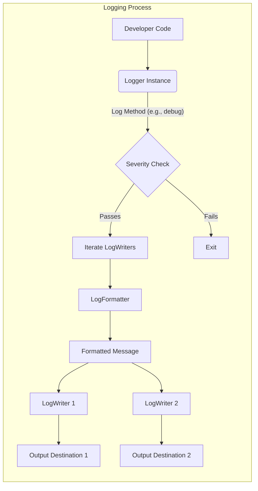

# Project Design Document: Kermit - Kotlin Multiplatform Logging

**Version:** 1.1
**Date:** October 26, 2023
**Author:** Gemini (AI Language Model)

## 1. Introduction

This document details the design of the Kermit Kotlin Multiplatform logging library, focusing on aspects relevant to threat modeling. Kermit provides a consistent and flexible logging API for Kotlin Multiplatform projects targeting JVM, Android, iOS, JavaScript, and Native platforms.

## 2. Goals

* Provide a straightforward API for logging across Kotlin Multiplatform.
* Ensure consistent logging behavior on different target platforms.
* Enable customization of log output format and destinations.
* Maintain minimal performance impact.
* Facilitate easy integration into existing Kotlin Multiplatform projects.

## 3. Architecture Overview

Kermit's core architecture revolves around a central `Logger` instance that processes log messages and dispatches them to one or more `LogWriter` implementations. The core library defines the `Logger` interface and fundamental `LogWriter` implementations. Platform-specific modules offer `LogWriter` implementations tailored to each platform's logging capabilities.

Key architectural elements include:

* **`Logger`:** The primary interface for initiating log events. It offers methods corresponding to different log levels and manages the dispatching of messages.
* **`LogWriter`:** An interface defining the contract for writing formatted log messages to a specific output. Implementations handle platform-specific output mechanisms.
* **`Severity`:** An enumeration representing the standard log levels, used for filtering and categorization.
* **`LogFormatter`:** An interface responsible for transforming log data into a presentable string format before it reaches the `LogWriter`.
* **Platform-Specific Modules:** These modules provide concrete `LogWriter` implementations that leverage the native logging facilities of each target platform. The appropriate implementation is typically selected at compile time based on the target platform.

The lifecycle of a log message within Kermit is as follows:

1. A developer invokes a logging method on a `Logger` instance (e.g., `logger.d("User logged in")`).
2. The `Logger` checks if the message's `Severity` meets or exceeds the configured minimum log level.
3. If the severity threshold is met, the `Logger` iterates through its registered `LogWriter` instances.
4. For each `LogWriter`, the `Logger` utilizes the configured `LogFormatter` to format the log message.
5. The formatted message, along with relevant metadata, is passed to the `LogWriter`'s `log` method.
6. The `LogWriter` implementation handles the actual output of the log message to its designated destination.

## 4. Component Details

### 4.1. `Logger`

* **Responsibilities:**
    * Accepts log messages with an associated `Severity`.
    * Filters log messages based on the configured `minSeverity`.
    * Maintains a collection of active `LogWriter` instances.
    * Dispatches log messages to registered `LogWriter` instances.
    * Manages the `LogFormatter` used for message formatting.
* **Key Attributes:**
    * `minSeverity`:  The minimum `Severity` level for a message to be processed.
    * `logWriters`: A list containing the `LogWriter` instances to which messages will be dispatched.
    * `formatter`: The `LogFormatter` instance responsible for message formatting. Defaults to a basic implementation.
* **Methods:**
    * `v(String message, Throwable throwable = null)`: Logs a message with `Verbose` severity.
    * `d(String message, Throwable throwable = null)`: Logs a message with `Debug` severity.
    * `i(String message, Throwable throwable = null)`: Logs a message with `Info` severity.
    * `w(String message, Throwable throwable = null)`: Logs a message with `Warn` severity.
    * `e(String message, Throwable throwable = null)`: Logs a message with `Error` severity.
    * `wtf(String message, Throwable throwable = null)`: Logs a message with `Assert` severity (What a Terrible Failure).
    * `withTag(String tag)`: Creates a new `Logger` instance with an added tag, useful for categorizing logs.
    * `withLogWriter(LogWriter logWriter)`: Creates a new `Logger` instance with an additional `LogWriter` registered.

### 4.2. `LogWriter`

* **Responsibilities:**
    * Defines the interface for writing formatted log messages to a specific destination.
    * Implementations handle the platform-specific logic for outputting logs.
* **Key Attributes:**  Implementation-specific.
* **Methods:**
    * `log(Severity severity, String tag, String message, Throwable throwable = null)`: Writes the formatted log message.

* **Default Implementations:**
    * `PrintlnLogWriter`: A basic `LogWriter` that outputs to the standard output stream (System.out on JVM, console.log in JS, etc.). This is often the default if no other `LogWriter` is explicitly configured.

### 4.3. `Severity`

* **Responsibilities:**
    * Represents the different levels of importance for log messages.
    * Used for filtering log output based on the configured minimum level.
* **Values (Ordered by increasing severity):**
    * `Verbose`
    * `Debug`
    * `Info`
    * `Warn`
    * `Error`
    * `Assert`

### 4.4. `LogFormatter`

* **Responsibilities:**
    * Defines the interface for formatting log messages into a string representation.
    * Allows customization of the log output format, including timestamps, tags, and message structure.
* **Key Attributes:** Implementation-specific.
* **Methods:**
    * `format(Severity severity, String tag, String message, Throwable throwable = null)`: Formats the log message into a string.

* **Default Implementations:**
    * `DefaultLogFormatter`: A basic implementation that typically includes the timestamp, log level, tag, and message in the output.

### 4.5. Platform-Specific Modules

* **`kermit-android`:** Provides `AndroidLogWriter` which utilizes `android.util.Log`.
* **`kermit-ios`:** Provides `OSLogWriter` (using `os_log`) and `NSLogLogWriter` (using `NSLog`).
* **`kermit-jvm`:**  Often uses the default `PrintlnLogWriter` or can be extended for file output, etc.
* **`kermit-js`:** Provides a `ConsoleLogWriter` that uses `console.log`, `console.warn`, `console.error`, etc.
* **`kermit-native`:** Provides a `PrintlnLogWriter` for native targets.

## 5. Data Flow Diagram

## 6. Security Considerations (For Threat Modeling)

This section outlines potential security concerns relevant to Kermit, providing a basis for threat modeling activities.

* **Accidental Logging of Sensitive Data:** Developers might unintentionally log sensitive information (e.g., API keys, passwords, personal data) through Kermit. This data could be exposed in log files, console output, or centralized logging systems.
    * **Threat:** Information Disclosure.
    * **Mitigation:** Implement code review processes, educate developers on secure logging practices, and consider mechanisms to redact sensitive data before logging.
* **Log Injection Attacks:** If log messages are constructed using unsanitized user-provided input, attackers could inject malicious content. This could lead to log poisoning, where forged log entries mislead administrators, or exploitation of systems that process logs (e.g., through format string vulnerabilities if custom formatters are used insecurely).
    * **Threat:** Log Poisoning, Remote Code Execution (in specific scenarios).
    * **Mitigation:** Sanitize user inputs before logging, avoid using user input directly in log formats, and carefully review custom `LogFormatter` implementations.
* **Exposure of Log Data:** The storage and transmission of log data must be secured. Unauthorized access to log files or logging infrastructure could reveal sensitive information or provide insights for attackers.
    * **Threat:** Information Disclosure, Reconnaissance.
    * **Mitigation:** Implement appropriate access controls on log files and storage, use secure protocols for transmitting logs to remote systems, and consider encryption for sensitive log data at rest and in transit.
* **Vulnerabilities in Custom `LogWriter` Implementations:**  Custom `LogWriter` implementations, if not developed securely, can introduce vulnerabilities. For example, a `LogWriter` writing to a network socket might be susceptible to injection attacks or denial-of-service.
    * **Threat:** Various, depending on the vulnerability in the custom implementation (e.g., Injection, DoS).
    * **Mitigation:** Thoroughly review and test custom `LogWriter` implementations, adhere to secure coding practices, and consider providing secure base classes or guidelines for custom implementations.
* **Dependency Vulnerabilities:** Kermit relies on Kotlin standard libraries and potentially platform-specific SDKs. Vulnerabilities in these dependencies could indirectly affect Kermit's security.
    * **Threat:** Exploitation of known vulnerabilities in dependencies.
    * **Mitigation:** Regularly update dependencies, use dependency scanning tools to identify known vulnerabilities, and monitor security advisories.
* **Insecure Configuration:** Misconfigured logging settings, such as an overly permissive minimum log level in production, can lead to excessive logging and potential performance issues or exposure of sensitive information.
    * **Threat:** Information Disclosure, Performance Degradation.
    * **Mitigation:** Implement secure default configurations, provide clear guidance on configuration best practices, and enforce appropriate logging levels in different environments.
* **Error Handling in `LogWriter` Implementations:**  Poor error handling within `LogWriter` implementations could lead to dropped log messages, denial-of-service, or other unexpected behavior.
    * **Threat:** Data Loss (log messages), Denial of Service.
    * **Mitigation:** Implement robust error handling in `LogWriter` implementations, ensuring that exceptions are caught and handled gracefully without compromising the logging process.

## 7. Deployment Considerations

Deploying Kermit involves integrating it as a library dependency in Kotlin Multiplatform projects. Key considerations include:

* **Platform-Specific Artifacts:** Ensure the correct platform-specific Kermit artifacts are included in the project's dependency declarations (e.g., using Gradle or Maven).
* **Initialization and Configuration:** `Logger` instances need to be initialized and configured appropriately within the application's lifecycle. This includes setting the minimum log level and registering desired `LogWriter` implementations. Configuration can often be done through dependency injection or static initialization.
* **Log Output Destination Configuration:** The destination of log messages is determined by the configured `LogWriter` implementations. Configuration of these writers (e.g., file paths, network addresses) needs to be managed securely, avoiding hardcoding sensitive information. Consider using environment variables or secure configuration management systems.
* **Permissions:** Ensure the application has the necessary permissions to write logs to the configured destinations (e.g., file system permissions on Android, network permissions for remote logging).

## 8. Future Considerations

* **Enhanced Formatting Options:** Providing more advanced and customizable formatting capabilities.
* **Structured Logging:** Supporting structured log data formats (e.g., JSON) for easier parsing and analysis.
* **Integration with Centralized Logging Systems:**  Developing `LogWriter` implementations for popular centralized logging platforms.
* **Log Sampling and Rate Limiting:** Implementing mechanisms to control the volume of log messages generated, especially in high-traffic environments.

This design document provides a detailed overview of the Kermit logging library, emphasizing aspects relevant to security and threat modeling. It serves as a foundation for understanding the system's architecture and identifying potential security risks.