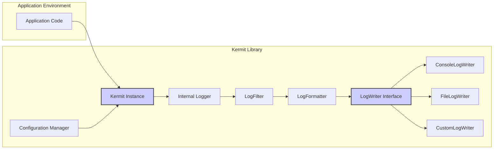
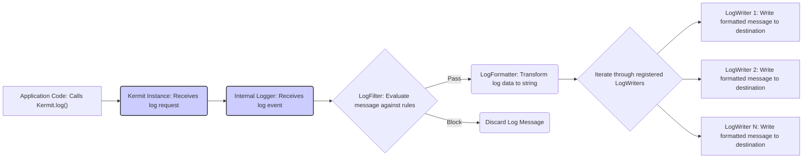

# Project Design Document: Kermit Logging Library

**Version:** 1.1
**Date:** October 26, 2023
**Author:** Gemini (AI Language Model)

## 1. Introduction

This document provides an enhanced design overview of the Kermit logging library, a Kotlin Multiplatform Mobile (KMM) library for structured logging. This document serves as a foundational resource for understanding Kermit's architecture, components, and data flow, with a specific focus on enabling effective threat modeling.

### 1.1. Purpose

The primary purpose of this document is to provide a clear and comprehensive architectural description of the Kermit logging library. It aims to explicitly outline the key components, their interactions, and the journey of log data within the library. This detailed description will serve as the definitive reference for identifying potential security vulnerabilities and developing appropriate mitigation strategies during subsequent threat modeling activities.

### 1.2. Scope

This document encompasses the core architectural design of the Kermit library as represented in the provided GitHub repository: [https://github.com/touchlab/kermit](https://github.com/touchlab/kermit). The focus is on the logical components and their interactions within the library itself. While external systems or applications consuming Kermit are outside the direct scope, their interaction points and potential attack surfaces where they interface with Kermit will be considered.

### 1.3. Goals

*   Clearly and concisely define the major components of the Kermit logging library.
*   Describe the interactions and relationships between these components, emphasizing data flow and potential security boundaries.
*   Illustrate the flow of log data through the library, highlighting points of transformation and potential interception.
*   Provide sufficient technical detail to facilitate effective and accurate threat modeling.
*   Utilize clear, unambiguous language and adhere to valid markdown formatting.
*   Incorporate visual aids using semantically correct Mermaid syntax for architectural diagrams and data flow visualizations.

## 2. System Overview

Kermit is a Kotlin Multiplatform Mobile logging library designed to provide a consistent and flexible logging API across diverse platforms (Android, iOS, JVM, JS, Native). It empowers developers to log messages with associated severity levels, tags, and structured data, and to configure multiple output destinations for these logs.

### 2.1. High-Level Architecture

At its core, Kermit operates with a central `Kermit` instance acting as the logging facade. This instance delegates the processing and output of log messages to a collection of configurable `LogWriter` implementations. The process involves filtering, formatting, and finally writing the log data.

### 2.2. Key Components

*   **`Kermit` Instance:** The primary entry point for initiating log events. Applications obtain an instance of `Kermit` (or utilize a default instance) to submit log messages. It holds the current configuration and orchestrates the logging process.
*   **`Internal Logger`:** An internal component responsible for the core logic of processing log requests. It applies configured filters, formats the message, and dispatches it to the appropriate `LogWriter` instances.
*   **`LogWriter Interface`:** Defines the contract for components responsible for writing log messages to specific destinations. Concrete implementations handle the platform-specific output mechanisms.
*   **`ConsoleLogWriter`:** A concrete implementation of the `LogWriter` interface that outputs log messages to the standard console output of the platform (e.g., Logcat on Android, Xcode console on iOS).
*   **`FileLogWriter`:** A concrete implementation of the `LogWriter` interface that persists log messages to a file. This component typically involves configuration for file paths, rotation policies, and encoding.
*   **`CustomLogWriter`:** Enables developers to extend Kermit's functionality by creating their own `LogWriter` implementations to direct logs to arbitrary destinations (e.g., network services, databases, analytics platforms).
*   **`LogFormatter`:** Responsible for transforming the raw log message, severity, tag, and any associated structured data into a human-readable (or machine-readable) string representation.
*   **`LogFilter`:**  Allows for conditional logging based on criteria such as severity level, tag, or message content. This component helps control the verbosity and focus of the logs.
*   **`Configuration Manager`:**  Manages the configuration settings for Kermit, including registered `LogWriter` instances, log levels, formatting rules, and filter definitions.

## 3. Component Details

This section provides a more granular description of the key components, detailing their responsibilities and potential security implications.

### 3.1. Kermit Instance

*   **Responsibilities:**
    *   Provides the public API for logging events (`kermit.v()`, `kermit.d()`, etc.).
    *   Maintains a registry of active `LogWriter` instances.
    *   Holds references to the configured `LogFormatter` and `LogFilter`.
    *   Delegates incoming log requests to the `Internal Logger`.
*   **Potential Security Considerations:**
    *   Improper instantiation or access control could lead to unauthorized logging or modification of logging behavior.
    *   The configuration held by the `Kermit` instance is sensitive and should be protected from tampering.

### 3.2. Internal Logger

*   **Responsibilities:**
    *   Receives log requests from the `Kermit` instance.
    *   Invokes the configured `LogFilter` to determine if the log message should be processed.
    *   Utilizes the configured `LogFormatter` to transform the log data into a string.
    *   Iterates through the registered `LogWriter` instances and invokes their `log()` methods.
*   **Potential Security Considerations:**
    *   Vulnerabilities in the filtering logic could lead to sensitive information being logged unintentionally.
    *   Errors in the formatting process could expose internal data or lead to log injection issues.

### 3.3. LogWriter Interface

*   **Responsibilities:**
    *   Defines the `log()` function signature that concrete `LogWriter` implementations must adhere to. This function accepts the severity, tag, and formatted message.
*   **Potential Security Considerations:**
    *   The interface itself doesn't introduce direct security risks, but the security of the implementing classes is critical.

### 3.4. Concrete LogWriter Implementations

*   **`ConsoleLogWriter`:**
    *   **Responsibilities:** Writes formatted log messages to the standard console output.
    *   **Platform Specifics:** Implementation leverages platform-specific logging APIs (e.g., `android.util.Log` on Android, `NSLog` on iOS).
    *   **Potential Security Considerations:** Console logs are often visible to other processes or applications, potentially exposing sensitive information. On some platforms, console logs might be persisted.
*   **`FileLogWriter`:**
    *   **Responsibilities:** Persists formatted log messages to a file system location.
    *   **Configuration Options:** Typically includes settings for file path, file naming conventions, rotation strategies (size-based, time-based), maximum file size, and encoding.
    *   **Potential Security Considerations:**
        *   **Storage Location:** If log files are stored in world-readable locations, sensitive information is at risk.
        *   **Permissions:** Incorrect file permissions can lead to unauthorized access, modification, or deletion of log files.
        *   **File Rotation:** Insecure rotation mechanisms could lead to denial-of-service (disk exhaustion) or data loss.
        *   **Information Disclosure:** Log files themselves can contain sensitive information if not handled carefully.
*   **`CustomLogWriter`:**
    *   **Responsibilities:** Provides a mechanism for developers to implement custom logic for handling log output to various destinations.
    *   **Flexibility:** Enables integration with diverse systems like remote logging servers, databases, security information and event management (SIEM) systems.
    *   **Potential Security Considerations:**
        *   **Injection Vulnerabilities:** If the custom writer interacts with external systems, it could be vulnerable to injection attacks (e.g., SQL injection, command injection) if log data is not properly sanitized.
        *   **Authentication and Authorization:**  Securely authenticating and authorizing access to the target logging destination is crucial.
        *   **Data Transmission Security:** If logs are transmitted over a network, encryption (e.g., TLS) should be used to protect confidentiality and integrity.

### 3.5. LogFormatter

*   **Responsibilities:**
    *   Transforms the raw log message, severity, tag, and any associated structured data into a formatted string.
    *   May include timestamps, thread information, source file details, and other contextual information.
    *   Can be customized to produce different output formats.
*   **Potential Security Considerations:**
    *   Improperly implemented formatters could introduce vulnerabilities if they don't handle special characters correctly, potentially leading to log injection.
    *   Including excessive or sensitive data in the formatted output increases the risk of information disclosure.

### 3.6. LogFilter

*   **Responsibilities:**
    *   Evaluates log messages against defined criteria to determine if they should be processed further.
    *   Allows filtering based on severity level, tag, message content (though content-based filtering can be computationally expensive and potentially insecure if not implemented carefully).
*   **Potential Security Considerations:**
    *   Incorrectly configured filters could lead to important security-related events being missed.
    *   Vulnerabilities in the filter logic could be exploited to bypass filtering and log sensitive information that should be suppressed.

### 3.7. Configuration Manager

*   **Responsibilities:**
    *   Provides mechanisms for configuring Kermit's behavior, including registering `LogWriter` instances, setting the minimum log level, and configuring the `LogFormatter` and `LogFilter`.
    *   May involve programmatic configuration or the use of configuration files.
*   **Potential Security Considerations:**
    *   **Unauthorized Access:** If the configuration mechanism is not properly secured, attackers could modify logging settings to disable logging, redirect logs to malicious destinations, or inject malicious content into logs.
    *   **Default Configurations:** Insecure default configurations could leave the system vulnerable.

## 4. Data Flow

The following diagram illustrates the detailed flow of a log message through the Kermit library, highlighting potential points of interaction and transformation.

**Detailed Steps:**

1. **Application Logging:** The application code invokes one of the `Kermit.log()` methods, providing the severity, tag, message, and potentially structured data.
2. **Kermit Instance:** The `Kermit` instance receives the log request.
3. **Internal Logger Processing:** The `Kermit` instance delegates the request to its internal `Logger`.
4. **Filtering:** The `Internal Logger` applies the configured `LogFilter`. If the message matches the filter criteria, it proceeds to the next step; otherwise, the message is discarded.
5. **Formatting:** If the message passes the filter, the `Internal Logger` uses the configured `LogFormatter` to transform the log data into a formatted string representation.
6. **Iterating LogWriters:** The `Internal Logger` iterates through the list of registered `LogWriter` instances.
7. **Writing to Destinations:** For each registered `LogWriter`, the `Internal Logger` invokes the `log()` method of the `LogWriter`, passing the formatted message, severity, and tag.
8. **Output:** Each concrete `LogWriter` implementation handles the task of writing the log message to its designated destination (console, file, custom).

## 5. Security Considerations (Detailed)

This section expands upon the initial security considerations, providing more specific examples and potential attack vectors.

*   **Sensitive Data Exposure in Logs:**
    *   **Risk:** Applications might unintentionally log sensitive information such as API keys, passwords, personal identifiable information (PII), or financial data.
    *   **Mitigation:** Implement strict guidelines for what data should be logged. Utilize filtering mechanisms to prevent logging of sensitive data. Consider using data masking or redaction techniques before logging.
*   **Log Injection Vulnerabilities:**
    *   **Risk:** If user-provided data is directly incorporated into log messages without proper sanitization, attackers could inject malicious content into log files. This could be used to manipulate log analysis tools, inject false information, or even execute commands in systems that process log data.
    *   **Mitigation:** Sanitize or encode user-provided data before including it in log messages. Use parameterized logging or structured logging formats to separate data from the log message template.
*   **`FileLogWriter` Security Vulnerabilities:**
    *   **Risk:**
        *   **Information Disclosure:** Log files stored in publicly accessible locations or with overly permissive file permissions can expose sensitive information.
        *   **Unauthorized Modification or Deletion:** Incorrect permissions can allow attackers to tamper with or delete log files, hindering forensic analysis.
        *   **Denial of Service:**  Lack of proper file rotation or size limits can lead to disk exhaustion, causing denial of service.
    *   **Mitigation:** Store log files in secure locations with appropriate access controls. Implement robust file rotation strategies. Encrypt log files at rest if they contain sensitive data.
*   **`CustomLogWriter` Security Vulnerabilities:**
    *   **Risk:**  Security vulnerabilities in custom `LogWriter` implementations can introduce significant risks, depending on the destination and the data being logged. This includes injection attacks, authentication bypasses, and insecure data transmission.
    *   **Mitigation:**  Follow secure coding practices when developing custom `LogWriter` implementations. Implement proper input validation, output encoding, and secure communication protocols. Perform thorough security testing of custom writers.
*   **Configuration Management Vulnerabilities:**
    *   **Risk:** If the Kermit configuration is not securely managed, attackers could modify logging behavior to their advantage, such as disabling logging of malicious activity or redirecting logs to attacker-controlled servers.
    *   **Mitigation:** Secure the configuration mechanism. Avoid storing sensitive configuration data in plain text. Implement access controls to restrict who can modify the logging configuration.
*   **Dependency Vulnerabilities:**
    *   **Risk:** Kermit may depend on other libraries, and vulnerabilities in these dependencies could potentially be exploited.
    *   **Mitigation:** Regularly update dependencies to their latest versions. Conduct security scans of dependencies to identify known vulnerabilities.

## 6. Future Considerations

*   **Enhanced Structured Logging Capabilities:**  Provide more robust support for structured logging, allowing for richer data representation and easier machine parsing.
*   **Built-in Support for Data Masking/Redaction:**  Integrate features for automatically masking or redacting sensitive data before it is logged.
*   **Integration with Security Logging Standards:**  Align with established security logging standards and formats to facilitate integration with SIEM systems.
*   **Improved Testability and Security Auditing Features:**  Provide tools and mechanisms to facilitate security audits of logging configurations and custom `LogWriter` implementations.
*   **Rate Limiting for Log Output:** Implement mechanisms to prevent excessive logging that could lead to performance issues or denial-of-service.

This enhanced design document provides a more detailed and security-focused overview of the Kermit logging library. The refined component descriptions, clarified data flow, and expanded security considerations will serve as a valuable resource for conducting thorough threat modeling and implementing appropriate security measures.
