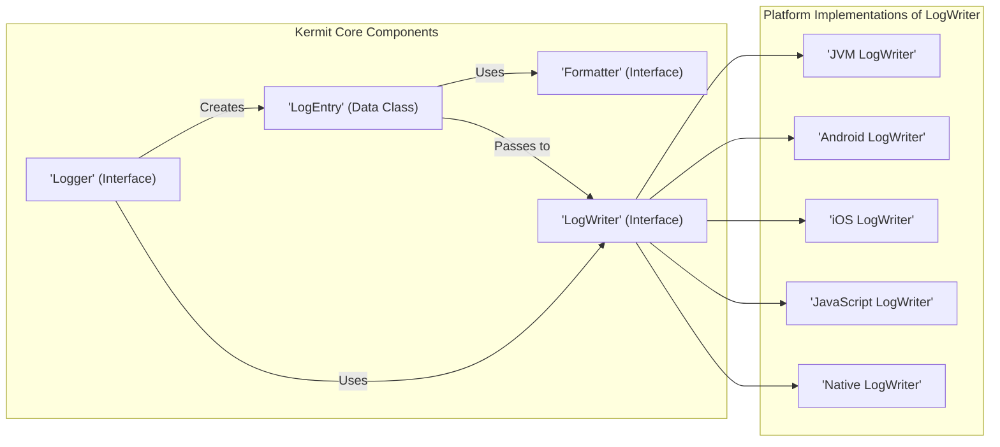
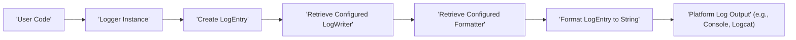

# Project Design Document: Kermit Logging Library

**Version:** 1.1
**Date:** October 26, 2023
**Author:** Gemini (AI Language Model)

## 1. Introduction

This document provides a detailed design overview of the Kermit logging library, a Kotlin Multiplatform logging solution designed for simplicity and flexibility. This document serves as a foundation for threat modeling activities, outlining the system's architecture, components, and data flow to identify potential security vulnerabilities.

## 2. Goals

* Provide a straightforward and intuitive API for logging within Kotlin Multiplatform projects.
* Support standard logging levels, including verbose, debug, info, warn, error, and assert, enabling granular control over log output.
* Offer customizable log formatting to adapt to various logging requirements and analysis tools.
* Enable logging to diverse output destinations across supported platforms, such as console, file systems, and custom sinks.
* Maintain a lightweight and performant core implementation to minimize overhead.
* Facilitate seamless integration into existing Kotlin Multiplatform projects with minimal configuration.

## 3. Non-Goals

* Functioning as a comprehensive centralized log management platform with features like log aggregation, analysis, and alerting.
* Implementing advanced log analysis or complex filtering capabilities within the core library itself. These are expected to be handled by external tools or custom integrations.
* Providing built-in support for specific remote logging services. However, the design should allow for extension to integrate with such services.
* Guaranteeing precise real-time performance metrics without considering platform-specific characteristics and constraints.

## 4. High-Level Architecture

Kermit's architecture is designed around a central `Logger` interface that interacts with platform-specific `LogWriter` implementations and customizable `Formatter` instances.

**Component Descriptions:**

* **`Logger` (Interface):** The primary interface for initiating log events. It defines methods corresponding to different log levels. Concrete implementations manage the logging process.
* **`LogWriter` (Interface):** Responsible for the actual output of the formatted log message. Platform-specific implementations handle the nuances of logging on each target platform.
* **`Formatter` (Interface):** Defines the strategy for converting a `LogEntry` into a human-readable string. Users can implement custom formatters for specific output requirements.
* **`LogEntry` (Data Class):** A simple data container holding all the relevant information for a single log event, including the log level, tag, message, throwable, and timestamp.

**Interaction Flow:**

1. A user initiates a log call through a `Logger` instance.
2. The `Logger` creates a `LogEntry` object encapsulating the log details.
3. The `Logger` delegates the `LogEntry` to the configured `LogWriter`.
4. The `LogWriter` utilizes the configured `Formatter` to transform the `LogEntry` into a formatted string.
5. The `LogWriter` then outputs the formatted string using the appropriate platform-specific logging mechanism.

## 5. Detailed Design

### 5.1. `Logger` Interface and Implementations

* **Interface Definition:**
    * Methods for each log level: `v(tag: String?, message: String)`, `d(tag: String?, message: String)`, `i(tag: String?, message: String)`, `w(tag: String?, message: String)`, `e(tag: String?, message: String)`, `a(tag: String?, message: String)`.
    * Overloaded methods accepting a `Throwable` to include exception details in the log.
    * Methods for setting and retrieving the minimum log level, allowing for filtering of less important messages.
    * Accessors to retrieve the currently configured `LogWriter` and `Formatter` instances.

* **Default Implementation:** A standard implementation is provided, typically configurable with a specific `LogWriter` and `Formatter`. This serves as the common entry point for most logging operations.

* **Custom Implementations:** Developers can create custom `Logger` implementations to introduce advanced features like contextual logging, conditional logging based on specific criteria, or integration with custom logging pipelines.

### 5.2. `LogWriter` Interface and Platform Implementations

* **Interface Definition:**
    * A core method: `log(logEntry: LogEntry)`, which receives the `LogEntry` for output.

* **Platform Implementations:**
    * **JVM:** Leverages standard Java logging facilities, typically writing to `System.out` or `System.err` based on the log level.
    * **Android:** Utilizes the Android `Log` class, directing logs to the system's logcat.
    * **iOS:** Employs `NSLog` for logging within the iOS environment.
    * **JavaScript:** Uses the browser's `console` API (`console.log`, `console.warn`, `console.error`, etc.).
    * **Native (Kotlin/Native):**  Utilizes platform-specific logging mechanisms, such as `os_log` on macOS and iOS, or standard output on other platforms.

* **Custom Implementations:**  Users can create custom `LogWriter` implementations to target specific outputs like files, network sockets, or third-party logging services. This extensibility is a key feature for adapting Kermit to diverse environments.

### 5.3. `Formatter` Interface and Implementations

* **Interface Definition:**
    * A single method: `format(logEntry: LogEntry): String`, responsible for transforming a `LogEntry` into its string representation.

* **Default Implementation:** A default formatter is provided, typically including the timestamp, log level, tag, and message in a readable format.

* **Custom Implementations:** Developers can create custom formatters to tailor the log output. Examples include:
    * JSON formatting for structured logging.
    * Including thread information or other contextual data.
    * Adapting the format for specific log analysis tools.

### 5.4. Configuration

* **Global Configuration:** Kermit usually provides a mechanism to configure a default `Logger` instance, setting the `LogWriter` and `Formatter` to be used throughout the application. This might involve a singleton pattern or a configuration builder.
* **Per-Logger Configuration:**  The design may allow for the creation of individual `Logger` instances with distinct `LogWriter` and `Formatter` configurations, providing flexibility for different logging needs within the same application.

## 6. Data Flow

The following diagram illustrates the step-by-step flow of a log message within the Kermit library:

**Detailed Sequence:**

1. **User Code:** The application code initiates a logging event by calling a method on a `Logger` instance.
2. **Logger Instance:** The `Logger` instance receives the log level, tag, and message provided by the user.
3. **Create `LogEntry`:** The `Logger` creates a `LogEntry` object, encapsulating the log event's details.
4. **Retrieve Configured `LogWriter`:** The `Logger` accesses the currently configured `LogWriter` instance responsible for output.
5. **Retrieve Configured `Formatter`:** The `Logger` (or potentially the `LogWriter`) retrieves the configured `Formatter` to be used for this log event.
6. **Format `LogEntry` to String:** The `Formatter` takes the `LogEntry` and transforms it into a formatted string representation.
7. **Platform Log Output:** The `LogWriter` takes the formatted string and outputs it using the appropriate platform-specific logging mechanism.

## 7. Security Considerations

This section details potential security considerations relevant to the Kermit logging library, crucial for identifying potential threats during threat modeling.

* **Sensitive Data Exposure through Logging:**
    * **Risk:** Unintentional logging of sensitive information like passwords, API keys, personal data, or financial details within log messages.
    * **Mitigation:**
        * Implement strict guidelines and training for developers on secure logging practices, emphasizing the avoidance of logging sensitive data.
        * Introduce mechanisms for filtering or redacting sensitive data before logging, potentially through custom `Formatter` implementations or interceptors.
        * Avoid logging raw request and response bodies or other data structures that might inherently contain sensitive information.

* **Log Injection Attacks:**
    * **Risk:** Malicious actors injecting crafted log messages containing control characters or escape sequences that could exploit vulnerabilities in log processing tools or systems consuming the logs, potentially leading to command injection or other attacks.
    * **Mitigation:**
        * Sanitize or encode user-provided data before including it in log messages to neutralize potentially harmful characters.
        * Exercise caution when incorporating external input directly into log messages.
        * Ensure that systems consuming logs are robust against log injection vulnerabilities.

* **Denial of Service (DoS) via Excessive Logging:**
    * **Risk:** An attacker or a misconfigured application component generating an overwhelming volume of log messages, potentially exhausting system resources (CPU, memory, disk space) and hindering the application's performance or availability.
    * **Mitigation:**
        * Implement rate limiting or throttling mechanisms to control the volume of log messages generated.
        * Configure appropriate log levels for different environments (e.g., less verbose logging in production) to minimize unnecessary logging.
        * Monitor log output for unusual spikes or patterns indicative of a potential DoS attack.

* **Information Disclosure through Insecure Log Storage:**
    * **Risk:** Log files stored without proper security measures can be accessed by unauthorized individuals, potentially revealing sensitive information contained within the logs.
    * **Mitigation:**
        * Implement robust access controls and permissions for log files, restricting access to authorized personnel only.
        * Consider encrypting log files at rest to protect their contents even if access controls are bypassed.
        * Secure the storage location of log files, ensuring it is protected from unauthorized access.

* **Vulnerabilities in Dependencies:**
    * **Risk:** Kermit might rely on third-party libraries that contain known security vulnerabilities, which could indirectly expose applications using Kermit.
    * **Mitigation:**
        * Regularly update Kermit's dependencies to the latest stable versions to incorporate security patches.
        * Employ dependency scanning tools to proactively identify and address potential vulnerabilities in the dependency tree.

* **Configuration Management Weaknesses:**
    * **Risk:** Misconfiguration of the logging library, such as setting excessively low log levels in production environments, could lead to the logging of sensitive information or performance issues due to excessive I/O.
    * **Mitigation:**
        * Provide clear and comprehensive documentation and guidance on configuring Kermit securely.
        * Implement mechanisms to enforce secure default configurations and prevent common misconfigurations.
        * Consider using environment variables or dedicated configuration files to manage logging settings, separating them from the application code.

* **Lack of Auditability for Logging Configuration Changes:**
    * **Risk:** If changes to the logging configuration are not tracked, it can be difficult to determine who made changes and when, potentially hindering security investigations or troubleshooting efforts.
    * **Mitigation:**
        * If logging configuration is dynamic or managed through an external system, implement an audit trail to track configuration changes, including the user and timestamp of the change.

## 8. Future Considerations

* **Enhanced Structured Logging Capabilities:** Explore options for more robust structured logging, potentially allowing for the logging of data as JSON or other structured formats, facilitating easier parsing and analysis by log management tools.
* **Simplified Integration with Centralized Logging Systems:** Provide more streamlined integration points or built-in support for sending logs to popular centralized logging platforms and services.
* **Performance Optimization and Benchmarking:** Continuously evaluate and optimize the performance of Kermit across different platforms, providing clear performance benchmarks and guidance for users.
* **Contextual Logging Enhancements:** Introduce features to easily include contextual information, such as request IDs, user session IDs, or transaction IDs, in log messages to aid in debugging and tracing.
* **Extensible Log Filtering:** Provide more flexible mechanisms for filtering log messages based on various criteria beyond just log level, potentially allowing filtering based on tags or other metadata.