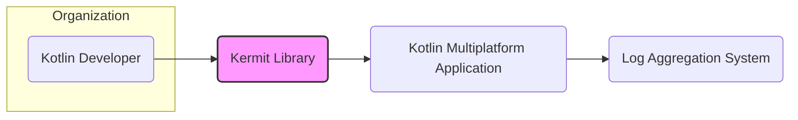
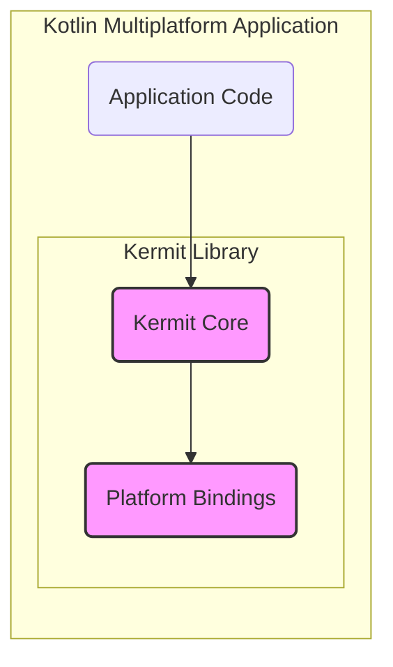
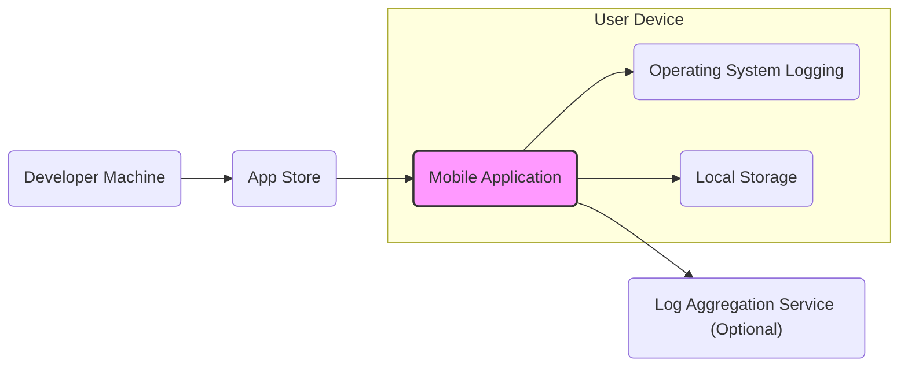
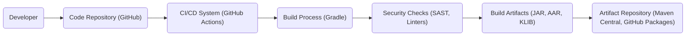

# BUSINESS POSTURE

- Business Priorities and Goals:
  - The primary business priority addressed by the Kermit library is to enhance the observability and debuggability of Kotlin Multiplatform applications.
  - The main goal is to provide a consistent and efficient logging solution across different platforms (Android, iOS, JVM, etc.) for Kotlin developers.
  - This contributes to faster development cycles, easier debugging, and improved application stability and maintainability.
  - By simplifying logging, Kermit aims to reduce development costs and improve the overall quality of Kotlin Multiplatform applications.

- Business Risks:
  - Unintentional logging of sensitive data: If developers are not careful, they might log personally identifiable information (PII), API keys, or other confidential data, leading to potential privacy violations or security breaches.
  - Performance overhead: Excessive or inefficient logging can negatively impact application performance, especially in production environments.
  - Dependency risk: Relying on a third-party library introduces a dependency risk. Although Kermit is open-source, vulnerabilities in the library or its dependencies could affect applications using it.
  - Misconfiguration: Incorrectly configured logging levels or destinations can lead to either insufficient logging for debugging or excessive logging that fills up storage or impacts performance.

# SECURITY POSTURE

- Existing Security Controls:
  - security control: Code review process on GitHub for contributions to the Kermit library. (Implemented on GitHub)
  - security control: Open-source nature of the library allows for community scrutiny and vulnerability reporting. (Described by project nature)
  - accepted risk: Dependency on third-party libraries and potential vulnerabilities within them. (Implicitly accepted by using open-source libraries)
  - accepted risk: Risk of developers misusing the library and logging sensitive information. (Implicitly accepted as developer responsibility)

- Recommended Security Controls:
  - security control: Implement automated static analysis security testing (SAST) in the Kermit library's CI/CD pipeline to identify potential code vulnerabilities.
  - security control: Provide clear documentation and best practices for developers on how to use Kermit securely, emphasizing the importance of avoiding logging sensitive data and configuring logging levels appropriately.
  - security control: Encourage and facilitate security vulnerability reporting through a clear process, such as a SECURITY.md file in the repository.

- Security Requirements:
  - Authentication: Not applicable for a logging library itself. Authentication is relevant for systems that consume or process logs generated by applications using Kermit (e.g., log aggregation systems).
  - Authorization: Not applicable for a logging library itself. Authorization is relevant for controlling access to logs generated by applications using Kermit.
  - Input Validation: While Kermit primarily handles string messages, input validation is relevant to prevent log injection vulnerabilities if log messages are processed by downstream systems in a way that could be exploited (e.g., if logs are directly interpreted as commands). Kermit should ensure that log messages are handled safely and do not introduce injection risks in typical logging scenarios.
  - Cryptography: Cryptography is not a core requirement for Kermit itself. However, if logs generated by Kermit need to be transmitted or stored securely, encryption should be considered at the application level or within the logging infrastructure.

# DESIGN

## C4 CONTEXT

- Context Diagram Elements:
  - - Name: Kotlin Developer
    - Type: Person
    - Description: Software developers who use the Kermit library in their Kotlin Multiplatform projects.
    - Responsibilities: Integrate Kermit into their applications, configure logging, and use logs for debugging and monitoring.
    - Security controls: Responsible for using Kermit securely and avoiding logging sensitive data.

  - - Name: Kermit Library
    - Type: Software System
    - Description: A Kotlin Multiplatform logging library that provides a consistent logging API across different platforms.
    - Responsibilities: Provide a simple and efficient logging API, allow for customization of log formatting and output, and support various logging destinations.
    - Security controls: Code review, open-source community scrutiny, potential future SAST in CI/CD.

  - - Name: Kotlin Multiplatform Application
    - Type: Software System
    - Description: Applications built using Kotlin Multiplatform that integrate the Kermit library for logging.
    - Responsibilities: Utilize Kermit for logging application events, errors, and information. Process and potentially forward logs to other systems.
    - Security controls: Application-specific security controls, including secure configuration of logging, access control to logs, and protection of sensitive data within logs.

  - - Name: Log Aggregation System
    - Type: Software System
    - Description: External systems like ELK stack, Splunk, or cloud-based logging services used to collect, store, and analyze logs generated by applications.
    - Responsibilities: Ingest, store, index, and provide search and analysis capabilities for logs.
    - Security controls: Authentication and authorization to access logs, encryption of logs in transit and at rest, audit logging of access and modifications.

## C4 CONTAINER

- Container Diagram Elements:
  - - Name: Kermit Core
    - Type: Library
    - Description: The core Kotlin code of the Kermit library, providing the main logging API and functionality.
    - Responsibilities: Define the logging API, handle log formatting, and dispatch logs to platform-specific bindings.
    - Security controls: Code review, open-source community scrutiny, potential future SAST in CI/CD.

  - - Name: Platform Bindings
    - Type: Library
    - Description: Platform-specific implementations of logging for different targets (Android, iOS, JVM, etc.). These bindings utilize native logging mechanisms of each platform.
    - Responsibilities: Interface with platform-specific logging APIs (e.g., Logcat on Android, os_log on iOS), handle platform-specific log formatting or output requirements.
    - Security controls: Code review, open-source community scrutiny, potential future SAST in CI/CD.

  - - Name: Application Code
    - Type: Code
    - Description: The Kotlin Multiplatform application code that utilizes the Kermit library for logging.
    - Responsibilities: Call Kermit logging APIs to record events, errors, and information within the application. Configure Kermit loggers and sinks as needed.
    - Security controls: Application-specific security controls, including secure coding practices to avoid logging sensitive data and proper configuration of logging levels.

## DEPLOYMENT

- Deployment Architecture Options:
  - Mobile Application Deployment (Android/iOS): Kermit is embedded within the mobile application package (APK/IPA) and deployed to user devices via app stores (Google Play Store, Apple App Store). Logs are typically stored locally on the device or sent to a remote logging service.
  - Backend Application Deployment (JVM): Kermit is included as a dependency in backend applications deployed to servers (cloud VMs, containers, on-premise servers). Logs are typically written to files, standard output, or sent to centralized logging systems.
  - Desktop Application Deployment (JVM): Similar to backend applications, Kermit can be used in desktop applications deployed to user computers. Logs can be stored locally or sent to remote systems.

- Detailed Deployment Architecture (Example: Mobile Application Deployment):

- Deployment Diagram Elements (Mobile Application Deployment):
  - - Name: Mobile Application
    - Type: Software
    - Description: The Kotlin Multiplatform mobile application that includes the Kermit library.
    - Responsibilities: Execute application logic, generate logs using Kermit, and potentially handle local log storage or forwarding to remote services.
    - Security controls: Application-level security controls, including data protection on the device, secure communication if logs are sent remotely, and adherence to app store security guidelines.

  - - Name: Operating System Logging
    - Type: System Service
    - Description: Platform-specific logging mechanisms provided by the mobile operating system (e.g., Logcat on Android, os_log on iOS). Kermit's platform bindings may utilize these services.
    - Responsibilities: Provide system-level logging capabilities, manage log storage and access control at the OS level.
    - Security controls: Operating system security controls, including access control to logs, and potential system-level auditing.

  - - Name: Local Storage
    - Type: Data Store
    - Description: Local storage on the user's mobile device where the application might store logs.
    - Responsibilities: Persistently store logs on the device.
    - Security controls: Device-level security controls, such as device encryption and application sandboxing, to protect locally stored logs.

  - - Name: App Store
    - Type: Distribution Platform
    - Description: Platforms like Google Play Store and Apple App Store used to distribute the mobile application to users.
    - Responsibilities: Host and distribute the application package, perform basic security checks on submitted applications.
    - Security controls: App store security review processes to detect malware and enforce application security guidelines.

  - - Name: Developer Machine
    - Type: Development Environment
    - Description: Developer's computer used to build and package the mobile application.
    - Responsibilities: Develop, build, test, and sign the application package before submitting it to app stores.
    - Security controls: Developer machine security practices, including secure coding, malware protection, and secure key management for application signing.

  - - Name: Log Aggregation Service (Optional)
    - Type: Cloud Service
    - Description: Optional remote logging service used to collect and analyze logs from mobile applications.
    - Responsibilities: Receive, store, and provide analysis capabilities for logs sent from mobile applications.
    - Security controls: Cloud service provider security controls, including data encryption in transit and at rest, access control, and compliance certifications.

## BUILD

- Build Process Elements:
  - - Name: Developer
    - Type: Person
    - Description: Software developer who writes and commits code to the code repository.
    - Responsibilities: Write code, perform local testing, and commit changes to the repository.
    - Security controls: Secure coding practices, code review, and access control to the code repository.

  - - Name: Code Repository (GitHub)
    - Type: Version Control System
    - Description: GitHub repository hosting the Kermit library source code.
    - Responsibilities: Store and manage source code, track changes, and facilitate collaboration.
    - Security controls: Access control, branch protection, audit logging, and vulnerability scanning provided by GitHub.

  - - Name: CI/CD System (GitHub Actions)
    - Type: Automation System
    - Description: GitHub Actions workflows used for automated building, testing, and publishing of the Kermit library.
    - Responsibilities: Automate the build process, run tests, perform security checks, and publish build artifacts.
    - Security controls: Secure configuration of CI/CD pipelines, access control to workflows and secrets, and audit logging.

  - - Name: Build Process (Gradle)
    - Type: Build Tool
    - Description: Gradle build system used to compile, package, and test the Kermit library.
    - Responsibilities: Compile Kotlin code, manage dependencies, run tests, and create build artifacts.
    - Security controls: Dependency management, build script security, and integration with security scanning tools.

  - - Name: Security Checks (SAST, Linters)
    - Type: Security Tooling
    - Description: Static analysis security testing (SAST) tools and linters integrated into the build process to identify potential code vulnerabilities and code quality issues.
    - Responsibilities: Automatically scan code for security vulnerabilities and coding standard violations during the build process.
    - Security controls: Configuration and maintenance of SAST tools and linters, and processes for addressing identified issues.

  - - Name: Build Artifacts (JAR, AAR, KLIB)
    - Type: Software Packages
    - Description: Compiled and packaged versions of the Kermit library for different platforms (JAR for JVM, AAR for Android, KLIB for Kotlin/Native).
    - Responsibilities: Provide distributable packages of the Kermit library for developers to use in their projects.
    - Security controls: Signing of artifacts (if applicable), and secure storage of artifacts before publishing.

  - - Name: Artifact Repository (Maven Central, GitHub Packages)
    - Type: Package Registry
    - Description: Repositories like Maven Central and GitHub Packages used to publish and distribute Kermit library artifacts.
    - Responsibilities: Host and distribute Kermit library artifacts, manage versions, and provide access to developers.
    - Security controls: Access control, secure storage of artifacts, and vulnerability scanning of hosted packages (Maven Central).

# RISK ASSESSMENT

- Critical Business Processes:
  - For the Kermit library itself, there are no direct critical business processes. Its value is in enabling logging for applications.
  - For applications using Kermit, critical business processes depend on the application's purpose. Logging is crucial for:
    - Incident response and troubleshooting: Quickly identifying and resolving issues in production.
    - Performance monitoring and optimization: Understanding application performance and identifying bottlenecks.
    - Security auditing and compliance: Recording security-related events and meeting regulatory requirements.
    - Debugging and development: Facilitating efficient development and bug fixing.

- Data to Protect and Sensitivity:
  - The primary data to protect is the log data generated by applications using Kermit.
  - Sensitivity of log data depends entirely on what is logged by the application. Logs can contain:
    - Non-sensitive operational data: Application events, performance metrics, debug information. Low sensitivity.
    - Potentially sensitive data: User IDs, IP addresses, timestamps. Medium sensitivity.
    - Highly sensitive data: Personally identifiable information (PII), API keys, passwords, financial data. High sensitivity.
  - It is crucial to avoid logging highly sensitive data and to implement appropriate security controls for logs based on their sensitivity.

# QUESTIONS & ASSUMPTIONS

- Questions:
  - What are the intended use cases for Kermit in terms of application types and industries? Understanding the typical applications using Kermit would help tailor security recommendations.
  - Are there any specific compliance requirements (e.g., GDPR, HIPAA, PCI DSS) that applications using Kermit might need to adhere to? This would influence the security requirements for logging.
  - What is the process for reporting and addressing security vulnerabilities in the Kermit library? A clear vulnerability management process is essential for open-source projects.

- Assumptions:
  - Kermit is primarily used by Kotlin developers to enhance the observability and debuggability of their applications.
  - Developers using Kermit are responsible for configuring logging levels and destinations appropriately and for avoiding logging sensitive data.
  - Security of the applications using Kermit is the responsibility of the application developers and operators, not directly the Kermit library itself.
  - The Kermit project aims to follow secure development practices for the library itself, but the primary focus is on providing a functional and efficient logging solution.