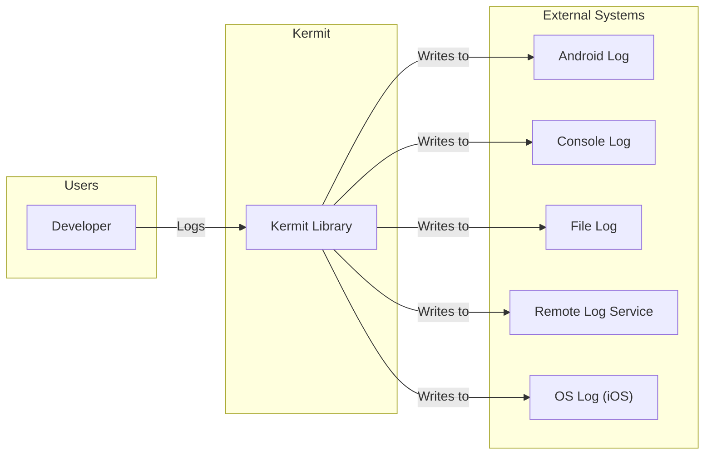
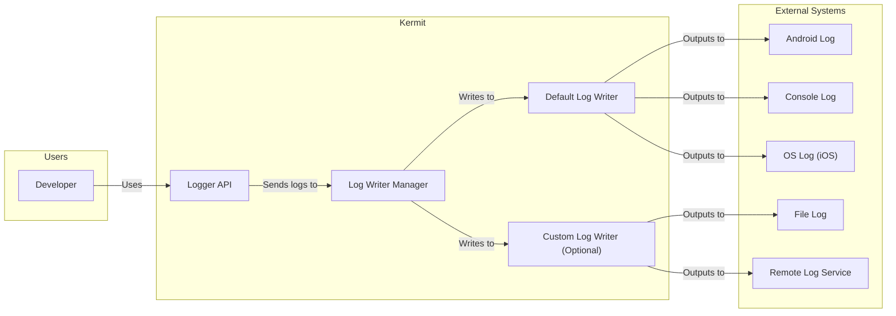
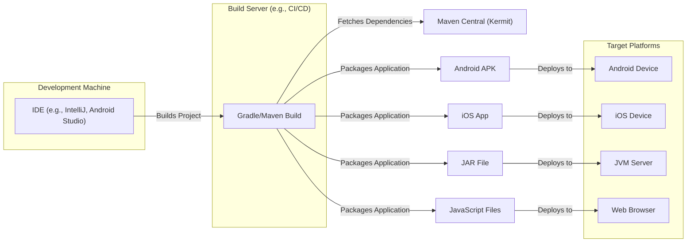
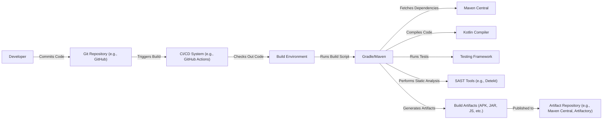

# Project Design Document: Kermit

## BUSINESS POSTURE

Kermit is a Kotlin Multiplatform logging library. It aims to simplify and standardize logging across different platforms (JVM, Android, iOS, JavaScript, Native) by providing a common API.

Priorities:

*   Provide a consistent logging experience across all Kotlin Multiplatform targets.
*   Offer flexibility in configuration and output (different log levels, custom writers).
*   Maintain a small footprint and good performance.
*   Ease of use and integration with existing projects.
*   Support structured logging.

Goals:

*   Become the go-to logging solution for Kotlin Multiplatform projects.
*   Reduce the boilerplate code needed for logging in multiplatform scenarios.
*   Enable developers to easily debug and monitor their applications across all platforms.

Business Risks:

*   Inconsistent logging behavior across platforms could lead to difficulties in debugging and monitoring.
*   Poor performance could impact application responsiveness, especially on resource-constrained platforms like mobile.
*   Lack of features or flexibility could limit adoption by developers with specific logging needs.
*   Security vulnerabilities in the library could expose sensitive information or allow attackers to manipulate log data.
*   Lack of proper structured logging can make log analysis and monitoring difficult.

## SECURITY POSTURE

Existing Security Controls:

*   security control: The library itself doesn't directly handle sensitive data. Its primary function is to format and output log messages.
*   security control: The library allows configuring log levels, which can be used to control the verbosity of logging and avoid accidentally logging sensitive information in production. (Described in Kermit documentation)
*   security control: The library supports custom log writers, allowing developers to implement secure logging practices, such as encrypting log data or sending it to a secure logging service. (Described in Kermit documentation)

Accepted Risks:

*   accepted risk: Developers are responsible for ensuring that sensitive information is not logged directly. Kermit does not automatically redact or sanitize log messages.
*   accepted risk: The security of the log output depends on the chosen log writer and its configuration. If a vulnerable or misconfigured log writer is used, log data could be compromised.
*   accepted risk: The library does not provide built-in mechanisms for log integrity verification or tamper detection.

Recommended Security Controls:

*   security control: Integrate with a secure logging service or framework that provides features like encryption, access control, and audit trails.
*   security control: Implement a custom log writer that sanitizes or redacts sensitive information before it is logged.
*   security control: Provide guidance and examples in the documentation on how to securely configure and use Kermit, including best practices for handling sensitive data.
*   security control: Regularly review and update the library's dependencies to address any known security vulnerabilities.
*   security control: Implement a mechanism to verify the integrity of log messages, such as using digital signatures or checksums.

Security Requirements:

*   Authentication: Not directly applicable to the logging library itself. Authentication should be handled by the application or the logging service.
*   Authorization: Not directly applicable to the logging library itself. Authorization should be handled by the application or the logging service.
*   Input Validation: The library should validate its own configuration parameters to prevent unexpected behavior or vulnerabilities. Log messages themselves are considered input from the application, and the library should handle them gracefully without crashing or introducing security risks.
*   Cryptography: If log data needs to be encrypted, this should be handled by a custom log writer or a secure logging service. The library itself should not implement its own encryption mechanisms unless specifically designed for that purpose.

## DESIGN

### C4 CONTEXT

Element Descriptions:

*   Element:
    *   Name: Developer
    *   Type: Person
    *   Description: A developer using the Kermit library in their Kotlin Multiplatform project.
    *   Responsibilities: Writes log statements in their code using the Kermit API.
    *   Security controls: None directly within Kermit. Developers are responsible for not logging sensitive data.

*   Element:
    *   Name: Kermit Library
    *   Type: Software System
    *   Description: The core Kermit library that provides the logging API and manages log writers.
    *   Responsibilities: Provides a common logging interface, manages log levels, and dispatches log messages to configured writers.
    *   Security controls: Log level filtering.

*   Element:
    *   Name: Android Log
    *   Type: External System
    *   Description: The Android system's logging facility (Logcat).
    *   Responsibilities: Receives and displays log messages on Android devices.
    *   Security controls: Android system security controls.

*   Element:
    *   Name: Console Log
    *   Type: External System
    *   Description: Standard output (console) for logging.
    *   Responsibilities: Displays log messages in the console.
    *   Security controls: Operating system console security.

*   Element:
    *   Name: File Log
    *   Type: External System
    *   Description: Writing logs to a file.
    *   Responsibilities: Stores log messages in a file on the file system.
    *   Security controls: File system permissions.

*   Element:
    *   Name: Remote Log Service
    *   Type: External System
    *   Description: A remote service for collecting and analyzing logs (e.g., Datadog, Loggly, Sentry).
    *   Responsibilities: Receives, stores, and analyzes log data.
    *   Security controls: Security controls of the specific remote logging service.

*   Element:
    *   Name: OS Log
    *   Type: External System
    *   Description: The iOS system's logging facility (unified logging).
    *   Responsibilities: Receives and displays log messages on iOS devices.
    *   Security controls: iOS system security controls.

### C4 CONTAINER

Element Descriptions:

*   Element:
    *   Name: Logger API
    *   Type: Container
    *   Description: The public API that developers use to create loggers and write log messages.
    *   Responsibilities: Provides methods for logging at different levels (debug, info, warn, error, etc.).
    *   Security controls: None. Relies on Log Writer Manager and Log Writers for security.

*   Element:
    *   Name: Log Writer Manager
    *   Type: Container
    *   Description: Manages the configured log writers and dispatches log messages to them.
    *   Responsibilities: Handles log level filtering and routing of log messages to the appropriate writers.
    *   Security controls: Log level filtering.

*   Element:
    *   Name: Default Log Writer
    *   Type: Container
    *   Description: The default log writer implementation that outputs to platform-specific logging facilities (e.g., Logcat on Android, console on JVM).
    *   Responsibilities: Formats log messages and sends them to the appropriate platform-specific output.
    *   Security controls: Relies on the security of the underlying platform logging facilities.

*   Element:
    *   Name: Custom Log Writer (Optional)
    *   Type: Container
    *   Description: A user-defined log writer that can output to custom destinations (e.g., files, remote services).
    *   Responsibilities: Formats log messages and sends them to a custom destination.
    *   Security controls: Implemented by the developer creating the custom log writer.

### DEPLOYMENT

Possible Deployment Solutions:

1.  **Gradle/Maven Dependency:** Kermit is typically included as a library dependency in a Kotlin Multiplatform project using a build system like Gradle or Maven.
2.  **Manual Integration:** While less common, it's possible to manually integrate the library files into a project.

Chosen Solution (Gradle/Maven Dependency):

Element Descriptions:

*   Element:
    *   Name: IDE (e.g., IntelliJ, Android Studio)
    *   Type: Node
    *   Description: The integrated development environment used by the developer.
    *   Responsibilities: Provides tools for writing, building, and debugging code.
    *   Security controls: IDE security features.

*   Element:
    *   Name: Gradle/Maven Build
    *   Type: Node
    *   Description: The build system used to manage dependencies, compile code, and package the application.
    *   Responsibilities: Fetches dependencies, compiles code, runs tests, and creates deployable artifacts.
    *   Security controls: Build system security features, dependency verification.

*   Element:
    *   Name: Maven Central (Kermit)
    *   Type: Node
    *   Description: The Maven Central repository where the Kermit library is hosted.
    *   Responsibilities: Provides the Kermit library artifacts for download.
    *   Security controls: Maven Central security measures.

*   Element:
    *   Name: Android Device
    *   Type: Node
    *   Description: An Android device where the application is deployed.
    *   Responsibilities: Runs the Android application.
    *   Security controls: Android operating system security.

*   Element:
    *   Name: iOS Device
    *   Type: Node
    *   Description: An iOS device where the application is deployed.
    *   Responsibilities: Runs the iOS application.
    *   Security controls: iOS operating system security.

*   Element:
    *   Name: JVM Server
    *   Type: Node
    *   Description: A server running the Java Virtual Machine where the application is deployed.
    *   Responsibilities: Runs the JVM application.
    *   Security controls: JVM security, server security.

*   Element:
    *   Name: Web Browser
    *   Type: Node
    *   Description: A web browser where the JavaScript application is deployed.
    *   Responsibilities: Runs the JavaScript application.
    *   Security controls: Browser security features.

*   Element:
    *   Name: Android APK
    *   Type: Node
    *   Description: Android application package.
    *   Responsibilities: Contains compiled code and resources for Android application.
    *   Security controls: Android application signing.

*   Element:
    *   Name: iOS App
    *   Type: Node
    *   Description: iOS application package.
    *   Responsibilities: Contains compiled code and resources for iOS application.
    *   Security controls: iOS application signing.

*   Element:
    *   Name: JAR File
    *   Type: Node
    *   Description: Java archive file.
    *   Responsibilities: Contains compiled code and resources for JVM application.
    *   Security controls: JAR signing (optional).

*   Element:
    *   Name: JavaScript Files
    *   Type: Node
    *   Description: JavaScript files.
    *   Responsibilities: Contains compiled code and resources for Web application.
    *   Security controls: Content Security Policy (CSP), Subresource Integrity (SRI).

### BUILD

Build Process Description:

1.  **Code Commit:** A developer commits code changes to a Git repository (e.g., GitHub, GitLab).
2.  **Build Trigger:** The commit triggers a build process in a CI/CD system (e.g., GitHub Actions, Jenkins, CircleCI).
3.  **Code Checkout:** The CI/CD system checks out the code from the repository into a build environment.
4.  **Build Script Execution:** A build script (e.g., Gradle build.gradle.kts) is executed.
5.  **Dependency Resolution:** The build system fetches project dependencies from a repository like Maven Central.
6.  **Compilation:** The Kotlin compiler compiles the code.
7.  **Testing:** Unit and integration tests are executed using a testing framework.
8.  **Static Analysis:** Static analysis tools (SAST) like Detekt are run to identify potential code quality and security issues.
9.  **Artifact Generation:** Build artifacts (e.g., APK for Android, JAR for JVM, JavaScript files for web) are generated.
10. **Artifact Publication:** The build artifacts are published to an artifact repository (e.g., Maven Central, a private Artifactory instance).

Security Controls in Build Process:

*   security control: Dependency verification (e.g., checksum verification, signature verification) to ensure that downloaded dependencies have not been tampered with.
*   security control: Static analysis (SAST) to identify potential security vulnerabilities in the code.
*   security control: Secure build environment (e.g., isolated containers, limited access) to prevent unauthorized access or modification of the build process.
*   security control: Code signing of build artifacts (e.g., APK signing, JAR signing) to ensure their authenticity and integrity.
*   security control: Software Composition Analysis (SCA) tools to identify known vulnerabilities in third-party libraries.

## RISK ASSESSMENT

Critical Business Processes:

*   Reliable and consistent logging across all supported platforms.
*   Ability to debug and troubleshoot application issues effectively.
*   Monitoring application behavior and performance.

Data Protection:

*   Data Sensitivity: Kermit itself does not handle sensitive data directly. However, it's crucial to prevent developers from accidentally logging sensitive information such as:
    *   Personally Identifiable Information (PII)
    *   Authentication tokens
    *   API keys
    *   Financial data
    *   Internal system details
*   Data to Protect: The primary data to protect is the log data itself. While Kermit doesn't inherently contain sensitive data, the *content* of the logs written by the *application* using Kermit is the responsibility of the application developers.  The focus is on preventing *unintentional* exposure of sensitive data through logging.

## QUESTIONS & ASSUMPTIONS

Questions:

*   Are there any specific compliance requirements (e.g., GDPR, HIPAA) that need to be considered for logging?
*   What are the expected log volumes and retention policies?
*   Are there any existing logging infrastructure or services that Kermit should integrate with?
*   What level of support will be provided for custom log writers?
*   Will there be any specific requirements for log aggregation or analysis?

Assumptions:

*   BUSINESS POSTURE: The primary goal is to provide a convenient and consistent logging solution for Kotlin Multiplatform developers.
*   BUSINESS POSTURE: Adoption and ease of use are prioritized over highly specialized security features within the library itself.
*   SECURITY POSTURE: Developers are responsible for the content of their log messages and for not logging sensitive data directly.
*   SECURITY POSTURE: Security of log storage and transport is primarily the responsibility of the chosen log writer and/or external logging services.
*   DESIGN: The library will be distributed primarily through Maven Central and integrated using Gradle or Maven.
*   DESIGN: The build process will utilize a CI/CD system and include static analysis.
*   DESIGN: The library will provide a flexible API that allows for custom log writers to be implemented.