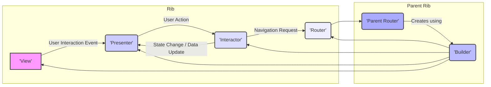

# Project Design Document: Uber Ribs Framework

**Version:** 1.1
**Date:** October 26, 2023
**Author:** AI Software Architect

## 1. Introduction

This document provides a detailed design overview of the Uber Ribs (Router, Interactor, Builder, and Presenter) framework, as found in the linked GitHub repository: [https://github.com/uber/ribs](https://github.com/uber/ribs). This document aims to clearly articulate the architecture, components, and interactions within the Ribs framework to facilitate effective threat modeling. It outlines the key elements and their relationships, providing a foundation for identifying potential security vulnerabilities. This framework promotes building modular, testable, and maintainable mobile applications, primarily on Android.

## 2. Goals

*   Provide a comprehensive description of the Ribs framework's architecture and components.
*   Clearly define the responsibilities and interactions of each core component with illustrative examples.
*   Illustrate the typical flow of control and data within a Ribs-based application using a concrete scenario.
*   Serve as a foundational document for subsequent threat modeling exercises, highlighting potential attack surfaces.

## 3. Overview of the Ribs Framework

Ribs is an architectural pattern for building mobile (primarily Android) applications. It promotes modularity, testability, and maintainability by dividing the application's logic and presentation into distinct, well-defined components. This separation of concerns simplifies development, testing, and collaboration. The core components of Ribs are:

*   **Router:** Responsible for managing the navigation and lifecycle of child Ribs. It orchestrates the attachment and detachment of other Ribs, effectively defining the application's screen flow and component hierarchy. Think of it as the conductor of the application's UI flow.
*   **Interactor:** Contains the business logic and state management for a specific feature or screen. It reacts to user input from the Presenter and updates the application's state. It also communicates with external data sources or services. This is where the core application logic resides.
*   **Builder:** A factory class responsible for creating and assembling the components of a Rib. This promotes loose coupling and simplifies the creation process, ensuring each Rib is instantiated correctly with its dependencies.
*   **Presenter:** Handles the presentation logic and UI updates. It receives data from the Interactor and formats it for display in the View. It also forwards user interactions from the View to the Interactor. It acts as a bridge between the business logic and the UI.
*   **View:** (While not strictly part of the "RIB" acronym, it's an integral part of the framework) The UI layer, typically an Activity, Fragment, or custom View in Android. It displays information provided by the Presenter and notifies the Presenter of user interactions. This is the user's point of interaction with the application.

## 4. Detailed Design

### 4.1. Component Descriptions

*   **Router:**
    *   **Responsibilities:**
        *   Managing the lifecycle of child Ribs:  Ensuring child Ribs are created, attached, and detached at the appropriate times.
        *   Attaching and detaching child Ribs based on application state or user actions: For example, when a user navigates to a new screen, the Router attaches the corresponding Rib.
        *   Orchestrating transitions between different parts of the application: Handling animations or other visual cues during navigation.
        *   Holding references to child Routers: Maintaining the hierarchy of Ribs.
    *   **Key Interactions:**
        *   Instantiated by the Builder.
        *   Interacts with child Builders to create child Rib instances:  Uses the child's Builder to instantiate the child Rib's components.
        *   Communicates with child Routers to manage their lifecycles:  Telling child Routers when to attach or detach their own children.
        *   May receive instructions from the Interactor to navigate: The Interactor might signal a need to move to a different part of the app.

*   **Interactor:**
    *   **Responsibilities:**
        *   Containing the core business logic for the associated feature:  Implementing the specific functionality of the screen or feature. For example, handling the logic for submitting a form or fetching data.
        *   Managing the state of the feature: Holding the data relevant to the current screen or feature.
        *   Handling user input received from the Presenter: Processing actions like button clicks or text changes.
        *   Interacting with data sources (e.g., repositories, network services): Fetching data from a database or an API.
        *   Notifying the Presenter of state changes: Informing the Presenter when data has been updated so the UI can be refreshed.
    *   **Key Interactions:**
        *   Instantiated by the Builder.
        *   Receives user actions from the Presenter:  Gets notified when the user interacts with the UI.
        *   Sends data to the Presenter for display: Provides the necessary data for the UI to render.
        *   May instruct the Router to navigate:  Determines when a navigation event should occur.
        *   Interacts with external services or data layers: Communicates with databases, APIs, or other data sources.

*   **Builder:**
    *   **Responsibilities:**
        *   Creating and assembling the components of a Rib (Router, Interactor, Presenter, and potentially View):  The central point for creating instances of the Rib's components.
        *   Providing dependencies to the created components: Injecting necessary dependencies into the Router, Interactor, and Presenter.
        *   Encapsulating the creation logic for a Rib: Hiding the complexity of object creation and dependency wiring.
    *   **Key Interactions:**
        *   Used by a parent Router to create child Ribs:  The mechanism for creating nested Rib structures.
        *   Instantiates the Router, Interactor, and Presenter.
        *   May inject dependencies into the created components:  Using dependency injection frameworks or manual injection.

*   **Presenter:**
    *   **Responsibilities:**
        *   Formatting data received from the Interactor for display in the View:  Transforming data into a format suitable for UI rendering (e.g., converting dates, formatting numbers).
        *   Handling UI-specific logic:  Logic related to how data is presented, but not the core business logic.
        *   Receiving user interactions from the View:  Listening for UI events.
        *   Forwarding user actions to the Interactor:  Relaying user input to the business logic layer.
        *   Updating the View based on data from the Interactor:  Instructing the View to display updated information.
    *   **Key Interactions:**
        *   Instantiated by the Builder.
        *   Receives data from the Interactor.
        *   Sends formatted data to the View.
        *   Receives user interactions from the View.
        *   Sends user actions to the Interactor.

*   **View:**
    *   **Responsibilities:**
        *   Displaying information to the user: Rendering the UI elements and data.
        *   Handling user input events (e.g., button clicks, text input):  Detecting user interactions.
        *   Notifying the Presenter of user interactions:  Informing the Presenter about user actions.
    *   **Key Interactions:**
        *   Receives data from the Presenter to update the UI.
        *   Sends user interaction events to the Presenter.

### 4.2. Component Relationships

The following list describes the typical relationships between the core Ribs components:

*   A **Router** owns and manages zero or more child **Routers**, forming a hierarchical structure.
*   A **Router** owns exactly one **Interactor**, which manages the business logic for that part of the UI.
*   An **Interactor** owns exactly one **Presenter**, responsible for the presentation logic.
*   A **Presenter** interacts with exactly one **View**, which displays the UI.
*   **Builders** are used by **Routers** to instantiate and assemble new Rib instances, acting as factories.

### 4.3. Flow of Control

Let's consider a scenario where a user clicks a "Submit" button in a form:

1. The user clicks the "Submit" button in the **View**.
2. The **View** detects the click event and notifies the **Presenter**.
3. The **Presenter** receives the click event and, based on the UI logic, prepares an action (e.g., a data object representing the form submission). It then forwards this action to the **Interactor**.
4. The **Interactor** receives the submission action. It contains the business logic to handle form submissions, such as validating the data, and potentially interacting with a backend service to save the data.
5. The **Interactor** might update its internal state (e.g., set a "loading" flag) and then initiate a network request.
6. Once the backend operation completes (either successfully or with an error), the **Interactor** updates its state accordingly.
7. The **Interactor** then notifies the **Presenter** of the state change (e.g., "submission successful" or "submission failed").
8. The **Presenter** receives the notification and formats the appropriate feedback message for the user.
9. The **Presenter** instructs the **View** to display the feedback message (e.g., a success message or an error message).
10. If the submission was successful, the **Interactor** might also instruct the **Router** to navigate to a different screen (e.g., a confirmation screen).
11. The **Router** then manages the transition to the new screen by attaching the corresponding Rib.

### 4.4. Data Flow

The flow of data within a Ribs application typically follows this pattern:

*   **View** -> **Presenter**:  Raw user interaction events (e.g., `onClick`, `onTextChanged`).
*   **Presenter** -> **Interactor**: Processed user actions, often as data objects representing the user's intent (e.g., a `SubmitFormAction` object containing form data).
*   **Interactor** -> External Data Sources/Services: Data requests, including parameters and authentication details.
*   External Data Sources/Services -> **Interactor**: Data responses, which can be data objects, success/failure indicators, or error messages.
*   **Interactor** -> **Presenter**: Application state updates (e.g., a `UserState` object), data to display (e.g., a list of items), or error information.
*   **Presenter** -> **View**: Formatted data for display, often as ViewModels or simple data structures that the View can easily render.

## 5. Architectural Diagram

## 6. Key Security Considerations (for Threat Modeling)

The following points highlight areas that should be carefully considered during threat modeling of a Ribs-based application, focusing on potential attack vectors:

*   **Input Validation:**
    *   **Threat:** Malicious or malformed input could lead to unexpected behavior or vulnerabilities.
    *   **Consideration:**  The **Interactor** is the primary point for input validation. Ensure all data received from the **Presenter** is rigorously validated against expected formats, types, and ranges. Specifically, consider injection attacks (SQL, command injection if interacting with external systems), cross-site scripting (if displaying user-generated content), and denial-of-service attacks through excessive or malformed input.
    *   **Example:**  If a user enters a string in a number field, the Interactor should reject it.
*   **State Management:**
    *   **Threat:** Compromised or leaked state could expose sensitive information or allow unauthorized actions.
    *   **Consideration:**  How is sensitive data stored within the **Interactor**'s state?  Avoid storing sensitive data in memory for extended periods. If persistence is required, use secure storage mechanisms. Consider the risk of state manipulation if the Interactor's state is not properly encapsulated.
    *   **Example:**  Storing user credentials or API keys directly in the Interactor's state is a security risk.
*   **Data Handling:**
    *   **Threat:** Insecure data transfer or storage could lead to data breaches.
    *   **Consideration:**  When the **Interactor** communicates with external sources, ensure secure protocols like HTTPS are used. Validate the integrity of data received from external sources. When the **Presenter** prepares data for the **View**, ensure proper sanitization to prevent cross-site scripting (XSS) vulnerabilities if the data is displayed in a web view or similar component.
    *   **Example:**  Fetching data over HTTP instead of HTTPS exposes it to eavesdropping.
*   **Navigation and Access Control:**
    *   **Threat:** Unauthorized access to sensitive parts of the application.
    *   **Consideration:**  The **Router** controls navigation. Ensure that navigation logic enforces proper authorization. Can a user bypass the intended flow to access restricted features? Are there any vulnerabilities in how child Ribs are attached or detached that could be exploited?
    *   **Example:**  A user should not be able to navigate directly to an admin screen without proper authentication.
*   **Dependency Management:**
    *   **Threat:** Vulnerabilities in third-party libraries could be exploited.
    *   **Consideration:**  Regularly review and update dependencies used by the Ribs framework and the application. Use tools to identify known vulnerabilities in dependencies.
    *   **Example:**  Using an outdated networking library with known security flaws.
*   **Inter-Component Communication:**
    *   **Threat:**  Malicious code could intercept or tamper with communication between Ribs components.
    *   **Consideration:** While Ribs promotes modularity, consider the security implications of how components interact. Are there any implicit trust assumptions between components that could be exploited?  While direct injection is common, ensure proper scoping and access control.
    *   **Example:**  A compromised Presenter could send malicious actions to the Interactor.
*   **View Layer Security:**
    *   **Threat:**  UI vulnerabilities could be exploited to compromise the application.
    *   **Consideration:**  Be mindful of potential vulnerabilities in the **View** layer, such as insecure data binding that could lead to information disclosure or UI manipulation. If using web views, ensure they are configured securely to prevent attacks like JavaScript injection.
    *   **Example:**  Displaying sensitive data directly in the View without proper encoding could lead to information leakage.
*   **Builder Security:**
    *   **Threat:**  Improperly configured Builders could lead to insecure component instantiation.
    *   **Consideration:**  Ensure that **Builders** correctly inject dependencies and do not inadvertently create components with insecure configurations or missing security features.
    *   **Example:**  A Builder might instantiate a network client without proper SSL/TLS configuration.

## 7. Conclusion

This enhanced design document provides a more detailed and illustrative overview of the Uber Ribs framework, focusing on aspects relevant to security considerations and threat modeling. By understanding the responsibilities and interactions of each component, along with potential attack vectors, development and security teams can proactively identify and mitigate security risks in Ribs-based applications. This document serves as a valuable resource for building more secure and resilient mobile applications.