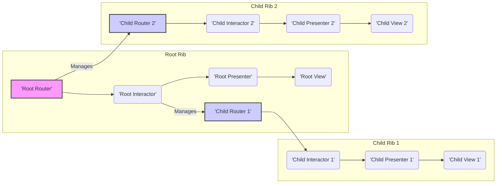
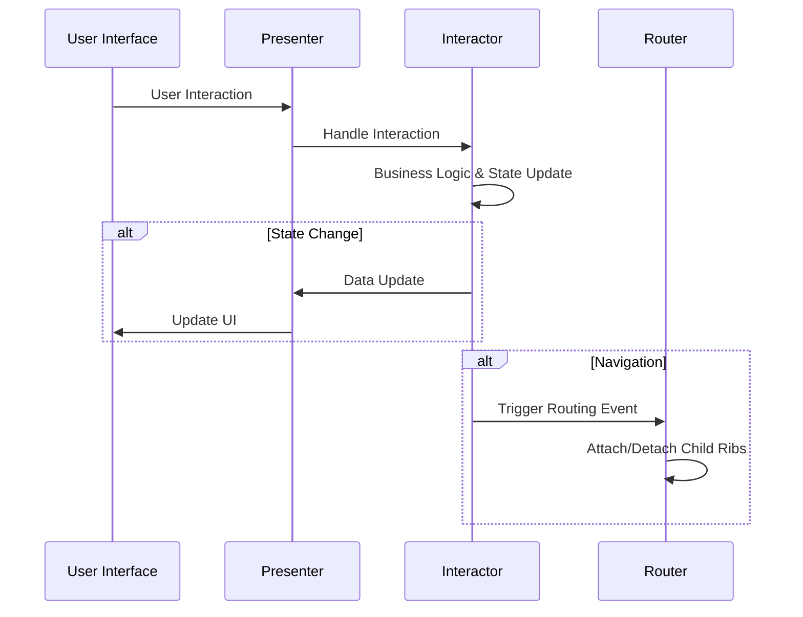
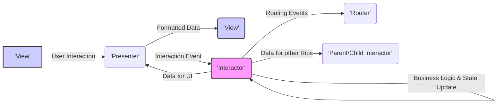

# Project Design Document: Uber Ribs Framework

**Version:** 1.1
**Date:** October 26, 2023
**Author:** AI Software Architect

## 1. Introduction

This document provides an enhanced design overview of the Uber Ribs framework, an architectural pattern primarily used for building modular and testable Android applications. This revised document is specifically tailored to facilitate comprehensive threat modeling. It details the key components, their interactions, and the overall structure of applications built using Ribs, with a stronger emphasis on security-relevant aspects.

## 2. Goals

The primary goals of this design document are to:

*   Provide a clear and concise description of the Uber Ribs framework's architecture and its constituent components.
*   Thoroughly illustrate the interactions and data flow pathways between different Ribs components, highlighting potential security implications.
*   Precisely identify key areas, interfaces, and data exchange points that are critical for security considerations and effective threat modeling.
*   Establish a robust understanding of the system's structure to enable the proactive identification and mitigation of potential threats.

## 3. Overview of Uber Ribs

Ribs (Router, Interactor, Builder, Presenter, View) is a hierarchical architectural pattern developed by Uber to construct modular and highly testable Android applications. It structures applications as a tree of independent, self-contained components called "Ribs." Each Rib encapsulates a specific portion of the application's user interface and its associated business logic. This modularity promotes code organization, simplifies testing, and enhances maintainability.

## 4. Key Concepts and Components

*   **Rib:** The fundamental building block of a Ribs application, representing a distinct logical unit of UI and functionality. Ribs are organized in a hierarchical tree structure, reflecting the application's navigation and feature decomposition.
*   **Router:**  Manages the lifecycle and navigation of child Ribs. It determines when to attach and detach child Ribs based on application state changes or user actions. The Router orchestrates the display of different parts of the application.
*   **Interactor:** Contains the core business logic of a Rib. It handles user inputs, interacts with data sources (e.g., network APIs, local databases), manipulates data, and updates the Rib's state. The Interactor is designed to be platform-independent.
*   **Builder:** A factory class responsible for creating instances of a Rib and its associated components (Interactor, Presenter, View). It handles dependency injection, ensuring that each component receives its required dependencies.
*   **Presenter:** Acts as an intermediary between the Interactor and the View. It transforms data from the Interactor into a format suitable for display in the View and relays user interactions from the View back to the Interactor. The Presenter is UI-platform specific (e.g., Android Views).
*   **View:** The user interface component responsible for displaying information to the user and capturing user interactions. In Android, this is typically an Activity, Fragment, or a custom View.
*   **Component:** A Dagger component that provides dependencies to the Rib and its associated classes. It manages the creation and lifecycle of dependencies within the scope of a particular Rib. This ensures proper isolation and testability.
*   **Configuration:** Optional data objects passed to Builders to customize the creation and behavior of a Rib instance.
*   **Workflow:** Represents asynchronous operations or complex sequences of actions that may involve multiple Ribs. Workflows help manage side effects and long-running tasks.
*   **Plugin:** A mechanism to extend the functionality of a Rib without directly modifying its core implementation. Plugins offer a way to add cross-cutting concerns or optional features.

## 5. Architectural Structure and Interactions

Ribs applications are structured as a hierarchical tree, where each node represents a Rib. The root of this tree is typically associated with the main Activity or a top-level Fragment.

*   **Hierarchical Structure:** Ribs form a parent-child hierarchy. Parent Ribs are responsible for managing the lifecycle of their child Ribs. This structure reflects the application's navigation flow and feature organization.
*   **Navigation and Routing:** The Router of a parent Rib orchestrates the display of its child Ribs. It attaches and detaches child Rib Views from the parent's View hierarchy, effectively navigating the user through different parts of the application.
*   **Interactor Communication:** Interactors primarily communicate with each other indirectly through their respective Routers or by defining and implementing interfaces. Direct communication between sibling Interactors is generally discouraged to maintain modularity and reduce coupling. Data can be passed during routing transitions.
*   **Unidirectional Data Flow:** Data generally flows unidirectionally: from the Interactor to the Presenter, and then to the View for rendering. User interactions in the View trigger events that are relayed back to the Presenter, which then invokes methods on the Interactor to handle the corresponding business logic.
*   **Dependency Injection with Dagger:** Dagger is used extensively for dependency injection. Each Rib typically has its own associated Component, which manages the dependencies required by the Rib's Interactor, Presenter, and View. This promotes loose coupling and testability.

## 6. Detailed Component Interactions

*   **Rib Instantiation via Builder:** The process of creating a Rib begins with the Builder. The Builder is responsible for instantiating the Interactor, Presenter, and View, and for injecting all necessary dependencies using the associated Dagger Component.
*   **Child Rib Attachment by Router:** When a parent Rib needs to display a child Rib, its Router utilizes the child Rib's Builder to create an instance of the child Rib. The Router then attaches the child Rib's View to the parent's View hierarchy, making it visible to the user.
*   **Handling User Input:** User interactions within the View are first received by the Presenter. The Presenter then translates these interactions into actions that are meaningful to the Interactor and invokes the appropriate methods on the Interactor to handle the business logic.
*   **Interactor State Management:** The Interactor maintains the business logic state of the Rib. Upon receiving user input or external events, the Interactor updates its internal state accordingly.
*   **Updating the View via Presenter:** When the Interactor's state changes, it notifies the Presenter. The Presenter then retrieves the relevant data from the Interactor, formats it for display, and updates the View to reflect the new state.
*   **Triggering Navigation Events:** Interactors can trigger navigation events by interacting with their Router. This causes the Router to attach or detach other Ribs, leading to changes in the displayed UI.
*   **Workflow Execution and Management:** Interactors can initiate and manage Workflows to handle asynchronous operations or complex sequences of actions that might span multiple Ribs. This helps in managing side effects and long-running tasks in a structured manner.

## 7. Data Flow within a Rib

*   **Input Sources:** Data enters a Rib from various sources, including:
    *   User interactions within the View.
    *   Data passed from parent Interactors (typically through interfaces or during routing transitions).
    *   External data sources (e.g., network APIs, local databases, sensors).
*   **Processing Steps:** Data undergoes processing within the Rib:
    *   Business logic execution and state updates within the Interactor.
    *   Data transformation and formatting within the Presenter to prepare it for display.
*   **Output Destinations:** Processed data is outputted to:
    *   The View for rendering on the user interface.
    *   Child Interactors (typically through interfaces or during routing transitions).
    *   External services or data stores.

## 8. Technology Stack

*   **Primary Language:** Kotlin
*   **UI Framework:** Android SDK (Activities, Fragments, Views)
*   **Dependency Injection:** Dagger
*   **Asynchronous Programming:** Typically RxJava or Kotlin Coroutines (for handling asynchronous operations and reactive streams)
*   **Testing Frameworks:** JUnit, Mockito, etc. (for unit and integration testing)

## 9. Deployment Model

Ribs is an architectural pattern for structuring the codebase of an Android application. The deployment process for applications built with Ribs follows the standard Android application deployment procedures, typically involving packaging the application and distributing it through the Google Play Store or other distribution channels.

## 10. Security Considerations (Detailed)

While Ribs provides a structure for building applications, security vulnerabilities can arise from how the pattern is implemented and utilized. Key security considerations within the Ribs context include:

*   **Secure Inter-Rib Communication:**  Ensure that data passed between Ribs is validated and sanitized to prevent injection attacks or unauthorized data access. Pay close attention to interfaces and data structures used for communication.
*   **Data Handling and Persistence in Interactors:** Implement secure data storage practices for sensitive information within Interactors. This includes using appropriate encryption methods and adhering to secure coding principles to prevent data leaks or unauthorized modification.
*   **Input Validation and Sanitization:** Thoroughly validate and sanitize all user inputs received by Interactors to prevent common vulnerabilities like SQL injection, cross-site scripting (if web views are involved), or other injection-based attacks.
*   **Secure Network Communication:** When Interactors communicate with external services, ensure that network requests are made over secure channels (HTTPS) and that appropriate authentication and authorization mechanisms are in place. Protect against man-in-the-middle attacks.
*   **Dependency Management Security:** Regularly review and update dependencies managed by Dagger to patch known security vulnerabilities in third-party libraries. Employ tools for dependency vulnerability scanning.
*   **State Management Vulnerabilities:**  Carefully manage the application's state within Interactors to prevent vulnerabilities related to state manipulation or inconsistent state transitions. Avoid exposing sensitive state information unnecessarily.
*   **Android Permissions:**  Adhere to the principle of least privilege when requesting Android permissions. Ensure that each Rib only requests the permissions it absolutely needs to function. Analyze the potential security impact of granted permissions.
*   **Exposure of Internal Components:** Avoid unintentionally exposing internal components or data through public interfaces or improper access modifiers. Maintain clear boundaries between Ribs.
*   **Improper Error Handling:** Implement robust error handling to prevent sensitive information from being leaked in error messages or logs.

## 11. Threat Modeling Focus Areas

When performing threat modeling on a Ribs-based application, focus on the following areas:

*   **Inter-Rib Communication Channels:** Analyze the interfaces and data structures used for communication between Interactors for potential vulnerabilities related to data integrity, confidentiality, and availability.
*   **Data Storage and Persistence Mechanisms:** Examine how Interactors handle and store sensitive data, focusing on encryption, access controls, and secure deletion practices.
*   **External API Integrations:** Assess the security of interactions with external services and APIs, including authentication, authorization, and data transmission security.
*   **User Input Handling Logic:**  Thoroughly analyze how Interactors validate, sanitize, and process user input to identify potential injection points and other input-related vulnerabilities.
*   **Routing and Navigation Flows:** Analyze the Router's logic for potential vulnerabilities related to unauthorized navigation, access control bypasses, or denial-of-service scenarios.
*   **Dagger Component Configurations:** Review Dagger module and component configurations for potential security misconfigurations that could lead to unintended dependency injection or access to sensitive resources.
*   **Workflow Implementations:** Examine the security of asynchronous operations and complex flows managed by Workflows, paying attention to potential race conditions, insecure state transitions, or improper error handling.
*   **Permissions Management:** Analyze the Android permissions requested and used by different Ribs to identify potential over-privileging or misuse of permissions.

## 12. Diagrams

The diagrams included in sections 5, 6, and 7 provide visual representations of the Ribs architecture, component interactions, and data flow.

## 13. Conclusion

This enhanced design document provides a detailed and security-focused overview of the Uber Ribs framework. It outlines the key components, their interactions, and the data flow within applications built using this pattern. This information is crucial for conducting effective threat modeling, enabling security engineers to identify and mitigate potential security vulnerabilities proactively. By understanding the architectural nuances and potential security considerations, development teams can build more secure and resilient Android applications using the Ribs framework.