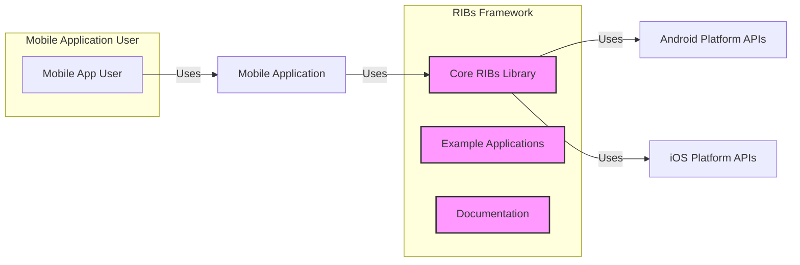

# BUSINESS POSTURE

- Business Priorities and Goals:
  - Provide a robust and scalable architecture for building cross-platform mobile applications (primarily Android and iOS).
  - Enhance developer productivity by offering a structured and modular approach to mobile application development.
  - Promote code reusability and maintainability across different mobile platforms.
  - Facilitate the development of complex mobile applications with well-defined components and interactions.
  - Establish a framework that can adapt to evolving mobile development paradigms and technologies.
- Business Risks:
  - Risk of vulnerabilities within the RIBs framework itself, potentially leading to security flaws in applications built upon it.
  - Risk of increased complexity for developers unfamiliar with the RIBs architecture, potentially hindering adoption and productivity.
  - Risk of insufficient community support and documentation, making it challenging for developers to effectively utilize and troubleshoot the framework.
  - Risk of the framework not adequately addressing specific business requirements or use cases, limiting its applicability.
  - Risk of dependencies on external libraries or platforms introducing vulnerabilities or compatibility issues.

# SECURITY POSTURE

- Existing Security Controls:
  - security control: Open Source Codebase - The RIBs framework is publicly available on GitHub, allowing for community review and scrutiny of the code for potential vulnerabilities. Implemented: GitHub Repository.
  - security control: Reliance on Platform Security - Applications built with RIBs rely on the underlying security mechanisms provided by the Android and iOS operating systems. Implemented: Mobile OS Platforms (Android, iOS).
  - security control: Code Review Process -  It is assumed that Uber, as the creator of RIBs, employs internal code review processes for contributions to the framework. Implemented: Uber Internal Development Process (Assumption).
  - security control: Unit and Integration Testing -  The repository includes unit and integration tests, which can help identify functional bugs and potential security issues early in the development cycle. Implemented: GitHub Repository - `/android/libraries/rib-base/src/test/java/com/uber/rib/core`, `/ios/RIBsTreeTests`.
- Accepted Risks:
  - accepted risk: Community-Driven Security - Reliance on the open-source community to identify and report security vulnerabilities may lead to delayed detection of certain issues.
  - accepted risk: Framework Vulnerabilities -  Despite development efforts, there remains a possibility of undiscovered vulnerabilities existing within the RIBs framework code.
  - accepted risk: Misuse of Framework - Developers using RIBs might misinterpret or misuse framework components, potentially introducing security vulnerabilities in their applications.
- Recommended Security Controls:
  - security control: Automated Security Scanning - Implement automated Static Application Security Testing (SAST) and Dynamic Application Security Testing (DAST) tools within the RIBs development and CI/CD pipeline to proactively identify potential vulnerabilities.
  - security control: Regular Security Audits - Conduct periodic security audits of the RIBs framework codebase by external security experts to identify and remediate potential security weaknesses.
  - security control: Secure Development Guidelines - Establish and publish secure development guidelines for contributors to the RIBs framework, emphasizing secure coding practices and vulnerability prevention.
  - security control: Vulnerability Disclosure Program - Implement a clear vulnerability disclosure program to allow security researchers and the community to report potential security issues in a responsible manner.
  - security control: Security Training for Contributors - Provide security training to contributors to the RIBs framework to raise awareness of common security vulnerabilities and secure coding practices.
- Security Requirements:
  - Authentication:
    - Applications built using RIBs will likely require authentication mechanisms to verify user identities. RIBs itself does not directly handle authentication but should provide guidance or integration points for implementing secure authentication within applications.
    - Requirement: Applications using RIBs must implement secure authentication mechanisms appropriate for their use case, leveraging platform-provided security features or established authentication libraries.
  - Authorization:
    - Applications built using RIBs will need authorization mechanisms to control user access to resources and functionalities. RIBs should facilitate the implementation of fine-grained authorization within applications.
    - Requirement: Applications using RIBs must implement robust authorization mechanisms to enforce access control policies and protect sensitive data and operations.
  - Input Validation:
    - The RIBs framework should encourage or enforce input validation practices to prevent common vulnerabilities like injection attacks. While RIBs might not directly handle input validation, its architecture should promote modularity and separation of concerns, making input validation easier to implement at appropriate boundaries within applications.
    - Requirement: Applications using RIBs must implement comprehensive input validation at all application boundaries to prevent injection attacks and other input-related vulnerabilities.
  - Cryptography:
    - Applications built with RIBs may need to implement cryptographic operations for data protection and secure communication. RIBs itself might not provide cryptographic primitives but should not hinder the integration of secure cryptographic libraries and practices within applications.
    - Requirement: Applications using RIBs that handle sensitive data must employ strong cryptography for data encryption, secure communication, and secure storage, adhering to industry best practices and standards.

# DESIGN

## C4 CONTEXT

```mermaid
graph LR
    subgraph "Mobile Application User"
        A[Mobile App User]
    end
    B[RIBs Framework] -- Uses --> C[Android SDK]
    B -- Uses --> D[iOS SDK]
    B -- Uses --> E[Build Tools (Gradle, Xcode)]
    B -- Uses --> F[Dependency Repositories (Maven, CocoaPods)]
    A -- Uses --> B
    style B fill:#f9f,stroke:#333,stroke-width:2px
```

- Context Diagram Elements:
  - - Name: Mobile App User
    - Type: Person
    - Description: End-users who interact with mobile applications built using the RIBs framework.
    - Responsibilities: Utilize mobile applications for their intended purposes.
    - Security controls: User device security controls (OS security, device encryption, user authentication on device).
  - - Name: RIBs Framework
    - Type: Software System
    - Description: Uber's cross-platform mobile architecture framework for building Android and iOS applications. It provides a structured approach to application development, promoting modularity, testability, and scalability.
    - Responsibilities: Provide a robust and well-defined architecture for mobile application development, manage application lifecycle, facilitate component communication, and offer utilities for common mobile development tasks.
    - Security controls: Code reviews, unit and integration testing, (recommended) automated security scanning, (recommended) security audits, (recommended) secure development guidelines.
  - - Name: Android SDK
    - Type: Software System
    - Description: Google's Software Development Kit for the Android platform. Provides libraries, tools, and APIs necessary to develop Android applications.
    - Responsibilities: Provide platform-specific APIs and functionalities for Android applications, manage application execution environment on Android devices.
    - Security controls: Android OS security features, SDK security updates, application sandboxing.
  - - Name: iOS SDK
    - Type: Software System
    - Description: Apple's Software Development Kit for the iOS platform. Provides libraries, tools, and APIs for developing applications for iPhones and iPads.
    - Responsibilities: Provide platform-specific APIs and functionalities for iOS applications, manage application execution environment on iOS devices.
    - Security controls: iOS OS security features, SDK security updates, application sandboxing.
  - - Name: Build Tools (Gradle, Xcode)
    - Type: Software System
    - Description: Software tools used to build, compile, and package mobile applications. Gradle is commonly used for Android, and Xcode is used for iOS.
    - Responsibilities: Automate the build process, compile source code, manage dependencies, package applications for deployment.
    - Security controls: Secure build environment, dependency vulnerability scanning (within build tools or integrated tools), build output integrity checks.
  - - Name: Dependency Repositories (Maven, CocoaPods)
    - Type: Software System
    - Description: Online repositories that host software libraries and dependencies used by mobile applications. Maven is commonly used for Android (Java/Kotlin), and CocoaPods for iOS (Swift/Objective-C).
    - Responsibilities: Provide access to required libraries and dependencies for application development, manage dependency versions.
    - Security controls: Repository security policies, dependency vulnerability scanning (by developers or repository providers), checksum verification of downloaded dependencies.

## C4 CONTAINER



- Container Diagram Elements:
  - - Name: Core RIBs Library
    - Type: Library
    - Description: The main component of the RIBs framework, providing the core architectural patterns, base classes, and utilities for building RIB-based applications. This library is distributed as source code and integrated into mobile applications.
    - Responsibilities: Implement the RIBs architecture, provide base classes for Routers, Interactors, and Builders, manage RIB lifecycle, facilitate inter-RIB communication, offer utility functions.
    - Security controls: Code reviews, unit and integration testing, (recommended) automated security scanning, (recommended) security audits, (recommended) secure development guidelines.
  - - Name: Example Applications
    - Type: Application
    - Description: Sample mobile applications included in the RIBs repository to demonstrate the framework's usage and best practices. These examples serve as learning resources and showcases of RIBs capabilities.
    - Responsibilities: Demonstrate practical application of the RIBs framework, provide code examples for developers, showcase recommended architectural patterns.
    - Security controls: Code reviews, (recommended) security review of example applications to ensure they demonstrate secure coding practices.
  - - Name: Documentation
    - Type: Documentation
    - Description: Comprehensive documentation for the RIBs framework, including guides, tutorials, API references, and architectural explanations. This documentation is crucial for developers to understand and effectively use the framework.
    - Responsibilities: Provide clear and accurate information about the RIBs framework, guide developers in using the framework correctly, explain architectural concepts and best practices.
    - Security controls: Review of documentation content for accuracy and security guidance, (recommended) inclusion of security considerations and best practices in documentation.
  - - Name: Android Platform APIs
    - Type: Library
    - Description: Android SDK APIs used by the Core RIBs Library to interact with the Android operating system and device features.
    - Responsibilities: Provide access to Android platform functionalities, manage device resources, handle system events.
    - Security controls: Android OS security features, SDK security updates.
  - - Name: iOS Platform APIs
    - Type: Library
    - Description: iOS SDK APIs used by the Core RIBs Library to interact with the iOS operating system and device features.
    - Responsibilities: Provide access to iOS platform functionalities, manage device resources, handle system events.
    - Security controls: iOS OS security features, SDK security updates.
  - - Name: Mobile Application
    - Type: Application
    - Description: A mobile application built using the RIBs framework. This application leverages the Core RIBs Library to structure its architecture and implement its functionalities.
    - Responsibilities: Implement specific business logic and user interface, utilize the RIBs framework for application structure and management, interact with users and potentially backend services.
    - Security controls: Application-level security controls (authentication, authorization, input validation, cryptography), secure coding practices, dependency management, regular security updates.

## DEPLOYMENT

- Deployment Architecture Options:
  - Option 1: Developer Local Machine - Developers typically build and test RIBs-based applications on their local development machines using Android Studio (for Android) and Xcode (for iOS).
  - Option 2: Continuous Integration/Continuous Delivery (CI/CD) Pipeline - For automated builds, testing, and distribution, applications are deployed through CI/CD pipelines (e.g., GitHub Actions, Jenkins, CircleCI).
  - Option 3: App Stores (Google Play Store, Apple App Store) - Final deployment for end-users is through public app stores.
- Detailed Deployment Architecture (CI/CD Pipeline):

```mermaid
graph LR
    subgraph "Developer Environment"
        A[Developer Machine]
    end
    subgraph "CI/CD Pipeline (GitHub Actions)"
        B[Source Code Repository (GitHub)]
        C[Build Server (GitHub Actions Runner)]
        D[Artifact Repository]
        E[Testing Environment]
    end
    subgraph "App Stores"
        F[Google Play Store]
        G[Apple App Store]
    end
    A -- Push Code --> B
    B -- Trigger Build --> C
    C -- Build & Test --> D
    C -- Deploy to Testing --> E
    D -- Release Build --> F
    D -- Release Build --> G
    style C fill:#f9f,stroke:#333,stroke-width:2px
    style D fill:#f9f,stroke:#333,stroke-width:2px
```

- Deployment Diagram Elements (CI/CD Pipeline):
  - - Name: Developer Machine
    - Type: Environment
    - Description: The local computer used by developers to write code, build, and test mobile applications during development.
    - Responsibilities: Code development, local builds, unit testing, integration testing, debugging.
    - Security controls: Developer machine security (OS security, antivirus, firewall, access control), code repository access control.
  - - Name: Source Code Repository (GitHub)
    - Type: System
    - Description: A version control system (GitHub) hosting the source code of the RIBs framework and applications built with it.
    - Responsibilities: Source code management, version control, collaboration, code review, trigger CI/CD pipelines.
    - Security controls: Access control (authentication and authorization), branch protection, audit logs, (recommended) code scanning tools integrated with repository.
  - - Name: Build Server (GitHub Actions Runner)
    - Type: Environment
    - Description: A server environment provided by GitHub Actions that automatically builds, tests, and packages the application code when triggered by code changes in the repository.
    - Responsibilities: Automated builds, compilation, unit testing, integration testing, packaging, artifact creation.
    - Security controls: Secure build environment (hardened OS, access control), secrets management for build credentials, build process isolation, (recommended) security scanning during build.
  - - Name: Artifact Repository
    - Type: System
    - Description: A repository for storing build artifacts (e.g., APKs for Android, IPAs for iOS) generated by the CI/CD pipeline.
    - Responsibilities: Store build artifacts, versioning of artifacts, provide access to artifacts for testing and release.
    - Security controls: Access control, artifact integrity checks (checksums), secure storage.
  - - Name: Testing Environment
    - Type: Environment
    - Description: A dedicated environment (physical devices or emulators/simulators) where built applications are deployed and tested automatically or manually.
    - Responsibilities: Automated testing (UI tests, integration tests), manual testing, performance testing, security testing.
    - Security controls: Isolated testing environment, test data management, access control to testing environment.
  - - Name: Google Play Store
    - Type: System
    - Description: Google's official app store for Android applications, used for distributing applications to end-users.
    - Responsibilities: Application distribution to Android users, app updates, app store security scanning.
    - Security controls: Google Play Protect (app scanning), developer account security, app signing.
  - - Name: Apple App Store
    - Type: System
    - Description: Apple's official app store for iOS applications, used for distributing applications to end-users.
    - Responsibilities: Application distribution to iOS users, app updates, app store security review process.
    - Security controls: App Store review process, developer account security, app signing.

## BUILD

```mermaid
graph LR
    A[Developer] --> B[Code Changes]
    B --> C[Source Code Repository (GitHub)]
    C --> D{CI Trigger}
    D -- Auto Build --> E[Build System (GitHub Actions)]
    E --> F[Dependency Download]
    E --> G[Compilation & Packaging]
    E --> H[Unit & Integration Tests]
    E --> I{Security Checks (SAST, Linters)}
    I -- Findings --> E
    E --> J[Build Artifacts]
    J --> K[Artifact Repository]
    style E fill:#f9f,stroke:#333,stroke-width:2px
    style K fill:#f9f,stroke:#333,stroke-width:2px
```

- Build Process Elements:
  - - Name: Developer
    - Type: Person
    - Description: Software developers who write and modify the code for the RIBs framework or applications using it.
    - Responsibilities: Write code, commit code changes, run local builds and tests, address code review feedback.
    - Security controls: Secure coding practices, code review participation, developer machine security.
  - - Name: Code Changes
    - Type: Data
    - Description: Modifications to the source code of the RIBs framework or applications.
    - Responsibilities: Represent new features, bug fixes, security patches, or refactoring.
    - Security controls: Code review process, version control (tracking changes and history).
  - - Name: Source Code Repository (GitHub)
    - Type: System
    - Description: Version control system hosting the source code.
    - Responsibilities: Store code changes, manage versions, trigger CI/CD pipeline on code commits.
    - Security controls: Access control, branch protection, audit logs.
  - - Name: CI Trigger
    - Type: Process
    - Description: Automated trigger that initiates the CI/CD build process when new code changes are pushed to the repository.
    - Responsibilities: Detect code changes, initiate build process automatically.
    - Security controls: Secure webhook configuration (if applicable), access control to CI trigger configuration.
  - - Name: Build System (GitHub Actions)
    - Type: System
    - Description: Automated build environment that executes the build process defined in CI/CD workflows.
    - Responsibilities: Download dependencies, compile code, run tests, perform security checks, package artifacts.
    - Security controls: Secure build environment, secrets management, build process isolation, (recommended) security scanning tools integration.
  - - Name: Dependency Download
    - Type: Process
    - Description: The build system downloads necessary dependencies (libraries, SDKs) from dependency repositories.
    - Responsibilities: Fetch required dependencies, manage dependency versions.
    - Security controls: Dependency vulnerability scanning, checksum verification of downloaded dependencies, using trusted dependency repositories.
  - - Name: Compilation & Packaging
    - Type: Process
    - Description: Source code is compiled into executable code, and the application is packaged into distributable artifacts (APK, IPA).
    - Responsibilities: Compile code, link libraries, package application, sign application (for release builds).
    - Security controls: Secure compilation process, code signing with secure keys, output artifact integrity checks.
  - - Name: Unit & Integration Tests
    - Type: Process
    - Description: Automated tests are executed to verify the functionality and correctness of the code.
    - Responsibilities: Run unit tests, run integration tests, report test results.
    - Security controls: Secure test environment, test case design to cover security aspects, test result analysis.
  - - Name: Security Checks (SAST, Linters)
    - Type: Process
    - Description: Automated security analysis tools (SAST, linters) are used to scan the codebase for potential vulnerabilities and code quality issues.
    - Responsibilities: Static code analysis, identify potential vulnerabilities, enforce code quality standards, generate security reports.
    - Security controls: Regularly updated security scanning tools, configured security rules and policies, vulnerability reporting and remediation process.
  - - Name: Build Artifacts
    - Type: Data
    - Description: Output files generated by the build process, including compiled code, packaged application, and associated files.
    - Responsibilities: Represent the distributable application, ready for testing or release.
    - Security controls: Artifact integrity checks (checksums), secure storage of artifacts.
  - - Name: Artifact Repository
    - Type: System
    - Description: Repository for storing and managing build artifacts.
    - Responsibilities: Store build artifacts, versioning, access control to artifacts.
    - Security controls: Access control, secure storage, audit logs.

# RISK ASSESSMENT

- Critical Business Processes:
  - Development and maintenance of the RIBs framework itself.
  - Development of mobile applications using the RIBs framework.
  - Distribution of mobile applications built with RIBs to end-users.
- Data Sensitivity:
  - Source code of the RIBs framework: Medium sensitivity. Publicly available but vulnerabilities can impact applications built with it.
  - Source code of example applications: Low sensitivity. Publicly available examples.
  - Documentation: Low sensitivity. Publicly available documentation.
  - Build artifacts (APKs, IPAs): Medium sensitivity. Represent compiled application code, potential for reverse engineering.
  - Developer credentials and secrets used in build process: High sensitivity. Compromise can lead to unauthorized access and code tampering.

# QUESTIONS & ASSUMPTIONS

- Questions:
  - What is the primary motivation for creating this design document? Is it for internal security review, external communication, or a specific compliance requirement?
  - What is the intended audience for this document? (Security team, development team, management, etc.)
  - Are there any specific security incidents or concerns that are driving the need for this threat modeling exercise?
  - What is the expected lifespan of the RIBs framework and applications built with it?
  - Are there any specific regulatory or compliance requirements that applications built with RIBs must adhere to?
- Assumptions:
  - BUSINESS POSTURE:
    - The primary goal of RIBs is to improve developer productivity and create scalable, maintainable mobile applications.
    - Uber intends to continue supporting and developing the RIBs framework.
    - The framework is intended for use in a variety of mobile application domains.
  - SECURITY POSTURE:
    - Security is a concern for both the RIBs framework itself and applications built using it.
    - Uber has internal security practices and processes in place for software development.
    - The open-source nature of RIBs is seen as a benefit for community review and security contributions.
  - DESIGN:
    - RIBs is primarily used for native Android and iOS mobile application development.
    - The C4 model is an appropriate level of abstraction for describing the RIBs framework architecture.
    - The deployment model described focuses on a typical CI/CD pipeline and app store distribution.