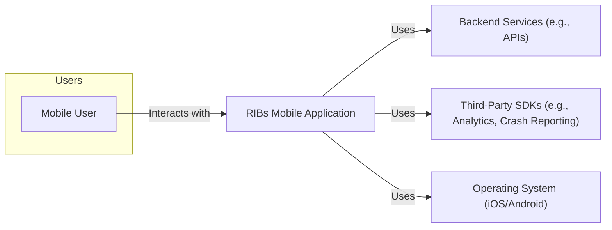
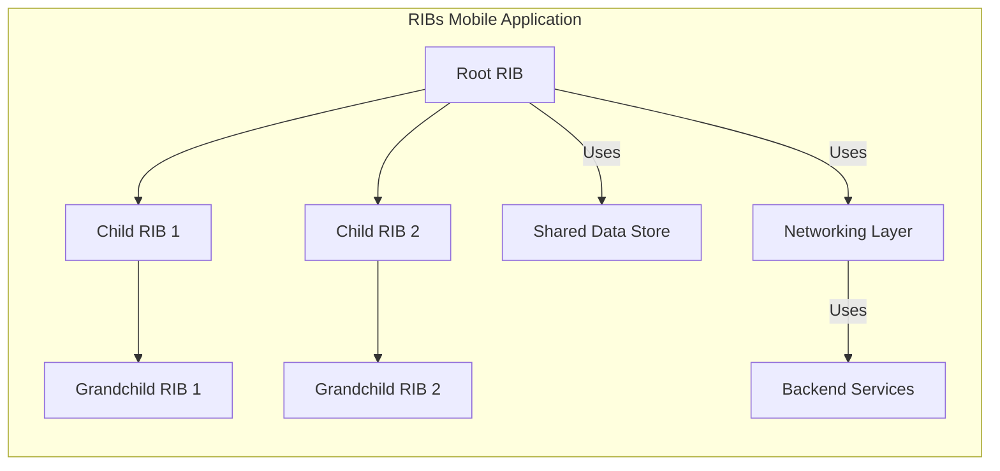
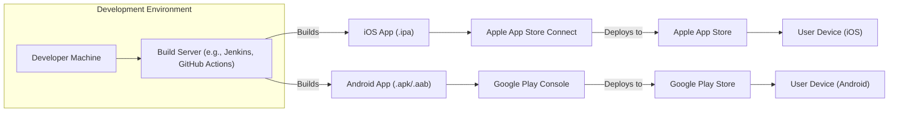
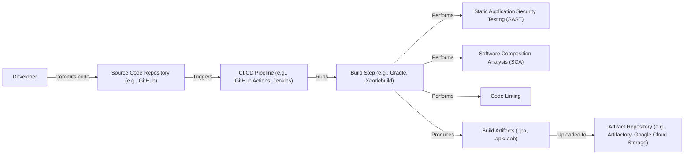

Okay, let's create a design document for Uber's RIBs framework.

# BUSINESS POSTURE

RIBS (Router, Interactor, Builder) is a cross-platform architecture framework developed by Uber for building mobile applications with large teams and complex business logic.  It's designed to promote code reusability, testability, and maintainability across iOS and Android platforms.  The primary business goals driving RIBs are:

*   Developer Productivity: Enable large teams to work concurrently on different parts of the application with minimal conflicts and dependencies.
*   Code Quality and Stability:  Reduce bugs and regressions through a well-defined architecture that promotes testability and isolation.
*   Scalability:  Support the development of large, complex applications that can evolve over time.
*   Maintainability: Make it easier to understand, modify, and extend the codebase.
*   Cross-Platform Consistency:  Ensure a consistent architecture and development approach across iOS and Android.

Business priorities:

*   Rapid feature development and iteration.
*   High app stability and performance.
*   Efficient onboarding of new developers.
*   Reduced long-term maintenance costs.

Most important business risks:

*   Increased development time due to the complexity of the RIBs architecture.
*   Steeper learning curve for new developers unfamiliar with the RIBs pattern.
*   Potential performance overhead if RIBs are not implemented correctly.
*   Difficulty in refactoring existing applications to adopt the RIBs architecture.
*   Over-engineering for smaller, simpler applications.

# SECURITY POSTURE

The RIBs framework itself doesn't directly address security concerns. It's an architectural pattern focused on application structure and workflow. Security is the responsibility of the application built *using* RIBs. However, the structure imposed by RIBs *can* facilitate the implementation of security controls.

Existing Security Controls (as inferred from the framework's design and purpose, not explicitly stated in the repository):

*   security control: Modularity: RIBs promote a modular design, which can help isolate security-sensitive components. (Implemented in the RIBs architecture itself).
*   security control: Testability: The emphasis on testability in RIBs allows for easier implementation of security unit and integration tests. (Described in RIBs documentation and examples).
*   security control: Defined Data Flow: The unidirectional data flow in RIBs can simplify reasoning about data access and control. (Implemented in the RIBs architecture itself).

Accepted Risks:

*   accepted risk: The framework itself does not provide built-in security mechanisms (e.g., authentication, authorization, encryption). These must be implemented separately within each RIB or shared components.
*   accepted risk: Reliance on developers to correctly implement security best practices within each RIB.
*   accepted risk: Potential for vulnerabilities if inter-RIB communication is not properly secured.

Recommended Security Controls (High Priority):

*   security control: Secure Inter-RIB Communication: Implement secure mechanisms for communication between RIBs, especially if data is passed between them. This might involve using a shared, secure data store or encrypting data in transit.
*   security control: Input Validation: Enforce strict input validation in each RIB's Interactor to prevent injection attacks and other data-related vulnerabilities.
*   security control: Least Privilege: Design each RIB with the principle of least privilege in mind, granting it only the necessary permissions to access data and perform its functions.
*   security control: Secure Storage: If RIBs handle sensitive data, ensure that this data is stored securely, using platform-specific secure storage mechanisms (e.g., Keychain on iOS, Keystore on Android).

Security Requirements:

*   Authentication: RIBs architecture doesn't dictate authentication, but any application built with it likely needs a robust authentication mechanism. This should be handled by a dedicated RIB or a set of RIBs responsible for user login, session management, and token handling.
*   Authorization: Access control should be enforced within each RIB, determining whether the current user (or the RIB itself) has the necessary permissions to perform specific actions or access certain data. This can be implemented using role-based access control (RBAC) or other authorization schemes.
*   Input Validation: All input received by a RIB (from user interactions, network requests, or other RIBs) must be validated to ensure it conforms to expected formats and constraints. This is crucial for preventing injection attacks and other data-related vulnerabilities.
*   Cryptography: If sensitive data is handled, appropriate cryptographic techniques should be used to protect it. This includes encrypting data at rest and in transit, using secure hashing algorithms, and managing cryptographic keys securely.

# DESIGN

## C4 CONTEXT

C4 Context Element List:

*   Mobile User
    *   Name: Mobile User
    *   Type: Person
    *   Description: A user interacting with the mobile application built using RIBs.
    *   Responsibilities: Initiates actions, views data, interacts with the application's features.
    *   Security controls: Authentication (handled by the application), authorization (handled by the application).

*   RIBs Mobile Application
    *   Name: RIBs Mobile Application
    *   Type: Software System
    *   Description: The mobile application built using the RIBs architecture.
    *   Responsibilities: Provides the application's functionality, manages user interactions, communicates with backend services.
    *   Security controls: Input validation, secure inter-RIB communication, secure storage, authentication, authorization.

*   Backend Services
    *   Name: Backend Services
    *   Type: Software System
    *   Description: Backend APIs and services that the mobile application interacts with.
    *   Responsibilities: Provides data and business logic to the mobile application.
    *   Security controls: Authentication, authorization, input validation, data encryption. (Responsibility of the backend system).

*   Third-Party SDKs
    *   Name: Third-Party SDKs
    *   Type: Software System
    *   Description: Third-party libraries integrated into the mobile application (e.g., for analytics, crash reporting).
    *   Responsibilities: Provides specific functionalities as defined by the SDK.
    *   Security controls: Varies depending on the SDK. Should be reviewed for security implications.

*   Operating System
    *   Name: Operating System
    *   Type: Software System
    *   Description: The underlying mobile operating system (iOS or Android).
    *   Responsibilities: Provides platform-specific services and APIs.
    *   Security controls: Sandboxing, permission management, secure storage (Keychain/Keystore).

## C4 CONTAINER

C4 Container Element List:

*   Root RIB
    *   Name: Root RIB
    *   Type: Container (RIB)
    *   Description: The top-level RIB in the application, responsible for launching the application and managing the main workflow.
    *   Responsibilities: Application lifecycle management, launching child RIBs.
    *   Security controls: Initial authentication, high-level authorization.

*   Child RIB 1, Child RIB 2
    *   Name: Child RIB 1 / Child RIB 2
    *   Type: Container (RIB)
    *   Description: RIBs representing major features or sections of the application.
    *   Responsibilities: Managing specific features or workflows.
    *   Security controls: Feature-specific authorization, input validation.

*   Grandchild RIB 1, Grandchild RIB 2
    *   Name: Grandchild RIB 1 / Grandchild RIB 2
    *   Type: Container (RIB)
    *   Description: RIBs representing sub-features or components within a larger feature.
    *   Responsibilities: Managing specific sub-features or workflows.
    *   Security controls: Sub-feature-specific authorization, input validation.

*   Shared Data Store
    *   Name: Shared Data Store
    *   Type: Container (Data Store)
    *   Description: A shared data store used for communication and data persistence between RIBs.
    *   Responsibilities: Storing and retrieving data.
    *   Security controls: Secure storage, data encryption, access control.

*   Networking Layer
    *   Name: Networking Layer
    *   Type: Container (Component)
    *   Description: A component responsible for handling network communication with backend services.
    *   Responsibilities: Making API requests, handling responses, managing network errors.
    *   Security controls: TLS/SSL, certificate pinning, input validation, secure handling of API keys.

* Backend Services
    * Name: Backend Services
    * Type: External System
    * Description: External system that provides data to mobile application.
    * Responsibilities: Processing requests from mobile application.
    * Security controls: Authentication, authorization, input validation, data encryption. (Responsibility of the backend system).

## DEPLOYMENT

Possible deployment solutions:

1.  **Standard Mobile App Deployment:** Deploying the iOS and Android applications through their respective app stores (Apple App Store and Google Play Store).
2.  **Enterprise Distribution:** For internal applications, deploying through an enterprise mobile device management (MDM) solution.
3.  **TestFlight/Beta Testing:** Using platforms like TestFlight (iOS) and Google Play Console's beta testing features for pre-release testing.

Chosen solution (for detailed description): **Standard Mobile App Deployment**

Deployment Element List:

*   Developer Machine
    *   Name: Developer Machine
    *   Type: Infrastructure Node
    *   Description: The developer's workstation where code is written and tested.
    *   Responsibilities: Code development, local testing.
    *   Security controls: Local security measures (e.g., disk encryption, firewall).

*   Build Server
    *   Name: Build Server
    *   Type: Infrastructure Node
    *   Description: A server that automates the build process (e.g., Jenkins, GitHub Actions).
    *   Responsibilities: Building the application, running tests, creating release artifacts.
    *   Security controls: Secure access control, secure storage of build secrets, SAST/DAST scanning.

*   iOS App (.ipa)
    *   Name: iOS App (.ipa)
    *   Type: Software Artifact
    *   Description: The iOS application package.
    *   Responsibilities: N/A (artifact).
    *   Security controls: Code signing, entitlements.

*   Android App (.apk/.aab)
    *   Name: Android App (.apk/.aab)
    *   Type: Software Artifact
    *   Description: The Android application package.
    *   Responsibilities: N/A (artifact).
    *   Security controls: Code signing, permissions.

*   Apple App Store Connect
    *   Name: Apple App Store Connect
    *   Type: Platform
    *   Description: Apple's platform for managing iOS app submissions and releases.
    *   Responsibilities: App review, distribution.
    *   Security controls: Apple's internal security controls.

*   Google Play Console
    *   Name: Google Play Console
    *   Type: Platform
    *   Description: Google's platform for managing Android app submissions and releases.
    *   Responsibilities: App review, distribution.
    *   Security controls: Google's internal security controls.

*   Apple App Store
    *   Name: Apple App Store
    *   Type: Platform
    *   Description: Apple's app store for distributing iOS applications.
    *   Responsibilities: Hosting and delivering apps to users.
    *   Security controls: Apple's internal security controls.

*   Google Play Store
    *   Name: Google Play Store
    *   Type: Platform
    *   Description: Google's app store for distributing Android applications.
    *   Responsibilities: Hosting and delivering apps to users.
    *   Security controls: Google's internal security controls.

*   User Device (iOS)
    *   Name: User Device (iOS)
    *   Type: Infrastructure Node
    *   Description: The user's iOS device.
    *   Responsibilities: Running the application.
    *   Security controls: iOS security features (sandboxing, etc.).

*   User Device (Android)
    *   Name: User Device (Android)
    *   Type: Infrastructure Node
    *   Description: The user's Android device.
    *   Responsibilities: Running the application.
    *   Security controls: Android security features (sandboxing, etc.).

## BUILD

Build Process Description:

1.  **Code Commit:** Developers commit code changes to a source code repository (e.g., GitHub).
2.  **CI/CD Trigger:** The commit triggers a CI/CD pipeline (e.g., GitHub Actions, Jenkins).
3.  **Build Step:** The pipeline executes a build step using build tools like Gradle (for Android) or Xcodebuild (for iOS).
4.  **Security Checks:**
    *   **SAST:** Static Application Security Testing tools analyze the source code for potential vulnerabilities.
    *   **SCA:** Software Composition Analysis tools identify and analyze open-source components for known vulnerabilities and license compliance.
    *   **Linting:** Code linters check the code for style and potential errors.
5.  **Artifact Creation:** If the build and security checks are successful, build artifacts (.ipa for iOS, .apk/.aab for Android) are created.
6.  **Artifact Storage:** The build artifacts are uploaded to an artifact repository (e.g., Artifactory, Google Cloud Storage).

Security Controls in Build Process:

*   security control: SAST: Integration of static analysis tools to identify vulnerabilities in the source code.
*   security control: SCA: Integration of software composition analysis tools to identify vulnerabilities in third-party libraries.
*   security control: Code Signing: Ensuring that the build artifacts are digitally signed to verify their authenticity and integrity.
*   security control: Build Pipeline Security: Secure configuration of the CI/CD pipeline to prevent unauthorized access and modifications.
*   security control: Artifact Repository Security: Secure storage and access control for the build artifacts.
*   security control: Linting: Enforce code style and identify potential errors.

# RISK ASSESSMENT

Critical Business Processes to Protect:

*   User authentication and authorization.
*   Secure handling of user data (personal information, payment details, location data, etc.).
*   Communication with backend services.
*   Application functionality and stability.
*   Protection of intellectual property (source code, algorithms).

Data to Protect and Sensitivity:

*   Usernames and Passwords: Highly sensitive. Requires strong encryption and secure storage.
*   Personal Information (name, email, address, phone number): Sensitive. Requires appropriate protection based on privacy regulations (e.g., GDPR, CCPA).
*   Payment Details (credit card numbers, bank account information): Highly sensitive. Requires PCI DSS compliance.
*   Location Data: Sensitive, especially if collected continuously. Requires user consent and appropriate protection.
*   Usage Data and Analytics: Less sensitive, but should still be handled responsibly.
*   Authentication Tokens: Highly sensitive. Requires secure storage and handling to prevent session hijacking.
*   API Keys: Sensitive. Requires secure storage and handling to prevent unauthorized access to backend services.

# QUESTIONS & ASSUMPTIONS

Questions:

*   What specific backend services does the RIBs application interact with?
*   What types of user data are handled by the application?
*   Are there any existing security policies or guidelines that need to be followed?
*   What is the expected user base and scale of the application?
*   What are the specific regulatory requirements (e.g., GDPR, CCPA, PCI DSS) that apply to the application?
*   Are there any specific third-party SDKs used, and what are their security implications?
*   What is the current development and deployment process?
*   What level of logging and monitoring is required?

Assumptions:

*   BUSINESS POSTURE: The primary goal is to build a scalable and maintainable mobile application.
*   BUSINESS POSTURE: The development team has some familiarity with architectural patterns.
*   SECURITY POSTURE: Basic security best practices are followed (e.g., secure coding principles).
*   SECURITY POSTURE: Developers are responsible for implementing security within their RIBs.
*   DESIGN: The application will interact with backend services.
*   DESIGN: The application will be deployed through the official app stores.
*   DESIGN: A CI/CD pipeline will be used for building and deploying the application.
*   DESIGN: The application will use a shared data store for inter-RIB communication.