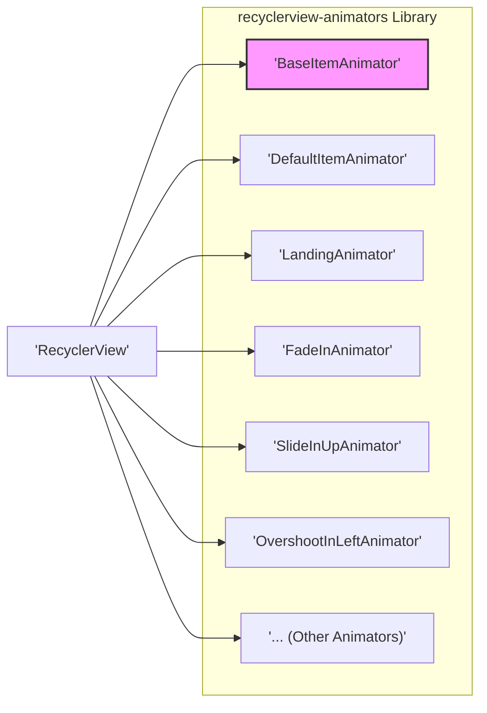
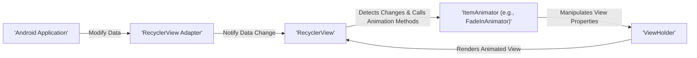

# Project Design Document: RecyclerView Animators

**Version:** 1.1
**Date:** October 26, 2023
**Author:** AI Software Architect

## 1. Introduction

This document provides an enhanced design overview of the `recyclerview-animators` project, a library offering a collection of pre-built `ItemAnimator` implementations for Android's `RecyclerView`. This revised document aims for greater clarity and detail regarding the library's architecture, component interactions, and data flow, specifically tailored for effective threat modeling.

## 2. Goals and Objectives

The core objectives of the `recyclerview-animators` library are:

* **Enrich `RecyclerView` visuals:** Offer a diverse range of visually appealing, ready-to-use animation effects for item additions, removals, moves, and changes within a `RecyclerView`.
* **Simplify custom animation development:** Provide an abstract base class and clear interfaces to facilitate the creation of unique, developer-defined animations.
* **Improve user engagement:** Enhance the user experience in Android applications by providing smooth and engaging visual feedback during `RecyclerView` updates.
* **Maintain performance efficiency:** Ensure animations are implemented in a performant manner, minimizing impact on application responsiveness and resource consumption.
* **Enable flexible customization:** Allow developers to adjust animation parameters such as duration, interpolator, and direction to suit their specific needs.

## 3. System Architecture

The library's architecture revolves around the `ItemAnimator` interface and provides a set of concrete implementations. The key interaction is between the `RecyclerView` and the selected `ItemAnimator`.



**Components:**

* **`BaseItemAnimator`:** An abstract class extending `RecyclerView.ItemAnimator`. It provides foundational methods and state management for common animation behaviors, simplifying the creation of new animators.
* **Concrete `ItemAnimator` Implementations:** A set of classes, each implementing a specific animation effect. Examples include:
    * `DefaultItemAnimator`: Provides basic, default animations.
    * `LandingAnimator`: Animates items as if they are landing from above.
    * `FadeInAnimator`: Fades new items into view.
    * `SlideInUpAnimator`: Slides new items in from the bottom.
    * `OvershootInLeftAnimator`: Slides items in from the left with an overshoot effect.
    *  ... and many others.
* **`RecyclerView` (Android Framework):** The core Android UI component responsible for displaying collections of data. It manages the layout and rendering of items and interacts with the `ItemAnimator` for animations.
* **`ViewHolder` (Android Framework):** Represents the view for an individual item in the `RecyclerView`. The `ItemAnimator` manipulates the properties of the `ViewHolder`'s views to create animations.

**Interactions:**

1. **Initialization:** The Android application instantiates a `RecyclerView` and sets an `Adapter` to provide data.
2. **Animator Selection:** The application selects a specific `ItemAnimator` implementation from the `recyclerview-animators` library and sets it on the `RecyclerView` using `recyclerView.setItemAnimator()`.
3. **Data Changes:** When the underlying data set of the `RecyclerView`'s `Adapter` changes (items added, removed, moved, or updated), the `Adapter` notifies the `RecyclerView`.
4. **Animation Trigger:** The `RecyclerView` detects these changes and initiates the animation process through the set `ItemAnimator`.
5. **`ItemAnimator` Logic:** The `ItemAnimator` implementation determines the specific animation to apply based on the type of change and manipulates the `ViewHolder`'s views using Android's animation framework.
6. **View Updates:** The Android rendering pipeline updates the `ViewHolder`'s views based on the animation values, resulting in the visual animation.

## 4. Data Flow

The data flow involves the propagation of data change events from the application to the `RecyclerView` and the subsequent animation of `ViewHolder`s by the `ItemAnimator`.



**Detailed Flow:**

1. **Data Modification:** The Android application modifies the data source (e.g., a `List`) that the `RecyclerView.Adapter` is bound to.
2. **Adapter Notification:** The application calls methods on the `RecyclerView.Adapter` (e.g., `notifyItemInserted()`, `notifyItemRemoved()`, `notifyItemMoved()`, `notifyItemChanged()`) to inform it about the data changes.
3. **`RecyclerView` Event Handling:** The `RecyclerView` receives these notifications and determines the type of animation required.
4. **`ItemAnimator` Method Invocation:** The `RecyclerView` calls the relevant animation methods on the set `ItemAnimator`, passing the affected `ViewHolder`(s) as arguments. These methods include:
    * `animateAdd(ViewHolder)`
    * `animateRemove(ViewHolder)`
    * `animateMove(ViewHolder, int, int, int, int)`
    * `animateChange(ViewHolder, ViewHolder, int, int, int, int)`
5. **Animation Execution:** The `ItemAnimator` implementation performs the following steps:
    * **State Capture:**  Captures the initial state of the `ViewHolder`'s relevant views (e.g., position, alpha, scale).
    * **Animation Creation:** Creates `ValueAnimator` or `ObjectAnimator` instances to animate the desired properties over a specified duration, using an appropriate `Interpolator`.
    * **Property Updates:** Updates the properties of the `ViewHolder`'s views during the animation lifecycle.
    * **Callback Handling:**  Handles animation start, end, and cancellation events.
6. **View Rendering:** The Android rendering system redraws the `RecyclerView` and its `ViewHolder`s based on the updated animation values, resulting in the visual animation effect.

## 5. Dependencies

The `recyclerview-animators` library depends on the following:

* **Android SDK:** The library is designed for the Android platform and relies on core Android framework classes, particularly within the `android.view` and `androidx.recyclerview.widget` packages.
* **`androidx.recyclerview:recyclerview`:** This is a direct and essential dependency, as the library provides extensions and customizations for the `RecyclerView` component.
* **`androidx.annotation:annotation` (Optional):** May be used for nullability annotations and other static analysis benefits.

## 6. Security Considerations (For Threat Modeling)

While primarily a UI enhancement library, `recyclerview-animators` presents several potential security considerations relevant for threat modeling:

**Potential Threat Categories:**

* **Resource Exhaustion/Denial of Service (DoS):**
    * **Excessive Animation Triggering:** A malicious actor or flawed logic could trigger a rapid succession of item changes, leading to a large number of concurrent animations. This could overwhelm the device's CPU and GPU, causing UI unresponsiveness, application freezes, or even crashes.
    * **Complex Animation Exploitation:**  Specific, computationally intensive animations, if triggered repeatedly, could disproportionately consume resources.
* **Unexpected Behavior and UI Manipulation:**
    * **Malformed Data Impact:** If the animation logic relies on specific data properties of the `ViewHolder`'s underlying data, providing unexpected or malformed data could lead to visually broken or misleading animations. This could potentially be used for social engineering or phishing attacks if the UI is designed to convey critical information.
    * **Animation Interference:**  In complex UI scenarios, poorly implemented custom animations or conflicts between different animations could lead to unexpected visual glitches or interfere with the intended user interaction flow.
* **Indirect Information Disclosure:**
    * **Timing Attacks:** In highly specific and sensitive applications, the duration or nature of animations, even subtle ones, could potentially leak information about the underlying data or application state through timing analysis. This is a low-probability threat but worth considering in high-security contexts.
* **Dependency Chain Vulnerabilities:**
    * **Underlying Framework Flaws:** The library relies on the Android animation framework. Any security vulnerabilities present in the underlying Android SDK animation components could indirectly affect applications using `recyclerview-animators`. While not a direct vulnerability of this library, it's a dependency risk.
* **Misuse and Configuration Issues:**
    * **Insecure Defaults:** If the library had insecure default animation parameters (e.g., excessively long durations), it could contribute to a poor user experience or potential DoS if not properly configured by the developer.
    * **Lack of Input Validation (Less Applicable):** While less relevant for a UI animation library, if animation parameters were directly influenced by user input without validation, it could theoretically lead to issues (though this is not the typical use case).

**Specific Threat Examples:**

* An attacker could craft a scenario where a large number of items are rapidly added and removed from a `RecyclerView`, causing excessive animations and making the application unusable.
* Maliciously crafted data could cause a custom animation to render in a way that obscures critical UI elements or displays misleading information.
* In a financial application, the timing of an animation confirming a transaction could be subtly manipulated to provide false feedback to the user.

## 7. Deployment

The `recyclerview-animators` library is deployed as a standard Android library dependency. Developers integrate it into their projects using build tools like Gradle:

```gradle
dependencies {
    implementation 'jp.wasabeef:recyclerview-animators:X.Y.Z' // Replace X.Y.Z with the desired version
}
```

After adding the dependency, developers can access and utilize the provided `ItemAnimator` implementations within their Android application code.

## 8. Future Considerations

Potential areas for future development and improvement include:

* **Expanded Animation Library:** Adding more diverse and sophisticated animation effects to cater to a wider range of UI needs.
* **Enhanced Customization Options:** Providing more fine-grained control over animation parameters, such as easing functions, start delays, and animation direction.
* **Performance Optimization:** Continuously profiling and optimizing the existing animations for better performance and reduced resource consumption, especially on lower-end devices.
* **LayoutManager Compatibility:** Ensuring seamless compatibility and optimal animation behavior across various `RecyclerView.LayoutManager` implementations (e.g., `LinearLayoutManager`, `GridLayoutManager`, `StaggeredGridLayoutManager`).
* **Accessibility Improvements:**  Considering accessibility guidelines and providing options to reduce or disable animations for users with motion sensitivities.
* **Improved Documentation and Examples:** Providing more comprehensive documentation and illustrative examples for each animator to facilitate easier adoption and customization.
* **Testing and Quality Assurance:**  Expanding the test suite to cover a wider range of scenarios and edge cases to ensure the robustness and reliability of the library.

This revised document provides a more detailed and security-focused design overview of the `recyclerview-animators` library, intended to be a valuable resource for threat modeling and security analysis.
