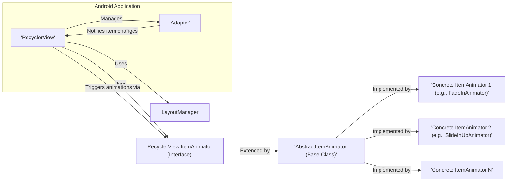
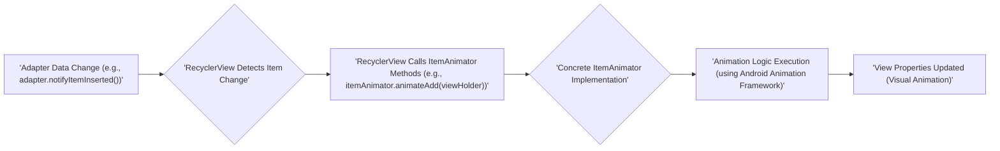

# Project Design Document: RecyclerView Animators Library

**Document Version:** 1.1
**Date:** October 26, 2023
**Prepared By:** Bard (AI Language Model)

## 1. Introduction

This document provides a detailed design overview of the `recyclerview-animators` library, accessible at [https://github.com/wasabeef/recyclerview-animators](https://github.com/wasabeef/recyclerview-animators). This library offers a curated collection of pre-built `ItemAnimator` implementations for Android's `RecyclerView`, streamlining the integration of visually appealing animations for list updates. The primary objective of this document is to clearly articulate the library's architecture, constituent components, and the flow of data during animation processes. This detailed description will serve as a foundational resource for subsequent threat modeling exercises.

## 2. Goals

*   To present a lucid and thorough description of the architectural design of the `recyclerview-animators` library.
*   To precisely identify the key components within the library and delineate their interactions.
*   To visually represent the data flow involved in initiating and executing animations.
*   To establish a solid groundwork for identifying potential security vulnerabilities and associated threats.

## 3. Scope

This document specifically focuses on the internal design and operational mechanics of the `recyclerview-animators` library. The scope encompasses:

*   The fundamental interfaces and abstract classes provided by the library.
*   The diverse set of concrete `ItemAnimator` implementations included within the library.
*   The interaction dynamics between the library and the Android `RecyclerView` component.
*   The sequence of events involved in triggering and executing animations.

This document explicitly excludes:

*   The intricate implementation details of the Android `RecyclerView` itself.
*   Specific methods employed by developers to integrate and utilize the library within their applications (although a general understanding of usage is considered for context).
*   Aspects related to network communication or data persistence, as the library's primary function is UI animation.
*   Dedicated threat modeling procedures or vulnerability assessments (these will be conducted based on the information presented in this document).

## 4. Architectural Overview

The `recyclerview-animators` library is structured as a repository of concrete `ItemAnimator` classes, each extending Android's `RecyclerView.ItemAnimator`. The core principle is to intercept notifications of item changes within the `RecyclerView` and apply customized animations based on the selected animator.

**Key Architectural Characteristics:**

*   **Extension of `RecyclerView.ItemAnimator`:** The library's central functionality is built upon providing concrete implementations of the `RecyclerView.ItemAnimator` interface. This design facilitates seamless integration with the existing Android `RecyclerView` framework.
*   **Abstract Base Class Utilization:** The `AbstractItemAnimator` class likely serves as a foundational class, offering shared functionalities and utility methods to the concrete animator implementations, thereby minimizing code redundancy.
*   **Diverse Animation Styles:** The library offers a spectrum of pre-configured animation styles, with each style encapsulated within its own concrete `ItemAnimator` class.
*   **Integration Mechanism with RecyclerView:** Developers utilizing the library instantiate a concrete `ItemAnimator` and set it on their `RecyclerView` instance. Subsequently, the `RecyclerView` leverages this animator to manage animations triggered by item changes.

## 5. Components

This section provides a detailed description of the key components within the `recyclerview-animators` library.

*   **`RecyclerView.ItemAnimator` (Interface):** This is a fundamental interface within the Android framework. It defines the contract that item animators must adhere to for handling animations related to item modifications (additions, removals, movements, and changes). The `recyclerview-animators` library provides concrete implementations of this interface.
    *   Responsibilities:
        *   Receiving notifications from the `RecyclerView` regarding item changes.
        *   Determining the appropriate animation strategy for these changes.
        *   Managing the lifecycle of the animations.
*   **`AbstractItemAnimator` (Abstract Class):** This class likely acts as a superclass for the specific animator implementations within the library.
    *   Responsibilities:
        *   Providing common logic and utility methods to facilitate animation management.
        *   Potentially defining default animation durations and timing interpolators.
        *   Reducing code duplication across various animator implementations.
*   **Concrete `ItemAnimator` Implementations (e.g., `FadeInAnimator`, `SlideInUpAnimator`, `ScaleInAnimator`):** These are the specific animation implementations offered by the library. Each class embodies a unique animation style. Examples of methods they might implement include:
    *   `animateAdd(RecyclerView.ViewHolder holder)`: Defines the animation when an item is added.
    *   `animateRemove(RecyclerView.ViewHolder holder)`: Defines the animation when an item is removed.
    *   `animateMove(RecyclerView.ViewHolder holder, int fromX, int fromY, int toX, int toY)`: Defines the animation when an item is moved.
    *   `animateChange(RecyclerView.ViewHolder oldHolder, RecyclerView.ViewHolder newHolder, int fromX, int fromY, int toX, int toY)`: Defines the animation when an item's content is changed.
    *   Responsibilities:
        *   Implementing the specific animation logic for different types of item changes (add, remove, move, change).
        *   Utilizing Android's animation framework (e.g., `ObjectAnimator`, `ViewPropertyAnimator`) to execute the animations.
        *   Managing the animation state for individual items.
*   **Helper Classes/Utilities (Potentially):** The library might include auxiliary classes to perform common tasks such as calculating animation durations or applying standard animation patterns.
    *   Responsibilities:
        *   Simplifying recurring animation-related tasks.
        *   Encapsulating reusable animation logic.

## 6. Data Flow

The data flow within the `recyclerview-animators` library centers around the `RecyclerView`'s item change notifications triggering the animation sequence.

**Detailed Data Flow Description:**

1. **Adapter Data Change:** The application's `RecyclerView` Adapter signals changes in the underlying data set by invoking methods such as `notifyItemInserted()`, `notifyItemRemoved()`, `notifyItemMoved()`, or `notifyItemChanged()`.
2. **RecyclerView Detects Item Change:** The `RecyclerView` intercepts these notifications of data modification.
3. **RecyclerView Calls ItemAnimator Methods:** Based on the nature of the change, the `RecyclerView` invokes the corresponding methods on the currently assigned `ItemAnimator`. For instance, `animateAdd()` for insertions, `animateRemove()` for removals, and so forth, passing the relevant `ViewHolder`.
4. **Concrete ItemAnimator Implementation:** The appropriate method within the selected concrete `ItemAnimator` implementation (from the `recyclerview-animators` library) is executed.
5. **Animation Logic Execution:** The `ItemAnimator` implementation executes the defined animation logic. This typically involves:
    *   Identifying the relevant views involved in the animation (the views of the added, removed, moved, or changed items).
    *   Creating and initiating Android animations, often using `ObjectAnimator` or `ViewPropertyAnimator`, to modify the visual attributes of these views (e.g., alpha, translation, scale).
    *   Managing the animation's progression from start to completion.
6. **View Properties Updated:** The Android animation framework modifies the visual properties of the item views, resulting in the animation being rendered on the user interface.

## 7. Security Considerations (Preliminary)

While the primary function of the `recyclerview-animators` library is to enhance UI aesthetics through animations and it doesn't directly handle sensitive data, the following preliminary security considerations are relevant for threat modeling:

*   **Denial of Service (DoS) via Excessive Animations:** A maliciously crafted or poorly performing adapter could trigger an excessive number of rapid item changes. This could lead to a surge in animation processing, potentially causing the UI to become unresponsive or even leading to application crashes due to resource exhaustion.
*   **Vulnerabilities in Underlying Dependencies:** The library relies on the Android framework's animation capabilities. Any security vulnerabilities present within the underlying Android animation framework could indirectly impact the security of applications utilizing this library. Maintaining up-to-date dependencies is crucial for mitigation.
*   **Supply Chain Attack Risks:** If the library itself were to be compromised (e.g., through the injection of malicious code into its source code or build artifacts), it could introduce vulnerabilities into all applications that depend on it. Verifying the integrity of the library's source and the build pipeline is a significant security measure.
*   **Indirect Information Disclosure through Timing Attacks (Low Probability):** Although less likely in the context of UI animations, subtle flaws in the animation logic could theoretically lead to timing differences that might inadvertently reveal information about the underlying data being displayed. This is a low-probability scenario but worth noting.
*   **Potential for Code Injection if Customizations are Allowed:** If the library provides mechanisms for developers to inject custom animation logic or if there are vulnerabilities in how the library handles external input related to animations, this could create potential code injection attack vectors. Scrutinizing how the library manages any form of customization is essential.
*   **Resource Consumption and Battery Drain:** While not strictly a security vulnerability, inefficient animation implementations or excessive use of animations could lead to increased resource consumption (CPU, memory) and contribute to battery drain on user devices. This could be considered a denial-of-service against the device's resources.

**Note:** These are initial security considerations. A dedicated threat modeling exercise will provide a more in-depth analysis of potential threats and vulnerabilities based on this design document.

## 8. Future Considerations

*   **Performance Enhancements:** Future development efforts could focus on optimizing animation performance, particularly when dealing with large datasets or intricate animation sequences. Techniques like using hardware acceleration more effectively or optimizing animation algorithms could be explored.
*   **Expanded Customization Options:** Providing more granular control over animation parameters (e.g., duration, interpolator, start delays) and offering more flexible ways to customize animation behavior would increase the library's versatility.
*   **Accessibility Considerations:** Future development should prioritize ensuring animations are accessible to users with disabilities. This might involve providing options to reduce animation intensity, disable animations altogether, or use alternative animation styles that are more accessible.
*   **Inclusion of New Animation Styles and Effects:** Continuously adding new and visually appealing animation styles and effects would keep the library current and valuable to developers.
*   **Improved Documentation and Examples:** Enhancing the documentation with more detailed explanations, usage examples, and best practices would improve the developer experience and encourage wider adoption.

This document provides a detailed design overview of the `recyclerview-animators` library, serving as a valuable resource for conducting thorough threat modeling activities aimed at identifying and mitigating potential security risks.