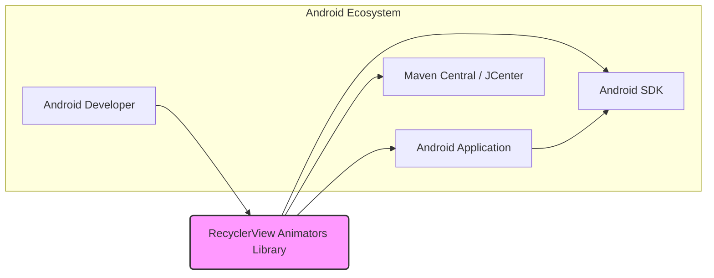
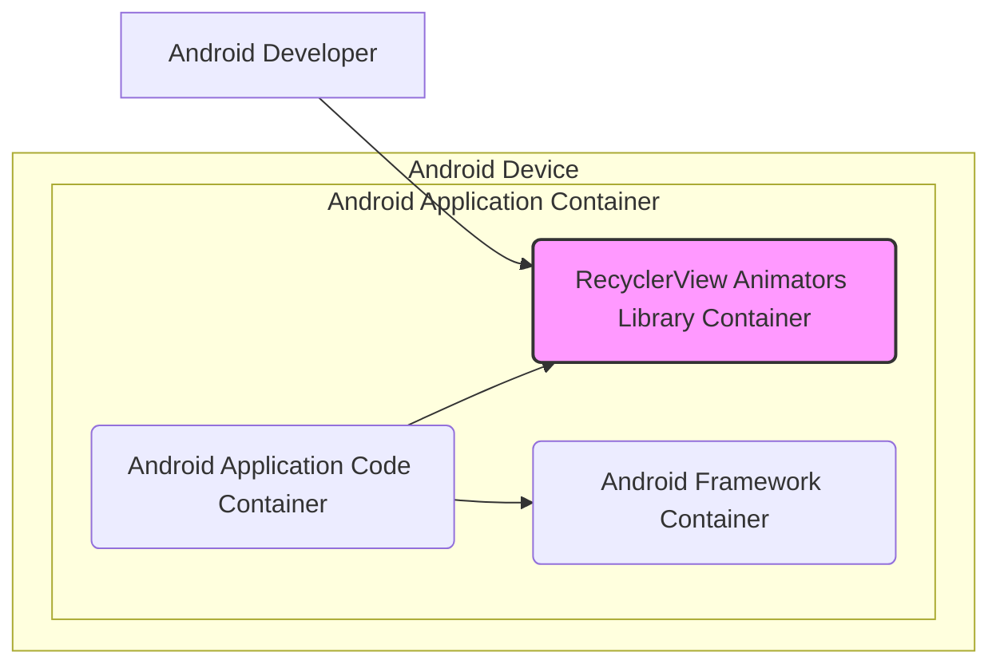
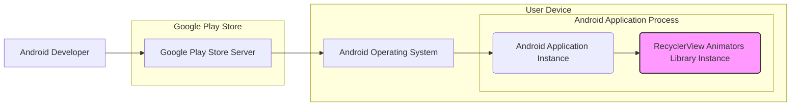

# BUSINESS POSTURE

This project provides a library of RecyclerView item animators for Android applications. The primary business goal for developers using this library is to enhance the user interface of their Android applications by adding visually appealing animations to RecyclerViews, improving user engagement and the overall user experience. This can lead to increased user satisfaction, better app store ratings, and potentially higher user retention.

The most important business risks associated with using this library are:
- Risk of introducing bugs or performance issues into applications due to library defects.
- Risk of security vulnerabilities within the library that could be exploited in applications using it.
- Risk of license incompatibility if the library's license is not compatible with the application's license.
- Risk of dependency on an external, potentially unmaintained, library.

# SECURITY POSTURE

Existing security controls:
- security control: Open source nature of the library allows for community review and scrutiny of the code. Source code is publicly available on GitHub.
- security control: Widespread use of the library in various Android applications implies a degree of implicit testing and bug discovery by the community.
- accepted risk: Dependency on a third-party library introduces a potential supply chain risk.
- accepted risk: Potential vulnerabilities in the library code might exist and could be exploited.

Recommended security controls:
- security control: Implement dependency scanning tools in the application's build pipeline to identify known vulnerabilities in the library and its dependencies.
- security control: Conduct license compliance checks to ensure the library's license is compatible with the application's license.
- security control: Regularly update the library to the latest version to benefit from bug fixes and security patches.
- security control: Perform code review of the library integration and usage within the application to ensure proper and secure implementation.

Security requirements:
- Authentication: Not applicable. This library does not handle user authentication. Authentication is the responsibility of the applications using this library.
- Authorization: Not applicable. This library does not handle user authorization. Authorization is the responsibility of the applications using this library.
- Input validation: Input validation is relevant for the parameters passed to the library's animation classes. Applications using this library should ensure that any data used to configure animations is properly validated to prevent unexpected behavior or crashes.
- Cryptography: Not applicable. This library does not handle cryptographic operations. Cryptography is the responsibility of the applications using this library if needed.

# DESIGN

## C4 CONTEXT



Context Diagram Elements:

- Name: Android Developer
  - Type: Person
  - Description: Software developers who build Android applications. They are the users of the RecyclerView Animators Library.
  - Responsibilities: Integrate the RecyclerView Animators Library into their Android applications to enhance UI animations. Configure and use the library correctly.
  - Security controls: Responsible for securely integrating and using the library within their applications. Follow secure coding practices when using the library.

- Name: RecyclerView Animators Library
  - Type: Software System
  - Description: An Android library providing a collection of pre-built item animations for RecyclerViews.
  - Responsibilities: Provide animation functionalities for RecyclerView items. Be a well-documented and easy-to-use library.
  - Security controls: Undergo community review due to its open-source nature. Maintain code quality to minimize potential vulnerabilities.

- Name: Android Application
  - Type: Software System
  - Description: Android applications developed by Android developers that utilize the RecyclerView Animators Library.
  - Responsibilities: Provide user functionality and experience. Integrate and utilize external libraries like RecyclerView Animators.
  - Security controls: Implement application-level security controls, including input validation, secure data handling, and dependency management.

- Name: Maven Central / JCenter
  - Type: External System
  - Description: Package repositories where the RecyclerView Animators Library is published and distributed.
  - Responsibilities: Host and distribute the library artifacts. Ensure availability and integrity of the packages.
  - Security controls: Implement security measures to protect the repository from unauthorized access and tampering.

- Name: Android SDK
  - Type: External System
  - Description: Android Software Development Kit, providing tools and libraries necessary for Android application development, including RecyclerView.
  - Responsibilities: Provide the base platform and libraries for Android development. Maintain security and stability of the Android platform.
  - Security controls: Regular updates and security patches provided by Google.

## C4 CONTAINER



Container Diagram Elements:

- Name: RecyclerView Animators Library Container
  - Type: Library Container
  - Description: This container represents the RecyclerView Animators Library itself, packaged as an Android Archive (AAR) file. It contains the compiled code and resources of the library.
  - Responsibilities: Provide animation classes and functionalities to Android applications.
  - Security controls: Code is publicly available for review. Potential security vulnerabilities are addressed through updates and community contributions.

- Name: Android Application Code Container
  - Type: Application Container
  - Description: This container represents the Android application code that integrates and uses the RecyclerView Animators Library.
  - Responsibilities: Implement application logic, user interface, and utilize external libraries to enhance functionality.
  - Security controls: Application developers are responsible for implementing security controls within their application code, including secure usage of libraries and data handling.

- Name: Android Framework Container
  - Type: Framework Container
  - Description: This container represents the Android Framework, which provides the underlying platform and APIs for Android applications to run. It includes components like RecyclerView and animation APIs.
  - Responsibilities: Provide the runtime environment and core functionalities for Android applications. Enforce platform-level security policies.
  - Security controls: Security controls are managed by the Android operating system and Google, including permission management, sandboxing, and regular security updates.

## DEPLOYMENT

Deployment of the RecyclerView Animators Library is not a standalone deployment. It is integrated into Android applications, and the applications are then deployed to Android devices. The deployment architecture described here is for an Android application that uses this library.



Deployment Diagram Elements:

- Name: Google Play Store Server
  - Type: Infrastructure
  - Description: Google's infrastructure for hosting and distributing Android applications.
  - Responsibilities: Host application packages (APKs). Manage application distribution and updates to user devices.
  - Security controls: Google Play Protect scans applications for malware. Secure communication channels for app uploads and downloads.

- Name: Android Operating System
  - Type: Infrastructure
  - Description: The operating system running on the user's Android device.
  - Responsibilities: Provide a secure runtime environment for applications. Manage application permissions and resource access.
  - Security controls: Android security features like sandboxing, permission system, and regular security updates.

- Name: Android Application Instance
  - Type: Software Instance
  - Description: A running instance of the Android application on a user's device, which incorporates the RecyclerView Animators Library.
  - Responsibilities: Execute application logic and provide user functionality, including using the animation library.
  - Security controls: Application-level security controls implemented by the developer. Operates within the Android OS security sandbox.

- Name: RecyclerView Animators Library Instance
  - Type: Software Instance
  - Description: Instance of the RecyclerView Animators Library running within the Android Application Process.
  - Responsibilities: Provide animation functionalities to the RecyclerView within the application.
  - Security controls: Inherits the security context of the Android Application Instance. Relies on the security of the library code and its integration.

## BUILD

```mermaid
flowchart LR
    A["Android Developer"] --> B{Code Changes}
    B --> C["Version Control System (e.g., Git)"]
    C --> D["Build Server (e.g., GitHub Actions, Local Machine)"]
    D --> E{Build Process (Gradle)}
    E --> F["Build Artifacts (AAR)"]
    F --> G["Maven Central / JCenter (Publish)"]

    style F fill:#f9f,stroke:#333,stroke-width:2px
```

Build Process Description:

1. Android Developer: Developers write and modify the code for the RecyclerView Animators Library.
2. Code Changes: Code modifications are made by developers.
3. Version Control System (e.g., Git): Code changes are committed and pushed to a version control system like Git, hosted on platforms like GitHub.
4. Build Server (e.g., GitHub Actions, Local Machine): A build server or the developer's local machine is used to automate the build process. For open-source projects like this, GitHub Actions is commonly used for CI/CD.
5. Build Process (Gradle): Gradle, the standard build tool for Android projects, is used to compile the code, run tests, and package the library into an AAR (Android Archive) file.
6. Build Artifacts (AAR): The output of the build process is the AAR file, which contains the compiled library.
7. Maven Central / JCenter (Publish): The AAR file is published to a package repository like Maven Central or JCenter, making it available for Android developers to include in their projects.

Security Controls in Build Process:

- security control: Version Control System (Git): Tracks code changes, enabling audit trails and rollback capabilities. Helps in identifying the source of changes and potential security issues.
- security control: Build Automation (Gradle, GitHub Actions): Automates the build process, ensuring consistency and reducing manual errors. Allows for integration of security checks into the build pipeline.
- security control: Dependency Management (Gradle): Gradle manages project dependencies, but dependency scanning is a recommended additional security control to identify vulnerable dependencies.
- security control: Code Review: While not explicitly in the diagram, code review before merging changes into the main branch is a crucial security control to catch potential vulnerabilities and code quality issues.
- security control: Signing of Artifacts: Publishing to Maven Central/JCenter usually involves signing the artifacts to ensure integrity and authenticity.

# RISK ASSESSMENT

Critical business process we are trying to protect:
- Secure and reliable development of Android applications that utilize third-party libraries to enhance user interface and user experience.
- Maintaining the integrity and security of Android applications that depend on external libraries.

Data we are trying to protect and their sensitivity:
- Android application code: Sensitive as it contains the application's logic and potentially business logic. Vulnerabilities in the library could indirectly expose application code to risks.
- User data within applications using the library: Indirectly relevant. If the library introduces vulnerabilities, it could potentially compromise the security of applications and the user data they handle. Sensitivity depends on the type of data the application processes (personal data, financial data, etc.).

# QUESTIONS & ASSUMPTIONS

BUSINESS POSTURE:
- Assumption: Developers using this library prioritize enhancing user experience and are willing to accept the inherent risks of using third-party libraries.
- Question: What is the risk tolerance of organizations using this library? Startups might have a higher risk tolerance compared to large enterprises.

SECURITY POSTURE:
- Assumption: Applications using this library follow standard Android security best practices.
- Question: What security measures are typically implemented in applications that will use this library? Are dependency scanning and license compliance checks part of their standard development process?

DESIGN:
- Assumption: The library is used as intended within the RecyclerView component of Android applications.
- Question: Are there any specific use cases or integrations of this library that might introduce unique security considerations? Are there any known compatibility issues with certain Android versions or devices that could have security implications?