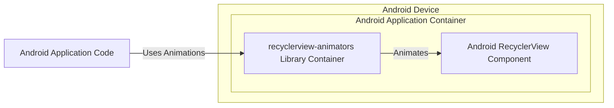
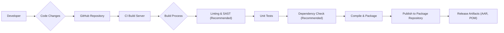

# BUSINESS POSTURE

This project is an open-source Android library that provides a collection of RecyclerView ItemAnimators. The primary goal is to enhance the user interface and user experience of Android applications by offering visually appealing and customizable animations for RecyclerViews.

* Business Priorities:
    * Provide a useful and high-quality animation library for Android developers.
    * Maintain compatibility with a wide range of Android versions.
    * Ensure ease of integration and use for developers.
    * Foster an active open-source community around the library.
* Business Goals:
    * Increase adoption and usage of the library by Android developers.
    * Expand the collection of available animations and customization options.
    * Maintain the library's quality and address bug reports and feature requests.
* Business Risks:
    * Library vulnerabilities could be introduced, impacting applications that depend on it.
    * Lack of maintenance or community support could lead to the library becoming outdated or unusable.
    * Security vulnerabilities in the build or distribution process could compromise the library.

# SECURITY POSTURE

* Security Control: Repository hosted on GitHub, providing version control and access management. Implemented by: GitHub platform.
* Security Control: Open-source project, allowing for community review and potential security audits. Implemented by: Open-source nature of the project.
* Accepted Risk: Reliance on community contributions for identifying and addressing security vulnerabilities.
* Accepted Risk: Potential vulnerabilities in third-party dependencies used by the library.

Recommended Security Controls:
* Recommended Security Control: Implement automated dependency scanning to identify known vulnerabilities in third-party libraries.
* Recommended Security Control: Integrate static analysis security testing (SAST) tools into the build process to detect potential code-level vulnerabilities.
* Recommended Security Control: Establish a clear process for reporting and handling security vulnerabilities.
* Recommended Security Control: Consider code signing for releases to ensure integrity and authenticity.

Security Requirements:
* Authentication: Not directly applicable to the library itself. Authentication is relevant for contributors to the repository (handled by GitHub).
* Authorization: Not directly applicable to the library itself. Authorization is relevant for managing access to the repository (handled by GitHub).
* Input Validation: While the library itself doesn't directly handle user input, it's important to ensure that the library's API is robust and handles unexpected or invalid input from developers using the library gracefully without causing crashes or unexpected behavior.
* Cryptography: Not directly applicable to this animation library. Cryptographic requirements might be relevant if the library were handling sensitive data, which is not the case here.

# DESIGN

## C4 CONTEXT

```mermaid
flowchart LR
    subgraph "Android Ecosystem"
        A["Android Developer"]
    end
    B("recyclerview-animators Library")
    C["Android Application"]
    D["Jitpack/Maven Central"]

    A -->|Uses| B
    B -->|Included in| C
    C -->|Runs on| "Android Device"
    B -->|Published to/Downloaded from| D
```

* Elements of Context Diagram:
    * Name: Android Developer
        * Type: Person
        * Description: Developers who build Android applications and want to add RecyclerView animations.
        * Responsibilities: Integrate the `recyclerview-animators` library into their Android projects.
        * Security controls: Responsible for securely integrating and using the library within their applications, following secure coding practices in their own projects.
    * Name: recyclerview-animators Library
        * Type: Software System
        * Description: An open-source Android library providing a collection of RecyclerView ItemAnimators.
        * Responsibilities: Provide animation functionalities for RecyclerViews. Be easily integrable and customizable.
        * Security controls:  Adhere to secure coding practices during development. Consider security scanning and dependency management.
    * Name: Android Application
        * Type: Software System
        * Description: Android applications that utilize the `recyclerview-animators` library to enhance their UI with animations.
        * Responsibilities:  Provide functionality to end-users. Utilize libraries like `recyclerview-animators` to improve user experience.
        * Security controls: Implement application-level security controls, including secure data handling, authentication, authorization, and input validation, independent of the animation library.
    * Name: Jitpack/Maven Central
        * Type: Software System
        * Description: Package repositories where the `recyclerview-animators` library is published and from where Android developers download it.
        * Responsibilities: Host and distribute the library artifacts. Ensure availability and integrity of packages.
        * Security controls: Implement security measures to protect the repository from unauthorized access and tampering. Provide secure download mechanisms (HTTPS).

## C4 CONTAINER



* Elements of Container Diagram:
    * Name: recyclerview-animators Library Container
        * Type: Library Container
        * Description:  The compiled and packaged `recyclerview-animators` library (e.g., AAR file). It contains the animation logic and related resources.
        * Responsibilities: Provide animation classes and functionalities to be used within Android applications.
        * Security controls:  Source code is reviewed on GitHub. Build process should include security checks (SAST, dependency scanning - recommended).
    * Name: Android RecyclerView Component
        * Type: Application Component
        * Description: The RecyclerView component within an Android application that utilizes the animations provided by the library.
        * Responsibilities: Display lists of data efficiently. Utilize animation capabilities to enhance user experience.
        * Security controls:  Security is primarily managed at the application level. RecyclerView itself is a standard Android component and assumed to be secure.
    * Name: Android Application Code
        * Type: Application Container
        * Description: The application code that integrates and uses the `recyclerview-animators` library and the RecyclerView component.
        * Responsibilities:  Orchestrate the application logic, including using the animation library to animate RecyclerView items.
        * Security controls: Application developers are responsible for the overall security of their application code, including how they use external libraries.

## DEPLOYMENT

```mermaid
flowchart LR
    subgraph "Jitpack/Maven Central Deployment Environment"
        A["Package Repository Server"]
    end
    subgraph "Developer Build Environment"
        B["Developer Workstation"]
        C["Build Server (CI)"]
    end

    B -->|Code Push| C
    C -->|Build & Publish| A
    A -->|Download Library| "Android Developer Environment"
```

* Elements of Deployment Diagram:
    * Name: Package Repository Server
        * Type: Infrastructure
        * Description: Servers hosting Jitpack and/or Maven Central repositories, responsible for storing and distributing the `recyclerview-animators` library.
        * Responsibilities:  Store and serve library artifacts. Ensure high availability and data integrity.
        * Security controls: Access control to the server infrastructure. Security measures to prevent unauthorized uploads or modifications of packages. HTTPS for secure downloads.
    * Name: Developer Workstation
        * Type: Infrastructure
        * Description: Developer's local machine where code is written, tested, and pushed to the repository.
        * Responsibilities: Code development, local testing, and contribution to the project.
        * Security controls: Developer workstation security practices (OS hardening, antivirus, etc.). Secure access to GitHub repository (SSH keys, HTTPS).
    * Name: Build Server (CI)
        * Type: Infrastructure
        * Description: Continuous Integration server (e.g., GitHub Actions, Jenkins) that automates the build, test, and publishing process of the library.
        * Responsibilities: Automate build, testing, and publishing. Ensure consistent and repeatable builds.
        * Security controls: Secure configuration of CI/CD pipelines. Access control to CI/CD system. Secrets management for publishing credentials. (Recommended: Security scanning integration in CI pipeline).

## BUILD



* Elements of Build Diagram:
    * Name: Developer
        * Type: Person
        * Description: Software developer contributing to the `recyclerview-animators` project.
        * Responsibilities: Write code, fix bugs, implement features, and contribute to the project.
        * Security controls: Secure coding practices. Secure access to development environment and GitHub.
    * Name: GitHub Repository
        * Type: Code Repository
        * Description: Central repository for source code, version control, and collaboration.
        * Responsibilities: Store and manage source code. Track changes and facilitate collaboration.
        * Security controls: Access control (GitHub permissions). Audit logs. Branch protection.
    * Name: CI Build Server
        * Type: Automation System
        * Description: Continuous Integration server that automates the build and release process.
        * Responsibilities: Automate build, test, and publishing. Ensure consistent builds.
        * Security controls: Access control to CI system. Secure pipeline configuration. Secrets management. (Recommended: Integration of security scanning tools).
    * Name: Build Process
        * Type: Automated Process
        * Description: Sequence of steps to compile, test, and package the library.
        * Responsibilities: Transform source code into distributable artifacts. Ensure code quality and functionality.
        * Security controls: (Recommended: Include linting, SAST, dependency checking). Unit tests to verify functionality.
    * Name: Linting & SAST (Recommended)
        * Type: Security Tool
        * Description: Static analysis tools to identify potential code quality issues and security vulnerabilities.
        * Responsibilities: Detect potential issues early in the development cycle. Improve code quality and security.
        * Security controls: Automated execution in CI pipeline. Configuration and maintenance of SAST tools.
    * Name: Unit Tests
        * Type: Automated Tests
        * Description: Automated tests to verify the functionality of the library components.
        * Responsibilities: Ensure code correctness and prevent regressions.
        * Security controls: Well-written tests can indirectly contribute to security by reducing bugs.
    * Name: Dependency Check (Recommended)
        * Type: Security Tool
        * Description: Tool to scan project dependencies for known vulnerabilities.
        * Responsibilities: Identify vulnerable dependencies. Alert developers to update or mitigate risks.
        * Security controls: Automated execution in CI pipeline. Database of known vulnerabilities.
    * Name: Compile & Package
        * Type: Build Step
        * Description: Compilation of source code and packaging into distributable artifacts (AAR, POM).
        * Responsibilities: Create deployable library artifacts.
        * Security controls: Ensure build process integrity. Verify build outputs.
    * Name: Publish to Package Repository
        * Type: Distribution Step
        * Description: Uploading the built artifacts to package repositories like Jitpack and Maven Central.
        * Responsibilities: Make the library available to Android developers.
        * Security controls: Secure credentials management for publishing. HTTPS for upload. (Recommended: Code signing).
    * Name: Release Artifacts (AAR, POM)
        * Type: Distribution Artifacts
        * Description: The final compiled and packaged library files (AAR, POM) ready for distribution.
        * Responsibilities: Provide the library in a usable format for developers.
        * Security controls: (Recommended: Code signing to ensure integrity and authenticity).

# RISK ASSESSMENT

* Critical Business Processes:
    * Maintaining the integrity and availability of the `recyclerview-animators` library in package repositories.
    * Ensuring that the library is free from vulnerabilities that could be exploited by malicious actors in applications that depend on it.
* Data to Protect:
    * Source code of the library: Sensitivity - Publicly available, but integrity is crucial to prevent malicious modifications.
    * Build artifacts (AAR, POM): Sensitivity - Publicly available, but integrity is crucial to prevent distribution of compromised libraries.
* Data Sensitivity: Publicly available code and artifacts, but integrity is paramount for supply chain security.

# QUESTIONS & ASSUMPTIONS

Questions:
* What is the current process for handling bug reports and security vulnerabilities?
* Are there any automated security checks currently in place in the build process (e.g., dependency scanning, SAST)?
* Is there a process for code signing releases?
* What are the criteria for accepting contributions, and is there any security review process for contributions?

Assumptions:
* The project is primarily maintained by the open-source community.
* The library is distributed through standard package repositories like Jitpack and Maven Central.
* The build process is automated using a CI system (likely GitHub Actions or similar).
* Security is considered important, but might not be the primary focus compared to functionality and ease of use.
* Developers using the library are responsible for the overall security of their Android applications.