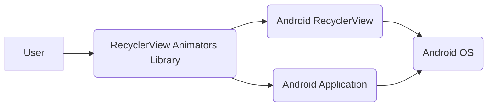
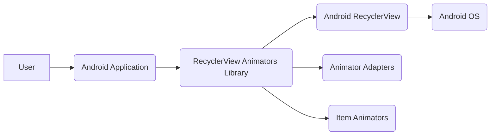
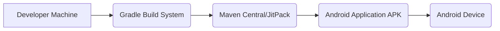
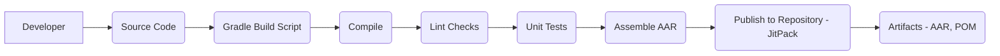

# Project Design Document: RecyclerView Animators

## BUSINESS POSTURE

*   Priorities and Goals:
    *   Provide an easy-to-use library for adding animations to RecyclerView items in Android applications.
    *   Enhance the user experience by making list interactions more visually appealing.
    *   Offer a variety of pre-built animations for common use cases.
    *   Allow developers to easily customize and extend the animations.
    *   Maintain a lightweight and performant library.

*   Business Risks:
    *   Performance issues: Poorly optimized animations could lead to janky scrolling or UI freezes, negatively impacting the user experience.
    *   Compatibility issues: The library might not be compatible with all RecyclerView versions or other related libraries, limiting its adoption.
    *   Maintenance overhead: As the library gains popularity, maintaining it and addressing user issues could become time-consuming.
    *   Lack of adoption: If the library doesn't provide significant value or is difficult to use, it might not gain traction among developers.
    *   Security vulnerabilities: While unlikely for a UI animation library, vulnerabilities could potentially be introduced through dependencies or custom animation implementations.

## SECURITY POSTURE

*   Existing Security Controls:
    *   security control: The library itself does not handle sensitive data or perform security-critical operations. Its primary function is to provide visual animations. (Implicit in the library's purpose)
    *   security control: Dependency management: The project uses Gradle for dependency management, allowing for version control and updates. (build.gradle)
    *   security control: Code style and linting: The project uses a consistent code style, which can help prevent some types of errors. (Implicit in the code structure)

*   Accepted Risks:
    *   accepted risk: The library does not implement specific security measures beyond standard Android development practices. This is acceptable given its limited scope and functionality.
    *   accepted risk: The library relies on external dependencies (e.g., Android support libraries). Vulnerabilities in these dependencies could potentially affect the library.

*   Recommended Security Controls:
    *   security control: Regularly update dependencies to their latest secure versions to mitigate potential vulnerabilities in third-party libraries.
    *   security control: Integrate static analysis tools (e.g., FindBugs, PMD, Android Lint) into the build process to identify potential code quality and security issues.
    *   security control: Consider using a dependency vulnerability scanner (e.g., OWASP Dependency-Check) to automatically identify known vulnerabilities in project dependencies.

*   Security Requirements:

    *   Authentication: Not applicable, as the library does not handle user authentication.
    *   Authorization: Not applicable, as the library does not control access to resources.
    *   Input Validation: Not directly applicable, but developers using the library should ensure proper input validation in their own code when handling user input that might affect animations.
    *   Cryptography: Not applicable, as the library does not handle encryption or other cryptographic operations.

## DESIGN

### C4 CONTEXT

*   Elements:

    *   1.  Name: User
        *   Type: Person
        *   Description: The user of the Android application that utilizes the RecyclerView Animators library.
        *   Responsibilities: Interacts with the Android application, triggering RecyclerView animations.
        *   Security controls: None specific to this library. Relies on the security of the Android application and OS.

    *   2.  Name: RecyclerView Animators Library
        *   Type: Software System
        *   Description: The library providing animations for RecyclerView items.
        *   Responsibilities: Provides pre-built and customizable animations for RecyclerView.
        *   Security controls: Dependency management, code style, and linting.

    *   3.  Name: Android RecyclerView
        *   Type: Software System
        *   Description: The standard Android UI component for displaying lists and grids.
        *   Responsibilities: Manages the display and scrolling of list items.
        *   Security controls: Relies on the security of the Android OS.

    *   4.  Name: Android Application
        *   Type: Software System
        *   Description: The application that integrates the RecyclerView Animators library.
        *   Responsibilities: Implements the application logic and UI, including the RecyclerView.
        *   Security controls: The application is responsible for its own security, including data handling, authentication, and authorization.

    *   5.  Name: Android OS
        *   Type: Software System
        *   Description: The underlying operating system for the Android device.
        *   Responsibilities: Provides the core functionality and security features for the device.
        *   Security controls: Android OS security features, including sandboxing, permissions, and system updates.

### C4 CONTAINER

*   Elements:

    *   1.  Name: User
        *   Type: Person
        *   Description: The user of the Android application.
        *   Responsibilities: Interacts with the application.
        *   Security controls: None specific to this library.

    *   2.  Name: Android Application
        *   Type: Mobile App
        *   Description: The application using the RecyclerView Animators library.
        *   Responsibilities: Handles application logic and UI.
        *   Security controls: Application-specific security measures.

    *   3.  Name: RecyclerView Animators Library
        *   Type: Library
        *   Description: Provides animations for RecyclerView.
        *   Responsibilities: Offers pre-built and customizable animations.
        *   Security controls: Dependency management, code style.

    *   4.  Name: Android RecyclerView
        *   Type: Library
        *   Description: Standard Android UI component for lists/grids.
        *   Responsibilities: Manages list display and scrolling.
        *   Security controls: Relies on Android OS security.

    *   5.  Name: Animator Adapters
        *   Type: Component
        *   Description: Adapters that bridge RecyclerView and animators.
        *   Responsibilities: Connect RecyclerView events to animation triggers.
        *   Security controls: None specific.

    *   6.  Name: Item Animators
        *   Type: Component
        *   Description: Classes that define specific animations.
        *   Responsibilities: Implement the visual animation logic.
        *   Security controls: None specific.

    *   7.  Name: Android OS
        *   Type: Operating System
        *   Description: Underlying operating system.
        *   Responsibilities: Provides core functionality and security.
        *   Security controls: Android OS security features.

### DEPLOYMENT

*   Possible Deployment Solutions:
    *   1.  Direct integration via Gradle: Developers include the library as a dependency in their app's build.gradle file. This is the most common and recommended approach.
    *   2.  Manual AAR integration: Developers download the AAR file and manually add it to their project's libs folder. This is less common and requires manual updates.
    *   3.  JitPack: The library is published on JitPack, allowing developers to easily include it using JitPack's repository URL.

*   Chosen Solution (Direct integration via Gradle):

*   Elements:

    *   1.  Name: Developer Machine
        *   Type: Workstation
        *   Description: The developer's computer where the Android application code is written and built.
        *   Responsibilities: Hosts the development environment, source code, and build tools.
        *   Security controls: Developer machine security (antivirus, firewall, etc.).

    *   2.  Name: Gradle Build System
        *   Type: Build Tool
        *   Description: The build system used for Android projects.
        *   Responsibilities: Manages dependencies, compiles code, and packages the application.
        *   Security controls: Dependency management, build script security.

    *   3.  Name: Maven Central/JitPack
        *   Type: Repository
        *   Description: Repository hosting the RecyclerView Animators library.
        *   Responsibilities: Stores and provides access to library artifacts.
        *   Security controls: Repository security measures (access control, integrity checks).

    *   4.  Name: Android Application APK
        *   Type: Application Package
        *   Description: The packaged Android application, including the RecyclerView Animators library.
        *   Responsibilities: Contains all the code and resources for the application.
        *   Security controls: APK signing, code obfuscation (if enabled).

    *   5.  Name: Android Device
        *   Type: Mobile Device
        *   Description: The device where the application is installed and run.
        *   Responsibilities: Executes the application.
        *   Security controls: Android OS security features.

### BUILD

The build process for RecyclerView Animators is typical for an Android library project.

*   Process:

    1.  Developer: The developer writes and modifies the library's source code.
    2.  Source Code: The Java/Kotlin code for the library.
    3.  Gradle Build Script: The build.gradle file defines the build process, dependencies, and publishing configuration.
    4.  Compile: The source code is compiled into bytecode.
    5.  Lint Checks: Static analysis tools (Android Lint) check the code for potential issues.
    6.  Unit Tests: Unit tests are executed to verify the functionality of individual components.
    7.  Assemble AAR: The compiled code and resources are packaged into an Android Archive (AAR) file.
    8.  Publish to Repository (JitPack): The AAR file and associated metadata (POM file) are published to JitPack.
    9.  Artifacts (AAR, POM): The final build artifacts are the AAR file and the POM file, which are used by developers to include the library in their projects.

*   Security Controls:

    *   Dependency Management: Gradle manages dependencies, allowing for version control and updates.
    *   Lint Checks: Static analysis helps identify potential code quality and security issues.
    *   Unit Tests: Testing helps ensure the code functions as expected and can catch regressions.
    *   Repository Security: JitPack provides a secure platform for hosting and distributing the library.

## RISK ASSESSMENT

*   Critical Business Process: Providing a smooth and visually appealing user experience for Android applications using RecyclerViews.

*   Data Protection: The library itself does not handle any sensitive data. The primary concern is the performance and stability of the application using the library. Data sensitivity is entirely dependent on the application integrating the library.

## QUESTIONS & ASSUMPTIONS

*   Questions:
    *   Are there any specific performance requirements or limitations for the library (e.g., target frame rate, maximum device memory usage)?
    *   Are there any plans to support additional animation types or features in the future?
    *   Are there any specific Android versions or RecyclerView versions that the library must support?
    *   What is the process for reporting and addressing security vulnerabilities in the library?

*   Assumptions:
    *   BUSINESS POSTURE: The library is intended for general use and does not target any specific industry or regulatory requirements.
    *   SECURITY POSTURE: Standard Android development practices are followed, and the library does not require any specialized security measures beyond those typically used in Android development.
    *   DESIGN: The library is designed to be lightweight and easy to integrate with existing Android projects. The provided design reflects the current state of the library and its intended use.