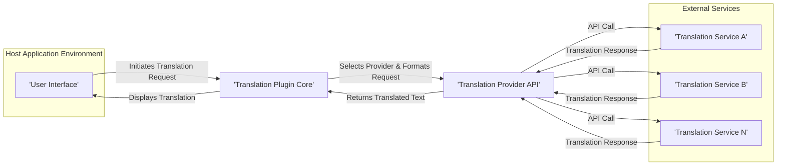

# Project Design Document: Translation Plugin

**Version:** 1.1
**Date:** October 26, 2023
**Author:** AI Architecture Expert

## 1. Introduction

This document provides a detailed design for the Translation Plugin project, based on the information available at [https://github.com/yiiguxing/translationplugin](https://github.com/yiiguxing/translationplugin). This document will serve as a foundation for subsequent threat modelling activities. The plugin's primary function is to enable seamless text translation within a host application, likely by interacting with external translation services. This document outlines the plugin's architecture, components, data flow, security considerations, and other relevant details.

## 2. Project Goals

*   Provide a user-friendly and intuitive interface for translating text selections within the host application.
*   Support integration with multiple translation providers, offering flexibility and choice to the user.
*   Allow users to configure translation settings, such as source and target languages, and preferred providers.
*   Integrate seamlessly with the host application's user interface and workflow, minimizing disruption.
*   Ensure secure and reliable communication with external translation providers, protecting sensitive data like API keys and the text being translated.
*   Maintain a modular design to facilitate future extensions and the addition of new translation providers.

## 3. System Architecture

The Translation Plugin operates as an extension within a host application. Its core functionality revolves around intercepting user requests, communicating with translation services, and presenting the results.

## 4. Component Description

The Translation Plugin is likely structured into the following key components:

*   **User Interface (UI) Integration Components:**
    *   **Text Selection Listener:** Monitors user interactions within the host application to identify selected text intended for translation.
    *   **Translation Invocation Mechanism:** Provides a way for the user to trigger the translation process (e.g., context menu item, button, keyboard shortcut).
    *   **Translation Display Area:** Presents the translated text to the user, potentially as an overlay, in a separate window, or by replacing the original text (with an option to revert).
    *   **Settings Panel:** Allows users to configure plugin settings, including:
        *   Preferred translation providers and their associated API keys.
        *   Default source and target languages.
        *   Display preferences for the translated text.
*   **Core Logic Components:**
    *   **Text Extraction Module:** Responsible for reliably extracting the selected text from the host application, handling different text formats and encoding.
    *   **Provider Configuration Manager:** Stores and retrieves configuration details for different translation providers, including API endpoints and authentication methods.
    *   **Translation Request Handler:** Orchestrates the translation process:
        *   Receives the text to be translated and user settings.
        *   Selects the appropriate translation provider based on configuration.
        *   Formats the translation request according to the provider's API specifications.
    *   **API Communication Module:** Manages communication with external translation provider APIs:
        *   Handles HTTP requests and responses.
        *   Implements necessary authentication mechanisms (e.g., API keys, OAuth).
        *   Implements retry logic for transient network errors.
        *   Parses the translation response and extracts the translated text.
        *   Implements error handling for API communication failures and provider-specific errors.
    *   **Caching Mechanism (Optional but Recommended):** Stores recent translation results to improve performance and reduce unnecessary API calls to translation providers. This cache should be configurable and potentially time-limited.
    *   **Logging and Monitoring Module:** Records plugin activity, errors, and performance metrics for debugging and monitoring purposes. This should be configurable to control the level of detail logged.
*   **External Dependencies:**
    *   **Translation Provider APIs:**  Specific APIs offered by services like Google Translate API, DeepL API, Microsoft Translator API, etc.
    *   **HTTP Client Library:** A library for making HTTP requests (e.g., `axios`, `fetch`, `requests`).
    *   **Configuration Management Library:** A library for managing plugin settings (e.g., reading and writing configuration files).
    *   **Logging Library:** A library for logging events and errors.
    *   **Potentially UI Framework Libraries:** Depending on the host application's plugin architecture (e.g., React, Angular, native UI libraries).

## 5. Data Flow

The process of translating text involves the following data flow:

Detailed steps in the data flow:

*   The **User Selects Text** within the host application's interface.
*   The **Text Extraction** module retrieves the selected text, potentially handling encoding and formatting.
*   The **Provider Selection** module determines the translation provider to use based on user configuration and availability.
*   The **API Request Formatting** module constructs the API request, including the text, target language, and authentication credentials.
*   The **API Communication** module sends the request to the **Translation Provider API** over HTTPS.
*   The **Translation Provider API** processes the request and returns the translated text.
*   The **API Communication** module receives the translation response.
*   The **Response Parsing** module extracts the translated text from the API response.
*   The **Caching (Optional)** module stores the original text and its translation for future use.
*   The **Display Translated Text** module presents the translated text to the user within the host application.

## 6. Security Considerations

Security is paramount for this plugin, especially given the handling of user-selected text and potentially sensitive API keys.

*   **Secure API Key Management:**
    *   API keys for translation providers should be stored securely, preferably using the host application's secure credential storage mechanisms or an encrypted configuration file.
    *   Avoid hardcoding API keys directly in the plugin's code.
    *   Consider implementing a mechanism for users to manage and update their API keys.
    *   Explore options for key rotation if supported by the translation provider.
*   **Secure Data Transmission:**
    *   All communication with translation providers MUST be over HTTPS to ensure encryption and protect data in transit.
    *   Avoid sending unnecessary data to the translation providers. Only send the text to be translated and necessary language parameters.
*   **Input Validation and Sanitization:**
    *   Sanitize the text selected by the user before sending it to the translation provider to prevent potential injection attacks or unexpected behavior on the provider's side.
    *   Validate the response received from the translation provider to ensure it is in the expected format and does not contain malicious content before displaying it to the user.
*   **Access Control and Permissions:**
    *   If the plugin requires specific permissions within the host application, ensure these are clearly defined and follow the principle of least privilege.
    *   Consider if any internal access controls are needed within the plugin itself.
*   **Dependency Security:**
    *   Regularly audit and update the plugin's dependencies to patch known security vulnerabilities.
    *   Use dependency management tools to track and manage dependencies.
    *   Consider using software composition analysis (SCA) tools to identify potential vulnerabilities in third-party libraries.
*   **Error Handling and Logging:**
    *   Implement robust error handling to prevent the plugin from crashing or exposing sensitive information in error messages.
    *   Log errors and important events securely, avoiding logging sensitive data like API keys or the full text being translated.
    *   Ensure log files are protected from unauthorized access.
*   **Data Privacy and Compliance:**
    *   Understand the privacy policies of the translation providers being used and ensure they are compliant with relevant regulations (e.g., GDPR).
    *   Inform users about the data being sent to translation providers and how it is being used.
    *   Consider offering users control over which translation providers are used, allowing them to choose providers with privacy policies they are comfortable with.
    *   If caching translations, consider the privacy implications and implement appropriate measures to protect cached data.

## 7. Deployment Considerations

*   **Plugin Packaging and Distribution:** Determine how the plugin will be packaged and distributed to users of the host application (e.g., as a file, through a plugin marketplace).
*   **Installation Process:** Define a clear and straightforward installation process for users.
*   **Configuration Management:** Provide a user-friendly way to configure the plugin, including setting API keys and choosing default languages. This could involve a graphical interface or configuration files.
*   **Host Application Compatibility:** Clearly document the versions of the host application that the plugin is compatible with.
*   **Resource Requirements:**  Document the plugin's resource requirements (e.g., memory, network access) to ensure smooth operation.
*   **Update Mechanism:** Consider how updates to the plugin will be managed and deployed.

## 8. Technology Stack (Likely)

The technology stack will depend on the host application's architecture and supported technologies. Potential technologies include:

*   **Programming Language:**
    *   JavaScript/TypeScript (common for web-based applications and some desktop applications).
    *   Python (often used for scripting and backend tasks).
    *   Java (common for enterprise applications).
    *   C# (.NET framework, often used for Windows applications).
    *   Potentially other languages depending on the host application.
*   **Networking Libraries:**
    *   `axios` or `fetch` (JavaScript).
    *   `requests` (Python).
    *   `HttpURLConnection` (Java).
    *   `HttpClient` (.NET).
*   **Configuration Management:**
    *   JSON or YAML for configuration files.
    *   Libraries specific to the chosen programming language for parsing configuration files.
*   **UI Framework (if applicable):**
    *   React, Angular, Vue.js (for web-based UIs).
    *   Native UI libraries of the host application's platform (e.g., Electron, native desktop frameworks).
*   **Logging Libraries:**
    *   `console.log` (JavaScript - for basic logging).
    *   `winston` or `morgan` (Node.js).
    *   `logging` module (Python).
    *   Log4j or SLF4j (Java).
    *   `NLog` or `log4net` (.NET).

## 9. Assumptions and Constraints

*   The plugin is designed to operate within the context of a pre-existing host application.
*   The core translation functionality relies on external translation provider APIs.
*   Users are responsible for obtaining and configuring their own API keys for certain translation providers, if required.
*   The plugin's primary focus is on translating text selected by the user within the host application.
*   The plugin's development will adhere to the security best practices outlined in this document.
*   The performance of the plugin is dependent on the responsiveness and availability of the external translation provider APIs.
