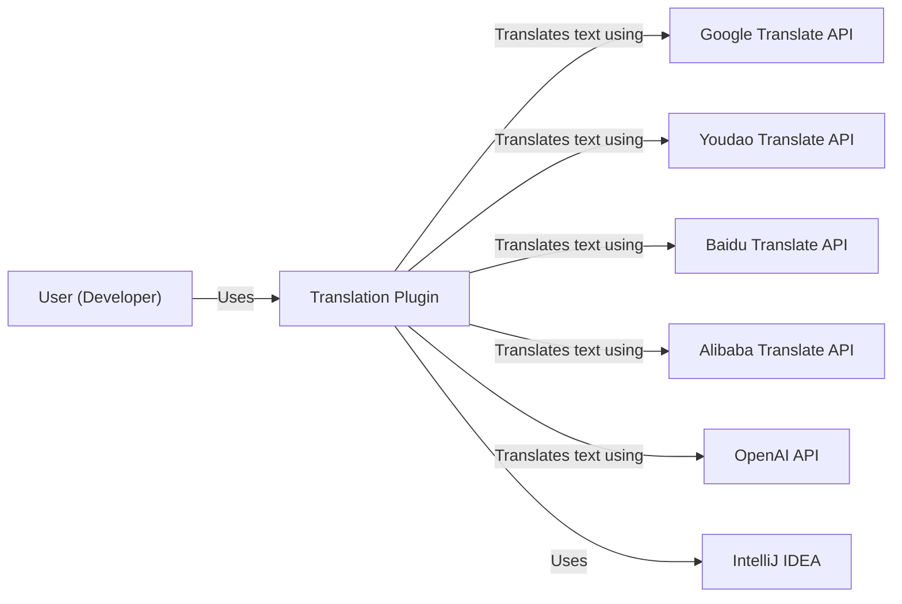
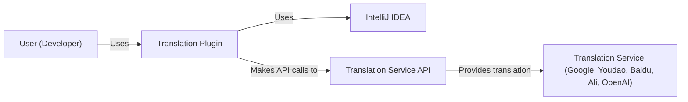
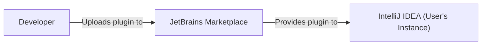
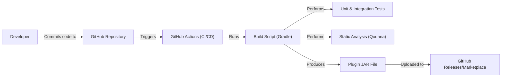

Okay, let's create a design document for the "Translation Plugin" based on the provided GitHub repository.

# BUSINESS POSTURE

Business Priorities and Goals:

*   Provide seamless and efficient text translation within the IntelliJ IDEA platform.
*   Support a wide range of languages and translation engines.
*   Enhance developer productivity by integrating translation directly into the IDE workflow.
*   Offer a user-friendly and intuitive interface for translation tasks.
*   Maintain a high level of accuracy and reliability in translations.
*   Provide customization options for translation settings and preferences.
*   Ensure the plugin is lightweight and does not significantly impact IDE performance.

Most Important Business Risks:

*   Inaccurate or unreliable translations leading to misinterpretations or errors in development.
*   Compatibility issues with different versions of IntelliJ IDEA or supported translation engines.
*   Poor user experience or performance issues hindering developer productivity.
*   Security vulnerabilities exposing user data or compromising the IDE environment.
*   Lack of support for required languages or translation engines limiting the plugin's usefulness.
*   Failure to comply with relevant data privacy regulations (e.g., GDPR) if user data is processed.

# SECURITY POSTURE

Existing Security Controls:

*   security control: API Key Management: The plugin relies on API keys for accessing various translation services (e.g., Google Translate, Youdao Translate). These keys are stored within the IDE's settings. (Implementation: Plugin settings)
*   security control: Data Minimization: Only the text selected for translation is sent to the external translation service. No other user data or code is transmitted. (Implementation: Plugin code)
*   security control: HTTPS Connections: Communication with translation services is performed over HTTPS to ensure data confidentiality and integrity in transit. (Implementation: Plugin code, usage of HTTP client libraries)
*   security control: Input Validation: The plugin likely performs some basic input validation to prevent excessively large text inputs or potentially malicious characters, although this needs to be confirmed in the code. (Implementation: Plugin code)
*   security control: Dependency Management: The project uses Gradle for dependency management, which helps in tracking and updating third-party libraries. (Implementation: build.gradle)
*   security control: Open Source Code: The project is open source, allowing for community review and identification of potential security vulnerabilities. (Implementation: GitHub repository)

Accepted Risks:

*   accepted risk: API Key Exposure: If the user's IDE configuration is compromised, API keys stored within the settings could be exposed.
*   accepted risk: Third-Party Service Dependency: The plugin's functionality relies on the availability and security of external translation services. Any vulnerability or outage in these services could impact the plugin.
*   accepted risk: Lack of Formal Security Audits: While the code is open source, it's not clear if formal security audits or penetration testing have been conducted.

Recommended Security Controls:

*   security control: Secure Storage of API Keys: Instead of storing API keys directly in the plugin settings, consider using the IDE's built-in credential store or a dedicated secrets management solution for enhanced security.
*   security control: Input Sanitization: Implement robust input sanitization to prevent potential injection attacks or other vulnerabilities related to user-provided text.
*   security control: Rate Limiting: Implement rate limiting to prevent abuse of the translation services and potential denial-of-service attacks.
*   security control: Content Security Policy (CSP): If the plugin uses any web views or embedded browsers, implement a CSP to mitigate the risk of cross-site scripting (XSS) attacks.
*   security control: Regular Security Audits: Conduct periodic security audits and penetration testing to identify and address potential vulnerabilities.
*   security control: Dependency Scanning: Integrate automated dependency scanning tools (e.g., Snyk, Dependabot) into the build process to identify and remediate known vulnerabilities in third-party libraries.

Security Requirements:

*   Authentication:
    *   The plugin itself does not require user authentication, as it leverages the user's existing IDE environment.
    *   Authentication to translation services is handled via API keys.
*   Authorization:
    *   The plugin should only allow authorized users (i.e., those with valid API keys) to access translation services.
    *   Access control should be enforced by the translation service provider based on the API key.
*   Input Validation:
    *   The plugin must validate all user input (text to be translated) to prevent excessively large inputs, invalid characters, and potential injection attacks.
    *   Input validation should be performed before sending data to external services.
*   Cryptography:
    *   All communication with translation services must be encrypted using HTTPS (TLS/SSL).
    *   API keys should be stored securely, preferably using the IDE's built-in credential management features.
*   Data Privacy
    *   Plugin should adhere to GDPR and other privacy regulations.

# DESIGN

## C4 CONTEXT

Element Descriptions:

*   Element:
    *   Name: User (Developer)
    *   Type: Person
    *   Description: A software developer using IntelliJ IDEA.
    *   Responsibilities: Selects text, invokes translation actions, views translated text.
    *   Security Controls: N/A (External to the system)

*   Element:
    *   Name: Translation Plugin
    *   Type: Software System
    *   Description: An IntelliJ IDEA plugin that provides text translation capabilities.
    *   Responsibilities: Manages user interactions, communicates with translation services, displays translated text, handles settings and configuration.
    *   Security Controls: API Key Management, Data Minimization, HTTPS Connections, Input Validation (basic).

*   Element:
    *   Name: Google Translate API
    *   Type: External System
    *   Description: Google's cloud-based translation service.
    *   Responsibilities: Provides text translation services.
    *   Security Controls: Managed by Google (External to the system)

*   Element:
    *   Name: Youdao Translate API
    *   Type: External System
    *   Description: Youdao's cloud-based translation service.
    *   Responsibilities: Provides text translation services.
    *   Security Controls: Managed by Youdao (External to the system)

*   Element:
    *   Name: Baidu Translate API
    *   Type: External System
    *   Description: Baidu's cloud-based translation service.
    *   Responsibilities: Provides text translation services.
    *   Security Controls: Managed by Baidu (External to the system)

*   Element:
    *   Name: Alibaba Translate API
    *   Type: External System
    *   Description: Alibaba's cloud-based translation service.
    *   Responsibilities: Provides text translation services.
    *   Security Controls: Managed by Alibaba (External to the system)

*   Element:
    *   Name: OpenAI API
    *   Type: External System
    *   Description: OpenAI's cloud-based service.
    *   Responsibilities: Provides text translation services.
    *   Security Controls: Managed by OpenAI (External to the system)

*   Element:
    *   Name: IntelliJ IDEA
    *   Type: External System
    *   Description: The IntelliJ IDEA integrated development environment.
    *   Responsibilities: Provides the platform for the plugin to run.
    *   Security Controls: Managed by JetBrains (External to the system)

## C4 CONTAINER

Element Descriptions:

*   Element:
    *   Name: User (Developer)
    *   Type: Person
    *   Description: A software developer using IntelliJ IDEA.
    *   Responsibilities: Selects text, invokes translation actions, views translated text.
    *   Security Controls: N/A (External to the system)

*   Element:
    *   Name: Translation Plugin
    *   Type: Plugin
    *   Description: The core component of the system, running within IntelliJ IDEA.
    *   Responsibilities: Handles user interactions, manages API keys, communicates with the Translation Service API, displays translations, manages settings.
    *   Security Controls: API Key Management, Data Minimization, HTTPS Connections, Input Validation.

*   Element:
    *   Name: IntelliJ IDEA
    *   Type: IDE
    *   Description: The IntelliJ IDEA integrated development environment.
    *   Responsibilities: Provides the platform and API for the plugin.
    *   Security Controls: Managed by JetBrains (External to the system).

*   Element:
    *   Name: Translation Service API
    *   Type: API
    *   Description: A generic representation of the API provided by the various translation services.
    *   Responsibilities: Accepts translation requests, returns translated text.
    *   Security Controls: HTTPS Connections, API Key Authentication (managed by the service provider).

*   Element:
    *   Name: Translation Service (Google, Youdao, Baidu, Ali, OpenAI)
    *   Type: External Service
    *   Description: The actual translation service (e.g., Google Translate, Youdao Translate).
    *   Responsibilities: Performs the text translation.
    *   Security Controls: Managed by the service provider (External to the system).

## DEPLOYMENT

Possible Deployment Solutions:

1.  JetBrains Marketplace: The standard and recommended way to distribute IntelliJ IDEA plugins.
2.  Manual Installation: Users can download the plugin JAR file and install it manually.
3.  Custom Plugin Repository: Organizations can host their own plugin repository for internal distribution.

Chosen Solution (JetBrains Marketplace):

Element Descriptions:

*   Element:
    *   Name: Developer
    *   Type: Person
    *   Description: The developer of the Translation Plugin.
    *   Responsibilities: Builds and packages the plugin, uploads it to the JetBrains Marketplace.
    *   Security Controls: N/A (External to the system)

*   Element:
    *   Name: JetBrains Marketplace
    *   Type: Software System
    *   Description: The official repository for IntelliJ IDEA plugins.
    *   Responsibilities: Hosts and distributes plugins, manages updates.
    *   Security Controls: Managed by JetBrains (External to the system)

*   Element:
    *   Name: IntelliJ IDEA (User's Instance)
    *   Type: Software System
    *   Description: The user's local installation of IntelliJ IDEA.
    *   Responsibilities: Downloads and installs the plugin from the JetBrains Marketplace.
    *   Security Controls: Managed by JetBrains and the user (External to the system)

## BUILD

Build Process Description:

1.  Developer commits code changes to the GitHub repository.
2.  GitHub Actions is triggered by the commit.
3.  The build script (Gradle) is executed.
4.  Unit and integration tests are run.
5.  Static analysis is performed using Qodana (as configured in the `.github/workflows` files).
6.  If all tests and analysis pass, the plugin JAR file is created.
7.  The JAR file is uploaded as a GitHub Release and/or to the JetBrains Marketplace.

Security Controls in Build Process:

*   security control: Version Control (Git): All code changes are tracked in a Git repository, providing an audit trail.
*   security control: CI/CD (GitHub Actions): Automated build and testing processes ensure consistency and reduce the risk of manual errors.
*   security control: Automated Testing: Unit and integration tests help identify bugs and regressions early in the development cycle.
*   security control: Static Analysis (Qodana): Qodana is used to identify potential code quality and security issues.
*   security control: Dependency Management (Gradle): Gradle manages dependencies, making it easier to track and update third-party libraries.
*   security control: Build Artifact (JAR File): The final output is a packaged JAR file, ready for distribution.

# RISK ASSESSMENT

Critical Business Processes:

*   Providing accurate and reliable text translation within the IntelliJ IDEA environment.
*   Maintaining user productivity by offering a seamless and efficient translation workflow.

Data We Are Trying to Protect:

*   Text to be translated (Potentially Sensitive): The primary data being processed is the text that the user selects for translation. This text could contain sensitive information, such as proprietary code, confidential documents, or personal data. Sensitivity: Variable, depending on the user's input.
*   API Keys (Sensitive): The API keys used to access translation services are sensitive credentials that must be protected. Sensitivity: High.
*   Plugin Settings (Low Sensitivity): User preferences and settings related to the plugin. Sensitivity: Low.

# QUESTIONS & ASSUMPTIONS

Questions:

*   Are there any specific compliance requirements (e.g., GDPR, HIPAA) that the plugin must adhere to?
*   What is the expected volume of translation requests? This will help determine the need for rate limiting and scaling.
*   Are there any specific security requirements or concerns from the JetBrains Marketplace review process?
*   What level of logging is required for auditing and troubleshooting purposes?
*   What is the process for handling security vulnerabilities reported by users or researchers?

Assumptions:

*   BUSINESS POSTURE: The primary goal is to provide a useful and convenient translation tool for developers.  Profitability is likely secondary, driven by increased user satisfaction and potentially attracting users to paid versions of IntelliJ IDEA or related services.
*   SECURITY POSTURE: The plugin will be used in a variety of environments, including personal and corporate settings.  A reasonable level of security is expected, but extreme measures (e.g., FIPS 140-2 compliance) are likely not required.
*   DESIGN: The plugin will primarily interact with external translation services via their APIs.  The plugin itself will not store any significant amount of user data persistently. The user is responsible for managing their own API keys and understanding the terms of service of the chosen translation provider.