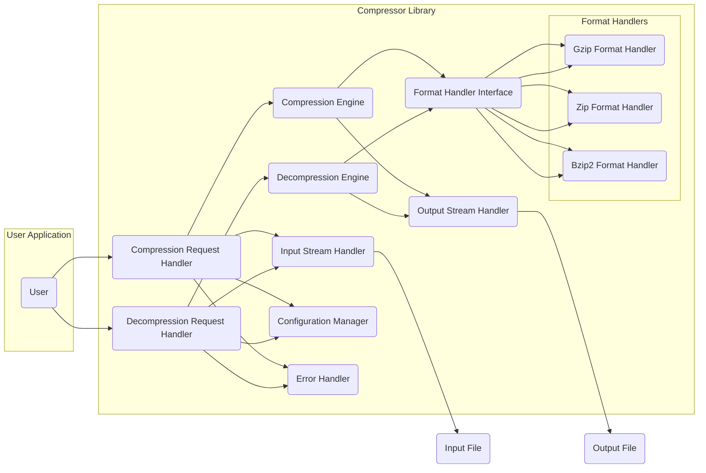
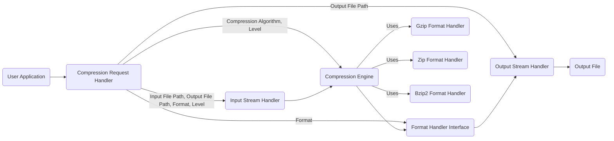
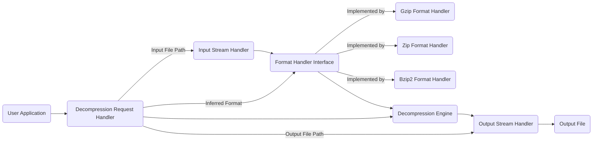

# Project Design Document: Compressor Library

**Version:** 1.1
**Date:** October 26, 2023
**Author:** AI Software Architect

## 1. Introduction

This document provides an enhanced and more detailed design for the "Compressor" library, a software component focused on delivering efficient and reliable file compression and decompression functionalities. This refined design builds upon the previous version, offering greater clarity and depth, particularly in areas relevant to security analysis and threat modeling. This document will serve as the primary reference for development and will be a key input for subsequent threat modeling activities. The design continues to emphasize modularity, maintainability, and security.

## 2. Goals and Objectives

The primary goals of the Compressor library remain:

*   Provide a simple and intuitive Application Programming Interface (API) for seamless integration into user applications for compressing and decompressing files.
*   Support a range of widely used compression algorithms, including but not limited to gzip, zlib, and bzip2, with potential for future expansion.
*   Offer granular control over compression levels, allowing users to optimize for either speed or compression ratio based on their specific needs.
*   Ensure efficient handling of large files, minimizing memory footprint and processing time.
*   Implement robust error handling mechanisms with clear and informative error reporting to facilitate debugging and issue resolution.
*   Maintain a strong focus on security throughout the design and implementation phases to proactively mitigate potential vulnerabilities.

## 3. High-Level Architecture

The Compressor library is architected as a modular system, with well-defined components interacting to perform compression and decompression tasks. The central interaction involves a user application invoking the library's API to process input files, resulting in compressed or decompressed output files.

**Components:**

*   **User Application:** The external software application or system that utilizes the functionalities provided by the Compressor library.
*   **Compression Request Handler:**  The entry point for compression requests. It receives requests from the User Application, performs initial validation, and orchestrates the compression workflow.
*   **Decompression Request Handler:** The entry point for decompression requests. It receives requests from the User Application, performs initial validation, and orchestrates the decompression workflow.
*   **Compression Engine:**  The core component responsible for applying the selected compression algorithm to the input data. It interacts with the appropriate Format Handler to structure the compressed output.
*   **Decompression Engine:** The core component responsible for reversing the compression process. It interacts with the appropriate Format Handler to parse the compressed data and apply the corresponding decompression algorithm.
*   **Format Handler Interface:** Defines a common interface for all specific Format Handlers, ensuring interoperability.
*   **Format Handlers:** Concrete implementations responsible for handling the specific details of different compression formats (e.g., gzip header/footer manipulation, zip archive structure parsing). Examples include:
    *   **Gzip Format Handler:** Handles the specifics of the gzip compression format.
    *   **Zip Format Handler:** Handles the specifics of the zip archive format.
    *   **Bzip2 Format Handler:** Handles the specifics of the bzip2 compression format.
*   **Input Stream Handler:**  Manages the process of reading data from the input source. It abstracts away the underlying input mechanism (e.g., file system, network stream).
*   **Output Stream Handler:** Manages the process of writing data to the output destination. It abstracts away the underlying output mechanism.
*   **Configuration Manager:**  Responsible for loading, storing, and providing access to the library's configuration settings, such as default compression levels and algorithm preferences.
*   **Error Handler:**  Centralizes the handling of errors and exceptions that occur within the library, providing mechanisms for logging, reporting, and potentially recovering from errors.

## 4. Component Design Details

This section provides a more in-depth look at the responsibilities, interactions, and potential implementation details of each component.

### 4.1. Compression Request Handler

*   **Responsibilities:**
    *   Receives compression requests from the User Application, including the path to the input file, the desired path for the output file, and the requested compression format and level.
    *   Performs rigorous validation of input parameters, such as checking for valid file paths, ensuring the input file exists and is readable, and verifying that the requested compression format is supported.
    *   Retrieves relevant configuration settings from the Configuration Manager, such as the default compression level if not explicitly provided in the request.
    *   Instantiates the appropriate concrete Format Handler based on the requested compression format.
    *   Creates instances of the Input Stream Handler and Output Stream Handler, configuring them with the input and output file paths.
    *   Invokes the Compression Engine, passing the input stream, output stream, and the selected Format Handler.
    *   Delegates error handling to the Error Handler in case of any issues during the process.

### 4.2. Decompression Request Handler

*   **Responsibilities:**
    *   Receives decompression requests from the User Application, including the path to the compressed input file and the desired path for the decompressed output file.
    *   Performs thorough validation of input parameters, ensuring the input file exists and is readable.
    *   Determines the compression format of the input file. This might involve examining magic numbers or file extensions, or relying on explicit format specification from the user.
    *   Instantiates the corresponding concrete Format Handler based on the identified compression format.
    *   Creates instances of the Input Stream Handler and Output Stream Handler.
    *   Invokes the Decompression Engine, providing the input stream, output stream, and the determined Format Handler.
    *   Handles errors by delegating to the Error Handler.

### 4.3. Compression Engine

*   **Responsibilities:**
    *   Receives data chunks from the Input Stream Handler.
    *   Applies the core compression algorithm (e.g., using a library like zlib for gzip compression) to the data chunks.
    *   Interacts with the provided Format Handler to ensure the compressed data is structured according to the specific format's requirements (e.g., adding headers and footers).
    *   Sends the compressed data chunks to the Output Stream Handler.
    *   Handles algorithm-specific errors that might occur during the compression process.

### 4.4. Decompression Engine

*   **Responsibilities:**
    *   Receives compressed data chunks from the Input Stream Handler.
    *   Interacts with the provided Format Handler to parse the format-specific structure of the compressed data (e.g., extracting headers).
    *   Applies the corresponding decompression algorithm to the data chunks.
    *   Sends the decompressed data chunks to the Output Stream Handler.
    *   Handles algorithm-specific errors and potential data corruption issues encountered during decompression.

### 4.5. Format Handler Interface

*   **Responsibilities:**
    *   Defines a contract that all concrete Format Handlers must adhere to. This interface will include methods for:
        *   `addCompressionHeaders(OutputStream)`: Adds format-specific headers during compression.
        *   `addCompressionFooters(OutputStream)`: Adds format-specific footers during compression.
        *   `parseDecompressionHeaders(InputStream)`: Parses format-specific headers during decompression, potentially validating the format.
        *   `removeDecompressionFooters(InputStream)`: Handles format-specific footers after decompression.

### 4.6. Format Handlers

*   **Responsibilities (Example: Gzip Format Handler):**
    *   **Compression:** Adds the standard gzip header containing magic numbers, compression method, modification time, etc. Adds the gzip footer containing a CRC-32 checksum and the size of the original uncompressed data.
    *   **Decompression:** Parses the gzip header to verify the magic number and compression method. Validates the CRC-32 checksum in the footer after decompression to ensure data integrity.

### 4.7. Input Stream Handler

*   **Responsibilities:**
    *   Opens and manages the input stream (e.g., a `FileInputStream`).
    *   Provides methods for reading data from the stream in configurable chunk sizes.
    *   Handles potential file I/O exceptions (e.g., `FileNotFoundException`, `IOException`).
    *   Could be extended in the future to support reading from other sources like network streams or in-memory buffers.

### 4.8. Output Stream Handler

*   **Responsibilities:**
    *   Opens and manages the output stream (e.g., a `FileOutputStream`).
    *   Provides methods for writing data to the stream in chunks.
    *   Handles potential file I/O exceptions.
    *   Could be extended to support writing to different destinations.

### 4.9. Configuration Manager

*   **Responsibilities:**
    *   Loads configuration settings from a configuration file (e.g., a properties file, YAML file) or uses default values if no configuration is found.
    *   Provides methods for accessing configuration parameters, such as the default compression level for different algorithms.
    *   May include mechanisms for validating configuration settings.
    *   Future enhancements could include support for runtime configuration updates.

### 4.10. Error Handler

*   **Responsibilities:**
    *   Receives error notifications (exceptions or error codes) from other components within the library.
    *   Logs detailed error information, including timestamps, error messages, the component where the error occurred, and potentially stack traces.
    *   Provides mechanisms for the User Application to handle errors gracefully, such as returning specific error codes or throwing custom exceptions.
    *   May implement strategies for error recovery or retry attempts in certain scenarios.

## 5. Data Flow

This section provides more detailed diagrams illustrating the flow of data during compression and decompression operations.

### 5.1. Compression Data Flow

**Steps:**

1. The User Application initiates a compression request, sending details to the Compression Request Handler.
2. The Compression Request Handler instructs the Input Stream Handler to open and prepare to read from the specified input file.
3. The Compression Request Handler instructs the Output Stream Handler to open and prepare to write to the specified output file.
4. The Compression Request Handler invokes the Compression Engine, providing the input stream, output stream, the selected compression algorithm, and the appropriate Format Handler.
5. The Compression Engine reads data chunks from the Input Stream Handler.
6. The Compression Engine applies the chosen compression algorithm to the data.
7. The Compression Engine interacts with the selected Format Handler to add format-specific headers and footers to the compressed data.
8. The Format Handler sends the formatted compressed data to the Output Stream Handler.
9. The Output Stream Handler writes the compressed data to the output file.

### 5.2. Decompression Data Flow

**Steps:**

1. The User Application initiates a decompression request, sending the input and output file paths to the Decompression Request Handler.
2. The Decompression Request Handler instructs the Input Stream Handler to open and prepare to read from the compressed input file.
3. The Decompression Request Handler instructs the Output Stream Handler to open and prepare to write to the output file.
4. The Decompression Request Handler determines the compression format of the input file and selects the corresponding Format Handler.
5. The Decompression Request Handler invokes the Decompression Engine, providing the input stream, output stream, and the selected Format Handler.
6. The Input Stream Handler provides compressed data chunks to the Format Handler.
7. The Format Handler parses format-specific headers and provides the raw compressed data to the Decompression Engine.
8. The Decompression Engine applies the appropriate decompression algorithm.
9. The Decompression Engine sends the decompressed data to the Output Stream Handler.
10. The Output Stream Handler writes the decompressed data to the output file.

## 6. Security Considerations (Detailed for Threat Modeling)

This section expands on the initial security considerations, providing more specific examples of potential threats and mitigation strategies.

*   **Input Validation Vulnerabilities:**
    *   **Threat:** Maliciously crafted input file paths (e.g., containing ".." sequences) could lead to path traversal vulnerabilities, allowing attackers to access or overwrite arbitrary files on the system.
    *   **Mitigation:** Implement strict validation of all input file paths, ensuring they are canonicalized and do not contain any potentially harmful sequences. Use secure file path handling mechanisms provided by the operating system or programming language.
*   **Buffer Overflow Vulnerabilities:**
    *   **Threat:** Processing very large files or specially crafted compressed data could lead to buffer overflows in the Compression or Decompression Engines if memory is not managed carefully.
    *   **Mitigation:** Employ safe memory management practices, such as using dynamically allocated buffers with size checks, and leveraging libraries that provide built-in protection against buffer overflows. Conduct thorough testing with large and potentially malicious files.
*   **Denial of Service (DoS) Attacks:**
    *   **Threat:** Attackers could provide "zip bombs" or similarly malicious compressed files that expand to an enormous size upon decompression, consuming excessive system resources (CPU, memory, disk space) and potentially crashing the application or the system.
    *   **Mitigation:** Implement safeguards against excessive resource consumption during decompression, such as setting limits on the maximum output size or the amount of memory used. Consider adding timeouts for decompression operations.
*   **Information Disclosure:**
    *   **Threat:** Temporary files created during compression or decompression might contain sensitive data and could be left behind unintentionally, potentially allowing unauthorized access.
    *   **Mitigation:** Ensure that any temporary files created are securely handled, including using appropriate permissions and deleting them promptly after use. Avoid writing sensitive data to temporary files if possible.
*   **Dependency Vulnerabilities:**
    *   **Threat:** The library might rely on external compression libraries (e.g., zlib). Vulnerabilities in these dependencies could be exploited through the Compressor library.
    *   **Mitigation:** Maintain an up-to-date inventory of all external dependencies and regularly scan them for known vulnerabilities. Implement a process for promptly updating dependencies when security patches are released.
*   **Error Handling and Information Leaks:**
    *   **Threat:** Verbose error messages might reveal sensitive information about the system's internal workings or file paths, which could be useful to attackers.
    *   **Mitigation:** Ensure that error messages are informative for debugging purposes but do not expose sensitive details. Log detailed error information securely, separate from user-facing error messages.
*   **Insecure Defaults:**
    *   **Threat:** Default configuration settings might not be secure (e.g., using a very low compression level, which might be faster but less secure in some contexts).
    *   **Mitigation:** Choose secure default configuration settings that prioritize security. Provide clear documentation on how to configure the library securely.
*   **Format-Specific Vulnerabilities:**
    *   **Threat:** Each compression format has its own potential vulnerabilities (e.g., vulnerabilities in the zip archive format).
    *   **Mitigation:** Stay informed about known vulnerabilities in the supported compression formats and implement appropriate safeguards within the respective Format Handlers. This might involve validating header information or implementing checks for known attack patterns.

## 7. Future Considerations

*   **Support for Additional Compression Algorithms:** Expand the library to support more advanced or specialized compression algorithms, such as LZ4 or Brotli.
*   **Asynchronous Operations:** Implement asynchronous compression and decompression operations to improve responsiveness and allow for non-blocking processing.
*   **In-Memory Stream Support:** Enable compression and decompression directly from and to in-memory streams or buffers, reducing the need for intermediate file I/O.
*   **Progress Reporting:** Add functionality to provide progress updates for long-running compression and decompression tasks, enhancing the user experience.
*   **Platform-Specific Optimizations:** Explore and implement platform-specific optimizations to improve performance on different operating systems and hardware architectures.
*   **Streaming Compression/Decompression:** Implement support for streaming compression and decompression, allowing processing of data without loading the entire input into memory.

This improved design document provides a more detailed and comprehensive view of the Compressor library, specifically addressing aspects relevant to security and threat modeling. It will serve as a valuable guide for development and security analysis.
