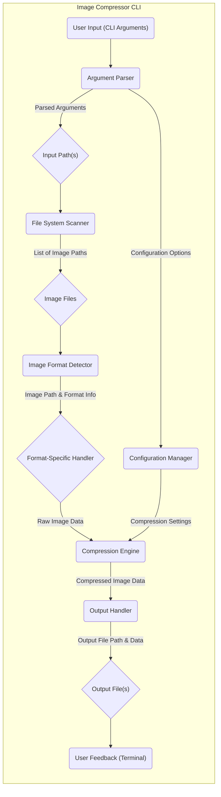

# Project Design Document: Image Compressor CLI

**Project Name:** Image Compressor CLI

**Project Repository:** https://github.com/zetbaitsu/compressor

**Version:** 1.1

**Date:** October 26, 2023

**Author:** Gemini (AI Language Model)

## 1. Introduction

This document provides a detailed design for the `zetbaitsu/compressor` command-line interface (CLI) tool. This tool is designed to compress image files, supporting various image formats and offering different compression options. This document aims to provide a comprehensive understanding of the system's architecture, components, and data flow, which will be used as the basis for subsequent threat modeling activities. This revision incorporates more detail on component interactions and potential security considerations.

### 1.1. Purpose

The purpose of this document is to outline the design of the image compression CLI tool. It will serve as a reference for development, maintenance, and security analysis, particularly for threat modeling exercises.

### 1.2. Scope

This document covers the design of the core functionality of the image compression CLI, including:

*   Handling command-line arguments and options provided by the user.
*   Scanning specified input paths for eligible image files.
*   Detecting and processing different image formats based on their characteristics.
*   Applying appropriate compression algorithms based on user-defined settings or sensible defaults.
*   Writing compressed image files to the designated output location, maintaining organizational structure if requested.
*   Managing and reporting errors encountered during the compression process, providing informative feedback to the user.

### 1.3. Goals

The primary goals of this design are to:

*   Clearly define the system's architecture and the responsibilities of each component.
*   Describe the detailed data flow within the application, highlighting transformations and interactions.
*   Identify key areas and potential vulnerabilities for security consideration during subsequent threat modeling activities.
*   Provide a solid foundation for future development, enhancements, and debugging efforts.

## 2. System Overview

The Image Compressor CLI tool takes user input via command-line arguments, systematically processes identified image files, and outputs compressed versions to a specified location. The core functionality revolves around the sequential steps of input processing, file identification, format handling, compression, and output writing.

### 2.1. High-Level Architecture

*   **User Input (CLI Arguments):** The user initiates the tool by providing instructions and parameters through the command line interface, specifying input sources, output destinations, compression preferences, and other operational directives.
*   **Argument Parser:** This component is responsible for interpreting and validating the command-line arguments provided by the user. It ensures that the necessary parameters are present and correctly formatted, extracting values for further processing.
*   **Input Path(s):**  The parsed input paths, derived from the user's command, indicate the locations (files or directories) where the images to be compressed are situated.
*   **Configuration Manager:** This component manages the application's settings, including those provided by the user via command-line arguments or potentially through configuration files. It provides these settings to other components as needed.
*   **File System Scanner:** This component systematically explores the specified input paths (which can be individual files or entire directories) to locate eligible image files that match the tool's supported formats.
*   **Image Files:** This represents the collection of image files identified by the File System Scanner as candidates for compression.
*   **Image Format Detector:** This component analyzes each identified image file to determine its specific format (e.g., JPEG, PNG, GIF). This identification is crucial for selecting the appropriate compression and handling methods.
*   **Format-Specific Handler:** Based on the detected image format, the appropriate handler module is invoked. This handler is responsible for understanding the nuances of that specific format and preparing the image data for compression.
*   **Compression Engine:** This is the core component responsible for applying the selected compression algorithm to the image data. It takes the raw image data and compression settings as input and produces compressed image data as output.
*   **Configuration Options:** These are the user-defined settings and preferences that influence the compression process, such as the desired compression level, quality settings, and output format options.
*   **Compressed Image Data:** This represents the output of the Compression Engine, the image data after the compression algorithm has been applied.
*   **Output Handler:** This component takes the compressed image data and writes it to the specified output location. It manages file creation, path handling, and potential overwriting of existing files.
*   **Output File(s):** These are the resulting compressed image files written to the designated output directory.
*   **User Feedback (Terminal):** Throughout the process, the tool provides feedback to the user via the terminal, indicating progress, potential errors, and completion status.

### 2.2. Data Flow

The data flow within the application follows a sequential process:

*   The user initiates the tool by entering commands and arguments in the terminal.
*   The Argument Parser receives the command-line input and extracts relevant parameters, passing configuration options to the Configuration Manager.
*   The File System Scanner utilizes the provided input paths to discover and list all relevant image files.
*   For each identified image file:
    *   The Image Format Detector determines the specific format of the image.
    *   The corresponding Format-Specific Handler is invoked to load and prepare the image data.
    *   The prepared image data, along with compression settings from the Configuration Manager, is passed to the Compression Engine.
    *   The Compression Engine applies the chosen algorithm, generating compressed image data.
    *   The Output Handler receives the compressed data and writes it to the designated output file path.
*   The tool provides feedback to the user at various stages, reporting on progress and any issues encountered.

## 3. Component Details

This section provides a more detailed breakdown of the responsibilities, functionality, and potential interactions of each major component within the Image Compressor CLI.

### 3.1. Argument Parser

*   **Responsibility:** To accurately interpret and validate command-line arguments provided by the user, ensuring all necessary information is available and correctly formatted.
*   **Functionality:**
    *   Defines expected command-line arguments (e.g., input paths, output directory, compression level, output format, overwrite options).
    *   Parses the raw command-line input, extracting values associated with each defined argument.
    *   Performs validation checks to ensure argument values are within acceptable ranges and of the correct type.
    *   Handles default values for optional arguments when not explicitly provided by the user.
    *   Generates informative error messages and exits gracefully if invalid or missing arguments are detected.
    *   May leverage libraries such as `argparse` (in Python) or similar command-line parsing tools.
*   **Interactions:**
    *   Receives raw input from the command line.
    *   Provides parsed arguments to the Configuration Manager and File System Scanner.

### 3.2. File System Scanner

*   **Responsibility:** To efficiently and accurately locate all eligible image files within the specified input paths, whether they are individual files or directories.
*   **Functionality:**
    *   Accepts one or more input paths (files or directories) as input from the Argument Parser.
    *   Recursively traverses directory structures if directory paths are provided.
    *   Filters discovered files based on recognized image file extensions (e.g., `.jpg`, `.jpeg`, `.png`, `.gif`, `.webp`).
    *   May offer options to include or exclude specific file patterns or subdirectories.
    *   Needs to handle potential errors such as invalid paths or permission issues.
*   **Interactions:**
    *   Receives input paths from the Argument Parser.
    *   Provides a list of identified image file paths to the Image Format Detector.

### 3.3. Image Format Detector

*   **Responsibility:** To reliably determine the specific format of each image file identified by the scanner, enabling the selection of the appropriate processing method.
*   **Functionality:**
    *   Takes an image file path as input.
    *   Employs techniques such as checking file extensions and examining file headers (magic numbers) to accurately identify the image format.
    *   Maintains a mapping of file signatures to image formats.
    *   Handles cases where the file extension might be incorrect or misleading.
    *   Supports a range of common image formats (e.g., JPEG, PNG, GIF, WebP) and potentially others.
*   **Interactions:**
    *   Receives image file paths from the File System Scanner.
    *   Provides image file paths along with their detected format to the Format-Specific Handler.

### 3.4. Format-Specific Handler

*   **Responsibility:** To manage the loading, decoding, and preparation of image data based on its specific format, abstracting away format-specific complexities for the Compression Engine.
*   **Functionality:**
    *   Receives an image file path and its detected format as input.
    *   Utilizes appropriate image processing libraries (e.g., Pillow for Python, ImageIO) to load and decode the image data.
    *   Handles format-specific nuances such as color spaces, bit depths, and metadata.
    *   May perform pre-processing steps if required by the compression algorithm.
    *   Provides a standardized representation of the image data to the Compression Engine.
*   **Interactions:**
    *   Receives image paths and format information from the Image Format Detector.
    *   Sends raw image data to the Compression Engine.

### 3.5. Compression Engine

*   **Responsibility:** To efficiently and effectively apply the chosen compression algorithm to the image data, reducing its file size while maintaining acceptable quality levels.
*   **Functionality:**
    *   Accepts raw image data and compression settings (from the Configuration Manager) as input.
    *   Selects and applies the appropriate compression algorithm based on the image format and user-specified options (e.g., JPEG compression, PNG optimization).
    *   Offers different compression levels or quality settings, allowing users to balance file size reduction and visual fidelity.
    *   Leverages underlying libraries or algorithms for the actual compression process.
    *   Handles potential errors during the compression process.
*   **Interactions:**
    *   Receives raw image data from the Format-Specific Handler.
    *   Receives compression settings from the Configuration Manager.
    *   Outputs compressed image data to the Output Handler.

### 3.6. Output Handler

*   **Responsibility:** To manage the creation and writing of compressed image files to the specified output location, ensuring proper file naming and handling of existing files.
*   **Functionality:**
    *   Receives compressed image data and the desired output path as input.
    *   Creates the output directory if it does not already exist, preserving directory structures if requested.
    *   Constructs the output file name based on the input file name and potentially user-defined patterns.
    *   Writes the compressed image data to the output file.
    *   Handles potential file writing errors, such as insufficient permissions or disk space issues.
    *   May offer options to overwrite existing files or skip them.
    *   Potentially preserves metadata from the original image file.
*   **Interactions:**
    *   Receives compressed image data from the Compression Engine.
    *   Interacts with the file system to write the output files.

### 3.7. Configuration Manager

*   **Responsibility:** To centralize the management of all configuration settings for the compression process, ensuring consistency and providing easy access to these settings for other components.
*   **Functionality:**
    *   Stores and retrieves configuration settings, including those provided via command-line arguments and potentially default values or configuration files.
    *   Provides a consistent interface for other components to access configuration parameters.
    *   Handles validation and potential sanitization of configuration values.
    *   May support loading configurations from files (e.g., JSON, YAML).
*   **Interactions:**
    *   Receives parsed arguments from the Argument Parser.
    *   Provides compression settings to the Compression Engine.

## 4. Security Considerations

This section details potential security considerations and vulnerabilities that should be carefully examined during threat modeling activities.

*   **Input Validation Vulnerabilities:**
    *   **Malicious File Paths:** Users could provide input paths designed to access sensitive files or directories outside the intended scope (path traversal). For example, using paths like `../../../../etc/passwd`.
    *   **Command Injection:** If any part of the input processing involves executing external commands based on user input (though unlikely in this core functionality), it could lead to command injection vulnerabilities.
    *   **Denial of Service (DoS) via Input:**  Providing an extremely large number of input files or deeply nested directories could overwhelm the file system scanner, leading to resource exhaustion.
*   **File System Access Control Issues:**
    *   **Insufficient Permissions:** The tool might not have the necessary permissions to read input files or write to the output directory, leading to operational failures.
    *   **Excessive Permissions:** Conversely, if the tool runs with overly broad permissions, it could potentially be exploited to access or modify files beyond its intended scope.
    *   **Symlink Exploitation:**  Careless handling of symbolic links could allow an attacker to trick the tool into accessing or overwriting unintended files.
*   **Dependency Vulnerabilities:**
    *   **Outdated Libraries:** The image processing and compression libraries used by the tool might contain known security vulnerabilities. Failure to keep these dependencies updated could expose the application to these risks.
    *   **Supply Chain Attacks:**  Compromised dependencies could introduce malicious code into the application.
*   **Error Handling and Information Disclosure:**
    *   **Verbose Error Messages:**  Detailed error messages displayed to the user could inadvertently reveal sensitive information about the system's internal workings or file paths.
    *   **Lack of Proper Error Handling:**  Unhandled exceptions or errors could lead to unexpected behavior or crashes, potentially exploitable for DoS.
*   **Configuration Security Weaknesses:**
    *   **Insecure Default Configurations:** Default settings that are not secure could leave the application vulnerable out of the box.
    *   **Storing Sensitive Information in Configuration:** Avoid storing sensitive information (like API keys, though not applicable here) directly in configuration files without proper encryption.
    *   **Configuration File Tampering:** If configuration files are used, they need to be protected from unauthorized modification.
*   **Output Integrity Concerns:**
    *   **Tampering with Output Files:** While less of a direct vulnerability of the tool itself, ensuring the integrity of the compressed output files might be a concern in certain contexts.
*   **Resource Exhaustion Vulnerabilities:**
    *   **Memory Exhaustion:** Processing very large image files or a large number of files simultaneously could lead to excessive memory consumption and potential crashes.
    *   **CPU Exhaustion:**  Certain compression algorithms, especially at high quality settings, can be CPU-intensive, potentially leading to DoS if an attacker can force the tool to process many such files.

## 5. Assumptions and Constraints

*   The tool assumes the availability of standard file system access mechanisms provided by the underlying operating system.
*   The primary deployment model is as a command-line application intended for individual use or integration into scripts.
*   Support for common image formats (JPEG, PNG, GIF, WebP) is a core requirement. Support for less common formats may be considered based on demand and available libraries.
*   The implementation will leverage existing, well-established image processing libraries to handle format-specific operations and compression algorithms, rather than implementing these from scratch.
*   The tool is expected to be executed with appropriate user permissions to access input files and write output files.

## 6. Future Considerations

*   **Expanded Image Format Support:**  Adding support for a wider range of image formats, including newer or less common ones (e.g., AVIF, HEIF).
*   **Advanced Compression Techniques:** Implementing more sophisticated compression algorithms or offering finer-grained control over compression parameters for advanced users.
*   **Parallel Processing Capabilities:**  Introducing multi-threading or asynchronous operations to significantly improve performance when processing multiple image files concurrently.
*   **Graphical User Interface (GUI):**  Developing a GUI version of the tool to cater to users who prefer a visual interface over the command line.
*   **Cloud Storage Integration:**  Enabling users to directly compress images from and upload them to popular cloud storage services (e.g., Amazon S3, Google Cloud Storage, Azure Blob Storage).
*   **Lossless Compression Optimization:**  Exploring and implementing more efficient lossless compression methods for formats like PNG.
*   **Metadata Handling Enhancements:** Providing more options for preserving, modifying, or stripping metadata during the compression process.
