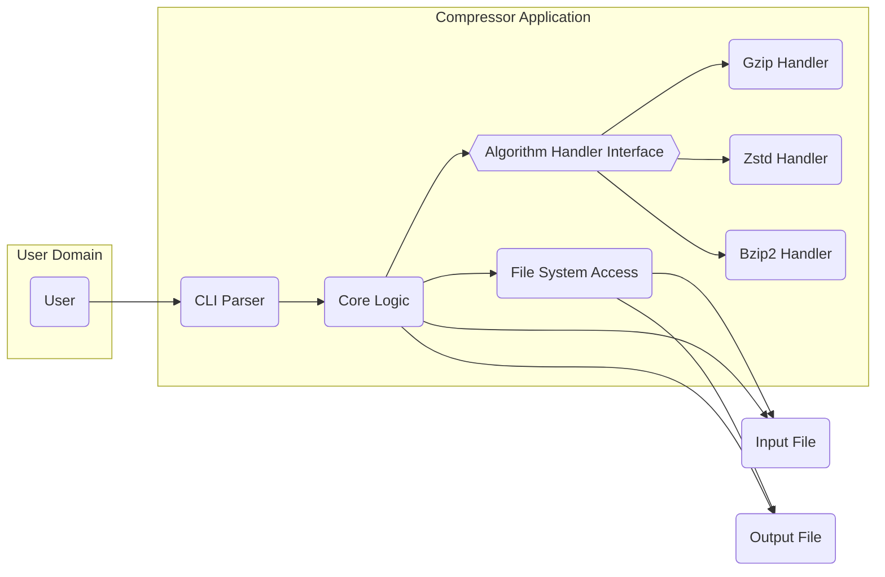
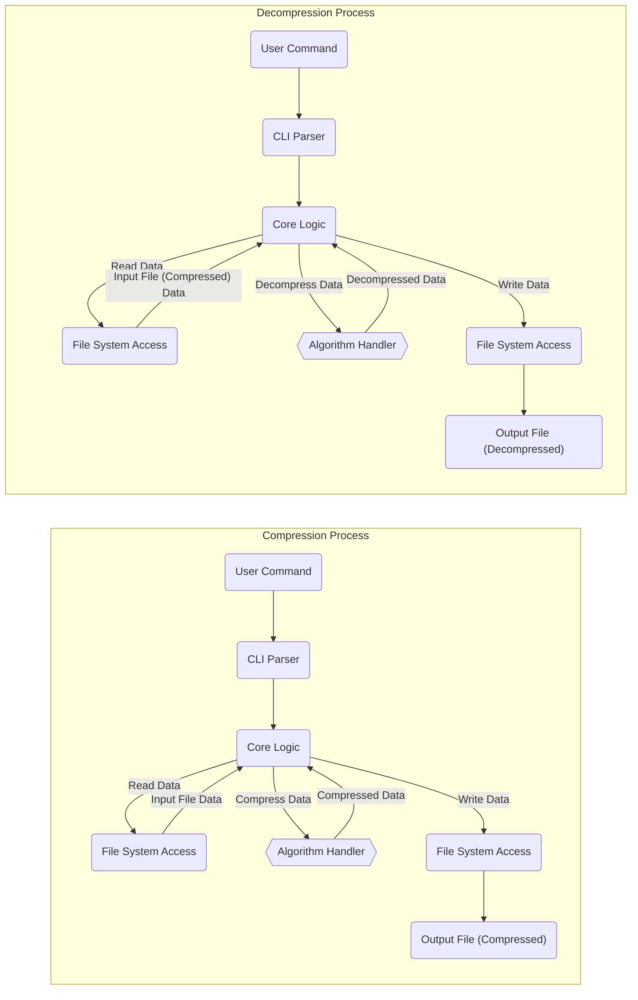

# Project Design Document: Compressor

**Version:** 1.1
**Date:** October 26, 2023
**Author:** AI Software Architect

## 1. Project Overview

This document details the design for the `compressor` project, a command-line tool engineered for efficient file compression and decompression. This design serves as the blueprint for subsequent threat modeling activities. As indicated by the linked GitHub repository, the project aims to deliver a versatile and performant solution for reducing file sizes, supporting a range of compression algorithms. The focus is on providing a robust and secure command-line experience for users needing to compress and decompress files.

## 2. Goals

* Provide a user-friendly command-line interface (CLI) for compressing and decompressing files.
* Support a variety of common compression algorithms, including but not limited to gzip, zstd, and bzip2.
* Offer granular control over compression levels, allowing users to optimize for size or speed.
* Handle diverse input and output file formats, including large files.
* Provide informative and actionable error messages to aid in troubleshooting.
* Achieve high performance and efficient utilization of system resources (CPU, memory, disk I/O).
* Maintain a secure design to protect user data and the system.

## 3. Non-Goals

* Development of a graphical user interface (GUI) for the application.
* Implementation of real-time or streaming compression/decompression functionalities.
* Direct integration with cloud storage services or remote file systems.
* Inclusion of cryptographic encryption features beyond the capabilities of the compression algorithms themselves.
* Functionality as a comprehensive file archiving tool with advanced features like versioning, metadata management, or spanning across multiple files.

## 4. System Architecture

The `compressor` application is designed with a modular architecture to promote extensibility, maintainability, and testability. The key components and their interactions are described below:

### 4.1. Components

* **Command-Line Interface (CLI) Parser:**
    * Responsible for interpreting command-line arguments supplied by the user.
    * Performs rigorous validation of input arguments, such as input and output file paths, specified compression algorithm, and desired compression level.
    * Converts the command-line arguments into a structured format suitable for processing by the Core Logic.
    * Handles the display of help messages, usage instructions, and version information upon user request.
    * Implements error handling for invalid or missing arguments, providing clear feedback to the user.

* **Core Logic:**
    * Serves as the central orchestrator for the compression and decompression workflows.
    * Determines the appropriate compression or decompression algorithm to employ based on user input or default settings.
    * Manages the reading of data from the input file through the File System Access component.
    * Delegates the actual compression or decompression operation to the designated Algorithm Handler.
    * Oversees the writing of the processed (compressed or decompressed) data to the output file via the File System Access component.
    * Implements comprehensive error handling and reporting for all stages of the process.

* **Algorithm Handler Interface:**
    * Defines a contract (interface or abstract class) that all concrete compression and decompression algorithm implementations must adhere to.
    * Ensures a consistent way for the Core Logic to interact with different compression algorithms.
    * Includes methods for initializing the handler, performing compression, performing decompression, and potentially setting algorithm-specific parameters.

* **Algorithm Handlers (Concrete Implementations):**
    * Provides specific implementations of the Algorithm Handler Interface for each supported compression algorithm.
    * Examples include `GzipHandler`, `ZstdHandler`, and `Bzip2Handler`.
    * Each handler leverages the appropriate underlying compression library or native implementation for its respective algorithm.
    * Encapsulates the logic for compressing and decompressing data using a specific algorithm.

* **File System Access:**
    * Responsible for all interactions with the file system.
    * Handles opening, reading from, and writing to files.
    * Implements error handling for file-related operations, such as file not found, permission errors, and disk space issues.
    * May include buffering mechanisms to optimize file I/O performance.
    * Ensures proper closing of file handles to prevent resource leaks.

### 4.2. Component Diagram (Mermaid)

### 4.3. Data Flow

The following outlines the data flow for both compression and decompression operations, emphasizing the movement of data and control between components.

#### 4.3.1. Compression

1. The **User** initiates a compression operation by providing a command with the input file path, output file path, and optionally the desired compression algorithm and level to the **CLI Parser**.
2. The **CLI Parser** meticulously parses and validates the command-line arguments. If validation fails, an error message is displayed to the user, and the process terminates.
3. Upon successful validation, the **CLI Parser** passes the validated parameters to the **Core Logic**.
4. The **Core Logic** determines the compression algorithm to be used, either based on the user's explicit specification or a default setting.
5. The **Core Logic** instructs the **File System Access** component to open and read data from the specified input file. Error handling is performed if the file cannot be opened or read.
6. The **File System Access** component reads the data from the input file, potentially in chunks, and returns it to the **Core Logic**.
7. The **Core Logic** selects the appropriate concrete **Algorithm Handler** implementation based on the chosen compression algorithm.
8. The **Core Logic** passes the data read from the input file to the selected **Algorithm Handler** for compression, along with the specified compression level.
9. The **Algorithm Handler** performs the compression using the relevant underlying library and returns the compressed data to the **Core Logic**.
10. The **Core Logic** instructs the **File System Access** component to open and write the compressed data to the specified output file. Error handling is performed if the file cannot be opened or written to.
11. The **File System Access** component writes the compressed data to the output file.
12. The **Core Logic** informs the **User** about the successful completion of the compression operation or reports any errors encountered during the process.

#### 4.3.2. Decompression

1. The **User** initiates a decompression operation by providing a command with the input file path (the compressed file), the desired output file path, and potentially the compression algorithm used (if it cannot be inferred) to the **CLI Parser**.
2. The **CLI Parser** parses and validates the command-line arguments. Any validation errors result in an error message to the user and termination of the process.
3. The **CLI Parser** passes the validated parameters to the **Core Logic**.
4. The **Core Logic** determines the decompression algorithm to be used. This might involve checking file metadata or relying on user input.
5. The **Core Logic** instructs the **File System Access** component to open and read data from the specified input file (the compressed file). File access errors are handled.
6. The **File System Access** component reads the compressed data and returns it to the **Core Logic**.
7. The **Core Logic** selects the appropriate concrete **Algorithm Handler** implementation for the determined decompression algorithm.
8. The **Core Logic** passes the compressed data to the selected **Algorithm Handler** for decompression.
9. The **Algorithm Handler** performs the decompression using the relevant library and returns the decompressed data to the **Core Logic**.
10. The **Core Logic** instructs the **File System Access** component to open and write the decompressed data to the specified output file. File writing errors are handled.
11. The **File System Access** component writes the decompressed data to the output file.
12. The **Core Logic** informs the **User** about the successful completion of the decompression operation or reports any errors encountered.

### 4.4. Data Flow Diagram (Mermaid)

## 5. Security Considerations

This section highlights potential security considerations that will be thoroughly examined during the threat modeling phase.

* **Input Validation Vulnerabilities:**
    * **Command Injection:** Insufficient validation of user-supplied arguments (especially file paths and algorithm names) could allow attackers to inject arbitrary commands into the system. Mitigation: Implement strict input sanitization and validation using whitelists and regular expressions.
    * **Path Traversal:** Improper handling of file paths could enable attackers to access or overwrite files outside the intended directories. Mitigation: Canonicalize file paths and restrict access to authorized directories.

* **Resource Exhaustion Attacks:**
    * **CPU Exhaustion:** Processing extremely large or maliciously crafted input files with high compression levels could consume excessive CPU resources, leading to denial of service. Mitigation: Implement limits on file sizes and compression levels, and consider using asynchronous processing or resource quotas.
    * **Memory Exhaustion:** Decompressing highly compressed or crafted files could lead to excessive memory allocation, causing the application to crash or become unresponsive. Mitigation: Implement safeguards against excessive memory allocation and consider using streaming decompression techniques.
    * **Disk Space Exhaustion:** Repeated compression of data without proper cleanup could fill up disk space. Mitigation: Implement monitoring and alerts for disk space usage.

* **Dependency Management Risks:**
    * **Vulnerable Libraries:** Using outdated or vulnerable compression libraries could expose the application to known exploits. Mitigation: Employ a robust dependency management system to track and update dependencies regularly, and perform security audits of used libraries.

* **Error Handling and Information Disclosure:**
    * **Verbose Error Messages:** Error messages that reveal sensitive information about the system's internal workings or file structure could aid attackers. Mitigation: Ensure error messages are informative but do not expose sensitive details. Log detailed errors securely for debugging purposes.

* **File System Security:**
    * **Insufficient Permissions:** Running the application with excessive file system permissions could allow attackers to perform unauthorized actions if a vulnerability is exploited. Mitigation: Adhere to the principle of least privilege and run the application with the minimum necessary permissions.

* **Malicious Input Files:**
    * **Exploiting Algorithm Vulnerabilities:** Maliciously crafted compressed files could exploit vulnerabilities within the decompression algorithms themselves, leading to crashes or arbitrary code execution. Mitigation: Stay updated on known vulnerabilities in compression libraries and consider using sandboxing or other isolation techniques for processing untrusted input.

## 6. Deployment

The `compressor` application is intended to be deployed as a standalone, self-contained command-line executable.

* **Build Process:** The application will be built using the Go toolchain. This will involve compiling the source code and linking the necessary libraries to produce a platform-specific executable.
* **Distribution:** The executable can be distributed directly to users for execution on their local machines. Distribution methods may include:
    * Direct download of pre-compiled binaries for various operating systems (Windows, macOS, Linux).
    * Packaging through system-specific package managers (e.g., `apt`, `yum`, `brew`).
    * Source code distribution for users to build themselves.
* **Dependencies:**  The deployment should ideally minimize external dependencies. Statically linking libraries where feasible can simplify deployment.
* **Execution:** Users will execute the `compressor` executable from their terminal or command prompt, providing the necessary command-line arguments.

## 7. Technologies Used

* **Programming Language:** Go (as indicated by the GitHub repository).
* **Compression Libraries:**
    * `compress/gzip` (Go standard library for gzip)
    * `github.com/klauspost/compress/zstd` (A popular Go library for Zstandard)
    * Potentially `github.com/ulikunitz/xz` or similar for bzip2 or other algorithms if not using cgo wrappers around system libraries.
* **CLI Parsing Library:**
    * Potentially `flag` package from the Go standard library for basic argument parsing.
    * More advanced options like `spf13/cobra` or `urfave/cli` for more complex command structures.
* **Build System:** Go's built-in `go build` command and potentially `Makefiles` for more complex build processes.

## 8. Future Considerations

* **Expansion of supported compression algorithms and formats.**
* **Implementation of archive format support (e.g., tar integration).**
* **Incorporation of checksum verification mechanisms for ensuring data integrity.**
* **Development of progress indicators to provide feedback during long compression/decompression operations.**
* **Creation of APIs or libraries for integration with other Go applications or scripting languages.**
* **Support for parallel processing to improve performance on multi-core systems.**

This revised design document provides a more detailed and comprehensive overview of the `compressor` project's architecture, functionality, and security considerations. It will serve as a more robust foundation for the upcoming threat modeling exercise.