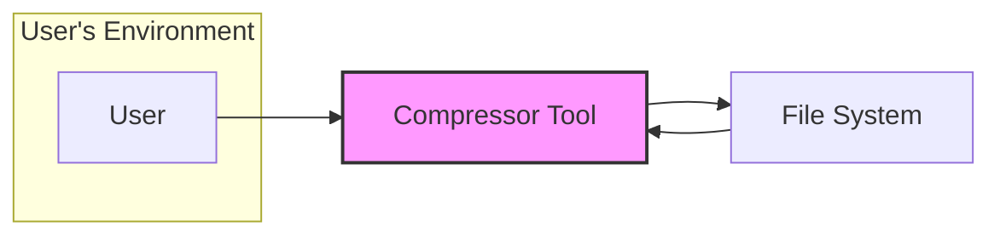
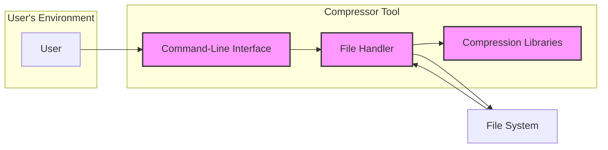
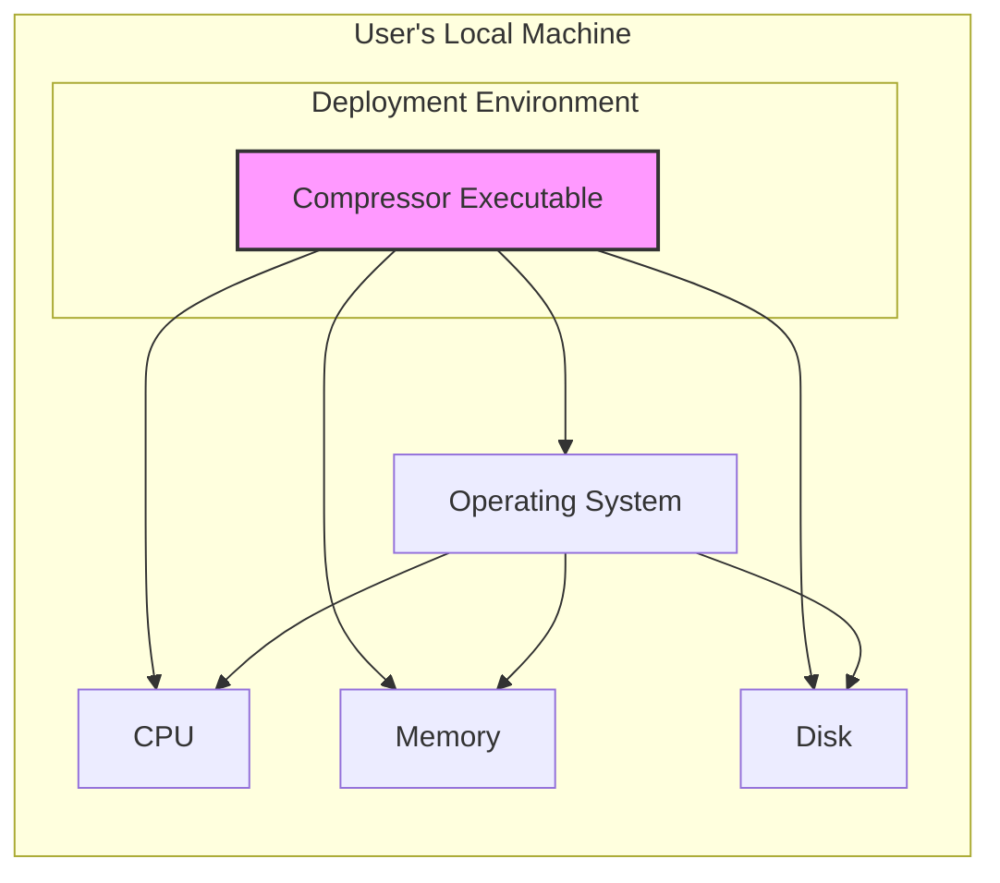

# BUSINESS POSTURE

This project, "compressor", provides a command-line tool for file compression and decompression.

- Business Priorities and Goals:
  - Primary goal: Efficiently compress and decompress files using various algorithms (gzip, zstd, brotli, etc.).
  - Potential priorities:
    - Performance: Fast compression and decompression speeds.
    - Compression ratio: Achieving high compression rates to reduce file sizes.
    - Algorithm support: Supporting a wide range of compression algorithms.
    - Ease of use: Simple and intuitive command-line interface.
    - Cross-platform compatibility: Working on different operating systems (Linux, macOS, Windows).
    - Open-source and community driven: Encouraging contributions and community support.

- Business Risks:
  - Data integrity risk: Corruption of data during compression or decompression.
  - Performance bottleneck risk: Inefficient compression or decompression algorithms leading to slow processing.
  - Compatibility risk: Issues with file format compatibility across different systems or versions.
  - Security vulnerability risk: Vulnerabilities in the compression/decompression algorithms or the tool itself that could be exploited.
  - Supply chain risk: Dependencies on external libraries or components that might introduce vulnerabilities.
  - Availability risk: Tool unavailability due to bugs or infrastructure issues if deployed as a service.

# SECURITY POSTURE

- Existing Security Controls:
  - security control: Open-source code - publicly available for review and scrutiny on GitHub. Implemented: GitHub repository.
  - security control: Use of well-established compression libraries (gzip, zstd, brotli). Implemented: Codebase dependencies.
  - security control: Go language - benefits from Go's memory safety features. Implemented: Programming language choice.

- Accepted Risks:
  - accepted risk: Reliance on community contributions for security vulnerability identification and patching.
  - accepted risk: Potential vulnerabilities in underlying compression libraries that are beyond the project's direct control.
  - accepted risk: Lack of formal security audits or penetration testing.

- Recommended Security Controls:
  - security control: Implement automated security scanning (SAST/DAST) in the CI/CD pipeline.
  - security control: Dependency vulnerability scanning to identify and address vulnerabilities in used libraries.
  - security control: Regular updates of dependencies to incorporate security patches.
  - security control: Input validation to prevent path traversal or other input-based vulnerabilities.
  - security control: Consider code signing for releases to ensure integrity and authenticity.

- Security Requirements:
  - Authentication: Not applicable for a command-line tool used locally. If deployed as a service, authentication would be required.
  - Authorization: Not applicable for a command-line tool used locally. If deployed as a service, authorization would be required to control access to compression/decompression functionalities.
  - Input Validation:
    - Requirement: Validate file paths provided as input to prevent path traversal vulnerabilities.
    - Requirement: Validate compression algorithm choices to ensure supported algorithms are used.
    - Requirement: Handle potentially large input files gracefully to prevent denial-of-service conditions.
  - Cryptography:
    - Requirement: Ensure correct and secure usage of cryptographic libraries used in compression algorithms (if any).
    - Requirement: If encryption features are added in the future, follow secure cryptographic practices.

# DESIGN

## C4 CONTEXT



- Context Diagram Elements:
  - Element:
    - Name: User
    - Type: Person
    - Description: Individual who uses the "compressor" tool to compress or decompress files.
    - Responsibilities: Provides input files and commands to the compressor tool, receives compressed or decompressed files.
    - Security controls: User's local machine security controls, access control to files on their file system.
  - Element:
    - Name: Compressor Tool
    - Type: Software System
    - Description: Command-line application for compressing and decompressing files using various algorithms.
    - Responsibilities: Reads input files, performs compression or decompression based on user commands, writes output files to the file system.
    - Security controls: Input validation, secure handling of file system operations, dependency vulnerability management, build process security.
  - Element:
    - Name: File System
    - Type: System
    - Description: Local file system where input files are stored and output files are written.
    - Responsibilities: Stores files, provides access to files for the compressor tool.
    - Security controls: File system permissions, access control lists, encryption at rest (if configured by the user).

## C4 CONTAINER



- Container Diagram Elements:
  - Element:
    - Name: Command-Line Interface (CLI)
    - Type: Application
    - Description: Provides the command-line interface for users to interact with the compressor tool, parse commands and arguments.
    - Responsibilities: Accepts user commands, parses arguments (input file paths, output file paths, compression algorithm), invokes File Handler.
    - Security controls: Input validation of command-line arguments, secure parsing of user input.
  - Element:
    - Name: File Handler
    - Type: Application Component
    - Description: Component responsible for reading and writing files to the file system.
    - Responsibilities: Opens, reads, and writes files based on instructions from CLI, handles file paths, interacts with Compression Libraries.
    - Security controls: Input validation of file paths, secure file handling operations, error handling for file system interactions, path traversal prevention.
  - Element:
    - Name: Compression Libraries
    - Type: Library
    - Description: Set of libraries (e.g., gzip, zstd, brotli libraries in Go) used to perform actual compression and decompression operations.
    - Responsibilities: Provides compression and decompression algorithms, performs data processing.
    - Security controls: Dependency vulnerability scanning, regular updates to libraries, ensuring libraries are used correctly and securely.
  - Element:
    - Name: File System
    - Type: System
    - Description: Local file system where input and output files are stored.
    - Responsibilities: Stores files, provides access to files for the File Handler component.
    - Security controls: File system permissions, access control lists, encryption at rest (if configured by the user).

## DEPLOYMENT

Deployment Scenario: Local execution on user's machine.



- Deployment Diagram Elements:
  - Element:
    - Name: Compressor Executable
    - Type: Software
    - Description: Compiled binary of the "compressor" tool, deployed on the user's local machine.
    - Responsibilities: Executes compression and decompression tasks when run by the user.
    - Security controls: Code signing (optional), integrity checks of the executable.
  - Element:
    - Name: Operating System
    - Type: Infrastructure
    - Description: User's operating system (e.g., Linux, macOS, Windows) providing the runtime environment.
    - Responsibilities: Provides system resources, manages processes, handles file system operations.
    - Security controls: Operating system security controls (firewall, access control, patching), user account controls.
  - Element:
    - Name: CPU
    - Type: Infrastructure
    - Description: Central Processing Unit for executing the compressor tool's code.
    - Responsibilities: Processing instructions, performing computations.
    - Security controls: Hardware security features (if any).
  - Element:
    - Name: Memory
    - Type: Infrastructure
    - Description: RAM used by the compressor tool during execution.
    - Responsibilities: Storing program code and data during runtime.
    - Security controls: Memory protection mechanisms provided by the OS.
  - Element:
    - Name: Disk
    - Type: Infrastructure
    - Description: Hard disk or SSD where the compressor executable and files are stored.
    - Responsibilities: Persistent storage of the compressor tool and files.
    - Security controls: Disk encryption (optional, configured by the user), file system permissions.

## BUILD

```mermaid
graph LR
    subgraph "Developer Environment"
        Developer[Developer]
        CodeRepo[Code Repository (GitHub)]
    end
    subgraph "CI/CD Pipeline (GitHub Actions)"
        BuildServer[Build Server (GitHub Actions Runner)]
        Compiler[Go Compiler]
        SAST[SAST Scanner]
        DependencyCheck[Dependency Check]
        ArtifactStorage[Artifact Storage (GitHub Actions Artifacts)]
    end

    Developer --> CodeRepo: Push Code
    CodeRepo --> BuildServer: Trigger Build
    BuildServer --> Compiler: Compile Code
    BuildServer --> SAST: Run SAST
    BuildServer --> DependencyCheck: Check Dependencies
    Compiler --> ArtifactStorage: Create Executable
    SAST --> BuildServer: Report
    DependencyCheck --> BuildServer: Report
    ArtifactStorage --> Release[Release Artifacts]

    style BuildServer fill:#f9f,stroke:#333,stroke-width:2px
    style ArtifactStorage fill:#f9f,stroke:#333,stroke-width:2px
```

- Build Process Elements:
  - Element:
    - Name: Developer
    - Type: Person
    - Description: Software developer who writes and commits code changes.
    - Responsibilities: Writes code, performs local testing, commits and pushes code to the repository.
    - Security controls: Secure development practices, code review, local development environment security.
  - Element:
    - Name: Code Repository (GitHub)
    - Type: System
    - Description: GitHub repository hosting the source code of the "compressor" tool.
    - Responsibilities: Version control, code storage, trigger CI/CD pipeline.
    - Security controls: Access control to the repository, branch protection, audit logs.
  - Element:
    - Name: Build Server (GitHub Actions Runner)
    - Type: Application
    - Description: GitHub Actions runner executing the CI/CD pipeline.
    - Responsibilities: Automates build process, compiles code, runs security scans, creates artifacts.
    - Security controls: Secure build environment, access control to CI/CD configuration, secrets management.
  - Element:
    - Name: Go Compiler
    - Type: Tool
    - Description: Go compiler used to compile the source code into an executable binary.
    - Responsibilities: Compiles Go code.
    - Security controls: Using trusted compiler version.
  - Element:
    - Name: SAST Scanner
    - Type: Tool
    - Description: Static Application Security Testing tool to scan the source code for potential vulnerabilities.
    - Responsibilities: Performs static code analysis, identifies potential security flaws.
    - Security controls: Regularly updated scanner rules, configuration to detect relevant vulnerabilities.
  - Element:
    - Name: Dependency Check
    - Type: Tool
    - Description: Tool to check dependencies for known vulnerabilities.
    - Responsibilities: Scans project dependencies, identifies known vulnerabilities in libraries.
    - Security controls: Regularly updated vulnerability database, configuration to report vulnerabilities.
  - Element:
    - Name: Artifact Storage (GitHub Actions Artifacts)
    - Type: System
    - Description: Storage within GitHub Actions to store build artifacts (e.g., executable).
    - Responsibilities: Stores build artifacts temporarily.
    - Security controls: Access control to artifacts, secure storage.
  - Element:
    - Name: Release Artifacts
    - Type: Software
    - Description: Final build artifacts (e.g., executable) that are released for distribution.
    - Responsibilities: Distributable binaries of the compressor tool.
    - Security controls: Code signing, checksum generation, secure release process.

# RISK ASSESSMENT

- Critical Business Processes:
  - File compression and decompression functionality. Ensuring these processes are reliable, performant, and maintain data integrity is critical.
  - Build and release process. Ensuring the tool is built and released securely to prevent supply chain attacks.

- Data to Protect and Sensitivity:
  - User files being compressed or decompressed. Sensitivity depends on the content of the files, which can range from public documents to highly confidential data.
  - The compressor tool itself. Protecting the integrity and availability of the tool is important to maintain functionality.
  - Build artifacts and release binaries. Protecting these from tampering is crucial for supply chain security.

# QUESTIONS & ASSUMPTIONS

- BUSINESS POSTURE:
  - Assumption: The primary business goal is to provide a reliable and efficient command-line compression tool for general use.
  - Question: Are there specific target users or industries for this tool? Are there any specific performance or compression ratio requirements?

- SECURITY POSTURE:
  - Assumption: Current security posture relies on open-source nature and basic secure development practices.
  - Question: Are there any existing security policies or standards that this project should adhere to? Is there a budget allocated for security improvements?

- DESIGN:
  - Assumption: The tool is primarily intended for local command-line use.
  - Question: Are there plans to deploy this tool as a service or integrate it into other systems? Are there any specific deployment environment constraints or requirements?
  - Assumption: The build process is currently basic and can be enhanced with more security controls.
  - Question: Is there a preferred CI/CD platform or existing build infrastructure that should be used? Are there any specific requirements for build artifact signing or verification?