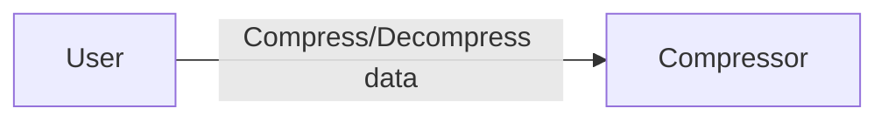
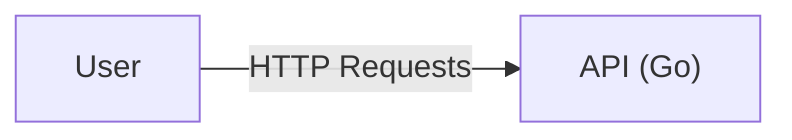
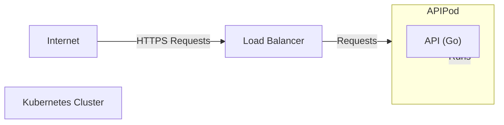
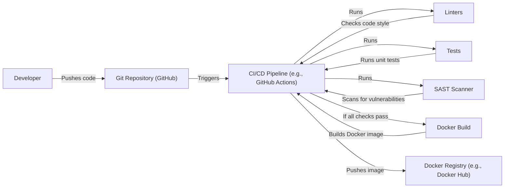

Okay, let's create a design document for the `compressor` project.

# BUSINESS POSTURE

Business Priorities and Goals:

*   Provide a simple, efficient, and reliable service for compressing and decompressing data.
*   Offer a publicly accessible API for this service.
*   Minimize operational overhead and infrastructure costs.
*   Ensure the service is scalable to handle varying loads.
*   Maintain a good user experience with fast response times.

Business Risks:

*   Data breaches: Unauthorized access to user-submitted data during compression/decompression or at rest.
*   Denial of Service: Attacks that overwhelm the service, making it unavailable to legitimate users.
*   Data corruption: Loss or corruption of user data during processing.
*   Resource exhaustion: Inefficient resource utilization leading to increased costs or performance degradation.
*   Abuse of service: Malicious users exploiting the service for unintended purposes (e.g., storing illegal content, launching attacks).
*   Compliance violations: Failure to meet relevant data privacy and security regulations.

# SECURITY POSTURE

Existing Security Controls:

*   security control: The project uses Go, which offers some built-in memory safety features compared to languages like C/C++. (Implicit in the choice of language).
*   security control: The project appears to be designed as a stateless service, reducing the attack surface related to session management. (Inferred from the code structure).
*   security control: The project uses standard Go libraries for compression (e.g., `gzip`, `deflate`), which are generally well-vetted. (Implicit in the code).

Accepted Risks:

*   accepted risk: The project currently lacks explicit authentication and authorization mechanisms. It's assumed that the service will be used for publicly shareable data or that access control will be handled at a higher layer (e.g., API gateway).
*   accepted risk: The project does not appear to implement any specific rate limiting or throttling, making it potentially vulnerable to DoS attacks.
*   accepted risk: The project does not include comprehensive input validation beyond basic checks for supported compression types.
*   accepted risk: The project does not currently encrypt data at rest.

Recommended Security Controls:

*   security control: Implement API Gateway: Use an API gateway (e.g., AWS API Gateway, Kong) to handle authentication, authorization, rate limiting, and request validation.
*   security control: Implement Input Validation: Add robust input validation to check for malicious or unexpected data. This should include size limits, content type checks, and potentially scanning for known malicious patterns.
*   security control: Implement Rate Limiting: Introduce rate limiting to prevent abuse and DoS attacks. This can be done at the API gateway level or within the application.
*   security control: Implement Monitoring and Alerting: Set up monitoring to track service performance, errors, and security-related events. Configure alerts for anomalies.
*   security control: Implement Data Encryption: Encrypt data at rest and in transit. Use TLS for all communication and consider encrypting data stored temporarily during processing.
*   security control: Implement Regular Security Audits and Penetration Testing: Conduct regular security assessments to identify and address vulnerabilities.

Security Requirements:

*   Authentication:
    *   If the service is intended for private data, a robust authentication mechanism (e.g., API keys, OAuth 2.0) is required.
    *   If the service is intended for public data, consider using a lightweight authentication mechanism to track usage and prevent abuse.

*   Authorization:
    *   If different users have different permissions (e.g., some users can only compress, others can decompress), an authorization mechanism is needed.
    *   If all users have the same permissions, a simple authorization check (e.g., verifying a valid API key) may suffice.

*   Input Validation:
    *   Validate the size of the input data to prevent excessively large uploads.
    *   Validate the content type of the input data to ensure it matches the expected format.
    *   Sanitize the input data to remove any potentially harmful characters or sequences.
    *   Validate compression type to prevent unsupported or malicious types.

*   Cryptography:
    *   Use TLS (HTTPS) for all communication between the client and the server.
    *   If storing data temporarily, encrypt it at rest using a strong encryption algorithm (e.g., AES-256).
    *   Use a secure random number generator for any cryptographic operations.
    *   Regularly update cryptographic libraries to address known vulnerabilities.

# DESIGN

## C4 CONTEXT

Element Description:

*   Element:
    *   Name: User
    *   Type: Person
    *   Description: A user who wants to compress or decompress data.
    *   Responsibilities:
        *   Submits data to the Compressor service for compression.
        *   Requests compressed data from the Compressor service for decompression.
    *   Security controls:
        *   Authentication and authorization may be implemented at the API gateway level if required.

*   Element:
    *   Name: Compressor
    *   Type: Software System
    *   Description: The system responsible for compressing and decompressing data.
    *   Responsibilities:
        *   Receives compression requests from users.
        *   Compresses data using specified algorithms (gzip, deflate).
        *   Receives decompression requests from users.
        *   Decompresses data using specified algorithms.
        *   Returns processed data to the user.
    *   Security controls:
        *   Input validation.
        *   Potentially rate limiting (if not handled by an API gateway).
        *   Secure coding practices.

## C4 CONTAINER

Element Description:

*   Element:
    *   Name: User
    *   Type: Person
    *   Description: A user who wants to compress or decompress data.
    *   Responsibilities:
        *   Sends HTTP requests to the API.
        *   Receives HTTP responses from the API.
    *   Security controls:
        *   Authentication and authorization may be implemented at the API gateway level if required.

*   Element:
    *   Name: API (Go)
    *   Type: Container (Web Application)
    *   Description: A Go web application that handles compression and decompression requests.
    *   Responsibilities:
        *   Receives HTTP requests from users.
        *   Parses request parameters (e.g., compression type, data).
        *   Performs compression or decompression using Go's standard libraries.
        *   Returns the processed data in an HTTP response.
    *   Security controls:
        *   Input validation.
        *   Potentially rate limiting (if not handled by an API gateway).
        *   Secure coding practices.
        *   Use of standard, well-vetted Go libraries for compression.

## DEPLOYMENT

Possible deployment solutions:

1.  **Virtual Machine (e.g., AWS EC2, Google Compute Engine):** The Go application can be compiled into a binary and deployed directly onto a virtual machine. A process manager (e.g., systemd) can be used to keep the application running.
2.  **Containerized Deployment (e.g., Docker, Kubernetes):** The Go application can be packaged into a Docker container and deployed to a container orchestration platform like Kubernetes. This offers better scalability and resource management.
3.  **Serverless Deployment (e.g., AWS Lambda, Google Cloud Functions):** The Go application can be adapted to run as a serverless function. This eliminates the need to manage servers and provides automatic scaling.

Chosen solution (Containerized Deployment with Docker and Kubernetes):

Element Description:

*   Element:
    *   Name: Internet
    *   Type: External Entity
    *   Description: The public internet.
    *   Responsibilities:
        *   Routes traffic to the load balancer.
    *   Security controls:
        *   None (relies on external security measures).

*   Element:
    *   Name: Kubernetes Cluster
    *   Type: Infrastructure
    *   Description: A Kubernetes cluster that manages the deployment and scaling of the application.
    *   Responsibilities:
        *   Schedules and runs the API pods.
        *   Provides networking and service discovery.
        *   Monitors the health of the pods.
    *   Security controls:
        *   Network policies to restrict traffic flow within the cluster.
        *   Role-based access control (RBAC) to limit access to cluster resources.
        *   Regular security updates and patching of the Kubernetes nodes.

*   Element:
    *   Name: Load Balancer
    *   Type: Infrastructure
    *   Description: A load balancer that distributes incoming traffic across multiple API pods.
    *   Responsibilities:
        *   Receives HTTPS requests from the internet.
        *   Forwards requests to healthy API pods.
        *   Provides SSL/TLS termination.
    *   Security controls:
        *   SSL/TLS certificates for secure communication.
        *   Web Application Firewall (WAF) to protect against common web attacks (optional).

*   Element:
    *   Name: API Pod (Docker Container)
    *   Type: Container
    *   Description: A Docker container running the Go API application.
    *   Responsibilities:
        *   Runs the API (Go) container.
    *   Security controls:
        *   Runs as a non-root user within the container.
        *   Uses a minimal base image to reduce the attack surface.
        *   Regularly updated with security patches.

*   Element:
    *   Name: API (Go)
    *   Type: Container (Web Application)
    *   Description: A Go web application that handles compression and decompression requests.
    *   Responsibilities:
        *   Receives HTTP requests from users.
        *   Parses request parameters (e.g., compression type, data).
        *   Performs compression or decompression using Go's standard libraries.
        *   Returns the processed data in an HTTP response.
    *   Security controls:
        *   Input validation.
        *   Potentially rate limiting (if not handled by an API gateway).
        *   Secure coding practices.
        *   Use of standard, well-vetted Go libraries for compression.

## BUILD

Build Process Description:

1.  **Developer:** A developer writes code and pushes it to the Git repository (GitHub).
2.  **Git Repository:** The repository hosts the source code and triggers the CI/CD pipeline upon code changes.
3.  **CI/CD Pipeline (GitHub Actions):** A GitHub Actions workflow is triggered by pushes to the repository. This workflow automates the build, test, and packaging process.
4.  **Linters:** The pipeline runs linters (e.g., `golangci-lint`) to check for code style and potential errors.
5.  **Tests:** The pipeline runs unit tests to verify the functionality of the code.
6.  **SAST Scanner:** A Static Application Security Testing (SAST) scanner (e.g., `gosec`) is run to identify potential security vulnerabilities in the code.
7.  **Docker Build:** If all checks (linters, tests, SAST) pass, the pipeline builds a Docker image containing the compiled Go application.
8.  **Docker Registry:** The built Docker image is pushed to a Docker registry (e.g., Docker Hub, AWS ECR).

Security Controls:

*   security control: Use of linters to enforce code style and identify potential errors.
*   security control: Use of unit tests to verify code functionality and prevent regressions.
*   security control: Use of a SAST scanner to detect security vulnerabilities in the code.
*   security control: Automated build process to ensure consistency and repeatability.
*   security control: Use of a Docker registry to store and manage Docker images.
*   security control: Use of signed commits.
*   security control: Use of signed docker images.

# RISK ASSESSMENT

Critical Business Processes:

*   Data compression and decompression service.
*   API availability and responsiveness.

Data Sensitivity:

*   The sensitivity of the data depends on the user's input. The service should be designed to handle potentially sensitive data, even if it's primarily intended for public data.
*   Data types:
    *   User-submitted data (variable sensitivity).
    *   Temporary data generated during processing (potentially sensitive).
    *   No PII is collected or stored by the service itself.

# QUESTIONS & ASSUMPTIONS

Questions:

*   What is the expected volume of data to be processed?
*   What are the performance requirements (e.g., latency, throughput)?
*   Are there any specific compliance requirements (e.g., GDPR, HIPAA)?
*   Will the service be used for public or private data?
*   What is the budget for infrastructure and security measures?
*   Is there a plan for handling large files or streaming data?

Assumptions:

*   BUSINESS POSTURE: The primary goal is to provide a simple and efficient compression/decompression service. Cost-effectiveness and scalability are important considerations.
*   SECURITY POSTURE: The service will be exposed publicly, but it's assumed that users will primarily use it for non-sensitive data. Basic security measures are in place, but more robust controls may be needed depending on the answers to the questions above.
*   DESIGN: The service is stateless and can be easily scaled horizontally. The use of Docker and Kubernetes provides flexibility and resilience. The build process is automated and includes basic security checks.