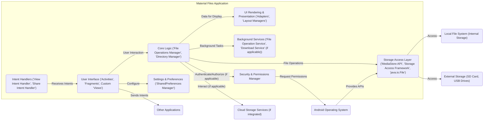
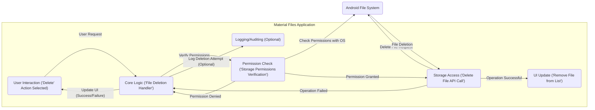

# Project Design Document: Material Files

**Version:** 1.1
**Date:** October 26, 2023
**Prepared By:** AI Software Architect

## 1. Introduction

This document provides a detailed architectural design of the Material Files Android application, an open-source file manager available at [https://github.com/zhanghai/MaterialFiles](https://github.com/zhanghai/MaterialFiles). This design document aims to provide a comprehensive understanding of the application's structure, components, and data flow, which will serve as the foundation for subsequent threat modeling activities. The target audience for this document includes security engineers, developers, and anyone involved in the security assessment of the application. This revision includes more detailed descriptions of components and potential security implications.

## 2. Project Overview

Material Files is an open-source file manager application for Android. It provides users with a graphical interface to browse, manage, and manipulate files and directories on their Android devices. Key functionalities include:

*   Browsing local file systems (internal and external storage).
*   Performing standard file operations: copying, moving, renaming, and deleting files and directories.
*   Creating new directories.
*   Opening files with associated applications via Android Intents.
*   Displaying file properties (name, size, modification date, etc.).
*   Offering various file sorting options (by name, date, size, etc.).
*   Potential integration with cloud storage services (to be verified in the codebase for specific implementations).
*   Theming and UI customization capabilities.
*   Support for different view modes (list, grid).

## 3. Architectural Design

This section outlines the high-level architecture and key components of the Material Files application, providing more detail on their responsibilities and interactions.

### 3.1. Component Diagram

### 3.2. Data Flow Diagram (File Deletion)

This diagram illustrates the data flow when a user deletes a file within the application, highlighting the security checks involved.

### 3.3. Key Components Description

*   **User Interface ('Activities', 'Fragments', Custom 'Views'):** This layer is responsible for all user interactions and visual presentation. It includes:
    *   `Activities`: Represent different screens of the application (e.g., file browser, settings). These manage the lifecycle of UI components.
    *   `Fragments`: Modular and reusable UI components within Activities, often used for displaying file lists or settings panels.
    *   Custom `Views`:  Specialized UI elements for displaying file information, icons, and handling user input. Security considerations here involve preventing UI redressing attacks and ensuring data displayed is correctly sanitized to avoid information leaks.
*   **Core Logic ('File Operations Manager', 'Directory Manager'):** This component contains the core business logic for file management.
    *   `File Operations Manager`: Handles actions like copy, move, delete, rename. It should implement robust error handling and security checks, such as validating file paths to prevent path traversal vulnerabilities.
    *   `Directory Manager`: Responsible for browsing and managing directories, including retrieving file lists and handling directory creation. It needs to ensure that directory access respects Android's permission model.
*   **Storage Access Layer ('MediaStore API', 'Storage Access Framework', 'java.io.File'):** This layer provides an abstraction for interacting with different storage locations.
    *   `MediaStore API`: Used for accessing media files (images, videos, audio). Security considerations involve ensuring proper permissions are in place and preventing unauthorized access to sensitive media.
    *   `Storage Access Framework (SAF)`: Allows users to grant access to specific directories or cloud storage providers. It's crucial to handle SAF URIs securely to prevent malicious applications from gaining unintended access.
    *   `java.io.File`:  Provides basic file system operations. Direct use requires careful handling of permissions and path validation.
*   **UI Rendering & Presentation ('Adapters', 'Layout Managers'):** This component focuses on efficiently displaying file information.
    *   `Adapters`: Bridge the data from the core logic to the UI elements (e.g., `RecyclerView.Adapter`).
    *   `Layout Managers`: Organize the layout of items in lists or grids. Security considerations are minimal here, but performance issues could lead to denial-of-service scenarios.
*   **Background Services ('File Operation Service', 'Download Service' (if applicable)):** These components handle long-running tasks without blocking the main UI thread.
    *   `File Operation Service`: Manages asynchronous file operations like copying or moving large files. Security is important here to ensure operations are performed with the correct permissions and data integrity is maintained.
    *   `Download Service`: If the application supports downloading files (e.g., from cloud storage), this service manages the download process. Security considerations include validating download sources and handling potential malware.
*   **Settings & Preferences ('SharedPreferences Manager'):** This component manages application settings.
    *   `SharedPreferences Manager`: Provides an interface for storing and retrieving user preferences. Sensitive information stored here should be encrypted.
*   **Intent Handlers ('View Intent Handler', 'Share Intent Handler'):** These components handle communication with other applications.
    *   `View Intent Handler`: Handles intents to open files. Security considerations involve validating the source of the intent and the file being opened to prevent malicious file execution.
    *   `Share Intent Handler`: Handles intents to share files. Care must be taken to ensure users are sharing files with the intended recipients and to prevent data leaks.
*   **Security & Permissions Manager:** This component (potentially implicit or part of the Core Logic) is responsible for managing permissions and enforcing security policies within the application. It handles runtime permission requests and potentially implements access control mechanisms.

### 3.4. Data Storage

The application interacts with various data storage locations:

*   **Android File System:** The primary data store, encompassing internal and external storage. Security depends on proper permission handling and preventing unauthorized access.
*   **Shared Preferences:** Used for storing application settings and user preferences. Sensitive data should be encrypted.
*   **Potential Local Database (e.g., SQLite):** May be used for caching file information or storing application-specific data. Requires secure data handling and protection against SQL injection (if applicable).
*   **Cloud Storage (If Integrated):** Credentials and data accessed through cloud storage APIs need to be handled securely, including secure storage of access tokens and encrypted communication.

### 3.5. External Interfaces

*   **Android Operating System:** Provides core functionalities like file system access, UI framework, and inter-process communication (Intents). Security relies on adhering to Android's security model and best practices.
*   **Other Applications:** Interaction occurs through Android Intents. Security involves validating incoming intents and ensuring outgoing intents do not expose sensitive information.
*   **Cloud Storage Providers (If Applicable):** Interaction through their respective APIs. Security requires secure authentication, authorization, and data transmission (HTTPS).

## 4. Security Considerations (Detailed for Threat Modeling)

This section expands on the initial security considerations, providing more specific examples of potential threats.

*   **File System Permissions Abuse:**
    *   **Threat:**  If the application requests excessive permissions or fails to properly validate access, malicious actors could potentially gain unauthorized access to sensitive files or modify critical system files.
    *   **Example:** An attacker could exploit a vulnerability to delete files outside the user's intended scope.
*   **Intent Handling Vulnerabilities:**
    *   **Threat:** Malicious applications could craft intents to trigger unintended actions within Material Files, such as opening a malicious file or sharing sensitive data with an unauthorized recipient.
    *   **Example:** A crafted intent could force Material Files to open a specially crafted file that exploits a vulnerability in the file viewer.
*   **Data Storage Security Weaknesses:**
    *   **Threat:** Sensitive information stored in shared preferences or a local database without proper encryption could be exposed if the device is compromised.
    *   **Example:** Cloud storage credentials stored in plain text in shared preferences could be stolen.
*   **Path Traversal Exploits:**
    *   **Threat:** Improper validation of user-supplied file paths could allow attackers to access files and directories outside the intended scope.
    *   **Example:** A user could input a path like `../../../system/etc/hosts` to access system files.
*   **Insufficient Data Sanitization:**
    *   **Threat:** While less likely in a file manager, if file names or content are displayed without proper sanitization, it could potentially lead to UI injection issues or information leaks.
    *   **Example:** Displaying a file name containing malicious HTML could potentially execute that code within the application's UI context (though Android's WebView security mitigates this).
*   **Cloud Storage Integration Risks (If Applicable):**
    *   **Threat:** Vulnerabilities in the integration with cloud storage providers could expose user credentials or allow unauthorized access to cloud data.
    *   **Example:**  Storing cloud storage access tokens insecurely could allow an attacker to access the user's cloud files.
*   **Insecure Update Mechanism:**
    *   **Threat:** If the application update process is not secure, attackers could potentially distribute malicious updates.
    *   **Example:**  Man-in-the-middle attacks during update downloads could replace the legitimate APK with a malicious one.
*   **Third-Party Library Vulnerabilities:**
    *   **Threat:** Using vulnerable third-party libraries can introduce security risks into the application.
    *   **Example:** A vulnerable image loading library could be exploited to execute arbitrary code.
*   **Lack of Input Validation:**
    *   **Threat:**  Insufficient validation of user input (e.g., when renaming files or creating directories) could lead to unexpected behavior or security vulnerabilities.
    *   **Example:** Allowing special characters in file names could potentially cause issues with file system operations or other applications.

## 5. Deployment

Material Files is deployed as an Android application package (APK) that users can install on their Android devices. Common deployment methods include:

*   **Google Play Store:** The primary and recommended distribution channel, offering security checks and automatic updates.
*   **F-Droid:** A repository for free and open-source Android applications, emphasizing transparency and security.
*   **Sideloading:** Users can manually install the APK file, which poses a higher security risk if the source is untrusted.

## 6. Assumptions and Constraints

*   **Target Platform:** The application is designed specifically for the Android platform and relies on its APIs and security features.
*   **Open Source Nature:** The source code is publicly available under an open-source license, allowing for community review but also potential scrutiny by malicious actors.
*   **User Permissions:** The application's functionality relies on users granting necessary runtime permissions for accessing storage and other resources. Users are expected to understand the implications of granting these permissions.

## 7. Future Considerations

Potential future enhancements that could impact the architecture and security posture include:

*   **Expanded Cloud Storage Integration:** Adding support for more cloud providers or implementing advanced features like server-side search or file versioning. This would introduce new attack surfaces related to cloud API security.
*   **Built-in File Encryption/Decryption:** Implementing features for encrypting and decrypting files directly within the application. This would require careful key management and secure storage of encryption keys.
*   **Local Network File Sharing:** Allowing users to share files over a local network (e.g., using SMB or WebDAV). This would introduce network security considerations, such as authentication and authorization for network shares.
*   **Plugin Architecture:** Enabling extensibility through plugins developed by third parties. This would require a robust security model to prevent malicious plugins from compromising the application or user data.

This revised document provides a more detailed and security-focused architectural overview of the Material Files application, serving as a stronger foundation for subsequent threat modeling activities.