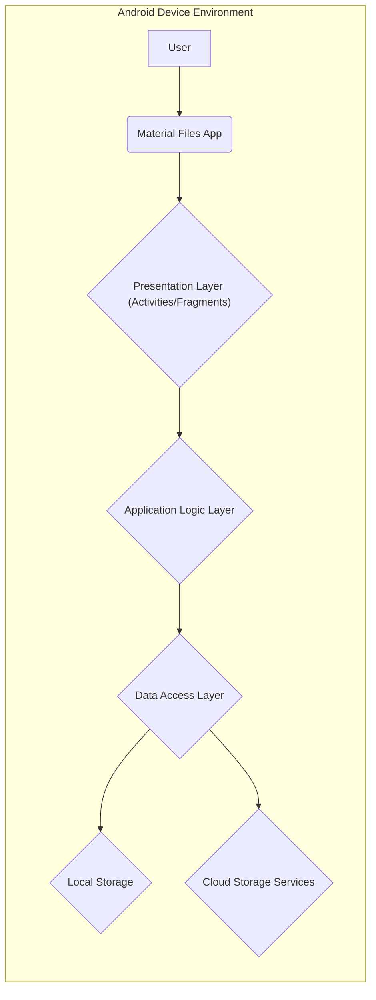
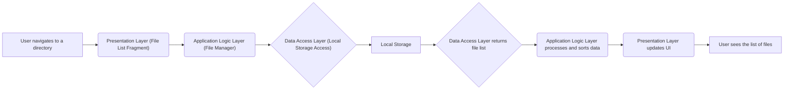
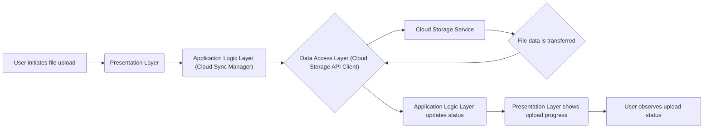
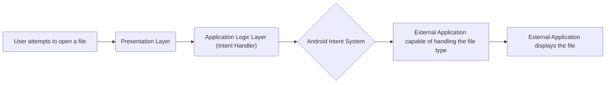

# Project Design Document: Material Files Android Application

**Version:** 1.1
**Date:** October 26, 2023
**Prepared By:** Gemini (AI Language Model)

## 1. Introduction

This document details the design of the Material Files Android application, an open-source file manager available on GitHub ([https://github.com/zhanghai/materialfiles](https://github.com/zhanghai/materialfiles)). The primary goal of this document is to provide a clear and comprehensive understanding of the application's architecture, components, and data interactions. This understanding is crucial for subsequent threat modeling activities.

## 2. Goals and Objectives

*   Provide a well-structured and easily understandable description of the Material Files application's design.
*   Clearly identify the key components and their responsibilities within the application.
*   Illustrate the flow of data during common user interactions and background processes.
*   Establish a solid foundation for identifying potential security threats and vulnerabilities.
*   Serve as a valuable resource for security analysts and developers involved in the project.

## 3. Scope

This document focuses on the architectural design of the Material Files Android application, reflecting its current state as represented in the linked GitHub repository. The scope includes:

*   A high-level overview of the application's structure.
*   Detailed descriptions of the core components and their functions.
*   Visual representations of data flow for key operations.
*   Identification of technologies and frameworks utilized.
*   Considerations for how the application is deployed to end-users.

This document explicitly excludes:

*   In-depth analysis of the application's source code.
*   Specific identification or exploitation of existing security vulnerabilities.
*   Detailed threat modeling outputs or proposed mitigation strategies (these will be addressed in separate documentation).
*   Discussions of future development plans or feature additions.

## 4. High-Level Architecture

The Material Files application is structured as a standard Android application, leveraging common architectural patterns and components provided by the Android framework.

**Component Descriptions:**

*   **User:** The individual who interacts with the Material Files application on their Android device.
*   **Material Files App:** The Android application package installed on the user's device.
*   **Presentation Layer (Activities/Fragments):**  Responsible for rendering the user interface, handling user input, and displaying information to the user.
*   **Application Logic Layer:** Contains the core business logic of the application, orchestrating file operations, managing state, and coordinating interactions between different components.
*   **Data Access Layer:** Provides an abstraction layer for accessing and manipulating data, whether it resides on local storage or remote cloud services.
*   **Local Storage:** The physical storage on the Android device (internal or external) where files are stored.
*   **Cloud Storage Services:** External services like Google Drive, OneDrive, etc., that the application integrates with for remote file storage and management.

## 5. Detailed Design

### 5.1. Core Components

*   **Activities:**
    *   `MainActivity`: Serves as the primary entry point and container for the main file browsing interface.
    *   `SettingsActivity`: Manages application-level settings and user preferences.
    *   File Viewer Activities (e.g., Image Viewer, Text Viewer):  Dedicated activities for displaying the content of specific file types.
    *   Intent Handling Activities: Activities designed to respond to intents from other applications, such as opening a file from an email attachment.

*   **Fragments:**
    *   File List Fragments: Display lists of files and directories, enabling navigation and file selection.
    *   Settings Fragments:  Provide UI elements for configuring various application settings.
    *   Dialog Fragments: Used for displaying modal dialogs for user prompts, confirmations, and input.

*   **Services:**
    *   File Transfer Services (Download/Upload): Manage background processes for transferring files to and from cloud storage services.
    *   Potentially other background services for tasks like indexing or monitoring file system changes.

*   **Data Management Components:**
    *   Local File System Access: Utilizes Android's file system APIs (`java.io.File`, `android.provider.DocumentsContract`) for interacting with local storage.
    *   Cloud Storage API Clients:  Wrappers around platform-specific SDKs (e.g., Google Drive Android API, Microsoft Graph SDK) to interact with cloud storage providers.
    *   Preferences Management: Uses `SharedPreferences` or similar mechanisms to store application settings and user preferences.
    *   Potentially a local database (e.g., SQLite via Room Persistence Library) for caching file metadata or managing bookmarks.

*   **Utility and Helper Classes:**
    *   File Operation Utilities:  Classes containing methods for common file operations like copying, moving, deleting, renaming, and creating files/directories.
    *   UI Helpers:  Classes that assist with UI updates, data binding, and common UI interactions.
    *   Permission Management Logic:  Handles requesting and managing necessary Android runtime permissions (e.g., `READ_EXTERNAL_STORAGE`, `WRITE_EXTERNAL_STORAGE`).

### 5.2. Data Flow Diagrams

#### 5.2.1. Displaying Files in a Directory

#### 5.2.2. Uploading a File to Cloud Storage

#### 5.2.3. Opening a File with an External Application

### 5.3. Security Considerations (Elaborated)

*   **Android Permissions:** The application's functionality relies on obtaining necessary Android permissions. A robust design ensures that only required permissions are requested, and their usage is clearly justified to the user. Mishandling permissions could lead to unauthorized access to user data.
*   **Local Data Security:** While the application itself might not implement explicit encryption for files at rest, it operates within the Android security sandbox. Consideration should be given to how the application handles sensitive data and whether additional measures are needed for specific use cases.
*   **Secure Communication:** Interactions with cloud storage services must utilize secure protocols like HTTPS to protect data in transit. Proper implementation and configuration of TLS/SSL are crucial.
*   **Input Sanitization and Validation:** The application should sanitize and validate user inputs, especially when dealing with file names and paths, to prevent vulnerabilities like path traversal attacks.
*   **Authentication and Authorization (Cloud):** Securely managing user credentials and access tokens for cloud storage services is paramount. The application should adhere to best practices for authentication and authorization flows provided by the respective cloud platforms.
*   **Third-Party Library Management:**  The application's security posture is influenced by the security of the third-party libraries it uses. Regularly updating and monitoring dependencies for known vulnerabilities is essential.
*   **Intent Security:** When interacting with other applications via Android Intents, proper intent filtering and data handling are necessary to prevent malicious applications from exploiting vulnerabilities.
*   **Data Handling in Memory:**  Sensitive data should be handled securely in memory and avoided being stored unnecessarily.

## 6. Technologies Used

*   **Primary Programming Languages:** Java, Kotlin
*   **Android SDK:**  The core development kit for building Android applications.
*   **Android Jetpack Libraries:**
    *   AppCompat: For backward compatibility with older Android versions.
    *   Material Design Components:  For implementing a consistent and modern user interface.
    *   ViewModel: For managing UI-related data in a lifecycle-conscious way.
    *   LiveData: For observable data holders that are lifecycle-aware.
    *   Potentially Room Persistence Library: For simplified database access if local data storage is required.
    *   Potentially Navigation Component: For managing in-app navigation.
*   **Cloud Storage SDKs/APIs:**
    *   Google Drive Android API (Google Play Services)
    *   Microsoft Graph SDK for Android (for OneDrive)
    *   Potentially SDKs for other supported cloud providers.
*   **Networking Libraries:**
    *   Likely `okhttp`: A popular HTTP client for Android and Java.
    *   Potentially `Retrofit`: A type-safe HTTP client built on top of `okhttp`.
*   **Image Loading Library:**
    *   Likely `Glide` or `Picasso`: For efficient image loading and caching.
*   **ZIP Compression/Decompression Library:**  For handling ZIP archives.

## 7. Deployment Methods

The Material Files application is typically distributed through the following channels:

*   **Google Play Store:** The primary and official app store for Android devices.
*   **F-Droid:** A repository of free and open-source Android applications.
*   **Sideloading (APK Installation):** Users can manually download and install the APK file, bypassing official app stores.

## 8. Future Considerations

*   **Enhanced End-to-End Encryption:** Implementing client-side encryption for files stored in the cloud.
*   **Improved Security Auditing and Logging:**  Adding more comprehensive logging for security-related events.
*   **Fine-grained Permission Control:** Providing users with more control over the permissions granted to the application.
*   **Integration with Additional Cloud Services:** Expanding support for a wider range of cloud storage providers.
*   **Regular Security Assessments:**  Conducting periodic security audits and penetration testing to proactively identify and address potential vulnerabilities.

This revised design document provides a more detailed and structured overview of the Material Files application's architecture, laying a strong foundation for effective threat modeling and security analysis. The clear identification of components, data flows, and technologies will aid in pinpointing potential attack surfaces and vulnerabilities.