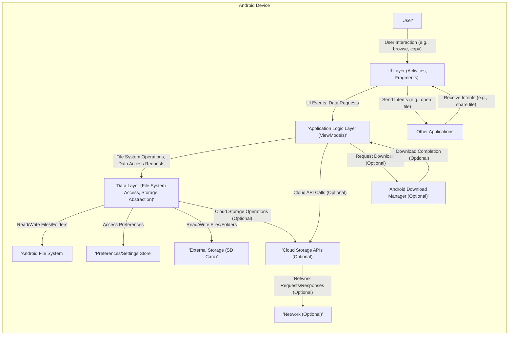

# Project Design Document: Material Files Android Application

**Version:** 1.1
**Date:** October 26, 2023
**Author:** AI Software Architect

## 1. Introduction

This document provides an enhanced design overview of the Material Files Android application, an open-source file manager available at [https://github.com/zhanghai/materialfiles](https://github.com/zhanghai/materialfiles). This iteration aims to provide a more granular understanding of the application's architecture, specifically tailored for effective threat modeling. It details the key architectural components, their interactions, and the flow of data within the application.

### 1.1. Purpose

The primary purpose of this document is to furnish a comprehensive and detailed architectural description of the Material Files application, explicitly for security analysis and threat modeling. This enhanced documentation will enable security professionals to gain a deeper understanding of the system's internal mechanisms, identify potential attack surfaces with greater precision, and assess associated risks more effectively.

### 1.2. Scope

This document encompasses the core functionalities and architectural components of the Material Files Android application, derived from a thorough analysis of its public repository. The focus is deliberately on aspects directly relevant to security, including data storage mechanisms, user interactions, inter-process communication, and external integrations. While it avoids delving into the minutiae of individual class or method implementations, it provides more specific examples and details within the architectural components to aid in identifying potential vulnerabilities.

### 1.3. Target Audience

This document is intended for:

* Security architects and engineers responsible for conducting threat modeling exercises and security assessments.
* Development team members involved in the maintenance, enhancement, or integration of the Material Files application.
* Individuals seeking an in-depth understanding of the application's architecture from a security perspective.

## 2. Overview

Material Files is a user-friendly, open-source file manager application designed for the Android operating system. It adheres to the principles of Material Design, providing a clean and intuitive user experience for managing files and directories. Key functionalities include:

* **File System Navigation:**  Allows users to browse the directory structure of their Android device, including internal and external storage.
* **File and Directory Management:**  Provides standard operations such as creating new folders, deleting, renaming, copying, and moving files and directories.
* **File Viewing and Opening:** Enables users to preview various file types and open them with associated applications installed on the device.
* **File Information Display:** Shows detailed information about files and directories, such as size, modification date, and permissions.
* **Storage Location Management:**  Handles interactions with different storage volumes available on the device.
* **Potential Cloud Storage Integration:** Depending on the specific version and implemented features, it might offer integration with cloud storage services.
* **Intent-based Interactions:**  Can interact with other Android applications through the Android Intent system for actions like sharing files.

## 3. Architectural Design

The application likely follows a well-structured Android architectural pattern, potentially employing Model-View-ViewModel (MVVM) or a similar approach to promote separation of concerns, testability, and maintainability.

### 3.1. Key Components

* **User Interface (UI) Layer:**
    * **Activities:**  Manage the lifecycle of application screens and handle high-level user interactions. Examples include the main `MainActivity` for file browsing, a `SettingsActivity` for configuration, and potentially specific activities for file editing or viewing.
    * **Fragments:**  Modular and reusable UI components within Activities. Examples include a `FileListFragment` to display files and folders, or dialog fragments for specific actions.
    * **Layouts (XML):** Define the visual structure and arrangement of UI elements using XML layout files.
    * **Adapters:**  Act as bridges between data sources and UI elements like `RecyclerView`, responsible for displaying lists of files and folders efficiently. For example, a `FileListAdapter`.
    * **Custom Views and UI Components:**  Potentially includes custom-drawn views or specialized UI elements for specific functionalities.

* **Application Logic Layer (ViewModel/Presenter):**
    * **ViewModels (or Presenters):**  Manage UI-related data and logic, handling user input and preparing data for display. They are responsible for interacting with the Data Layer and notifying the UI of changes. Examples include a `FileListViewModel` or `FileOperationViewModel`.
    * **Use Cases/Interactors:** Encapsulate specific business logic and operations related to file management, providing a clear separation of concerns. Examples include `GetFileListUseCase`, `CopyFileUseCase`, `DeleteFileUseCase`.

* **Data Layer (Model):**
    * **File System Access:**  Provides direct interaction with the Android file system APIs (`java.io.File`, `android.content.ContentResolver` for media files) to perform read, write, and management operations on files and directories. This is a critical area for security considerations.
    * **Storage Abstraction:**  Potentially implements an abstraction layer to handle different storage locations (internal storage, SD card, potentially cloud storage) in a unified manner. This might involve different implementations for accessing each storage type.
    * **Data Models:**  Plain data objects (POJOs/POCOs) representing files, folders, and related metadata. Examples include `FileItem`, `DirectoryItem`.
    * **Preferences/Settings Management:**  Handles the storage and retrieval of application settings and user preferences, likely using Android's `SharedPreferences` or the DataStore API. This may include sensitive preferences.

* **External Integrations (Potentially):**
    * **Cloud Storage API Clients:** If implemented, this component would contain clients for interacting with specific cloud storage service APIs (e.g., Google Drive API, Dropbox API). This introduces dependencies on external services and requires careful handling of authentication and authorization.
    * **Intent Handlers and Providers:**  Handles incoming Intents from other applications (e.g., to open a file) and potentially provides Intents to other applications (e.g., to share a file). This involves inter-process communication and requires security considerations.
    * **Download Manager Integration:**  Might integrate with the Android Download Manager for handling file downloads.

### 3.2. Component Interactions and Data Flow

**Detailed Data Flow Examples:**

* **Displaying a List of Files in a Directory:**
    1. The **User** interacts with the **UI Layer** (e.g., clicks on a folder in the `FileListFragment`).
    2. The **UI Layer** triggers an event, which is handled by the corresponding **ViewModel** in the **Application Logic Layer**.
    3. The **ViewModel** invokes a `GetFileListUseCase` from the **Application Logic Layer**, passing the directory path.
    4. The `GetFileListUseCase` interacts with the **Data Layer's File System Access** component or **Storage Abstraction**.
    5. The **Data Layer** uses Android file system APIs to read the contents of the specified directory from the **Android File System** or **External Storage**.
    6. The **Data Layer** returns a list of `FileItem` objects to the `GetFileListUseCase`.
    7. The `GetFileListUseCase` returns the list to the **ViewModel**.
    8. The **ViewModel** updates the LiveData or StateFlow holding the file list.
    9. The **UI Layer** observes these changes and updates the `RecyclerView` with the new file list.

* **Copying a File from Internal Storage to SD Card:**
    1. The **User** initiates a copy operation through the **UI Layer**, selecting the source and destination.
    2. The **UI Layer** sends a request to the **ViewModel** with the source and destination file paths.
    3. The **ViewModel** invokes a `CopyFileUseCase`.
    4. The `CopyFileUseCase` interacts with the **Data Layer's File System Access** component or **Storage Abstraction**.
    5. The **Data Layer** reads the content of the source file from the **Android File System**.
    6. The **Data Layer** writes the content to the destination path on the **External Storage**.
    7. The **Data Layer** reports the success or failure of the operation back to the `CopyFileUseCase`.
    8. The `CopyFileUseCase` informs the **ViewModel**.
    9. The **ViewModel** updates the UI to reflect the completion of the operation.

### 3.3. Data Storage

* **Android File System:** The primary storage mechanism for user files and directories. This includes internal storage, external storage (SD card), and potentially other mounted storage volumes. Access is managed through Android's file system permissions.
* **Application Preferences:** Application settings and user preferences are likely stored using Android's `SharedPreferences` or the newer DataStore API. This might include:
    * **UI Preferences:** Theme settings, sorting options, view modes.
    * **Functional Preferences:** Default sort order, hidden file visibility.
    * **Potentially Sensitive Data:**  While unlikely for core file management, if cloud integration is present, this could include stored authentication tokens or account identifiers. Secure storage mechanisms should be used for such data.

## 4. Security Considerations (Detailed)

Building upon the initial thoughts, here are more detailed security considerations:

* **File System Permissions and Access Control:**
    * **Risk:** Improperly requested or managed file system permissions could allow the application to access or modify files beyond its intended scope, potentially leading to data breaches or corruption.
    * **Example Threats:** An attacker could potentially manipulate the application to access sensitive system files or other application data if permissions are overly broad.
* **Intent Handling Vulnerabilities:**
    * **Risk:**  Vulnerabilities in how the application handles incoming and outgoing Intents could be exploited by malicious applications to trigger unintended actions or leak sensitive information.
    * **Example Threats:** A malicious application could send a crafted Intent to Material Files to delete arbitrary files or gain access to file paths. Conversely, if Material Files sends Intents with sensitive data without proper protection, other applications could intercept them.
* **Cloud Storage Integration Security (If Present):**
    * **Risk:**  Insecure storage or transmission of cloud service credentials (API keys, access tokens) could lead to unauthorized access to user cloud storage accounts.
    * **Example Threats:**  Storing API keys in plain text within the application or transmitting them over unencrypted connections.
    * **Risk:**  Insufficient validation of data received from cloud storage could lead to vulnerabilities.
    * **Example Threats:**  Downloading malicious files disguised as legitimate ones.
* **Path Traversal Vulnerabilities:**
    * **Risk:**  Improper handling of user-provided file paths could allow attackers to access files and directories outside the intended scope.
    * **Example Threats:**  A user could potentially craft a path like `../../../system/etc/passwd` if the application doesn't properly sanitize input.
* **Privacy of User Data:**
    * **Risk:**  The application might unintentionally log or store sensitive user information, such as browsing history or file access patterns, which could be a privacy concern.
    * **Example Threats:**  Storing a detailed log of all files accessed by the user without proper anonymization.
* **Secure Storage of Preferences:**
    * **Risk:**  Sensitive information stored in application preferences (e.g., cloud storage tokens) could be vulnerable if not properly encrypted or protected.
    * **Example Threats:**  Rooted devices or backup mechanisms could expose plain-text preferences.
* **Third-Party Library Vulnerabilities:**
    * **Risk:**  Using vulnerable third-party libraries could introduce security flaws into the application.
    * **Example Threats:**  A vulnerable image loading library could be exploited to execute arbitrary code.
* **Inter-Process Communication (IPC) Security:**
    * **Risk:** If the application uses IPC mechanisms (beyond basic Intents) for communication between its components or with other processes, these channels could be vulnerable to eavesdropping or manipulation.
    * **Example Threats:**  Unprotected Binder calls or shared memory regions.

## 5. Dependencies

The application likely relies on various components of the Android SDK and potentially external libraries. Key dependencies may include:

* **Android SDK Libraries:**
    * `androidx.appcompat`: For backward compatibility and UI consistency.
    * `androidx.recyclerview`: For efficiently displaying lists of files and folders.
    * `com.google.android.material`: For Material Design components.
    * Core Android framework libraries for file system access, intent handling, etc.
* **External Libraries (Examples):**
    * **Image Loading:** Libraries like Glide or Picasso for efficient image loading and caching.
    * **Networking (If Cloud Integration):** Libraries like Retrofit or OkHttp for making network requests.
    * **Dependency Injection:** Libraries like Dagger or Hilt for managing dependencies.
    * **Reactive Programming:** Libraries like RxJava or Kotlin Coroutines for asynchronous operations.
    * **Logging:** Libraries for structured logging.

## 6. Deployment

The primary deployment method for the Material Files application is likely through the Google Play Store. Distribution may also occur through direct APK downloads from the project's GitHub releases or other sources. Updates are typically managed through the Play Store or by manually installing newer APK versions.

## 7. Future Considerations

Potential future developments that could impact the architecture and security include:

* **Enhanced Cloud Storage Integration:** Adding support for more cloud providers or advanced features like file synchronization. This would introduce new authentication, authorization, and data handling complexities.
* **Network File Sharing (e.g., SMB, WebDAV):** Implementing support for accessing files on network shares. This would require handling network protocols and user authentication for remote systems.
* **File Archiving and Compression:** Adding features to create and extract archive files (e.g., ZIP). This would involve using libraries for archive manipulation and ensuring secure handling of archive contents.
* **File Encryption:** Implementing features to encrypt and decrypt files. This would require careful consideration of encryption algorithms, key management, and secure storage of encryption keys.

This enhanced design document provides a more detailed and security-focused overview of the Material Files application's architecture. This information will be crucial for conducting a thorough threat modeling exercise to identify potential vulnerabilities and design appropriate security mitigations.