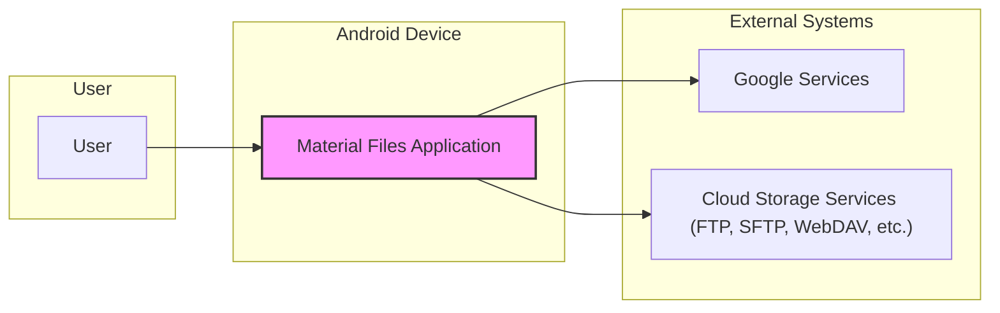
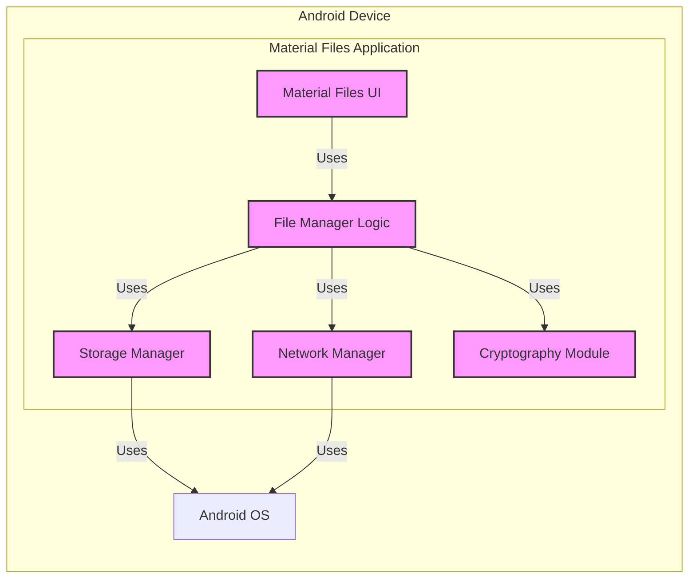
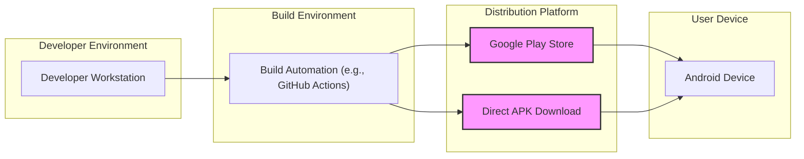
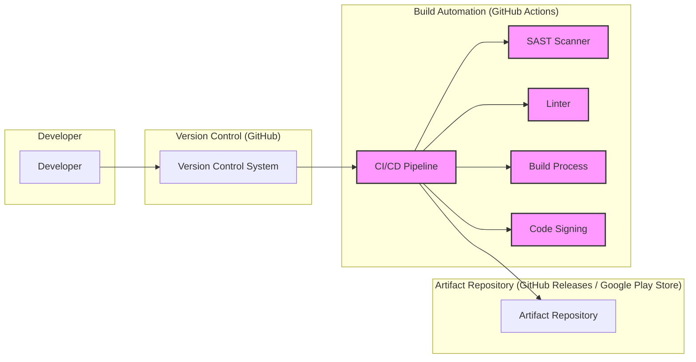

# BUSINESS POSTURE

This project, Material Files, is an open-source file manager application for the Android platform.

Business Priorities and Goals:

- Provide users with a feature-rich, user-friendly, and visually appealing file management solution for Android devices.
- Offer a free and open-source alternative to proprietary file manager applications.
- Support a wide range of storage options, including local storage and cloud services.
- Maintain user privacy and data security within the application's functionality.
- Foster community contributions and maintainability through open-source development.

Business Risks:

- Data breaches or unauthorized access to user files due to vulnerabilities in the application.
- Loss of user trust and adoption if security incidents occur.
- Reputational damage if the application is perceived as insecure.
- Legal and compliance issues if user data privacy is not adequately protected (e.g., GDPR, CCPA).
- Difficulty in monetizing or sustaining development efforts as a free and open-source project.

# SECURITY POSTURE

Existing Security Controls:

- security control: Open-source code, allowing for community review and vulnerability identification (location: GitHub repository).
- security control: Standard Android security model, including application sandboxing and permission system (location: Android OS documentation).
- security control: Use of standard Android APIs for file access and storage operations (location: Android SDK documentation).
- security control: Potentially leveraging platform security features for data encryption at rest (location: Android OS documentation).

Accepted Risks:

- accepted risk: Reliance on community contributions for security vulnerability identification and patching.
- accepted risk: Potential for vulnerabilities to exist in dependencies or third-party libraries.
- accepted risk: Risk of user devices being compromised outside of the application's control.
- accepted risk: Limited resources for dedicated security testing and audits.

Recommended Security Controls:

- security control: Implement automated security scanning (SAST/DAST) in the CI/CD pipeline.
- security control: Conduct regular security code reviews, especially for critical components and contributions.
- security control: Implement input validation and sanitization for all user inputs and external data.
- security control: Follow secure coding practices and guidelines for Android development.
- security control: Implement a vulnerability disclosure and incident response plan.
- security control: Consider using a dependency vulnerability scanner to monitor and update dependencies.

Security Requirements:

- Authentication:
    - requirement: The application itself does not require user authentication as it is a local file manager.
    - requirement: For accessing cloud storage services (FTP, SFTP, WebDAV, etc.), the application MUST securely store and manage user credentials.
    - requirement: Consider using Android Keystore for secure storage of cloud service credentials.
- Authorization:
    - requirement: The application MUST adhere to Android's permission model to access storage and other device resources.
    - requirement: Implement granular access control within the application to restrict access to sensitive functionalities based on user roles or permissions (if applicable, although less relevant for a file manager).
    - requirement: Ensure proper authorization checks are in place when accessing and manipulating files, especially when root access is enabled.
- Input Validation:
    - requirement: All user inputs, including file names, paths, and configuration settings, MUST be validated to prevent injection attacks (e.g., path traversal, command injection).
    - requirement: Data received from external sources (e.g., cloud storage APIs) MUST be validated and sanitized before processing.
- Cryptography:
    - requirement: Sensitive data, such as cloud storage credentials, MUST be encrypted at rest and in transit.
    - requirement: Use secure cryptographic libraries and algorithms for encryption and decryption operations.
    - requirement: Ensure proper handling of cryptographic keys and avoid hardcoding secrets in the application.
    - requirement: For network communication with cloud services (SFTP, WebDAV, etc.), use secure protocols like TLS/SSL to encrypt data in transit.

# DESIGN

## C4 CONTEXT

Context Diagram Elements:

- Element:
    - Name: User
    - Type: Person
    - Description: An individual using an Android device to manage files.
    - Responsibilities: Interacts with the Material Files application to browse, manage, and organize files on their device and connected cloud storage services.
    - Security controls: Device lock screen, user awareness of phishing and malware, application permissions granted.

- Element:
    - Name: Material Files Application
    - Type: Software System
    - Description: An Android application that provides file management functionalities, including local and cloud storage access.
    - Responsibilities:
        - Provide a user interface for file browsing and management.
        - Access and manipulate files on local storage.
        - Connect to and interact with cloud storage services.
        - Implement file operations (copy, move, delete, rename, etc.).
        - Manage user preferences and settings.
    - Security controls: Android application sandbox, permission requests, input validation, secure storage of credentials (if applicable), secure network communication.

- Element:
    - Name: Google Services
    - Type: Software System
    - Description: Google-provided services on Android devices, potentially used for storage access or other functionalities.
    - Responsibilities: Provide APIs and services for Android applications, including storage access frameworks.
    - Security controls: Google's security infrastructure, Android security model, API access controls.

- Element:
    - Name: Cloud Storage Services (FTP, SFTP, WebDAV, etc.)
    - Type: Software System
    - Description: External cloud storage providers that users can connect to through Material Files.
    - Responsibilities: Store user files in the cloud, provide APIs for file access and management.
    - Security controls: Cloud provider's security infrastructure, authentication mechanisms (username/password, API keys), encryption in transit and at rest.

## C4 CONTAINER

Container Diagram Elements:

- Element:
    - Name: Material Files UI
    - Type: Application
    - Description: The user interface component of the Material Files application, responsible for user interaction and presentation.
    - Responsibilities:
        - Display file listings and application UI elements.
        - Handle user input and navigation.
        - Present data to the user.
    - Security controls: Input validation on UI elements, adherence to Android UI security guidelines.

- Element:
    - Name: File Manager Logic
    - Type: Application
    - Description: The core business logic of the file manager, handling file operations, storage management orchestration, and network communication coordination.
    - Responsibilities:
        - Implement file operations (copy, move, delete, rename, etc.).
        - Orchestrate storage access through the Storage Manager.
        - Manage network connections through the Network Manager.
        - Enforce authorization and access control rules.
        - Handle application settings and preferences.
    - Security controls: Input validation, authorization checks, secure coding practices, logging and monitoring.

- Element:
    - Name: Storage Manager
    - Type: Application
    - Description:  Manages interactions with local and potentially cloud storage, abstracting storage access details.
    - Responsibilities:
        - Interact with Android OS APIs for local file system access.
        - Handle different storage types (internal, external, SD card).
        - Potentially integrate with cloud storage APIs (though Network Manager might handle direct cloud API interaction).
    - Security controls: Permission management, secure file access operations, input validation for file paths.

- Element:
    - Name: Network Manager
    - Type: Application
    - Description: Handles network communication for accessing cloud storage services.
    - Responsibilities:
        - Establish and manage network connections (FTP, SFTP, WebDAV, etc.).
        - Implement network protocols for file transfer.
        - Handle authentication with cloud storage services.
        - Encrypt network traffic.
    - Security controls: Secure network protocols (TLS/SSL), secure credential management, input validation for network requests, protection against network-based attacks.

- Element:
    - Name: Cryptography Module
    - Type: Application
    - Description: Provides cryptographic functionalities for secure storage of credentials and potentially file encryption.
    - Responsibilities:
        - Encrypt and decrypt sensitive data (e.g., cloud storage passwords).
        - Manage cryptographic keys.
        - Implement cryptographic algorithms.
    - Security controls: Use of secure cryptographic libraries, proper key management, adherence to cryptography best practices.

- Element:
    - Name: Android OS
    - Type: Infrastructure
    - Description: The underlying Android operating system providing core functionalities and security features.
    - Responsibilities:
        - Provide file system access APIs.
        - Enforce application sandboxing and permissions.
        - Provide network stack and security features.
        - Manage device security features (e.g., encryption, lock screen).
    - Security controls: Kernel security, application sandbox, permission system, OS updates and patching.

## DEPLOYMENT

Deployment Architecture: Android Application Distribution

Deployment Diagram Elements:

- Element:
    - Name: Developer Workstation
    - Type: Environment
    - Description: The development environment used by developers to write, test, and build the Material Files application.
    - Responsibilities: Code development, local testing, building application packages.
    - Security controls: Developer workstation security practices, code version control, secure development environment.

- Element:
    - Name: Build Automation (e.g., GitHub Actions)
    - Type: Environment
    - Description: Automated build system used to compile, test, and package the application for distribution.
    - Responsibilities: Automated building, testing, signing, and packaging of the Android application (APK).
    - Security controls: Secure build environment, access control to build system, code signing certificate management, automated security scans.

- Element:
    - Name: Google Play Store
    - Type: Environment
    - Description: Google's official app store for Android, used to distribute the Material Files application to users.
    - Responsibilities: Application hosting, distribution, updates, user reviews and ratings.
    - Security controls: Google Play Protect, application signing verification, platform security measures.

- Element:
    - Name: Direct APK Download
    - Type: Environment
    - Description: Alternative distribution method where users can directly download the APK file and install it on their devices.
    - Responsibilities: Providing APK download links (e.g., on GitHub releases, project website).
    - Security controls: Website/repository security, integrity checks (e.g., checksums) for APK files, user awareness of risks associated with sideloading applications.

- Element:
    - Name: Android Device
    - Type: Environment
    - Description: User's Android mobile device where the Material Files application is installed and run.
    - Responsibilities: Running the application, providing storage and network access.
    - Security controls: Device security features (lock screen, encryption), user-installed security applications, application permissions.

## BUILD

Build Process Diagram:

Build Process Description:

1.  Developer (DEV) writes code and commits changes to the Version Control System (VC) - GitHub.
2.  Changes to the repository trigger the CI/CD Pipeline (CI) - GitHub Actions.
3.  The CI/CD pipeline performs the following security checks:
    - SAST Scanner (SAST): Static Application Security Testing is performed to identify potential vulnerabilities in the source code.
    - Linter (LINT): Code linters are used to enforce code quality and coding standards, which can indirectly improve security.
4.  Build Process (BUILD): The application code is compiled and built into an Android Application Package (APK).
5.  Code Signing (SIGN): The APK is signed with a digital certificate to ensure integrity and authenticity.
6.  Artifact Repository (AR): The signed APK is published to the Artifact Repository, which can be GitHub Releases for direct download or Google Play Store for distribution through the official app store.

Build Security Controls:

- security control: Secure access to the CI/CD pipeline and build environment.
- security control: Use of dedicated build agents and isolated build environments.
- security control: Integration of SAST scanners and linters in the CI/CD pipeline.
- security control: Dependency scanning to identify vulnerable dependencies.
- security control: Secure storage and management of code signing certificates.
- security control: Audit logging of build process activities.
- security control: Review of build configurations and scripts for security vulnerabilities.
- security control: Principle of least privilege applied to build process permissions.

# RISK ASSESSMENT

Critical Business Processes:

- Protecting user data privacy and confidentiality is the most critical business process. This includes ensuring that user files are not accessed, modified, or deleted without authorization, and that sensitive data like cloud storage credentials are securely stored and transmitted.
- Maintaining application integrity and availability is also important to ensure users can reliably manage their files.

Data Sensitivity:

- User files stored on the device and in connected cloud storage are the primary data assets.
- Sensitivity of user files varies greatly depending on the user and the content of the files. Some files may contain highly sensitive personal or confidential information.
- Cloud storage credentials (usernames, passwords, API keys) are highly sensitive data that must be protected to prevent unauthorized access to user cloud accounts.
- Application settings and preferences may contain some less sensitive user data.

# QUESTIONS & ASSUMPTIONS

Questions:

- What type of cloud storage services are primarily targeted for integration? (FTP, SFTP, WebDAV, specific cloud providers APIs?)
- Are there any specific regulatory compliance requirements that the application needs to adhere to (e.g., GDPR, CCPA)?
- What is the intended user base for the application (general public, specific demographics, enterprise users)?
- Are there any plans for monetization or commercialization of the application?
- What is the process for handling user data and privacy concerns? Is there a privacy policy in place?
- What is the process for vulnerability reporting and incident response?

Assumptions:

- BUSINESS POSTURE: The primary goal is to provide a secure and user-friendly open-source file manager for Android. User trust and data privacy are high priorities.
- SECURITY POSTURE: The project currently relies on open-source community review and standard Android security features. There is a need for more proactive security measures like automated security scanning and formal security code reviews.
- DESIGN: The application is designed as a typical Android application with UI, logic, storage management, and network communication components. It will be distributed through Google Play Store and potentially direct APK download. The build process will leverage CI/CD pipelines and include basic security checks.