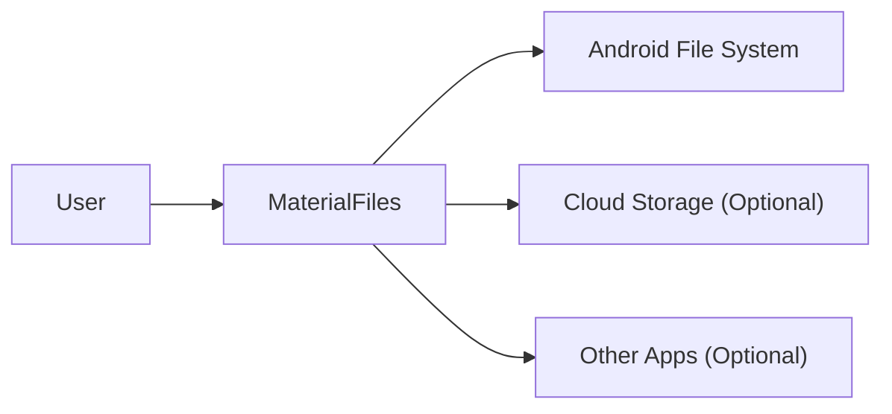
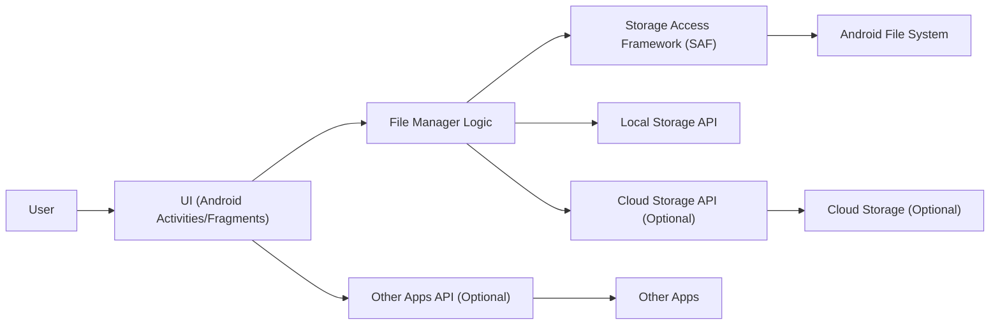
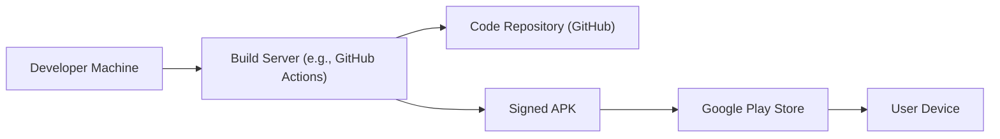
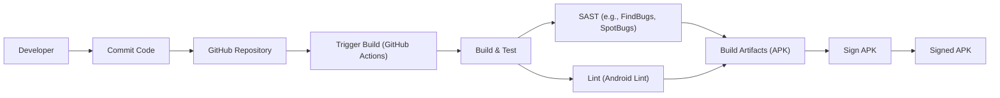

Okay, let's create a design document for the MaterialFiles project.

# BUSINESS POSTURE

MaterialFiles is an open-source Android file manager. The primary business goal is to provide a user-friendly, feature-rich, and visually appealing file management experience on Android devices, adhering to Material Design guidelines. The project aims to be a viable alternative to pre-installed and commercially available file managers.

Business priorities:

-   User Experience: Providing a clean, intuitive, and efficient user interface.
-   Functionality: Offering a comprehensive set of file management features.
-   Performance: Ensuring smooth and responsive operation, even with large numbers of files.
-   Stability: Minimizing crashes and ensuring data integrity.
-   Community Engagement: Fostering an active community of users and contributors.
-   Open Source: Maintaining the project as a freely available and open-source resource.

Business risks:

-   Data Loss/Corruption: Accidental deletion or modification of user files due to bugs or vulnerabilities. This is the most critical risk.
-   Security Vulnerabilities: Exposure of user data to malicious apps or actors due to security flaws.
-   Compatibility Issues: Inconsistent behavior or crashes on different Android versions or device models.
-   Performance Degradation: Slowdowns or unresponsiveness, particularly on older or lower-end devices.
-   Lack of Adoption: Failure to attract and retain users due to competition or lack of awareness.
-   Maintainer Burnout: Loss of key developers or maintainers, leading to project stagnation.

# SECURITY POSTURE

Existing security controls:

-   security control: Scoped Storage: The application targets a recent Android SDK, implying the use of Scoped Storage for enhanced file access security. This limits the app's access to only specific directories, reducing the potential impact of vulnerabilities. (Implicit in targeting a recent SDK version).
-   security control: Android Permissions Model: The app utilizes Android's permission system to request access to storage, network (if applicable), and other resources. Users are prompted to grant these permissions. (Manifest file and runtime permission requests).
-   security control: Code Obfuscation: ProGuard or R8 is likely used to obfuscate the code, making reverse engineering more difficult. (build.gradle configuration).
-   security control: Basic Input Validation: The application likely performs some basic input validation to prevent common injection vulnerabilities, although the specifics would need to be verified in the code. (Code review needed).

Accepted risks:

-   accepted risk: Third-Party Libraries: The project depends on third-party libraries, which may introduce vulnerabilities. Regular updates and vulnerability scanning are necessary.
-   accepted risk: User Error: The app cannot fully prevent users from making mistakes, such as deleting important files.
-   accepted risk: Limited Control over External Storage: While Scoped Storage improves security, the app still interacts with external storage, which may be less secure than internal storage.
-   accepted risk: Rooted Devices: On rooted devices, the app's security guarantees may be compromised.

Recommended security controls:

-   security control: Implement a robust Content Provider if sharing files with other apps is a requirement. This ensures controlled access to shared data.
-   security control: Perform thorough input validation and sanitization for all user inputs, including file names, paths, and search queries.
-   security control: Implement a secure file deletion mechanism (e.g., secure wipe) as an option for users.
-   security control: Regularly conduct static and dynamic code analysis to identify potential vulnerabilities.
-   security control: Implement a mechanism for securely handling user credentials if cloud storage integration is added.
-   security control: Consider implementing integrity checks for critical application files to detect tampering.

Security Requirements:

-   Authentication: Not directly applicable, as the app primarily deals with local files. If cloud storage integration is added, secure authentication mechanisms (e.g., OAuth 2.0) must be used.
-   Authorization: The app relies on the Android permission model for authorization to access storage and other resources. Access control within the app (e.g., restricting access to certain folders) should be considered based on user roles or settings.
-   Input Validation: All user inputs must be validated and sanitized to prevent injection attacks and other vulnerabilities. This includes file names, paths, search queries, and any data received from external sources.
-   Cryptography: If sensitive data is stored or transmitted, appropriate cryptographic techniques (e.g., encryption, hashing) should be used. For example, if cloud storage integration is added, data should be encrypted in transit (TLS) and at rest.

# DESIGN

## C4 CONTEXT

Context Diagram Element List:

-   Element:
    -   Name: User
    -   Type: Person
    -   Description: A person who uses MaterialFiles to manage files on their Android device.
    -   Responsibilities: Interacts with the MaterialFiles app to browse, copy, move, delete, and manage files.
    -   Security controls: N/A - This is the user of the application.

-   Element:
    -   Name: MaterialFiles
    -   Type: Software System
    -   Description: The Android file manager application.
    -   Responsibilities: Provides a user interface for managing files, interacts with the Android file system, and optionally interacts with cloud storage providers and other apps.
    -   Security controls: Scoped Storage, Android Permissions Model, Code Obfuscation, Basic Input Validation.

-   Element:
    -   Name: Android File System
    -   Type: External System
    -   Description: The underlying file system of the Android operating system.
    -   Responsibilities: Stores and manages files on the device's storage.
    -   Security controls: Android's built-in file system security features, including file permissions and sandboxing.

-   Element:
    -   Name: Cloud Storage (Optional)
    -   Type: External System
    -   Description: Cloud storage services like Google Drive, Dropbox, etc. (if integrated).
    -   Responsibilities: Stores and manages files in the cloud.
    -   Security controls: Security controls provided by the respective cloud storage provider (e.g., encryption, access controls).

-   Element:
    -   Name: Other Apps (Optional)
    -   Type: External System
    -   Description: Other applications on the device that may interact with MaterialFiles (e.g., through file sharing).
    -   Responsibilities: Varies depending on the app.
    -   Security controls: Security controls implemented by the respective apps. MaterialFiles should use secure methods for inter-app communication (e.g., Content Providers).

## C4 CONTAINER

Container Diagram Element List:

- Element:
    - Name: User
    - Type: Person
    - Description: A person interacting with the application.
    - Responsibilities: Provides input and receives output from the application.
    - Security controls: N/A

- Element:
    - Name: UI (Android Activities/Fragments)
    - Type: Container (Android Component)
    - Description: The user interface of the application, built using Android Activities and Fragments.
    - Responsibilities: Displays the file system to the user, handles user input, and communicates with the File Manager Logic.
    - Security controls: Input validation, UI-related security best practices.

- Element:
    - Name: File Manager Logic
    - Type: Container (Java/Kotlin Classes)
    - Description: The core logic of the application, responsible for managing files and interacting with storage APIs.
    - Responsibilities: Handles file operations (copy, move, delete, rename), manages file lists, and coordinates interactions with storage.
    - Security controls: Input validation, business logic security checks.

- Element:
    - Name: Storage Access Framework (SAF)
    - Type: Container (Android API)
    - Description: Android's Storage Access Framework, used for accessing files in a consistent and secure way.
    - Responsibilities: Provides a standard way to access files and directories, including those on external storage and cloud storage providers.
    - Security controls: Enforces Android's permission model and Scoped Storage rules.

- Element:
    - Name: Local Storage API
    - Type: Container (Java/Kotlin API)
    - Description: Standard Java/Kotlin APIs for interacting with the local file system.
    - Responsibilities: Provides low-level file system access.
    - Security controls: Relies on the underlying Android file system security.

- Element:
    - Name: Cloud Storage API (Optional)
    - Type: Container (External API)
    - Description: APIs for interacting with cloud storage providers (e.g., Google Drive API, Dropbox API).
    - Responsibilities: Handles communication with cloud storage services.
    - Security controls: Authentication and authorization using OAuth 2.0 or similar, secure communication (TLS).

- Element:
    - Name: Android File System
    - Type: External System
    - Description: The underlying file system of the Android operating system.
    - Responsibilities: Stores and manages files.
    - Security controls: Android's built-in file system security.

- Element:
    - Name: Cloud Storage (Optional)
    - Type: External System
    - Description: Cloud storage services.
    - Responsibilities: Stores and manages files in the cloud.
    - Security controls: Security controls provided by the cloud storage provider.

- Element:
    - Name: Other Apps API (Optional)
    - Type: Container (Android API)
    - Description: Android APIs for interacting with other applications, such as Intents and Content Providers.
    - Responsibilities: Facilitates communication with other apps.
    - Security controls: Uses Android's inter-process communication security mechanisms.

- Element:
    - Name: Other Apps
    - Type: External System
    - Description: Other applications on the device.
    - Responsibilities: Varies.
    - Security controls: Implemented by the other apps.

## DEPLOYMENT

Possible deployment solutions:

1.  Google Play Store: The standard distribution method for Android apps.
2.  F-Droid: An alternative app store focused on free and open-source software.
3.  Direct APK Download: Providing the APK file for manual installation (sideloading).

Chosen solution (described in detail): Google Play Store

Deployment Diagram Element List:

-   Element:
    -   Name: Developer Machine
    -   Type: Infrastructure Node
    -   Description: The developer's workstation where code is written and tested.
    -   Responsibilities: Code development, testing, and initiating the build process.
    -   Security controls: Development environment security best practices.

-   Element:
    -   Name: Build Server (e.g., GitHub Actions)
    -   Type: Infrastructure Node
    -   Description: A server that automates the build and testing process.
    -   Responsibilities: Builds the APK, runs tests, and potentially signs the APK.
    -   Security controls: Secure configuration of the build server, access controls, and secrets management.

-   Element:
    -   Name: Code Repository (GitHub)
    -   Type: Infrastructure Node
    -   Description: The Git repository hosted on GitHub.
    -   Responsibilities: Stores the source code and build scripts.
    -   Security controls: GitHub's access controls and security features.

-   Element:
    -   Name: Signed APK
    -   Type: Artifact
    -   Description: The final, signed APK file ready for distribution.
    -   Responsibilities: Represents the deployable application.
    -   Security controls: Code signing with a developer certificate.

-   Element:
    -   Name: Play Store
    -   Type: Infrastructure Node
    -   Description: Google Play Store.
    -   Responsibilities: Distributes the app to users.
    -   Security controls: Google Play Store's security features and review process.

-   Element:
    -   Name: User Device
    -   Type: Infrastructure Node
    -   Description: The user's Android device.
    -   Responsibilities: Runs the MaterialFiles app.
    -   Security controls: Android's operating system security features.

## BUILD

Build Process Description:

1.  Developer commits code changes to the GitHub repository.
2.  GitHub Actions is triggered by the commit (or a pull request).
3.  The build server checks out the code from the repository.
4.  The build process compiles the code, runs unit tests, and performs static analysis (SAST) using tools like FindBugs or SpotBugs.
5.  Android Lint is used to check for potential issues and code style violations.
6.  If all checks pass, the build artifacts (APK) are generated.
7.  The APK is signed with a release key.
8.  The signed APK is ready for deployment.

Security Controls in Build Process:

-   Supply Chain Security: Using a trusted build server (GitHub Actions) and managing dependencies carefully. Regularly updating dependencies to address known vulnerabilities.
-   Build Automation: Automating the build process with GitHub Actions ensures consistency and reduces the risk of manual errors.
-   Security Checks: SAST tools and linters are used to identify potential vulnerabilities and code quality issues early in the development lifecycle.
-   Code Signing: The APK is signed with a release key to ensure its authenticity and integrity.

# RISK ASSESSMENT

Critical Business Processes:

-   File Browsing and Management: Users must be able to reliably browse, access, and manage their files without data loss or corruption.
-   File Operations: Copying, moving, deleting, and renaming files must be performed accurately and securely.
-   (Optional) Cloud Storage Integration: If implemented, secure and reliable access to cloud storage services is critical.

Data Sensitivity:

-   User Files: The primary data is the user's files, which can range from low sensitivity (e.g., public domain images) to high sensitivity (e.g., personal documents, photos, financial records). The app must treat all user files as potentially sensitive.
-   (Optional) Cloud Storage Credentials: If cloud storage integration is implemented, user credentials (tokens, passwords) are highly sensitive and must be protected with strong security measures.
-   Application Metadata: The app may store some metadata about files (e.g., thumbnails, cached data). This data is generally low sensitivity but should still be protected from unauthorized access.

# QUESTIONS & ASSUMPTIONS

Questions:

-   Are there any specific compliance requirements (e.g., GDPR, CCPA) that the app needs to adhere to?
-   What is the target audience for the app (e.g., general users, power users, enterprise users)? This will influence the security features and risk assessment.
-   What are the plans for future development and feature additions? This will help anticipate future security needs.
-   What level of support and maintenance is planned for the project?
-   Will there be any integration with other apps or services beyond basic file sharing?
-   What is the expected user base size? This can impact scalability and performance considerations.

Assumptions:

-   BUSINESS POSTURE: The project prioritizes user experience and functionality while maintaining a reasonable level of security. The project is community-driven and relies on contributions from volunteers.
-   SECURITY POSTURE: The developers are aware of basic Android security best practices and are committed to addressing security vulnerabilities. The app will primarily handle local files, with optional cloud storage integration.
-   DESIGN: The app will follow Material Design guidelines and utilize Android's standard APIs for file management. The architecture will be relatively simple and straightforward, reflecting the nature of the application. The primary deployment method will be the Google Play Store.