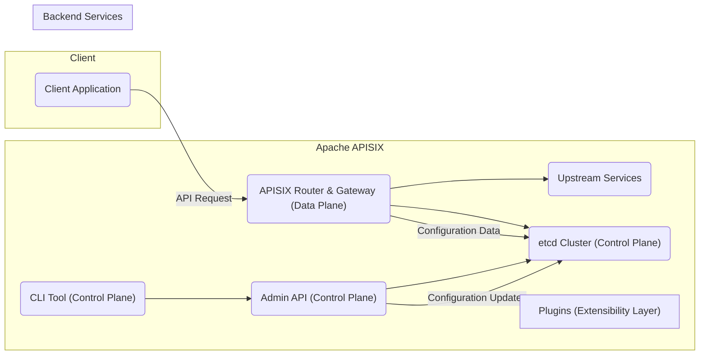
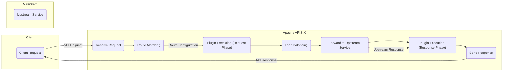

# Project Design Document: Apache APISIX

**Version:** 1.1
**Date:** October 26, 2023
**Author:** AI Software Architect

## 1. Introduction

This document provides an enhanced architectural design of the Apache APISIX project, an open-source, cloud-native API gateway. This revised document aims to offer a more detailed and refined understanding of the system's components, their interactions, and the overall architecture. This design will serve as a robust foundation for subsequent threat modeling activities.

## 2. Goals and Objectives

The primary goals of Apache APISIX are to:

*   Provide a high-performance, scalable, and reliable API gateway solution.
*   Offer a comprehensive suite of traffic management features, including advanced routing, intelligent load balancing, granular rate limiting, and robust circuit breaking capabilities.
*   Enable seamless extensibility through a dynamic plugin architecture, allowing for custom functionality and integrations.
*   Support a wide range of protocols, including HTTP, gRPC, WebSocket, and TCP/UDP, catering to diverse application needs.
*   Provide rich observability features through detailed logging, distributed tracing, and comprehensive metrics collection.
*   Offer robust and adaptable security features for comprehensive API protection against various threats.

## 3. High-Level Architecture

Apache APISIX employs a distributed architecture characterized by distinct control and data planes. The following diagram illustrates the high-level architecture:

**Key Components:**

*   **Client Application:** Any application, service, or user agent that initiates requests to the APIs managed by APISIX.
*   **Apache APISIX Router & Gateway (Data Plane):** The core runtime component responsible for processing incoming client requests. It performs routing decisions, executes plugins, applies load balancing strategies, and forwards requests to upstream services.
*   **etcd Cluster (Control Plane):** A distributed, consistent key-value store serving as the central repository for APISIX's configuration data. This includes route definitions, plugin configurations, and upstream service details.
*   **Admin API (Control Plane):** A secure RESTful API that allows administrators and automated systems to manage APISIX configurations. It provides endpoints for creating, updating, and deleting routes, plugins, upstreams, and other settings.
*   **CLI Tool (Control Plane):** A command-line interface that provides a convenient way for administrators to interact with the Admin API and manage APISIX instances.
*   **Plugins (Extensibility Layer):**  Modular, dynamically loaded components that extend APISIX's core functionality. They intercept and process requests and responses at various stages of the lifecycle.
*   **Upstream Services:** The backend applications or services that provide the actual business logic and data for the APIs managed by APISIX.

## 4. Component Details

This section provides a more granular description of the key components and their functionalities:

*   **Apache APISIX Router & Gateway (Data Plane):**
    *   Built upon the OpenResty web platform, leveraging LuaJIT for high performance.
    *   Receives and processes all incoming client requests.
    *   Performs sophisticated route matching based on a variety of criteria, including hostnames, paths, headers, and query parameters.
    *   Orchestrates the execution of configured plugins in a predefined order during the request and response lifecycle.
    *   Implements various load balancing algorithms (e.g., round-robin, consistent hashing, least connections) to distribute traffic across healthy upstream instances.
    *   Collects detailed metrics on request processing, latency, and error rates.
    *   Manages persistent connections to upstream services for improved performance.

*   **etcd Cluster (Control Plane):**
    *   Provides a highly available and consistent storage mechanism for APISIX's configuration.
    *   Ensures data durability and fault tolerance through its distributed nature.
    *   APISIX data plane nodes subscribe to changes in etcd, enabling dynamic configuration updates without service restarts.
    *   Supports features like watch mechanisms and leader election for reliable operation.

*   **Admin API (Control Plane):**
    *   Exposes a comprehensive set of RESTful endpoints for managing all aspects of APISIX configuration.
    *   Typically secured with robust authentication and authorization mechanisms to prevent unauthorized access.
    *   Validates configuration changes before persisting them to etcd.
    *   Provides feedback on the success or failure of configuration updates.

*   **CLI Tool (Control Plane):**
    *   Offers a user-friendly command-line interface for common administrative tasks, such as creating routes, configuring plugins, and managing upstreams.
    *   Simplifies interaction with the Admin API, making it easier for administrators to manage APISIX.

*   **Plugins (Extensibility Layer):**
    *   Provide a flexible mechanism to extend APISIX's core capabilities without modifying the core codebase.
    *   Executed at different phases of the request/response lifecycle (e.g., pre-request, post-request, pre-response, post-response).
    *   Examples of plugin functionalities include:
        *   **Authentication:**  `"key-auth"`, `"jwt-auth"`, `"oauth2-proxy"`.
        *   **Authorization:** `"rbac"`, `"opa"`.
        *   **Rate Limiting:** `"limit-count"`, `"limit-conn"`.
        *   **Traffic Control:** `"circuit-breaker"`, `"proxy-cache"`.
        *   **Logging:** `"file-logger"`, `"http-logger"`, `"kafka-logger"`.
        *   **Request/Response Transformation:** `"header-transformer"`, `"body-transformer"`.
    *   Plugins can be developed in Lua or other supported languages, offering flexibility and customization.

*   **Upstream Services (Backend):**
    *   Represent the backend applications or services that handle the actual processing of requests.
    *   Can be deployed in various environments and accessed via different protocols.
    *   APISIX performs health checks on upstream instances to ensure traffic is only routed to healthy endpoints, enhancing reliability.

## 5. Data Flow

The following diagram illustrates the detailed data flow for a typical client request through Apache APISIX:

**Detailed Request Flow:**

1. **Client Request:** A client application initiates an API request targeting the APISIX gateway.
2. **Receive Request:** APISIX receives the incoming request.
3. **Route Matching:** APISIX analyzes the request attributes (e.g., host, path, headers) and matches it against the configured routes stored in its in-memory cache (synchronized from etcd).
4. **Plugin Execution (Request Phase):**  If a matching route is found, APISIX executes the plugins configured for that route in the request phase. This can involve authentication, authorization checks, request transformations, rate limiting, and other pre-processing steps.
5. **Load Balancing:** APISIX selects a healthy upstream service instance based on the configured load balancing algorithm for the route's upstream.
6. **Forward to Upstream Service:** The request is forwarded to the selected upstream service instance.
7. **Upstream Service Processing:** The upstream service processes the request and generates a response.
8. **Plugin Execution (Response Phase):** Upon receiving the response from the upstream service, APISIX executes the plugins configured for the route in the response phase. This can include response transformations, logging, adding security headers, and other post-processing steps.
9. **Send Response:** APISIX sends the processed response back to the originating client application.

**Configuration Flow:**

1. **Admin Action:** An administrator uses the Admin API or CLI to initiate a configuration change (e.g., creating a new route or updating a plugin configuration).
2. **Admin API Processing:** The Admin API receives the request, validates the configuration changes, and authenticates and authorizes the request.
3. **etcd Update:** The Admin API persists the validated configuration changes to the etcd cluster.
4. **Configuration Synchronization:** APISIX data plane nodes monitor etcd for configuration changes. Upon detecting a change, they retrieve the updated configuration and update their in-memory state, ensuring all nodes have the latest configuration.

## 6. Security Considerations

Security is paramount in the design of Apache APISIX. Key security considerations and potential threats include:

*   **Authentication:**
    *   **Supported Mechanisms:** API Key authentication, JWT validation, OAuth 2.0 integration, Basic Authentication, mTLS.
    *   **Threats:** Brute-force attacks on authentication endpoints, credential stuffing, insecure storage of API keys.
    *   **Mitigations:** Implementing rate limiting on authentication attempts, using strong and securely stored credentials, enforcing password complexity policies (where applicable), leveraging mTLS for mutual authentication.

*   **Authorization:**
    *   **Supported Mechanisms:** Role-Based Access Control (RBAC) through plugins, integration with external authorization services (e.g., OPA).
    *   **Threats:** Privilege escalation, unauthorized access to resources, bypassing authorization checks.
    *   **Mitigations:** Implementing fine-grained access control policies, regularly reviewing and auditing authorization configurations, ensuring proper plugin configuration and enforcement.

*   **Data Security:**
    *   **Encryption:** Support for HTTPS/TLS for encrypting traffic between clients and APISIX, and between APISIX and upstream services.
    *   **Threats:** Man-in-the-middle attacks, eavesdropping on sensitive data in transit.
    *   **Mitigations:** Enforcing HTTPS, using strong TLS configurations, considering encryption for sensitive data at rest within etcd (etcd supports encryption at rest).

*   **Network Security:**
    *   **Considerations:** Deployment within secure network segments, use of firewalls to restrict access to APISIX and etcd ports.
    *   **Threats:** Unauthorized access to the APISIX infrastructure, DDoS attacks targeting APISIX or etcd.
    *   **Mitigations:** Implementing network segmentation, configuring firewall rules to allow only necessary traffic, utilizing DDoS mitigation services.

*   **Admin API Security:**
    *   **Considerations:** Strong authentication and authorization are crucial for accessing the Admin API.
    *   **Threats:** Unauthorized configuration changes, potential for system compromise if the Admin API is breached.
    *   **Mitigations:** Using strong API keys or other robust authentication methods for the Admin API, implementing rate limiting on Admin API requests, restricting access to the Admin API to authorized personnel and systems.

*   **Plugin Security:**
    *   **Considerations:** The security of APISIX depends on the security of its plugins.
    *   **Threats:** Malicious or vulnerable plugins could compromise the entire gateway.
    *   **Mitigations:** Thoroughly vetting and auditing third-party plugins, implementing security best practices for custom plugin development, potentially using mechanisms to isolate plugin execution.

*   **etcd Security:**
    *   **Considerations:** Securing the etcd cluster is critical as it stores APISIX's configuration.
    *   **Threats:** Unauthorized access to configuration data, potential for data corruption or manipulation.
    *   **Mitigations:** Implementing authentication and authorization for etcd access, encrypting communication between APISIX and etcd (using TLS), considering encryption at rest for etcd data.

*   **Logging and Auditing:**
    *   **Considerations:** Comprehensive logging of API requests, administrative actions, and security events is essential for monitoring and incident response.
    *   **Threats:** Insufficient logging can hinder security investigations.
    *   **Mitigations:** Configuring detailed logging, securely storing and managing log data, implementing mechanisms for log analysis and alerting.

## 7. Deployment Considerations

*   **Containerization:**  APISIX is ideally suited for deployment within containerized environments using Docker and orchestration platforms like Kubernetes, facilitating scalability and management.
*   **Scalability:** APISIX's stateless architecture allows for horizontal scaling by adding more data plane nodes. The etcd cluster should also be scaled appropriately to handle the load.
*   **High Availability:** Deploying multiple instances of APISIX and a multi-member etcd cluster ensures high availability and fault tolerance. Load balancers can distribute traffic across APISIX instances.
*   **Configuration Management:** Configuration is centrally managed through etcd, enabling dynamic updates across all APISIX instances.
*   **Monitoring and Observability:** Integrating APISIX with monitoring tools (e.g., Prometheus, Grafana) and distributed tracing systems (e.g., Jaeger, Zipkin) is crucial for real-time monitoring of performance, health, and potential issues.

## 8. Future Considerations

*   **Enhanced Observability:** Continued improvements in tracing capabilities, including more granular tracing information and integration with more tracing backends.
*   **Service Mesh Integration:** Deeper integration with service mesh technologies to provide a unified control plane for microservices.
*   **WASM Support:** Expanding support for WebAssembly plugins to enable more flexible and performant plugin development in various languages.
*   **Improved Developer Experience:** Further enhancements to the Admin API and CLI to simplify configuration and management tasks.
*   **Advanced Security Features:** Exploration of more advanced security features, such as web application firewall (WAF) capabilities and advanced threat detection.

This revised document provides a more detailed and comprehensive architectural design of Apache APISIX, incorporating enhanced explanations and addressing key security considerations. This information will serve as a valuable resource for conducting thorough threat modeling exercises and implementing appropriate security measures.
