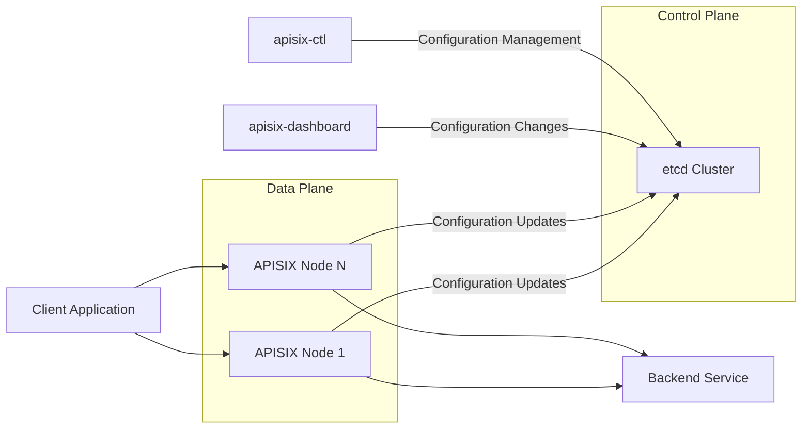
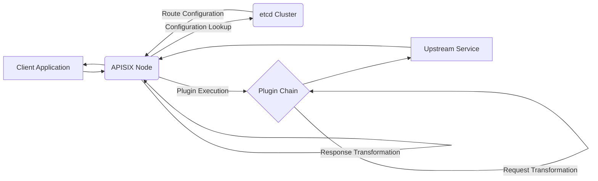

# Project Design Document: Apache APISIX

**Version:** 1.1
**Date:** October 26, 2023
**Author:** AI Software Architect

## 1. Introduction

This document provides an enhanced architectural design overview of the Apache APISIX project. It aims to provide a more detailed understanding of the key components, data flows, and functionalities of the system, specifically tailored for subsequent threat modeling activities.

Apache APISIX is a cloud-native, dynamic, real-time, high-performance API Gateway. It offers a rich set of traffic management features, including advanced load balancing strategies, dynamic upstream management, canary deployments, robust circuit breaking capabilities, comprehensive authentication and authorization mechanisms, and extensive observability tools. Its design prioritizes handling mission-critical traffic with high availability, horizontal scalability, and low latency.

## 2. Goals

The primary goals of this document are to:

*   Provide a clear and comprehensive articulation of the Apache APISIX architecture, suitable for both technical and security audiences.
*   Identify and describe the key components of the system, detailing their responsibilities and interactions.
*   Illustrate the typical and critical data flows within the system, highlighting potential points of interest for security analysis.
*   Establish a solid foundation for understanding the system's inherent security posture and potential vulnerabilities.
*   Facilitate effective and targeted threat modeling by clearly outlining the system's boundaries, critical assets, and potential attack vectors.

## 3. Architectural Overview

Apache APISIX employs a decoupled and distributed architecture, fundamentally separated into a control plane and a data plane. This separation allows for independent scaling and resilience.

*   **Control Plane:** Responsible for the management and distribution of the system's configuration and state. It relies on a distributed consensus mechanism provided by an etcd cluster to ensure data consistency and high availability.
*   **Data Plane:**  Handles the real-time processing of API requests based on the configuration disseminated by the control plane. It consists of multiple stateless APISIX nodes, enabling horizontal scalability.

The system's functionality is significantly extended through a flexible plugin architecture, allowing for customization and integration with a wide range of external services and protocols.

## 4. Component Details

This section provides a more detailed breakdown of the core components within the Apache APISIX architecture.

*   **APISIX Node (Data Plane):**
    *   The central component responsible for the runtime processing of incoming API requests.
    *   Built upon the high-performance Nginx web server, extended with the OpenResty framework (LuaJIT).
    *   Dynamically loads and applies configurations fetched from the etcd cluster.
    *   Executes a chain of configured plugins for each incoming request, enabling a wide range of functionalities.
    *   Performs core API gateway functions such as dynamic routing, various load balancing algorithms (round-robin, consistent hashing, etc.), request authentication, authorization enforcement, traffic shaping, and protocol translation.
    *   Collects detailed metrics, logs, and traces for observability and monitoring purposes.

*   **etcd Cluster (Control Plane):**
    *   A highly available and consistent distributed key-value store serving as the source of truth for APISIX's configuration.
    *   Utilizes the Raft consensus algorithm to ensure data consistency and fault tolerance across the cluster.
    *   APISIX nodes subscribe to changes in etcd, enabling real-time updates to their configuration without requiring restarts.
    *   Securing access to the etcd cluster is paramount for the overall security of the APISIX deployment.

*   **apisix-dashboard (Optional):**
    *   A user-friendly, web-based graphical interface for managing and configuring APISIX resources.
    *   Provides a visual representation of routes, services, upstreams, plugins, and other configuration entities.
    *   Simplifies the process of creating, modifying, and deleting configurations, interacting with the etcd cluster on behalf of the user.
    *   Typically requires authentication and authorization to prevent unauthorized configuration changes.

*   **apisix-ctl (Command Line Interface):**
    *   A powerful command-line tool for interacting with the APISIX control plane programmatically.
    *   Offers a more direct and scriptable way to manage and configure APISIX, suitable for automation and CI/CD pipelines.
    *   Communicates with the etcd cluster to apply configuration changes.
    *   Requires proper authentication and authorization to ensure only authorized users can manage the gateway.

*   **Plugins:**
    *   Modular components that extend the core functionality of APISIX, executed within the request processing lifecycle.
    *   Categorized by their function (e.g., authentication, authorization, traffic control, transformation, observability).
    *   Examples include:
        *   **Authentication:** `key-auth`, `jwt-auth`, `basic-auth`, `ldap`.
        *   **Authorization:** `opa` (Open Policy Agent), custom authorization plugins.
        *   **Traffic Control:** `limit-count`, `limit-req`, `circuit-breaker`.
        *   **Transformation:** `proxy-rewrite`, `request-transformer`.
        *   **Observability:** `skywalking`, `prometheus`, `zipkin`.
    *   Can be developed internally or sourced from the community, requiring careful consideration of their security implications.

## 5. Data Flow

The following details the typical data flow for an incoming API request, highlighting the interactions between different components.

Detailed Breakdown of the Data Flow:

*   **Client Request Initiation:** A client application initiates an API request targeting an endpoint managed by APISIX.
*   **Request Reception at APISIX Node:** The request is received by one of the available APISIX nodes in the data plane.
*   **Configuration Lookup and Retrieval:** The APISIX node consults its local cache for the relevant route configuration. If not found or outdated, it fetches the latest configuration from the etcd cluster.
*   **Route Matching:** APISIX matches the incoming request against configured routes based on defined criteria (e.g., path, host, headers, methods).
*   **Plugin Chain Execution:** Once a matching route is found, APISIX executes a series of plugins configured for that route in a predefined order. This phase involves:
    *   **Authentication and Authorization Checks:** Plugins verify the identity of the client and ensure they have the necessary permissions to access the requested resource.
    *   **Traffic Management Policies:** Plugins enforce traffic control rules such as rate limiting, request throttling, and circuit breaking.
    *   **Request Transformation:** Plugins may modify the request headers, body, or other attributes before forwarding it to the upstream service.
*   **Upstream Service Selection:** Based on the route configuration and configured load balancing policies, APISIX selects an appropriate upstream service instance.
*   **Forwarding to Upstream:** The processed request is forwarded to the selected backend service.
*   **Response Processing by Upstream:** The backend service processes the request and generates a response.
*   **Response Reception at APISIX Node:** The APISIX node receives the response from the upstream service.
*   **Response Plugin Execution:** APISIX may execute plugins on the response, such as adding or modifying headers, transforming the response body, or logging response details.
*   **Response Transmission to Client:** Finally, the processed response is sent back to the originating client application.

## 6. Key Data Entities

*   **Route:** A fundamental configuration entity that defines rules for matching incoming requests based on various criteria (e.g., path, methods, headers, hostnames). It links a specific request pattern to a set of associated configurations, including the target service and the plugins to be executed.
*   **Service:** Represents a logical abstraction of a group of upstream endpoints. Routes are typically associated with services, allowing for easier management of backend destinations. Services can define load balancing strategies and health check configurations for their associated upstreams.
*   **Upstream:** Defines the actual backend service endpoints (IP addresses or hostnames and ports) that APISIX will proxy requests to. It includes configurations for load balancing algorithms (e.g., round-robin, consistent hashing, least connections), health checks to monitor the availability of backend instances, and retry policies.
*   **Plugin:**  Represents the configuration for specific plugin functionalities. Plugin configurations are associated with routes or services, enabling the application of specific behaviors to matching traffic. Plugin configurations often include parameters specific to the plugin's functionality (e.g., API keys for authentication plugins, rate limits for traffic control plugins).
*   **Consumer:** Represents an entity (e.g., an application, a user) that is authorized to access APIs managed by APISIX. Consumers are often used in conjunction with authentication plugins, where each consumer is associated with specific credentials (e.g., API keys, JWT secrets).
*   **SSL:** Configuration for TLS/SSL certificates used to establish secure connections. This includes specifying the certificate and key files, as well as SNI (Server Name Indication) configurations for handling multiple domains with a single IP address.

## 7. Deployment Considerations

Apache APISIX offers flexible deployment options to suit various infrastructure requirements.

*   **Bare Metal:** Deployment directly on physical servers, offering maximum control over hardware resources.
*   **Virtual Machines (VMs):** Deployment within virtualized environments, providing resource isolation and flexibility.
*   **Containers (Docker):**  A common and recommended approach, leveraging Docker containers for packaging and running APISIX and its dependencies. This facilitates consistent deployments across different environments.
*   **Orchestration Platforms (Kubernetes):**  Well-suited for deployment and management within Kubernetes clusters, enabling automated scaling, rolling updates, and self-healing capabilities. Kubernetes deployments often utilize Helm charts or Operators for simplified management.
*   **Cloud Platforms:**  Easily deployable on major cloud providers such as:
    *   **Amazon Web Services (AWS):** Using EC2 instances, Elastic Kubernetes Service (EKS), or container services like Fargate.
    *   **Microsoft Azure:** Using Virtual Machines, Azure Kubernetes Service (AKS), or Azure Container Instances.
    *   **Google Cloud Platform (GCP):** Using Compute Engine instances, Google Kubernetes Engine (GKE), or Cloud Run.

## 8. Security Considerations (Pre-Threat Modeling)

This section outlines key security considerations and potential threat areas that will be the focus of subsequent threat modeling exercises.

*   **Control Plane Security (etcd Cluster):**
    *   **Threat:** Unauthorized access to the etcd cluster could allow attackers to manipulate the entire API gateway configuration, leading to service disruption, data breaches, or redirection of traffic.
    *   **Mitigation:** Implement strong authentication and authorization mechanisms for accessing etcd (e.g., mutual TLS). Restrict network access to the etcd cluster to only authorized components within the control plane. Regularly audit access logs.
*   **Data Plane Security (APISIX Nodes):**
    *   **Threat:** Vulnerabilities in APISIX nodes or their dependencies (e.g., OpenResty, Lua libraries) could be exploited to gain unauthorized access or execute arbitrary code.
    *   **Mitigation:** Keep APISIX and its dependencies up-to-date with the latest security patches. Implement proper input validation and sanitization within plugins. Regularly perform security audits and penetration testing.
*   **Authentication and Authorization of API Requests:**
    *   **Threat:** Weak or improperly configured authentication and authorization mechanisms could allow unauthorized clients to access protected APIs.
    *   **Mitigation:** Enforce strong authentication methods (e.g., API keys with proper rotation, OAuth 2.0, JWT). Implement fine-grained authorization policies to control access to specific resources. Securely store and manage API keys and secrets.
*   **Plugin Security:**
    *   **Threat:** Malicious or vulnerable plugins could introduce security risks, potentially allowing for code injection, data exfiltration, or denial of service.
    *   **Mitigation:** Carefully vet and audit plugins before deployment. Implement a process for reviewing and updating plugins. Consider using a plugin development framework with security best practices. Isolate plugin execution environments if possible.
*   **Communication Security (TLS/SSL):**
    *   **Threat:** Unencrypted communication channels could expose sensitive data in transit (e.g., API keys, request/response payloads).
    *   **Mitigation:** Enforce TLS/SSL for all communication channels, including client-to-APISIX and APISIX-to-upstream communication. Use strong cipher suites and regularly update certificates.
*   **Control Plane Access Security (apisix-dashboard, apisix-ctl):**
    *   **Threat:** Unauthorized access to administrative interfaces could allow attackers to reconfigure the API gateway, leading to a complete compromise.
    *   **Mitigation:** Implement strong authentication and authorization for accessing the dashboard and CLI (e.g., multi-factor authentication). Restrict network access to these interfaces. Regularly audit administrative actions.
*   **Data Security:**
    *   **Threat:** Sensitive data handled by APISIX (e.g., API keys in transit, request/response bodies) could be exposed if not properly protected.
    *   **Mitigation:** Encrypt sensitive data at rest and in transit. Avoid logging sensitive information. Implement data masking or redaction techniques where necessary.
*   **Rate Limiting and Denial of Service (DoS) Protection:**
    *   **Threat:** Lack of proper rate limiting could allow attackers to overwhelm the API gateway and backend services with excessive requests, leading to denial of service.
    *   **Mitigation:** Configure appropriate rate limiting policies based on expected traffic patterns. Implement other DoS mitigation techniques, such as connection limits and request size limits.
*   **Logging and Monitoring Security:**
    *   **Threat:** Security logs could be tampered with or accessed by unauthorized individuals, hindering incident response and forensic analysis.
    *   **Mitigation:** Securely store logs in a centralized and protected location. Implement access controls for log data. Monitor logs for suspicious activity.

## 9. Glossary

*   **API Gateway:** A reverse proxy that acts as a single point of entry for backend APIs, providing routing, security, and other management functionalities.
*   **Upstream:** The backend service or application that APISIX forwards requests to.
*   **Plugin:** A modular component that extends the functionality of APISIX, executed during the request processing lifecycle.
*   **Route:** A rule that defines how incoming requests are matched and handled, linking request patterns to specific configurations.
*   **Service:** A logical grouping of upstream endpoints, simplifying the management of backend destinations.
*   **Control Plane:** The set of components responsible for managing and distributing the configuration of APISIX (primarily the etcd cluster).
*   **Data Plane:** The set of components responsible for processing incoming API requests based on the configuration (APISIX nodes).
*   **etcd:** A distributed, reliable key-value store used by APISIX as its configuration database.
*   **OpenResty:** A full-fledged web platform that integrates the standard Nginx core with LuaJIT, extensible by numerous powerful Lua libraries.
*   **LuaJIT:** A just-in-time compiler for the Lua programming language, used within OpenResty for high-performance scripting.

This improved document provides a more detailed and comprehensive understanding of the Apache APISIX architecture, specifically focusing on aspects relevant to security analysis and threat modeling. The enhanced descriptions of components, data flows, and security considerations will facilitate a more thorough and effective threat modeling process.
