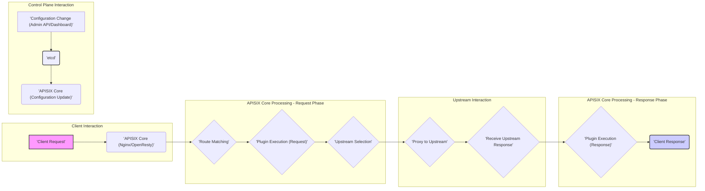
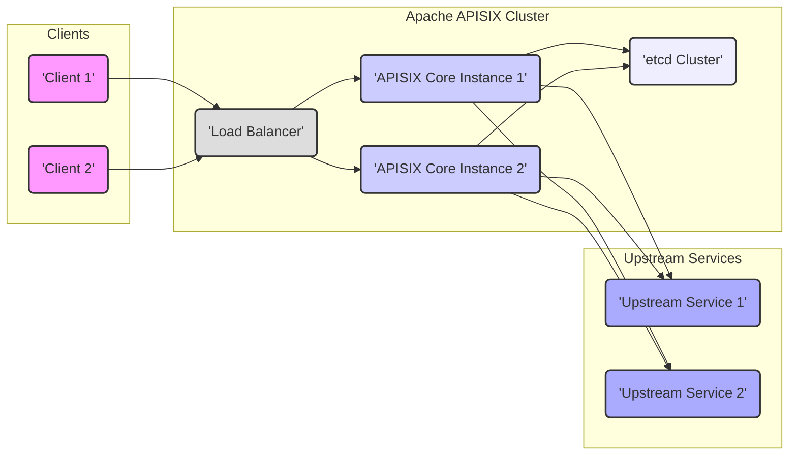

## Project Design Document: Apache APISIX - Improved

**Project Name:** Apache APISIX

**Project Repository:** [https://github.com/apache/incubator-apisix](https://github.com/apache/incubator-apisix)

**Document Version:** 2.0

**Date:** October 26, 2023

**Prepared By:** Gemini (AI Language Model)

**1. Introduction**

This document provides an enhanced architectural overview of the Apache APISIX project, building upon the previous version. It is specifically designed to facilitate comprehensive threat modeling activities. This document details the core components, their interactions, and the flow of data within the system, offering a robust foundation for identifying potential security vulnerabilities and designing effective mitigation strategies.

**2. Purpose**

The primary objective of this document is to furnish a detailed and improved architectural description of Apache APISIX to enable more effective and granular threat modeling. This document serves as a critical resource for security engineers, developers, and operations teams seeking a deep understanding of the system's structure to identify potential attack surfaces and security weaknesses.

**3. Target Audience**

This document is intended for the following audiences, requiring varying levels of technical detail:

* Security Engineers: To conduct thorough threat modeling, security assessments, and penetration testing.
* Developers: To gain a comprehensive understanding of the system's internal workings, component interactions, and security implications of their code.
* Operations Teams: To understand the deployment architecture, operational dependencies, and security considerations related to infrastructure management.

**4. Scope**

This document encompasses the essential architectural components of Apache APISIX, providing a deeper dive into their functionalities and interactions:

* The APISIX Core (Data Plane) and its internal modules.
* The Control Plane (etcd) and its role in configuration management.
* Key Plugins, categorized by their function and security relevance.
* Detailed data flow for request processing, including error handling and edge cases.
* Common deployment models and their security implications.

This document does not delve into:

* The intricate implementation details of individual plugins beyond their core functionality and security impact.
* Highly specific configuration parameters or syntax.
* Detailed operational procedures for day-to-day management, focusing instead on security-relevant aspects.

**5. High-Level Architecture**

Apache APISIX functions as a dynamic, real-time, and high-performance API Gateway. Its fundamental role is to act as a reverse proxy and intelligent load balancer, adeptly routing client requests to designated upstream services based on precisely configured rules. The architecture is inherently extensible through a powerful plugin-based system, enabling a wide array of functionalities such as sophisticated authentication, fine-grained authorization, robust rate limiting, and comprehensive observability.

The core architectural elements are:

* **Clients:** External entities initiating requests to the API Gateway. This includes web browsers, mobile applications, internal services, and third-party APIs.
* **APISIX Core (Data Plane):** The central processing engine responsible for intercepting incoming requests, applying a series of configured plugins, and intelligently routing these requests to the appropriate upstream services. It is built upon the robust foundation of Nginx and OpenResty, leveraging their performance and scalability.
* **Control Plane (etcd):** A highly reliable, distributed key-value store that serves as the central repository for APISIX's configuration. This includes definitions for routes, plugins, upstream services, and global settings. Its distributed nature ensures high availability and data consistency.
* **Upstream Services:** The backend services that APISIX intelligently directs traffic to. These are the ultimate destinations for client requests.
* **Plugins:** Modular components that augment APISIX's core functionality. They are executed during the request and response lifecycle, providing features ranging from security enhancements to traffic management and observability.

**6. Key Components**

* **APISIX Core (Data Plane):**
    * **Nginx/OpenResty:** Provides the underlying event-driven architecture, non-blocking I/O, and scripting capabilities via LuaJIT. This forms the bedrock for APISIX's performance and scalability.
    * **Request Handling Module:**  Responsible for receiving and parsing incoming HTTP/HTTPS requests from clients. This includes handling connection management and protocol specifics.
    * **Route Matching Engine:**  Matches incoming requests against a set of defined routes based on various criteria. This can include path matching, header inspection, HTTP method analysis, and more complex matching logic.
    * **Plugin Execution Framework:**  Executes configured plugins in a specific, ordered sequence for each matched route. This framework allows plugins to intercept and modify requests and responses.
        * **Request Phase Plugins:** Plugins executed *before* the request is proxied to the upstream. Examples include authentication, authorization, and request transformation plugins.
        * **Response Phase Plugins:** Plugins executed *after* the response is received from the upstream, but *before* it's sent to the client. Examples include response transformation and logging plugins.
    * **Upstream Selection and Load Balancing:** Selects an appropriate upstream service instance based on configured load balancing algorithms (e.g., round-robin, consistent hashing) and the health status of the upstreams.
    * **Proxying Module:** Forwards the processed request to the selected upstream service. This involves establishing a connection with the upstream and transmitting the request.
    * **Response Handling Module:** Receives the response from the upstream service, applies any configured response phase plugins, and prepares the final response to be sent back to the client.
    * **Health Check Module:** Periodically probes the health of configured upstream services to ensure they are available and responsive. This allows APISIX to avoid routing traffic to unhealthy instances.

* **Control Plane (etcd):**
    * **Centralized Configuration Store:**  Persistently stores all configuration data for the APISIX cluster, ensuring a single source of truth.
    * **Distributed Key-Value Database:** Provides a reliable and scalable way to store and retrieve configuration information.
    * **Raft Consensus Algorithm:** Ensures strong data consistency and fault tolerance across the etcd cluster. This guarantees that all APISIX instances have the same configuration.
    * **Watch Mechanism:** Allows APISIX Core instances to subscribe to configuration changes in etcd and receive real-time updates. This enables dynamic configuration updates without requiring service restarts, minimizing downtime.

* **Plugins:** (Categorized for clarity)
    * **Authentication Plugins:** Verify the identity of the client making the request. Examples:
        * `key-auth`: Authenticates clients using API keys.
        * `jwt-auth`: Authenticates clients using JSON Web Tokens.
        * `openid-connect`: Integrates with OpenID Connect identity providers.
    * **Authorization Plugins:** Control access to resources based on the authenticated client's permissions. Examples:
        * `basic-auth`:  Simple username/password authentication.
        * `opa`: Integrates with the Open Policy Agent for fine-grained policy enforcement.
        * `casbin`:  Provides support for various access control models.
    * **Traffic Control Plugins:** Manage and shape traffic flow. Examples:
        * `limit-count`: Limits the number of requests within a specified time window.
        * `limit-conn`: Limits the number of concurrent connections.
        * `circuit-breaker`: Prevents cascading failures by temporarily stopping requests to unhealthy upstreams.
    * **Transformation Plugins:** Modify requests and responses as they pass through APISIX. Examples:
        * `proxy-rewrite`: Rewrites the request URI or headers before forwarding to the upstream.
        * `header-transform`: Adds, removes, or modifies HTTP headers.
        * `grpc-transcode`: Allows RESTful clients to interact with gRPC backends.
    * **Observability Plugins:** Provide insights into the performance and behavior of APISIX. Examples:
        * `prometheus`: Exposes metrics in Prometheus format for monitoring.
        * `skywalking`: Integrates with the Apache SkyWalking APM system for distributed tracing.
        * `kafka-logger`: Sends logs to a Kafka topic.
    * **Security Plugins:** Enhance the security posture of the API Gateway. Examples:
        * `ip-restriction`: Allows or denies access based on client IP addresses.
        * Integrations with external Web Application Firewalls (WAFs).
        * `cors`:  Configures Cross-Origin Resource Sharing (CORS) policies.
    * **Routing Plugins:** Define how requests are matched and directed. Examples:
        * `proxy-mirror`:  Mirrors traffic to a secondary upstream for testing or monitoring.
        * `redirect`:  Redirects requests to a different URL.

* **Upstream Services:**
    * **Backend Applications:** The target services that process the actual business logic and data. These can be microservices, monolithic applications, serverless functions, or external APIs.
    * **Diverse Technologies:** Can be implemented using various programming languages and frameworks.

**7. Data Flow**

The journey of a request through Apache APISIX involves several key stages:

Detailed steps:

1. **Client Request:** A client initiates an HTTP/HTTPS request targeting the APISIX endpoint.
2. **APISIX Core (Nginx/OpenResty) Reception:** The request is received by the Nginx/OpenResty layer within the APISIX Core.
3. **Route Matching:** APISIX Core's routing engine attempts to find a matching route based on the request's attributes (e.g., path, headers, methods).
4. **Plugin Execution (Request Phase):** If a matching route is found, APISIX executes the plugins configured for that route in a predefined order during the request phase. This may involve authentication, authorization checks, request transformations, and traffic control measures.
5. **Upstream Selection:** Based on the route configuration and configured load balancing algorithms, APISIX selects a healthy upstream service instance to handle the request.
6. **Proxy to Upstream:** APISIX forwards the processed request to the chosen upstream service.
7. **Receive Upstream Response:** APISIX awaits and receives the response from the upstream service.
8. **Plugin Execution (Response Phase):** APISIX executes plugins configured for the response phase. This might include response transformations, logging, and adding security headers.
9. **Client Response:** APISIX sends the final, processed response back to the originating client.

**Control Plane Interaction:**

1. **Configuration Change:** An administrator modifies the APISIX configuration through the Admin API or the APISIX Dashboard.
2. **etcd Update:** The configuration changes are persisted within the etcd cluster.
3. **APISIX Core Update:** APISIX Core instances subscribe to changes in etcd and receive real-time updates to their configuration. This dynamic update mechanism ensures that all instances operate with the latest configuration without requiring restarts.

**8. Security Considerations**

Security is paramount in an API Gateway, and Apache APISIX incorporates several key security considerations:

* **Authentication and Authorization Mechanisms:**
    * APISIX relies heavily on its plugin architecture for authentication and authorization. The selection and secure configuration of these plugins are critical.
    * Vulnerabilities within authentication plugins could lead to unauthorized access, bypassing intended security controls.
    * Misconfigured authorization rules can inadvertently grant access to sensitive resources, leading to data breaches or unauthorized actions.
* **Robust Input Validation:**
    * APISIX should implement rigorous input validation to prevent common injection attacks such as SQL injection, command injection, and cross-site scripting (XSS).
    * While plugins can provide input validation capabilities, careful configuration and awareness of potential bypasses are essential.
* **Effective Rate Limiting and Traffic Control:**
    * Rate limiting plugins are crucial for mitigating denial-of-service (DoS) and distributed denial-of-service (DDoS) attacks by restricting the number of requests from specific sources or based on other criteria.
    * Improperly configured rate limits can inadvertently impact legitimate traffic, causing service disruptions for valid users.
* **Secure SSL/TLS Termination:**
    * APISIX often handles SSL/TLS termination, making the secure configuration of TLS certificates and related settings paramount.
    * Weak TLS configurations or the use of outdated protocols can expose sensitive data transmitted over HTTPS.
* **Plugin Security Management:**
    * The overall security of APISIX is intrinsically linked to the security of its installed plugins.
    * Vulnerabilities within plugins can be exploited to compromise the gateway itself or the backend services it protects.
    * It is crucial to use trusted, well-maintained, and regularly updated plugins from reputable sources.
* **Control Plane Access Control:**
    * Access to the etcd cluster and the APISIX Admin API must be strictly controlled and limited to authorized personnel.
    * Unauthorized access to the control plane can allow malicious actors to manipulate the gateway's configuration, leading to complete system compromise.
    * Strong authentication and authorization mechanisms, including multi-factor authentication, should be enforced for the Admin API.
* **Secure Communication with Upstreams:**
    * While APISIX provides a security layer, the security of the upstream services remains a critical concern.
    * APISIX can enforce mutual TLS (mTLS) for communication with upstreams, ensuring encrypted and authenticated communication between the gateway and backend services.
* **Comprehensive Logging and Monitoring:**
    * Detailed logging and real-time monitoring are essential for detecting and responding to security incidents.
    * Security-related events, such as authentication failures, authorization denials, and suspicious traffic patterns, should be logged and actively monitored.

**9. Deployment Model**

Apache APISIX offers flexible deployment options to suit various needs and scales:

* **Standalone Instance Deployment:** A single instance of APISIX, suitable for development, testing, or small-scale, non-critical deployments. This model presents a single point of failure.
* **Clustered Deployment for High Availability and Scalability:** Multiple APISIX Core instances operate in concert, sharing the same etcd cluster for configuration synchronization. An external load balancer distributes traffic across the APISIX instances, providing redundancy and horizontal scalability. This is the recommended model for production environments.
* **Kubernetes-Native Deployment:** APISIX can be seamlessly deployed within a Kubernetes cluster, either as an Ingress controller managing external access to services within the cluster or as a standalone service. This leverages Kubernetes' inherent orchestration capabilities for scaling, health management, and resource allocation.
* **Hybrid Deployment Strategies:** Combinations of the above models can be employed to meet specific architectural requirements and constraints. For example, a geographically distributed deployment might involve multiple clusters in different regions.

In a typical clustered deployment:

* Multiple independent APISIX Core instances are deployed.
* Each instance connects to the shared etcd cluster to retrieve and stay synchronized with the latest configuration.
* An external load balancer (hardware or software-based) distributes incoming traffic across the available APISIX Core instances.
* This architecture provides high availability, as the failure of one instance does not interrupt service, and allows for horizontal scaling by adding more APISIX instances to the cluster.

**10. Diagrams**

* **Improved High-Level Architecture Diagram:**

This enhanced document provides a more detailed and comprehensive understanding of the Apache APISIX architecture, specifically tailored for effective threat modeling. The information presented here will be instrumental in identifying potential security vulnerabilities and designing robust security controls.