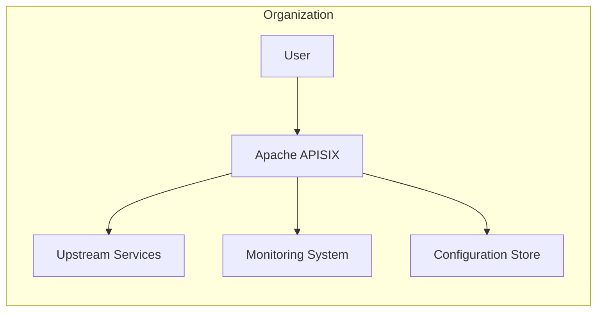
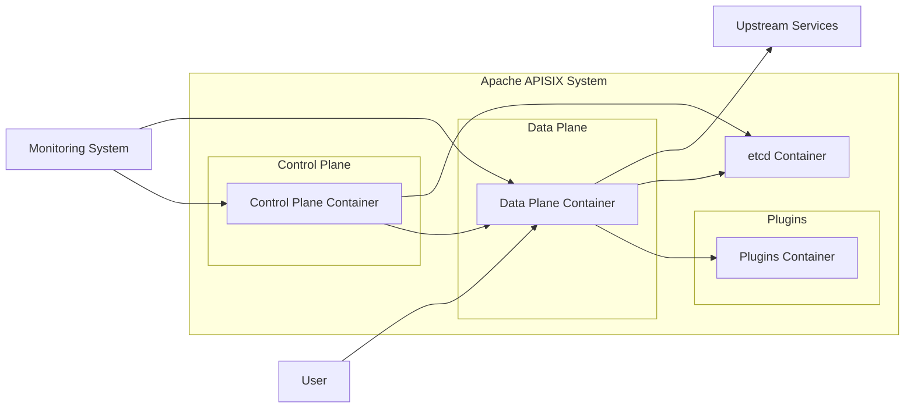
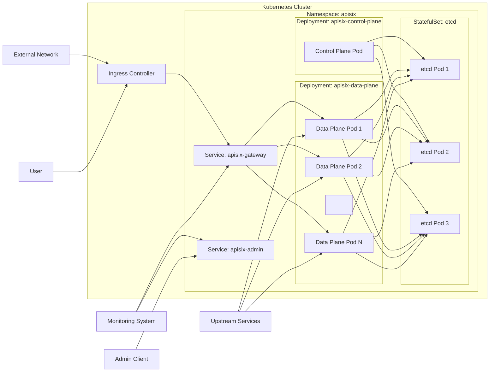

# BUSINESS POSTURE

This project, Apache APISIX, aims to provide a high-performance, scalable, and feature-rich API Gateway. It addresses the business need for organizations to manage, secure, and observe their APIs and microservices effectively.

- Business Priorities and Goals:
  - Provide a robust and reliable API gateway solution.
  - Offer a wide range of features including routing, load balancing, security, observability, and traffic control.
  - Enable easy integration with existing infrastructure and microservices architectures.
  - Support high performance and scalability to handle demanding API traffic.
  - Foster an open-source community and ecosystem around the API gateway.

- Business Risks:
  - Security vulnerabilities in the API gateway could expose backend systems and data.
  - Performance bottlenecks in the API gateway could impact application availability and user experience.
  - Lack of adoption or community support could lead to project stagnation.
  - Complexity of configuration and management could increase operational overhead.
  - Incompatibility with certain infrastructure or technologies could limit adoption.

# SECURITY POSTURE

- Security Controls:
  - security control: Input validation is implemented in various plugins to sanitize and validate incoming requests. (Implemented in plugins - code inspection needed for specifics)
  - security control: Authentication and Authorization are supported through various plugins like JWT, Key-auth, Basic-auth, and OIDC. (Implemented in plugins - code inspection needed for specifics)
  - security control: HTTPS/TLS encryption is supported for communication between clients and APISIX, and between APISIX and upstream services. (Configuration in Nginx and APISIX)
  - security control: Rate limiting and traffic control policies can be configured to mitigate DDoS attacks and manage traffic spikes. (Implemented in APISIX core and plugins)
  - security control: Access control lists (ACLs) can be configured to restrict access to specific routes or services. (Implemented in plugins)
  - security control: Regular security audits and vulnerability scanning are likely performed by the open-source community and contributors. (Community driven - no specific documentation provided in input)
  - security control: Secure software development lifecycle practices are generally followed in open-source projects, including code reviews and testing. (Open-source community practices)
  - security control: Dependency management is likely in place to track and update third-party libraries and components. (Build process and dependency management files)

- Accepted Risks:
  - accepted risk: As an open-source project, the speed of vulnerability patching might depend on community contributions and release cycles.
  - accepted risk: Misconfiguration of security features by users could lead to vulnerabilities.
  - accepted risk: Zero-day vulnerabilities might exist before being discovered and patched.
  - accepted risk: Security of plugins developed by the community might vary and require careful review.

- Recommended Security Controls:
  - security control: Implement automated security scanning (SAST/DAST) in the CI/CD pipeline to detect vulnerabilities early in the development process.
  - security control: Establish a formal vulnerability disclosure and response process to handle security issues effectively.
  - security control: Provide comprehensive security documentation and best practices for users to configure and operate APISIX securely.
  - security control: Implement robust logging and monitoring of security-related events for incident detection and response.
  - security control: Conduct regular penetration testing to identify and address potential security weaknesses.

- Security Requirements:
  - Authentication:
    - Requirement: Support multiple authentication methods (e.g., API keys, JWT, OAuth 2.0, OpenID Connect).
    - Requirement: Allow integration with external identity providers.
    - Requirement: Provide mechanisms for secure storage and management of authentication credentials.
  - Authorization:
    - Requirement: Implement fine-grained authorization policies based on roles, permissions, or attributes.
    - Requirement: Support policy enforcement at the API gateway level.
    - Requirement: Integrate with external authorization services if needed.
  - Input Validation:
    - Requirement: Validate all incoming requests to prevent injection attacks (e.g., SQL injection, command injection, cross-site scripting).
    - Requirement: Sanitize input data to remove potentially harmful characters or code.
    - Requirement: Enforce data type and format validation.
  - Cryptography:
    - Requirement: Use strong encryption algorithms for data in transit (HTTPS/TLS).
    - Requirement: Support encryption for sensitive data at rest if applicable (e.g., configuration secrets).
    - Requirement: Properly manage and rotate cryptographic keys.

# DESIGN

## C4 CONTEXT



- Context Diagram Elements:
  - Element:
    - Name: User
    - Type: Person
    - Description: End-users or applications consuming APIs exposed through Apache APISIX.
    - Responsibilities: Consume APIs, authenticate and authorize to access APIs.
    - Security controls: User authentication at the application level, secure communication channels.
  - Element:
    - Name: Apache APISIX
    - Type: Software System
    - Description: Cloud-native API gateway and microservices platform. Manages, secures, and observes API traffic.
    - Responsibilities: API routing, load balancing, authentication, authorization, rate limiting, observability, traffic control.
    - Security controls: Input validation, authentication plugins, authorization plugins, HTTPS/TLS encryption, rate limiting, access control lists, security audits, secure development lifecycle.
  - Element:
    - Name: Upstream Services
    - Type: Software System
    - Description: Backend services or microservices that provide the actual API functionality.
    - Responsibilities: Process API requests, provide responses, manage data.
    - Security controls: Service-level authentication, input validation, secure coding practices, access control, data encryption at rest and in transit.
  - Element:
    - Name: Monitoring System
    - Type: Software System
    - Description: System used to monitor the health, performance, and security of Apache APISIX and upstream services.
    - Responsibilities: Collect metrics, logs, and traces from APISIX and upstream services, provide dashboards and alerts.
    - Security controls: Secure access to monitoring data, data encryption in transit and at rest, audit logging.
  - Element:
    - Name: Configuration Store
    - Type: Software System
    - Description: External storage system (e.g., etcd) used by Apache APISIX to store its configuration.
    - Responsibilities: Persist and provide configuration data to APISIX instances.
    - Security controls: Access control to configuration data, encryption of sensitive configuration data at rest and in transit, audit logging.

## C4 CONTAINER



- Container Diagram Elements:
  - Element:
    - Name: Control Plane Container
    - Type: Container
    - Description: Manages the configuration and control of the data plane. Includes Admin API, configuration synchronization, and plugin management.
    - Responsibilities: Configuration management, plugin management, API management, control plane API exposure.
    - Security controls: Authentication and authorization for Admin API access, secure communication with etcd, input validation for Admin API requests, role-based access control.
  - Element:
    - Name: Data Plane Container
    - Type: Container
    - Description: Handles API request routing, processing, and forwarding. Based on Nginx and LuaJIT.
    - Responsibilities: API request routing, load balancing, traffic control, plugin execution, request/response transformation, observability data collection.
    - Security controls: Input validation, execution of security plugins (authentication, authorization, etc.), HTTPS/TLS termination, rate limiting, access control lists, secure coding practices in Lua plugins.
  - Element:
    - Name: Plugins Container
    - Type: Container (Logical)
    - Description: Represents the collection of plugins that extend APISIX functionality. Plugins are loaded and executed within the Data Plane.
    - Responsibilities: Provide extended functionalities like authentication, authorization, traffic control, observability, transformations.
    - Security controls: Plugin-specific security controls, code review for plugin development, input validation within plugins, secure plugin configuration.
  - Element:
    - Name: etcd Container
    - Type: Container
    - Description: Distributed key-value store used for storing APISIX configuration.
    - Responsibilities: Configuration persistence, distributed consensus, configuration data replication.
    - Security controls: Access control to etcd, authentication and authorization for etcd access, encryption of data at rest and in transit, regular backups.

## DEPLOYMENT

Deployment Solution: Kubernetes Deployment



- Deployment Diagram Elements:
  - Element:
    - Name: Kubernetes Cluster
    - Type: Infrastructure
    - Description: Container orchestration platform providing runtime environment for APISIX.
    - Responsibilities: Container orchestration, resource management, scalability, high availability.
    - Security controls: Kubernetes RBAC, network policies, pod security policies/admission controllers, security audits, vulnerability scanning of Kubernetes components.
  - Element:
    - Name: Namespace: apisix
    - Type: Kubernetes Namespace
    - Description: Isolated environment within the Kubernetes cluster for APISIX deployment.
    - Responsibilities: Resource isolation, access control within the namespace.
    - Security controls: Kubernetes RBAC for namespace access, network policies to restrict traffic within the namespace.
  - Element:
    - Name: Deployment: apisix-control-plane
    - Type: Kubernetes Deployment
    - Description: Kubernetes Deployment managing Control Plane Pods. Ensures desired number of Control Plane instances are running.
    - Responsibilities: Control Plane instance management, scaling, rolling updates.
    - Security controls: Pod security context, resource limits, security probes.
  - Element:
    - Name: Deployment: apisix-data-plane
    - Type: Kubernetes Deployment
    - Description: Kubernetes Deployment managing Data Plane Pods. Ensures desired number of Data Plane instances are running and handles load balancing.
    - Responsibilities: Data Plane instance management, scaling, rolling updates, load balancing of API traffic.
    - Security controls: Pod security context, resource limits, security probes, network policies to restrict access to upstream services.
  - Element:
    - Name: StatefulSet: etcd
    - Type: Kubernetes StatefulSet
    - Description: Kubernetes StatefulSet managing etcd cluster. Provides stable network identities and persistent storage for etcd pods.
    - Responsibilities: etcd cluster management, data persistence, high availability for configuration storage.
    - Security controls: Pod security context, persistent volume claims, access control to etcd pods, encryption of etcd data at rest and in transit.
  - Element:
    - Name: Service: apisix-gateway
    - Type: Kubernetes Service (LoadBalancer or ClusterIP)
    - Description: Kubernetes Service exposing Data Plane pods to external traffic. Provides stable endpoint for accessing APIs.
    - Responsibilities: Load balancing across Data Plane pods, external API access point.
    - Security controls: Service type selection (LoadBalancer or ClusterIP with Ingress), network policies to control access to the service.
  - Element:
    - Name: Service: apisix-admin
    - Type: Kubernetes Service (ClusterIP)
    - Description: Kubernetes Service exposing Control Plane Admin API within the cluster.
    - Responsibilities: Internal access point for Admin API, configuration management.
    - Security controls: Service type ClusterIP (internal access only), Kubernetes RBAC for access control to the service.
  - Element:
    - Name: Ingress Controller
    - Type: Kubernetes Ingress Controller (e.g., Nginx Ingress Controller)
    - Description: Kubernetes Ingress Controller to manage external access to services within the cluster.
    - Responsibilities: External traffic routing, TLS termination, ingress rule management.
    - Security controls: Ingress controller security configurations, TLS configuration, access control to ingress resources.
  - Element:
    - Name: External Network
    - Type: Network
    - Description: Public internet or external network from which users access the APIs.
    - Responsibilities: Provide network connectivity for users to access APIs.
    - Security controls: Firewall, DDoS protection, network monitoring.

## BUILD

```mermaid
graph LR
    subgraph "Developer Workstation"
        DEV[Developer]
    end
    subgraph "GitHub"
        VC[Version Control (GitHub)]
    end
    subgraph "CI/CD Pipeline (GitHub Actions)"
        BC[Build Container]
        TEST[Automated Tests]
        SAST[SAST Scanner]
        DAST[DAST Scanner]
        LINT[Linters]
        IMG_BUILD[Container Image Build]
        IMG_REG[Container Image Registry]
    end
    DEV --> VC
    VC --> BC
    BC --> TEST
    BC --> SAST
    BC --> DAST
    BC --> LINT
    BC --> IMG_BUILD
    IMG_BUILD --> IMG_REG
```

- Build Process Elements:
  - Element:
    - Name: Developer
    - Type: Person
    - Description: Software developer contributing code to the Apache APISIX project.
    - Responsibilities: Write code, commit code, create pull requests, perform code reviews.
    - Security controls: Secure coding practices, code review process, access control to development environment.
  - Element:
    - Name: Version Control (GitHub)
    - Type: Software System
    - Description: GitHub repository hosting the Apache APISIX source code.
    - Responsibilities: Source code management, version control, collaboration platform.
    - Security controls: Access control to repository, branch protection, audit logging, vulnerability scanning of dependencies.
  - Element:
    - Name: CI/CD Pipeline (GitHub Actions)
    - Type: Software System
    - Description: Automated CI/CD pipeline using GitHub Actions to build, test, and publish Apache APISIX.
    - Responsibilities: Automated build process, testing, security scanning, artifact publishing.
    - Security controls: Secure pipeline configuration, access control to pipeline resources, secret management, vulnerability scanning of pipeline components.
  - Element:
    - Name: Build Container
    - Type: Container
    - Description: Containerized build environment used in the CI/CD pipeline.
    - Responsibilities: Compile code, run tests, perform security scans, build artifacts.
    - Security controls: Base image security, minimal toolset, vulnerability scanning of container image.
  - Element:
    - Name: Automated Tests
    - Type: Software System
    - Description: Automated test suite including unit tests, integration tests, and end-to-end tests.
    - Responsibilities: Verify code functionality, ensure code quality, detect regressions.
    - Security controls: Test coverage for security-related functionalities, secure test data management.
  - Element:
    - Name: SAST Scanner
    - Type: Software System
    - Description: Static Application Security Testing tool to analyze source code for security vulnerabilities.
    - Responsibilities: Identify potential security flaws in the code without executing it.
    - Security controls: Regularly updated vulnerability rules, configuration for relevant security checks.
  - Element:
    - Name: DAST Scanner
    - Type: Software System
    - Description: Dynamic Application Security Testing tool to scan running application for security vulnerabilities.
    - Responsibilities: Identify runtime security issues by simulating attacks.
    - Security controls: Authenticated scanning, safe scanning practices, configuration for relevant security checks.
  - Element:
    - Name: Linters
    - Type: Software System
    - Description: Code linters to enforce coding standards and identify potential code quality issues.
    - Responsibilities: Improve code quality, enforce coding style, identify potential bugs.
    - Security controls: Configuration for security-related linting rules.
  - Element:
    - Name: Container Image Build
    - Type: Process
    - Description: Process of building container images for Apache APISIX components.
    - Responsibilities: Create container images, optimize image size, ensure image security.
    - Security controls: Base image selection, minimal image layers, vulnerability scanning of container images.
  - Element:
    - Name: Container Image Registry
    - Type: Software System
    - Description: Registry for storing and distributing container images (e.g., Docker Hub, GitHub Container Registry).
    - Responsibilities: Store container images, provide access to container images for deployment.
    - Security controls: Access control to image registry, vulnerability scanning of stored images, image signing and verification.

# RISK ASSESSMENT

- Critical Business Processes:
  - API Access and Availability: Ensuring APIs are accessible to authorized users and applications.
  - API Security: Protecting APIs and backend systems from unauthorized access and attacks.
  - Traffic Management: Managing API traffic to ensure performance and prevent overload.
  - Observability: Monitoring API performance and security to detect and respond to issues.

- Data to Protect and Sensitivity:
  - API Request Data: Potentially sensitive data transmitted in API requests and responses (e.g., user credentials, personal information, transaction details). Sensitivity depends on the specific APIs being managed.
  - Configuration Data: Sensitive configuration data for APISIX and plugins (e.g., API keys, secrets, authentication credentials). High sensitivity.
  - Logs and Metrics: Logs and metrics data may contain sensitive information depending on the configured logging and monitoring levels. Medium to low sensitivity, depending on content.

# QUESTIONS & ASSUMPTIONS

- Questions:
  - What are the specific compliance requirements for organizations using Apache APISIX (e.g., PCI DSS, HIPAA, GDPR)?
  - What is the expected scale and performance requirements for a typical Apache APISIX deployment?
  - What are the common use cases and deployment environments for Apache APISIX?
  - Are there specific security certifications or attestations for Apache APISIX?
  - What is the process for reporting and addressing security vulnerabilities in Apache APISIX?

- Assumptions:
  - BUSINESS POSTURE: The primary business goal is to provide a secure, reliable, and scalable API gateway solution for general-purpose API management.
  - SECURITY POSTURE: Standard security practices for open-source projects and API gateways are generally followed. Users are expected to configure and manage APISIX securely based on their own requirements.
  - DESIGN: The design is based on a typical cloud-native architecture using containers and Kubernetes for deployment. The build process includes automated testing and security scanning.