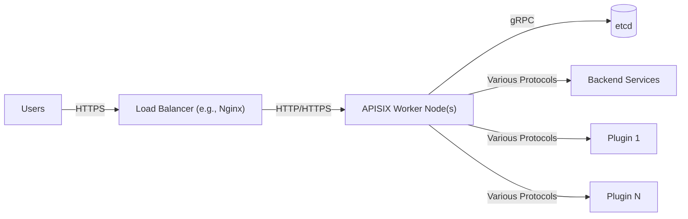
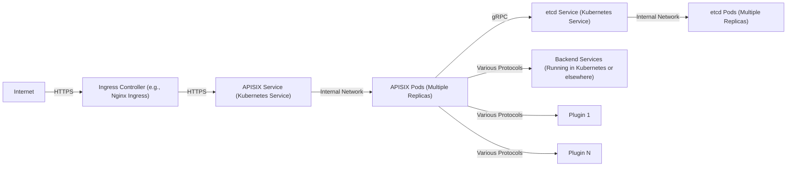
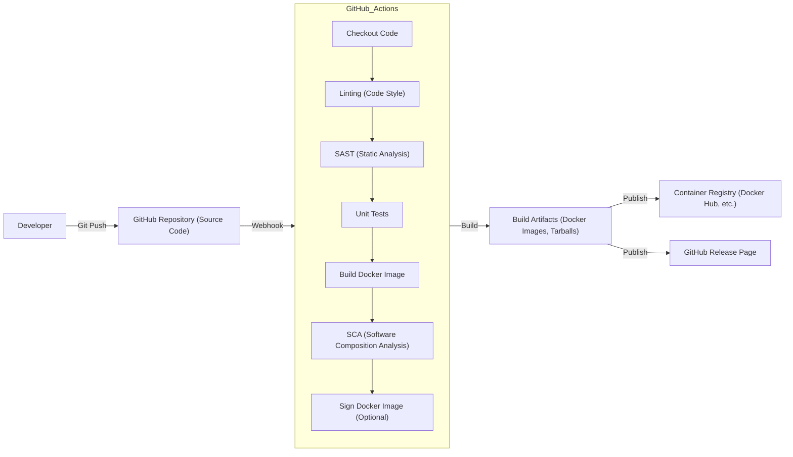

Okay, let's create a design document for the Apache APISIX project, focusing on aspects relevant for threat modeling.

# BUSINESS POSTURE

Apache APISIX is an open-source, high-performance, dynamic cloud-native API gateway.  It's designed to handle a large volume of requests and provide features like load balancing, dynamic routing, authentication, observability, and more.  Given its nature as an API gateway, it sits at the forefront of an organization's infrastructure, making it a critical component for both availability and security.

Priorities:

- High Availability and Performance:  APISIX must handle a large number of requests with low latency. Downtime or performance degradation directly impacts all services behind the gateway.
- Extensibility and Flexibility:  The ability to adapt to various API management needs through plugins and custom configurations is crucial.
- Security:  As the entry point for API traffic, APISIX must provide robust security features to protect backend services.
- Observability: Comprehensive logging, monitoring, and tracing capabilities are essential for operational insight and troubleshooting.
- Community and Ecosystem:  A strong open-source community and a rich ecosystem of plugins are vital for long-term sustainability and adoption.

Goals:

- Provide a reliable and performant API gateway solution.
- Enable secure access to backend services.
- Offer a flexible and extensible platform for API management.
- Foster a vibrant open-source community.

Business Risks:

- Service Disruption:  Outages or performance issues in APISIX can disrupt all connected services, leading to significant business impact.
- Security Breaches:  Vulnerabilities in APISIX could be exploited to gain unauthorized access to backend systems and sensitive data.
- Configuration Errors:  Incorrect configurations can lead to security loopholes or service disruptions.
- Plugin Vulnerabilities:  Third-party plugins might introduce security risks.
- Lack of Observability:  Insufficient monitoring can hinder the ability to detect and respond to issues promptly.

# SECURITY POSTURE

Existing Security Controls:

- security control: Authentication Plugins: APISIX supports various authentication mechanisms through plugins (e.g., key authentication, JWT, OAuth 2.0). Implemented in plugins.
- security control: Authorization Plugins:  Plugins like `authz-keycloak` provide authorization capabilities. Implemented in plugins.
- security control: Traffic Control:  Features like rate limiting, request size limiting, and connection limiting help prevent abuse and DoS attacks. Implemented in core and plugins.
- security control: SSL/TLS Support:  APISIX supports HTTPS for secure communication. Implemented in core.
- security control: Input Validation:  Some level of input validation is performed, but the extent varies depending on the specific plugin and configuration. Implemented in core and plugins.
- security control: Observability: APISIX integrates with monitoring tools like Prometheus and provides logging capabilities. Implemented in core and plugins.
- security control: Regular Security Audits: The Apache Software Foundation likely encourages security audits, although the frequency and scope may vary. Described in project documentation.
- security control: Community Vulnerability Reporting:  A process for reporting and addressing security vulnerabilities is in place. Described in project documentation.

Accepted Risks:

- accepted risk: Plugin Security:  The security of third-party plugins is ultimately the responsibility of the plugin developers and users.
- accepted risk: Configuration Complexity:  The extensive configuration options can lead to misconfigurations if not carefully managed.
- accepted risk: Dependence on etcd:  The reliance on etcd for configuration storage introduces a dependency that must be secured.

Recommended Security Controls:

- Implement a robust input validation framework that applies consistently across all routes and plugins.
- Introduce a centralized policy engine for authorization, rather than relying solely on individual plugins.
- Implement Web Application Firewall (WAF) capabilities, either natively or through a dedicated plugin.
- Provide detailed security hardening guidelines for production deployments.
- Establish a regular penetration testing program.
- Implement supply chain security measures for build and dependencies.

Security Requirements:

- Authentication:
    - Support for multiple authentication methods (e.g., API keys, JWT, OAuth 2.0, mTLS).
    - Secure storage of credentials and secrets.
    - Session management (if applicable).
- Authorization:
    - Fine-grained access control based on roles, attributes, or other criteria.
    - Integration with external identity providers (IdPs).
    - Centralized policy management.
- Input Validation:
    - Strict validation of all incoming requests (headers, query parameters, body).
    - Whitelisting of allowed characters and data types.
    - Protection against common web vulnerabilities (e.g., XSS, SQL injection, CSRF).
- Cryptography:
    - Use of strong, industry-standard cryptographic algorithms and protocols.
    - Secure key management.
    - Support for TLS 1.3.
    - Encryption of sensitive data at rest and in transit.

# DESIGN

## C4 CONTEXT

```mermaid
graph LR
    User["Users (Web Browsers, Mobile Apps, Other Systems)"] -- HTTPS --> APISIX["Apache APISIX (API Gateway)"]
    APISIX -- Various Protocols --> BackendServices["Backend Services (Microservices, Legacy Systems)"]
    APISIX -- gRPC --> etcd[(etcd (Configuration Store))]
    APISIX -- Various Protocols --> MonitoringSystems["Monitoring Systems (Prometheus, Grafana, etc.)"]
    APISIX -- Various Protocols --> Plugin_1["Plugin 1"]
    APISIX -- Various Protocols --> Plugin_N["Plugin N"]

```

Element Descriptions:

-   1.  Name: Users
    -   Type: External Entity
    -   Description: Represents the consumers of the APIs managed by APISIX. These can be web browsers, mobile applications, or other systems.
    -   Responsibilities: Initiates requests to access APIs.
    -   Security Controls:  HTTPS (TLS) for secure communication.

-   2.  Name: Apache APISIX
    -   Type: System
    -   Description: The core API gateway system, responsible for routing, transforming, and securing API traffic.
    -   Responsibilities:  Request routing, load balancing, authentication, authorization, rate limiting, transformation, observability.
    -   Security Controls: Authentication plugins, authorization plugins, traffic control, SSL/TLS support, input validation, observability integrations.

-   3.  Name: Backend Services
    -   Type: External System
    -   Description: The services that provide the actual API functionality.
    -   Responsibilities:  Processing API requests and returning responses.
    -   Security Controls:  Rely on APISIX for initial security enforcement; may have additional internal security measures.

-   4.  Name: etcd
    -   Type: External System
    -   Description: A distributed key-value store used by APISIX to store configuration data.
    -   Responsibilities:  Storing and providing access to APISIX configuration.
    -   Security Controls:  Access control, encryption at rest and in transit, network security.

-   5.  Name: Monitoring Systems
    -   Type: External System
    -   Description: Systems used to monitor the performance and health of APISIX.
    -   Responsibilities:  Collecting and visualizing metrics, logs, and traces.
    -   Security Controls:  Secure communication with APISIX, access control.

-   6.  Name: Plugin 1
    -   Type: External System
    -   Description: First plugin used to extend APISIX functionality.
    -   Responsibilities:  Extending APISIX functionality.
    -   Security Controls:  Rely on APISIX for initial security enforcement; may have additional internal security measures.

-   7.  Name: Plugin N
    -   Type: External System
    -   Description: Nth plugin used to extend APISIX functionality.
    -   Responsibilities:  Extending APISIX functionality.
    -   Security Controls:  Rely on APISIX for initial security enforcement; may have additional internal security measures.

## C4 CONTAINER



Element Descriptions:

-   1.  Name: Users
    -   Type: External Entity
    -   Description: Represents the consumers of the APIs.
    -   Responsibilities: Initiates requests.
    -   Security Controls: HTTPS (TLS).

-   2.  Name: Load Balancer
    -   Type: Container
    -   Description:  A load balancer (often Nginx) that distributes traffic across multiple APISIX worker nodes.
    -   Responsibilities:  Distributing traffic, SSL/TLS termination (optional).
    -   Security Controls:  SSL/TLS termination, access control lists (ACLs).

-   3.  Name: APISIX Worker Node(s)
    -   Type: Container
    -   Description:  Instances of the APISIX gateway that handle API requests.
    -   Responsibilities:  Request routing, authentication, authorization, transformation, etc.
    -   Security Controls:  Authentication plugins, authorization plugins, traffic control, input validation.

-   4.  Name: etcd
    -   Type: Container
    -   Description:  The etcd cluster storing APISIX configuration.
    -   Responsibilities:  Storing and serving configuration data.
    -   Security Controls:  Access control, encryption, network security.

-   5.  Name: Backend Services
    -   Type: External System
    -   Description:  The backend services providing API functionality.
    -   Responsibilities:  Processing API requests.
    -   Security Controls:  Rely on APISIX for initial security; may have internal security.

-   6.  Name: Plugin 1
    -   Type: Container
    -   Description: First plugin used to extend APISIX functionality.
    -   Responsibilities:  Extending APISIX functionality.
    -   Security Controls:  Rely on APISIX for initial security enforcement; may have additional internal security measures.

-   7.  Name: Plugin N
    -   Type: Container
    -   Description: Nth plugin used to extend APISIX functionality.
    -   Responsibilities:  Extending APISIX functionality.
    -   Security Controls:  Rely on APISIX for initial security enforcement; may have additional internal security measures.

## DEPLOYMENT

Possible Deployment Solutions:

-   Bare Metal:  Deploying APISIX and etcd directly on physical servers.
-   Virtual Machines:  Deploying on VMs within a private or public cloud.
-   Kubernetes:  Deploying APISIX and etcd as containers within a Kubernetes cluster.  This is a common and recommended approach.
-   Docker Compose:  Suitable for development and testing, but less common for production.

Chosen Solution: Kubernetes



Element Descriptions:

- 1.  Name: Internet
    -   Type: External Entity
    -   Description: The public internet.
    -   Responsibilities: Source of external traffic.
    -   Security Controls:  Firewalls, intrusion detection/prevention systems.

- 2.  Name: Ingress Controller
    -   Type: Node
    -   Description:  A Kubernetes Ingress controller (e.g., Nginx Ingress, Traefik) that manages external access to services in the cluster.
    -   Responsibilities:  Routing external traffic to the APISIX service, SSL/TLS termination.
    -   Security Controls:  SSL/TLS termination, access control, WAF (if configured).

- 3.  Name: APISIX Service
    -   Type: Node
    -   Description:  A Kubernetes Service that exposes the APISIX pods.
    -   Responsibilities:  Providing a stable endpoint for accessing APISIX.
    -   Security Controls:  Kubernetes network policies.

- 4.  Name: APISIX Pods
    -   Type: Node
    -   Description:  Multiple instances of the APISIX container running within Kubernetes pods.
    -   Responsibilities:  Handling API requests.
    -   Security Controls:  All APISIX security features (authentication, authorization, etc.), Kubernetes pod security policies.

- 5.  Name: etcd Service
    -   Type: Node
    -   Description:  A Kubernetes Service that exposes the etcd pods.
    -   Responsibilities: Providing a stable endpoint for accessing etcd.
    -   Security Controls: Kubernetes network policies.

- 6.  Name: etcd Pods
    -   Type: Node
    -   Description:  Multiple instances of the etcd container running within Kubernetes pods.
    -   Responsibilities:  Storing and serving APISIX configuration data.
    -   Security Controls:  etcd access control, encryption, Kubernetes pod security policies.

-   7.  Name: Backend Services
    -   Type: External System/Node
    -   Description: The backend services, which may be running within the same Kubernetes cluster or elsewhere.
    -   Responsibilities: Processing API requests.
    -   Security Controls: Rely on APISIX and their own security measures.

-   8.  Name: Plugin 1
    -   Type: Node
    -   Description: First plugin used to extend APISIX functionality.
    -   Responsibilities:  Extending APISIX functionality.
    -   Security Controls:  Rely on APISIX for initial security enforcement; may have additional internal security measures.

-   9.  Name: Plugin N
    -   Type: Node
    -   Description: Nth plugin used to extend APISIX functionality.
    -   Responsibilities:  Extending APISIX functionality.
    -   Security Controls:  Rely on APISIX for initial security enforcement; may have additional internal security measures.

## BUILD

The Apache APISIX build process involves several steps, from source code to deployable artifacts.  Security is a crucial consideration throughout this process.



Build Process Description:

1.  Developer commits code to the GitHub repository.
2.  A webhook triggers GitHub Actions, the CI/CD system used by APISIX.
3.  GitHub Actions performs the following steps:
    -   Checks out the code.
    -   Runs linters to enforce code style consistency.
    -   Performs Static Application Security Testing (SAST) to identify potential vulnerabilities in the code. Tools like `CodeQL` could be used.
    -   Executes unit tests to verify code correctness.
    -   Builds Docker images for APISIX.
    -   Performs Software Composition Analysis (SCA) to identify vulnerabilities in dependencies. Tools like `Dependency-Check` or `Snyk` could be used.
    -   Optionally signs the Docker images to ensure their integrity.
4.  The build artifacts (Docker images and tarballs) are published to a container registry (e.g., Docker Hub) and the GitHub release page.

Security Controls in Build Process:

- security control: Linting: Enforces code style and helps prevent some types of errors.
- security control: SAST: Identifies potential security vulnerabilities in the source code.
- security control: Unit Tests:  Verifies code correctness and helps prevent regressions.
- security control: SCA:  Identifies vulnerabilities in third-party dependencies.
- security control: Docker Image Signing:  Ensures the integrity of the Docker images.
- security control: CI/CD Automation:  Reduces the risk of manual errors and ensures consistent security checks.

# RISK ASSESSMENT

Critical Business Processes:

- API Access and Management:  APISIX is directly responsible for managing access to all backend APIs.  Its failure or compromise impacts all connected services.
- Service Availability:  APISIX's performance and availability are critical for the overall availability of the services it manages.

Data Sensitivity:

- Configuration Data (etcd):  Contains sensitive information about API routes, authentication credentials, and other configuration details.  Compromise of etcd could lead to a full system compromise.  Sensitivity: High
- API Traffic:  APISIX handles all API traffic, which may include sensitive data depending on the specific APIs being used.  Sensitivity: Variable (depends on the APIs)
- Logs and Metrics:  Contain information about API usage, which could be sensitive depending on the context.  Sensitivity: Medium

# QUESTIONS & ASSUMPTIONS

Questions:

- What is the specific threat model used by the Apache APISIX project (if any)?
- What are the current procedures for handling security vulnerabilities reported by the community or discovered internally?
- What are the specific security requirements for plugins, and how are they enforced?
- What is the frequency and scope of security audits?
- Are there any specific compliance requirements (e.g., PCI DSS, HIPAA) that need to be considered?
- What level of detail is logged, and how long are logs retained?
- How is access to etcd secured and monitored?

Assumptions:

- BUSINESS POSTURE:  The primary business goal is to provide a reliable, performant, and secure API gateway.
- SECURITY POSTURE:  The project follows general security best practices, but there is room for improvement in areas like input validation and centralized authorization.
- DESIGN:  The deployment will be on Kubernetes, and the build process will utilize GitHub Actions. The system relies on etcd for configuration management.