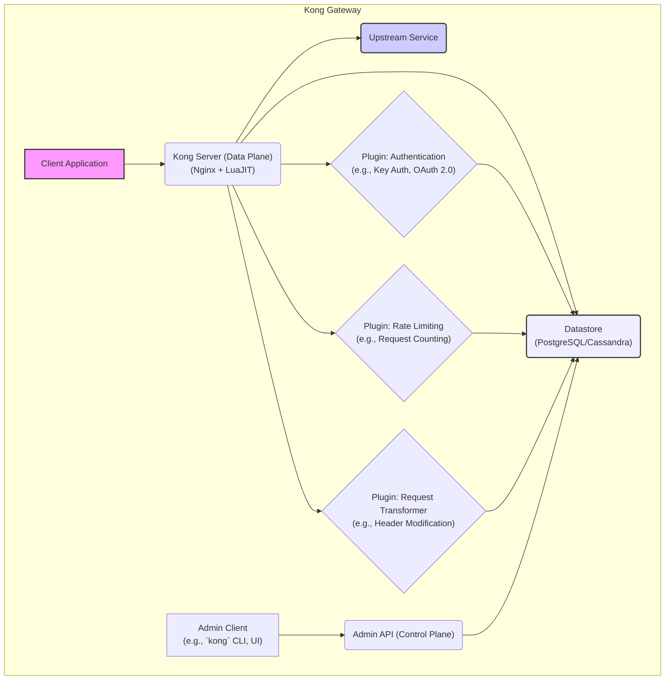
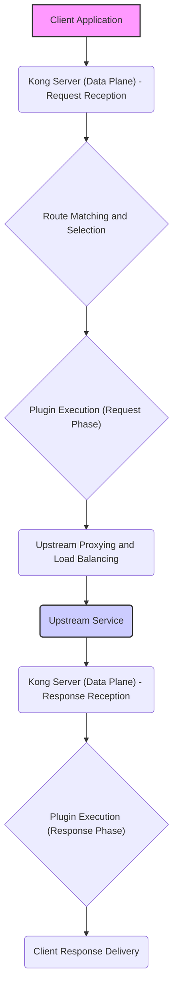

# Project Design Document: Kong Gateway

**Version:** 1.1
**Date:** October 26, 2023
**Author:** AI Software Architect

## 1. Introduction

This document provides an enhanced and detailed architectural design of the Kong API Gateway project (as represented by the GitHub repository: https://github.com/Kong/kong). This revised document aims to provide a more comprehensive understanding of the system's components, interactions, and data flows, serving as a robust foundation for subsequent threat modeling activities.

## 2. Project Overview

Kong is a highly scalable, open-source API gateway and reverse proxy built on top of Nginx and LuaJIT. It acts as an intelligent intermediary between client applications and one or more upstream services. Kong offers a wide range of functionalities through its plugin architecture, including authentication, authorization, rate limiting, traffic control, logging, monitoring, and request/response transformation. By centralizing these concerns, Kong simplifies the management and security of APIs.

## 3. System Architecture

The core architecture of Kong can be broken down into the following key components, working in concert to manage and route API traffic:

*   **Kong Server (Data Plane):** The central runtime engine responsible for proxying requests. It leverages Nginx to handle network traffic and LuaJIT to execute Kong's core logic and plugins. This component processes all incoming API requests, applies configured plugins, and forwards them to the appropriate backend.
*   **Admin API (Control Plane):** A RESTful API providing endpoints for configuring and managing all aspects of Kong. This includes defining services, routes, plugins, consumers, credentials, and other entities. It's the primary interface for administrators and automation tools.
*   **Datastore:** Kong relies on a persistent database to store its configuration data. Supported databases include PostgreSQL and Cassandra, chosen for their reliability and scalability. The datastore holds the source of truth for Kong's operational configuration.
*   **Plugins:** Modular, self-contained units of code that extend Kong's core functionality. They are executed within the request/response lifecycle, allowing for customization and the implementation of various policies and features. Plugins are configurable and can be applied globally or to specific services and routes.
*   **Clients:** Applications or end-users that initiate requests to the APIs managed by Kong. These clients interact directly with the Kong Server (Data Plane).
*   **Upstream Services:** The backend APIs or applications that Kong proxies requests to. Kong acts as a gateway, abstracting these services from the client.
*   **External Services:**  Services that Kong may integrate with to provide extended functionality or to offload specific tasks. Examples include authentication providers, logging aggregators, and monitoring platforms.

### 3.1. Component Details

*   **Kong Server (Data Plane):**
    *   Built upon the robust and high-performance Nginx web server.
    *   Utilizes LuaJIT, a just-in-time compiler for Lua, to execute Kong's core logic and plugins efficiently.
    *   Responsible for request routing, load balancing, and applying configured plugins.
    *   Maintains an in-memory cache of configuration data synchronized from the datastore for low-latency decision-making.
    *   Supports various deployment modes, including standalone, clustered, and hybrid (control plane/data plane separation).
    *   Handles TLS termination and SSL certificate management.
*   **Admin API (Control Plane):**
    *   Provides a comprehensive set of RESTful endpoints for CRUD operations on Kong's entities (services, routes, plugins, consumers, etc.).
    *   Secured by default, typically requiring an administrative token or mutual TLS authentication for access.
    *   Used by administrators, CI/CD pipelines, and other automation tools to manage Kong's configuration.
    *   Persists configuration changes to the datastore, which are then propagated to the data plane instances.
    *   Offers features like declarative configuration for managing Kong's state through configuration files.
*   **Datastore:**
    *   Serves as the persistent storage for Kong's configuration, including all defined services, routes, plugins, consumers, credentials, and their associated settings.
    *   Supports PostgreSQL and Cassandra, offering different trade-offs in terms of consistency, availability, and partitioning.
    *   High availability and data consistency are critical for the reliable operation of the Kong cluster. Data loss or corruption can severely impact Kong's functionality.
    *   Requires proper security measures, including access control and encryption, to protect sensitive configuration data.
*   **Plugins:**
    *   Extend Kong's capabilities in a modular and extensible way, without requiring modifications to the core Kong codebase.
    *   Primarily written in Lua, leveraging Kong's Plugin Development Kit (PDK).
    *   Can be enabled and configured at different levels: globally, for specific services, or for individual routes, providing granular control over their application.
    *   Examples include:
        *   **Authentication:** API Key authentication, Basic Authentication, OAuth 2.0, JWT validation, OpenID Connect.
        *   **Authorization:** Access Control Lists (ACLs), Role-Based Access Control (RBAC).
        *   **Rate Limiting:** Request counting, token bucket algorithms.
        *   **Request/Response Transformation:** Header manipulation, body transformation.
        *   **Logging:** Integration with various logging providers (e.g., HTTP Log, TCP Log, Syslog).
        *   **Traffic Control:** Request size limiting, proxy caching.
        *   **Security:**  CORS, Bot detection, request blocking.
*   **Clients:**
    *   Any application, service, or user that sends HTTP(S) requests to the APIs exposed and managed by Kong.
    *   Their primary interaction is with the Kong Server (Data Plane), which acts as the entry point for all API traffic.
    *   Clients are typically unaware of the underlying upstream services, interacting solely with Kong's exposed endpoints.
*   **Upstream Services:**
    *   The backend APIs, microservices, or applications that Kong sits in front of.
    *   Kong needs to be configured with the location (URL) and other relevant details of these upstream services to route requests correctly.
    *   Kong can perform health checks on upstream services to ensure traffic is only routed to healthy instances.
*   **External Services:**
    *   Services that Kong integrates with to enhance its functionality or offload specific tasks.
    *   Examples include:
        *   **Identity Providers (IdPs):** For federated authentication (e.g., OAuth 2.0 authorization servers, SAML providers).
        *   **Logging Aggregation Platforms:**  Services like Elasticsearch, Splunk, or Datadog for centralized logging.
        *   **Monitoring and Metrics Systems:** Platforms like Prometheus, Grafana, or Datadog for performance monitoring and alerting.
        *   **Certificate Management Systems:** For automated provisioning and renewal of TLS certificates.

## 4. Data Flow

The typical lifecycle of an API request processed by Kong involves the following steps, highlighting the interaction between components:

1. **Client Request Initiation:** A client application sends an HTTP(S) request targeting an endpoint exposed by Kong.
2. **Kong Server (Data Plane) Reception:** The Kong Server, specifically the Nginx component, receives the incoming request.
3. **Route Matching and Selection:** Kong analyzes the request's attributes (host, path, headers, etc.) to identify the matching route based on its configured routes.
4. **Plugin Execution (Request Phase):**  Once a route is matched, Kong executes the enabled plugins associated with that route, the parent service, or globally. Plugins are executed in a predefined order during the request phase. This may involve authentication checks, rate limiting enforcement, request transformations, and other pre-processing steps.
5. **Upstream Proxying and Load Balancing:** If the request passes all plugin checks, Kong forwards the processed request to the configured upstream service. If multiple upstream instances are configured, Kong applies a load balancing strategy to distribute the traffic.
6. **Upstream Service Processing:** The upstream service receives the request from Kong, processes it, and generates a response.
7. **Kong Server (Data Plane) Response Reception:** Kong receives the response from the upstream service.
8. **Plugin Execution (Response Phase):** Kong executes the enabled plugins again, this time during the response phase. This may involve response transformations, adding security headers, logging the response, and other post-processing steps.
9. **Client Response Delivery:** Kong sends the processed response back to the originating client application.

## 5. Security Considerations

Security is a paramount concern in the design and operation of Kong. Key security aspects include:

*   **Robust Authentication Mechanisms:** Kong offers a variety of authentication plugins (e.g., Key Authentication, Basic Authentication, OAuth 2.0, JWT, OpenID Connect) to verify the identity of clients accessing the APIs. Proper configuration and secure storage of credentials are crucial.
*   **Fine-grained Authorization Policies:** Plugins like ACL and RBAC enable the implementation of granular access control policies, ensuring that only authorized clients can access specific resources.
*   **Effective Rate Limiting and Traffic Control:** Kong's rate limiting plugins protect upstream services from being overwhelmed by excessive requests, mitigating denial-of-service attacks and ensuring fair usage.
*   **TLS/SSL Termination and Encryption:** Kong typically handles TLS termination, encrypting communication between clients and the gateway. Proper certificate management and secure key storage are essential.
*   **Admin API Security Hardening:** Access to the Admin API must be strictly controlled using strong authentication mechanisms (e.g., admin tokens, mutual TLS) and network restrictions to prevent unauthorized configuration changes.
*   **Secure Secrets Management:** Sensitive information, such as API keys, database credentials, and TLS certificates, must be stored and managed securely, ideally using dedicated secrets management solutions.
*   **Plugin Security Auditing:** The security of installed plugins is critical. Regularly auditing and updating plugins is necessary to address potential vulnerabilities. Using plugins from trusted sources is highly recommended.
*   **Comprehensive Logging and Auditing:** Detailed logging of requests, responses, and administrative actions provides valuable insights for security monitoring, incident response, and compliance.
*   **Network Segmentation and Firewalling:** Implementing proper network segmentation and firewall rules around the Kong infrastructure is crucial to limit the attack surface and prevent unauthorized access.
*   **Datastore Security Best Practices:** Securing the underlying datastore (PostgreSQL or Cassandra) is essential, including access control, encryption at rest and in transit, and regular backups.
*   **Input Validation and Sanitization:** While Kong's core functionality doesn't include extensive payload validation, plugins can be used to validate and sanitize incoming requests to prevent injection attacks.

## 6. Deployment Considerations

The security posture of a Kong deployment is significantly influenced by the chosen deployment strategy:

*   **Standalone Mode Security:** In standalone deployments, securing the single Kong instance and its connection to the datastore is paramount.
*   **Clustered Mode Security:** Clustered deployments require secure communication between Kong nodes to prevent unauthorized access and data manipulation within the cluster. Mutual TLS can be used for inter-node communication.
*   **Hybrid Mode Security:** Separating the control and data planes enhances security by isolating the management interface. Secure communication channels between the planes are essential.
*   **Containerized Environment Security (Docker, Kubernetes):** When deploying Kong in containers, following container security best practices (e.g., least privilege, image scanning, network policies) is crucial. Kubernetes Network Policies can restrict traffic flow to and from Kong pods.
*   **Cloud Platform Security (AWS, Azure, GCP):** Leveraging cloud-native security services (e.g., security groups, IAM roles, managed secrets) is recommended for deployments on cloud platforms. Managed Kong offerings often provide enhanced security features.

## 7. Threat Modeling Scope

This detailed design document provides the necessary information for a comprehensive threat modeling exercise of the Kong API Gateway. The scope of the threat modeling should encompass:

*   **Data Plane Threats:**
    *   Authentication and authorization bypass vulnerabilities.
    *   Injection attacks (e.g., SQL injection, command injection) targeting upstream services via Kong.
    *   Data leakage through improperly configured plugins or logging.
    *   Denial-of-service attacks targeting the data plane.
    *   Man-in-the-middle attacks on communication between clients and Kong, or Kong and upstream services.
*   **Control Plane Threats:**
    *   Unauthorized access to the Admin API leading to configuration manipulation.
    *   Compromise of admin credentials.
    *   Denial-of-service attacks targeting the Admin API.
    *   Data breaches of sensitive configuration data stored in the datastore.
*   **Plugin-Related Threats:**
    *   Vulnerabilities within installed plugins.
    *   Malicious plugins introduced into the environment.
    *   Misconfiguration of plugins leading to security weaknesses.
*   **Datastore Threats:**
    *   Unauthorized access to the datastore.
    *   Data breaches or data manipulation within the datastore.
    *   Denial-of-service attacks targeting the datastore.
*   **Communication Channel Threats:**
    *   Lack of encryption for communication between Kong components.
    *   Compromise of TLS certificates.
*   **Operational Threats:**
    *   Insecure deployment configurations.
    *   Lack of proper monitoring and alerting for security events.
    *   Insufficient patching and updating of Kong and its dependencies.

## 8. Glossary

*   **API Gateway:** A server that acts as a single, secure entry point for API requests, routing them to backend services.
*   **Upstream Service:** The backend API, microservice, or application that Kong proxies requests to.
*   **Plugin:** A modular component that extends Kong's functionality, providing features like authentication, rate limiting, and logging.
*   **Consumer:** An entity (application, user, or device) that consumes APIs managed by Kong.
*   **Route:** A rule defined in Kong that matches incoming requests to specific upstream services based on various criteria (e.g., path, host).
*   **Service:** Represents an upstream API or application within Kong's configuration, defining its location and other properties.
*   **Admin API:** The RESTful API used to configure and manage all aspects of the Kong gateway.
*   **Data Plane:** The Kong Server instance responsible for receiving, processing, and routing API requests.
*   **Control Plane:** The administrative components of Kong, primarily the Admin API and its associated processes.
*   **PDK (Plugin Development Kit):**  A set of libraries and tools provided by Kong for developing custom plugins.

This enhanced document provides a more detailed and nuanced understanding of the Kong API Gateway architecture, offering a stronger foundation for identifying and mitigating potential security threats. This information is crucial for conducting thorough threat modeling and implementing appropriate security controls.
