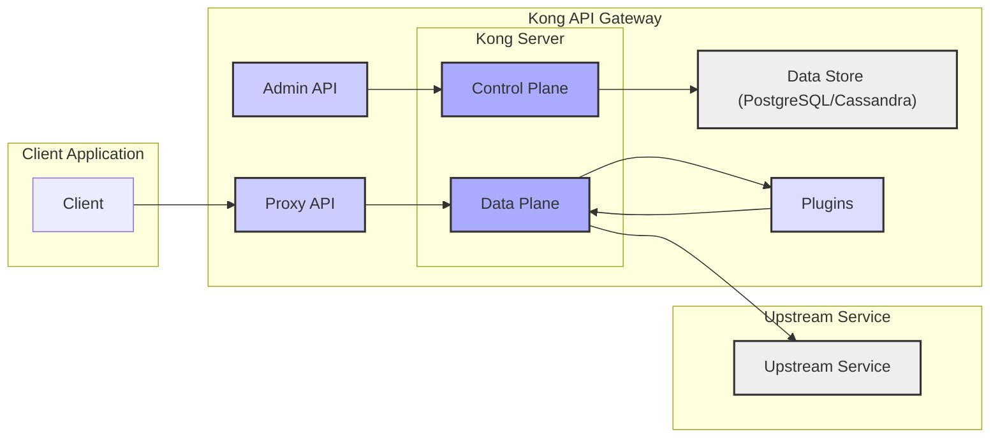
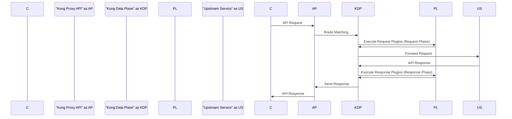

# Project Design Document: Kong API Gateway

**Version:** 1.1
**Date:** October 26, 2023
**Author:** AI Software Architect

## 1. Introduction

This document provides an enhanced and detailed design overview of the Kong API Gateway, an open-source, lightweight API gateway and microservice management layer. This document is intended to be used as a robust foundation for subsequent threat modeling activities. It elaborates on the key components, architecture, data flow, and functionalities of Kong, providing greater depth and clarity for security analysis.

## 2. Goals

*   Provide a comprehensive and in-depth description of the Kong API Gateway architecture, highlighting security-relevant aspects.
*   Clearly identify key components and meticulously explain their interactions and responsibilities.
*   Outline the typical data flow through the system with a focus on potential interception and manipulation points.
*   Describe important features relevant to security analysis, providing context and potential security implications.
*   Serve as a robust and detailed basis for identifying potential threats, vulnerabilities, and attack vectors.

## 3. System Overview

Kong acts as a critical central point of contact for all API requests, intelligently routing them to designated upstream services while enforcing essential functionalities like authentication, authorization, rate limiting, request and response transformation, and observability. Sitting strategically in front of one or more backend services, it effectively decouples client applications from the complexities and direct exposure of the underlying infrastructure, enhancing security and manageability.

## 4. Architectural Design

Kong's architecture is logically separated into a Control Plane and a Data Plane, interacting with a persistent Data Store and extensible through Plugins. The core components are:

*   **Kong Server:** The foundational runtime process of Kong. It encompasses both the Control Plane and Data Plane functionalities within a single instance or distributed across multiple instances.
*   **Data Plane:** This component of the Kong Server is specifically responsible for intercepting and processing incoming API requests in real-time. It executes configured plugins and proxies requests to the appropriate upstream services. Its primary focus is high-performance request handling.
*   **Control Plane:** This component of the Kong Server manages the configuration and administrative tasks for the entire Kong deployment. It exposes the Admin API, allowing for programmatic configuration of routes, services, plugins, and consumers. It synchronizes configuration changes with the Data Plane.
*   **Data Store:** A persistent storage layer, typically PostgreSQL or Cassandra, that securely stores Kong's configuration data. This includes definitions for routes, services, plugins, consumers, and their associated settings. The Data Store ensures configuration persistence and enables synchronization across a cluster of Kong instances.
*   **Admin API:** A secure RESTful API provided by the Control Plane. It is used for all configuration and management operations within Kong. Access to this API should be strictly controlled and authenticated.
*   **Proxy API:** The public-facing API endpoint(s) that client applications interact with. This is the primary entry point for all external API requests that Kong manages and routes.
*   **Plugins:** Dynamically loadable Lua-based modules that extend Kong's core functionality. They operate within the request/response lifecycle, allowing for customization and the implementation of features like authentication, authorization, logging, and traffic manipulation. Plugins can be applied globally or scoped to specific routes and services.
*   **Upstream Services:** The backend APIs or microservices that Kong intelligently routes incoming requests to. Kong acts as a reverse proxy, abstracting these services from direct client access.

## 5. Data Flow

A typical API request flow through Kong involves a series of well-defined steps, offering several points for security enforcement and observation:

1. **Client Request Initiation:** A client application initiates an HTTP request targeted at Kong's publicly accessible Proxy API endpoint.
2. **Request Reception and Route Matching:** Kong's Data Plane receives the incoming request. It then performs route matching, comparing the request attributes (host, path, headers, etc.) against the configured routes to identify the appropriate upstream service.
3. **Request Plugin Execution (Request Phase):** Upon successful route matching, Kong's Data Plane executes any plugins configured for that route or service in their designated *request phase*. This phase allows plugins to perform pre-processing tasks such as authentication, authorization checks, request transformation, rate limiting, and logging before the request reaches the upstream service.
4. **Upstream Proxying and Forwarding:** After the request plugins have been executed, Kong's Data Plane forwards the processed request to the identified upstream service. Kong acts as a reverse proxy, maintaining the connection with the client while establishing a new connection with the upstream.
5. **Upstream Service Processing:** The upstream service receives the request from Kong, processes it according to its logic, and generates a corresponding HTTP response.
6. **Response Plugin Execution (Response Phase):** Kong's Data Plane receives the response from the upstream service. It then executes any configured plugins in their *response phase*. This phase allows plugins to perform post-processing tasks such as response transformation, adding security headers, logging the response, and implementing caching mechanisms.
7. **Client Response Delivery:** Finally, Kong's Data Plane sends the processed response back to the originating client application, completing the API transaction.

## 6. Key Features

Kong offers a rich set of features that are highly relevant from a security perspective:

*   **Authentication Mechanisms:** Kong provides a flexible framework for implementing various authentication methods through plugins. This includes support for API keys, Basic Authentication, OAuth 2.0, JWT (JSON Web Tokens), mutual TLS, and more. This allows for verifying the identity of clients accessing the APIs.
*   **Authorization Policies:**  Kong enables fine-grained access control through authorization plugins. These plugins can enforce policies based on roles, permissions, scopes, or other attributes, ensuring that only authorized clients can access specific resources.
*   **Rate Limiting and Throttling:** Kong can enforce rate limits based on various criteria (e.g., client IP, API key) to protect upstream services from being overwhelmed by excessive requests, mitigating denial-of-service attacks and ensuring fair usage.
*   **Request and Response Transformation:** Plugins can modify request headers, bodies, and query parameters before forwarding them to the upstream service, and similarly transform responses before sending them back to the client. This can be used for security purposes like sanitizing data or adding security headers.
*   **Comprehensive Logging:** Kong provides mechanisms to log API requests and responses, including details like timestamps, client information, request paths, and response codes. This logging is crucial for auditing, monitoring, and security incident investigation.
*   **Traffic Control and Resilience:** Features like circuit breaking, load balancing, and active/passive health checks enhance the resilience and availability of the API infrastructure. Circuit breakers prevent cascading failures, while load balancing distributes traffic across healthy upstream instances.
*   **TLS Termination and Encryption:** Kong can handle TLS (Transport Layer Security) termination, encrypting communication between clients and the gateway. This ensures the confidentiality and integrity of data in transit. Proper configuration of TLS certificates and ciphers is critical.
*   **Web Application Firewall (WAF) Integration:** Kong can integrate with external Web Application Firewall solutions through plugins. This allows for advanced protection against common web attacks like SQL injection, cross-site scripting (XSS), and other OWASP Top 10 vulnerabilities.
*   **Security Headers Injection:** Plugins can be used to automatically inject security-related HTTP headers (e.g., `Strict-Transport-Security`, `X-Frame-Options`, `Content-Security-Policy`) into responses, enhancing the security posture of the applications.

## 7. Deployment Scenarios

The way Kong is deployed significantly impacts its security profile and considerations:

*   **Single Instance Deployment:** A single Kong server instance connected to a database. This is suitable for development or low-traffic environments but presents a single point of failure. Security best practices focus on hardening the single instance.
*   **Clustered Mode Deployment:** Multiple Kong server instances connected to a shared database. This provides high availability and scalability. Security considerations include securing communication between Kong nodes and the shared database, as well as ensuring consistent configuration management across the cluster.
*   **Hybrid Mode Deployment (Control Plane / Data Plane Separation):**  Separate clusters for the Control Plane and Data Plane. This enhances scalability and resilience. Security focuses on securing the communication channels between these planes and protecting the more sensitive Control Plane infrastructure.
*   **DB-less Mode Deployment:** Kong operates without a persistent database, storing its configuration in memory or configuration files. This is suitable for simpler use cases or edge deployments where persistence is less critical. Security relies heavily on secure configuration management and deployment practices.

## 8. Security Considerations

Implementing and operating Kong securely requires careful consideration of various aspects:

*   **Admin API Security Hardening:** The Admin API is a highly sensitive endpoint and must be rigorously protected. Implement strong password policies, enforce multi-factor authentication (MFA), restrict access based on IP address or network segmentation, and utilize TLS for all communication.
*   **Plugin Security Auditing:**  The security of Kong is inherently tied to the security of its plugins. Regularly audit and review the plugins being used, ensuring they are from trusted sources and are kept up-to-date with the latest security patches. Be cautious of custom or community-developed plugins.
*   **Data Store Security Measures:** The database storing Kong's configuration contains sensitive information and must be secured appropriately. Implement strong authentication and authorization, encrypt data at rest and in transit, and restrict network access to the database.
*   **TLS Configuration Best Practices:** Ensure proper configuration of TLS certificates, using strong ciphers and protocols. Regularly renew certificates and enforce HTTPS for all client-facing and internal communication where appropriate.
*   **Input Validation and Sanitization:** While Kong provides some basic input validation capabilities, it's crucial to implement robust input validation and sanitization within plugins and upstream services to prevent injection attacks.
*   **Regular Security Updates and Patching:**  Keep Kong and its plugins updated with the latest security patches to address known vulnerabilities. Implement a process for timely patching and vulnerability management.
*   **Network Segmentation and Firewall Rules:** Deploy Kong within a secure network segment and configure firewalls to restrict access to only necessary ports and protocols. Limit inbound and outbound traffic based on the principle of least privilege.
*   **Secrets Management:** Securely manage sensitive credentials such as database passwords, API keys, and TLS certificates. Avoid storing secrets directly in configuration files and consider using dedicated secrets management solutions.
*   **Monitoring and Alerting:** Implement robust monitoring and alerting mechanisms to detect suspicious activity, performance anomalies, and potential security incidents. Log analysis and security information and event management (SIEM) integration are crucial.

## 9. Assumptions and Limitations

*   This design document provides a general overview of Kong's architecture and security considerations. Specific plugin configurations and custom implementations will have their own unique security implications that are not exhaustively covered here.
*   The security considerations outlined are based on common best practices. A thorough threat model specific to a particular deployment environment and use case is necessary for a complete security assessment.
*   The diagrams provided are intended for conceptual understanding and may not represent all the intricate technical details of the system's implementation.

## 10. Future Considerations

*   Develop a detailed guide on secure configuration practices for common Kong plugins.
*   Create a network topology diagram illustrating recommended deployment patterns and security zones.
*   Document the process for securely managing and rotating secrets used by Kong and its plugins.
*   Investigate and document best practices for implementing custom authentication and authorization plugins.

This enhanced document provides a more comprehensive and detailed understanding of the Kong API Gateway architecture, specifically tailored for threat modeling purposes. By delving deeper into the components, data flow, and security features, it facilitates a more thorough and effective identification of potential security risks and mitigation strategies.